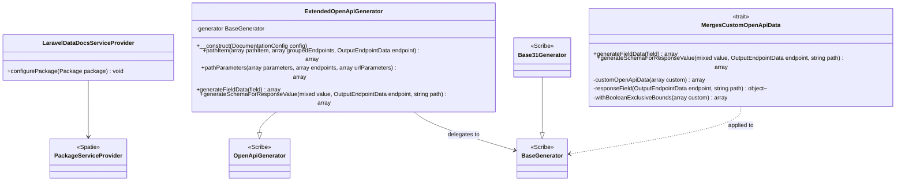

# Package Bootstrap and OpenAPI Field Merge

Core canvas. Owns `src/LaravelDataDocsServiceProvider.php`, `src/OpenApi/**` and `config/data-docs.php`.

Related canvases: Scribe strategies (they produce `custom.openAPI` via `Parameter::toArray`); documentation records (that array shape); parameter metadata pipeline (its `PipelineFactory` receives `config('data-docs')` from the strategies and reads `custom_types`).

## Requirements

- Register the Composer package with Laravel, including a publishable config file named after the package.
- When Scribe writes OpenAPI field objects, request parameters and response fields alike, copy extra keys from each field’s `custom.openAPI` bag onto the generated field.

## Entities

`ExtendedOpenApiGenerator` holds an anonymous subclass of `Base31Generator` (when `openapi.version` is 3.1.0 or later) or of `BaseGenerator` (otherwise), each using `MergesCustomOpenApiData`.

Config `config/data-docs.php` is a PHP array with a single key `custom_types` defaulting to an empty array. This canvas owns that file’s shape as shipped; PipelineFactory’s interpretation of each entry is the parameter metadata pipeline canvas.

## Approach

Minimal Spatie `laravel-package-tools` provider: package name `laravel-data-docs`, `hasConfigFile()` (config file `data-docs.php`). The provider does not bind ParameterGenerator, registries, or Scribe strategies. Scribe strategy registration is expected to live in the consuming app’s Scribe config (not in this provider).

OpenAPI merge runs inside a Scribe base generator matching the configured spec version. `ExtendedOpenApiGenerator` extends the no-op Scribe `OpenApiGenerator` and delegates `pathItem` and `pathParameters` to a private instance of `Base31Generator` (3.1.0 or later, compared with `version_compare`, default `OpenAPISpecWriter::SPEC_VERSION`) or `BaseGenerator` (otherwise). That instance uses the trait `MergesCustomOpenApiData`, whose `generateFieldData` merges `$field['custom']['openAPI'] ?? []` into the parent field data (`merged`). Later keys from custom OpenAPI overwrite parent keys on collision. Missing `custom` or `openAPI` yields parent data unchanged. Because the trait overrides `generateFieldData` on the delegate itself, nested object and array fields are merged too, and the 3.1 `example` → `examples` conversion in `Base31Generator::generateFieldData` runs before the merge.

Scribe applies a nullable array field's `nullable` flag to its `items`, not to the array (`items: {nullable: true}` on 3.0, `items.type: [..., 'null']` on 3.1), so the spec would reject the `null` that Laravel accepts for a `nullable, array` property and accept `[null]` instead. The flag is always the property's own (Scribe has one flag per field, and the pipeline sets it from the property's rules and type, never per item), so for a nullable field whose `type` is an array type (`Utils::isArrayType`) the trait moves it to the array: `nullable: true` on 3.0, `type: ['array', 'null']` on 3.1, and no nullability on `items` at any depth. This covers request body fields, nested ones and query parameters, which all go through `generateFieldData`; responses already mark the array itself.

The generator runs after Scribe's own generators (it is appended through `openapi.generators`). It therefore does not implement `root()`: rebuilding the document root would overwrite what `OverridesGenerator` applied from `openapi.overrides`. It rebuilds each path item, which is where field schemas are produced; `pathItem` keys not produced by the base generator, such as `security` from `SecurityGenerator`, survive the `array_merge`. The other direction does not: the base generator runs again here, so a generator listed before this one that edits a key the base generator produces (`parameters`, `requestBody`, `responses`, `summary`, `description`, `tags`, `operationId`) loses that edit. Such a generator belongs after this one in `openapi.generators`.

A bag may carry its own `items` bag: the constraints a custom type sets on each item of an array field (a `custom_types` entry keyed `Money[]` with `type: string[]` and a `pattern`, or a `Money[]` processor), which the pipeline sets aside for them (parameter metadata pipeline canvas). It is merged into the schema's `items` whenever the schema's `type` includes `array`, creating `items` where OpenAPI 3.1 leaves it out of a nullable array response. A response whose example value for the field is null gets a schema Scribe types from that null (`type: ['string', 'null']` on 3.1, `string` on 3.0), whose `type` holds no `array`, so its item bag is not merged; only the array-level keys are. Every other key stays on the field's own schema, including one an attribute writes on an array field (`#[Email]` on a `string[]` publishes `format: email` beside `type: array`): Laravel applies that rule to the array itself, so it constrains no item.

Known divergences:

- Service provider contains a block comment pointing at Spatie package-tools docs.
- ExtendedOpenApiGenerator contains a docblock describing Laravel Data strategies; it does not call those strategies itself.
- Provider does not register `ExtendedOpenApiGenerator`; the app must point Scribe at this class.
- Config does not document the per-type schema (type, descriptions, optional constraints); empty array only.
- `ExtendedOpenApiGenerator` is `final`. Because field schemas are produced by the delegate, a subclass overriding `generateFieldData` or any protected `BaseGenerator` hook would silently not be consulted, and it would not inherit `BaseGenerator`'s other public methods; making the class final turns that into a load-time error instead. `ExtendedOpenApiGenerator::generateFieldData` remains public and delegates, for direct callers. The change is recorded as breaking in `CHANGELOG.md`.
- The version-specific delegate is chosen once, in the constructor.

## Structure

`src/LaravelDataDocsServiceProvider.php` at package root namespace `Abrha\LaravelDataDocs`. `src/OpenApi/ExtendedOpenApiGenerator.php`, and the trait `src/OpenApi/Concerns/MergesCustomOpenApiData.php` (namespace `Abrha\LaravelDataDocs\OpenApi\Concerns`). Config at `config/data-docs.php`. No dependency between provider and generator.

## Operations

### LaravelDataDocsServiceProvider

- Extends `Spatie\LaravelPackageTools\PackageServiceProvider`.
- `configurePackage(Package $package)`: `name('laravel-data-docs')`, `hasConfigFile()`. No commands, routes, or views.

### config/data-docs.php

- Returns `custom_types` => empty array. Keys of `custom_types` are intended as PHP class names mapped to arrays for `CustomTypeConfig::fromArray` (required keys `type` and `descriptions` when entries exist; bound validation is in the documentation records canvas). `type` takes `string`, `integer`, `number`, `boolean`, `object`, or one of them with `[]` for an array; the value is copied to the schema as given and the strategies never normalise it, so a bare `array` is published as Scribe's `string[]`, which is no OpenAPI type (README lists the accepted set).

### ExtendedOpenApiGenerator

- `final`. Extends `Knuckles\Scribe\Writing\OpenApiSpecGenerators\OpenApiGenerator`.
- Private `BaseGenerator $generator`.
- `__construct(DocumentationConfig $config)`: calls parent, reads `openapi.version` (default `OpenAPISpecWriter::SPEC_VERSION`). If `version_compare($version, '3.1.0', '>=')`, assigns an anonymous `Base31Generator` subclass using `MergesCustomOpenApiData`, and returns; otherwise assigns an anonymous `BaseGenerator` subclass using the same trait.
- `pathItem(array $pathItem, array $groupedEndpoints, OutputEndpointData $endpoint): array`: returns `$this->generator->pathItem(...)`.
- `pathParameters(array $parameters, array $endpoints, array $urlParameters): array`: returns `$this->generator->pathParameters(...)`.
- `generateFieldData($field): array`: returns `$this->generator->generateFieldData($field)`.
- `generateSchemaForResponseValue(mixed $value, OutputEndpointData $endpoint, string $path): array`: returns `$this->generator->generateSchemaForResponseValue(...)`. The delegate's own `pathItem` already calls it on itself; this keeps the public surface the same as for fields.
- `root()` is not overridden; the inherited `OpenApiGenerator::root` returns its input unchanged.
- Class docblock states the version matching and that `openapi.overrides` survive.

### MergesCustomOpenApiData

- Trait. `generateFieldData($field): array`: return `merged(parent::generateFieldData($field), $field['custom']['openAPI'] ?? [])`. When `$field['nullable']` is set and `Utils::isArrayType($field['type'])`, the parent instead gets the field with `nullable` false (an array copy, or a clone of a `Parameter`, leaving the caller's untouched) and `applyNullable($schema, true)` marks the returned array schema before the merge. Docblock states why. `$field` is untyped. A non-array `custom.openAPI` throws a `TypeError` at the typed `merged` / `customOpenApiData` parameter (no guard), which stops generation.
- `generateSchemaForResponseValue(mixed $value, OutputEndpointData $endpoint, string $path): array`: return `merged(parent::generateSchemaForResponseValue(...), responseField($endpoint, $path)?->custom['openAPI'] ?? [])`. Scribe builds response schemas here, never through `generateFieldData`, and keeps each `ResponseField`'s `custom`; the path is Scribe's own key (`total`, `data.id`). On 3.1 the parent is `Base31Generator`'s override, so the merge runs after its 3.1 conversion, as for fields.
- It is as unguarded as the request merge: a non-array `custom['openAPI']` throws a `TypeError`. The whole bag is copied, `default` included, onto every response schema whose path matches, whatever the status (a field `message` in a 422 body receives the bag of a response field `message`).
- Private `responseField(OutputEndpointData $endpoint, string $path): ?object`: `responseFields[$path]` when set; otherwise the field whose name, with every `[]` removed, equals `$path`, because Scribe walks into an array's items as `items.qty` while the strategies name a field of an array of Data objects `items[].qty` (DTO extraction canvas); null when none matches.
- Private `merged(array $schema, array $custom): array`: takes the bag's `items` bag out; when it is an array and the schema's `type` includes `array` (`(array) $schema['type']`), spreads `customOpenApiData($items)` over the schema's `items` (an empty array when missing); then spreads `customOpenApiData($custom)` over the schema, later keys winning. Docblock states that only a custom type's item bag reaches `items` and an attribute's key stays on the field.
- Private `customOpenApiData(array $custom): array`: `$custom` as is when `$this` is a `Base31Generator`, else through `withBooleanExclusiveBounds`.
- Private `withBooleanExclusiveBounds(array $custom): array`: the pipeline writes `exclusiveMinimum` / `exclusiveMaximum` as numbers, the OpenAPI 3.1 form; OpenAPI 3.0 defines them as booleans that make `minimum` / `maximum` exclusive. For each side whose exclusive bound is an int or float: when there is no inclusive bound on that side, or the exclusive one is at least as strict (`>=` for minimum, `<=` for maximum), the inclusive key takes the bound and the exclusive key becomes `true`; otherwise the exclusive key is dropped and the stricter inclusive bound stays. Docblock states the two version forms and the stricter-wins rule.
- Only meaningful on a `BaseGenerator` subclass, where `parent::generateFieldData` exists.

## Norms

- Spatie package-tools for discovery; Scribe extension by generator class registered in `openapi.generators`, not events. The generator delegates to Scribe's version-matched base generator rather than inheriting a fixed one.
- Config filename follows package name (`data-docs`).
- No container bindings in the provider.

## Safeguards

- Absent `custom.openAPI` does not change Scribe’s default field object, except that a nullable array field is marked nullable on the array rather than its items; `ExtendedOpenApiGeneratorTest` and `NullableArrayRequestFieldTest` compare fields without `custom` (nullable string, integer, number, boolean, enum, object and file, and a non-nullable array) with a plain `BaseGenerator` / `Base31Generator`'s output.
- A nullable array request field accepts `null` in the spec and its items do not: `NullableArrayRequestFieldTest` pins, on both versions, `nullable: true` / `type: ['array', 'null']` on the array and no nullability on `items` for every item type (`string`, `integer`, `number`, `boolean`, `object`, `file`), with an enum, with a custom type's item bag, for a nested `integer[][]` (inner array not nullable), for a `Parameter` object (not mutated), a nested request child `lines[].tags`, a query parameter, and a `?array` Data property whose `null` Laravel's own rules accept; a nullable array response keeps the shape Scribe gives it.
- Custom OpenAPI keys override the parent generator on duplicate keys (e.g. `format`, `default`) — last-write-wins via array spread; `ExtendedOpenApiGeneratorTest` pins a `type: file` field whose bag sets `format`.
- Nested request children are merged too: `ExtendedOpenApiGeneratorTest` pins a request child `lines[].qty` whose bag is merged into the nested schema.
- A custom type's item constraints land in `items`, and an attribute's key on an array field stays on the field: `ExtendedOpenApiGeneratorTest` pins a `string[]` field whose `items` bag sets `pattern`, `format` and `minLength` (merged into `items`) beside `minItems` (kept on the field), and a `string[]` field whose bag sets `format: email` (kept on the field, not in `items`), on both versions, and a nullable array response field whose item bag reaches the `items` created for it on 3.1 and Scribe's on 3.0.
- The `custom.openAPI` bag never carries a key whose shape differs between spec versions (`example`, `examples`, `nullable`, `type`): the merge copies keys verbatim after Scribe's version conversion, so such a key would break the 3.1 shape. `ParameterContext::toParameter` (parameter metadata pipeline canvas) writes only version-neutral keys, plus the exclusive bounds, which the 3.0 path translates.
- Response fields get the same merge as request fields, on both versions, at the top level, inside nested objects (`customer.email`) and inside arrays of Data objects (`items[].qty`). Pinned by `ExtendedOpenApiGeneratorTest` through a written spec.
- With `openapi.version` 3.1.0 or later, field schemas keep Scribe's 3.1 shape (type array for nullable, `examples` instead of `example`, no `nullable`); with 3.0 they keep the 3.0 shape. A nullable array field's nullability sits on the array in both shapes. Pinned by `tests/Unit/OpenApi/ExtendedOpenApiGeneratorTest.php` and `tests/Unit/OpenApi/NullableArrayRequestFieldTest.php`.
- With 3.0, `exclusiveMinimum` / `exclusiveMaximum` are never published as numbers: a numeric exclusive bound becomes `minimum` / `maximum` with the boolean set, or is dropped when an inclusive bound on its side is stricter. With 3.1 they stay numbers. Pinned by the same test, per field and through a written 3.0 spec.
- `openapi.overrides` applied by `OverridesGenerator` (e.g. `info.version`, `servers`) survive on every spec version, because this generator never rewrites the document root. Pinned by the same test.
- Empty `custom_types` means CustomTypeStage never hits config and falls through to registry then string fallback (pipeline-owned).
- Provider does not boot singletons; AttributeProcessorRegistry still initializes on first `getInstance` during a request.
