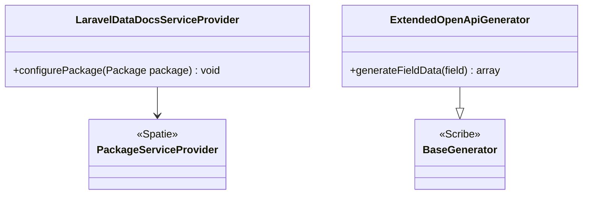

# Package Bootstrap and OpenAPI Field Merge

Core canvas. Owns `src/LaravelDataDocsServiceProvider.php`, `src/OpenApi/**` and `config/data-docs.php`.

Related canvases: Scribe strategies (they produce `custom.openAPI` via `Parameter::toArray`); documentation records (that array shape); parameter metadata pipeline (its `PipelineFactory` receives `config('data-docs')` from the strategies and reads `custom_types`).

## Requirements

- Register the Composer package with Laravel, including a publishable config file named after the package.
- When Scribe writes OpenAPI field objects, copy extra keys from each field’s `custom.openAPI` bag onto the generated field.

## Entities

Config `config/data-docs.php` is a PHP array with a single key `custom_types` defaulting to an empty array. This canvas owns that file’s shape as shipped; PipelineFactory’s interpretation of each entry is the parameter metadata pipeline canvas.

## Approach

Minimal Spatie `laravel-package-tools` provider: package name `laravel-data-docs`, `hasConfigFile()` (config file `data-docs.php`). The provider does not bind ParameterGenerator, registries, or Scribe strategies. Scribe strategy registration is expected to live in the consuming app’s Scribe config (not in this provider).

OpenAPI merge is a subclass of Scribe's `BaseGenerator` whose `generateFieldData` spreads `$field['custom']['openAPI'] ?? []` over the parent field data. Later keys from custom OpenAPI overwrite parent keys on collision. Missing `custom` or `openAPI` yields parent data unchanged. Because `BaseGenerator` builds nested object and array request fields through `generateFieldData` on itself, nested request fields are merged too. Response schemas are built by `generateSchemaForResponseValue`, which does not call `generateFieldData`, so response fields get no merge.

The generator runs after Scribe's own generators (it is appended through `openapi.generators`) and inherits every `BaseGenerator` method, so it rebuilds both the document root and each path item. `pathItem` keys not produced by the base generator, such as `security` from `SecurityGenerator`, survive the `array_merge`; keys the base generator produces are replaced by this generator's own.

Known divergences:

- Service provider contains a block comment pointing at Spatie package-tools docs.
- ExtendedOpenApiGenerator contains a docblock describing Laravel Data strategies; it does not call those strategies itself.
- Provider does not register `ExtendedOpenApiGenerator`; the app must point Scribe at this class.
- Config does not document the per-type schema (type, descriptions, optional constraints); empty array only.
- The generator always extends the 3.0 `BaseGenerator`. With `openapi.version` 3.1.0 or later, Scribe's `Base31Generator` runs first, and this generator then rewrites each path item in the 3.0 field shape (`nullable`, `example`) under a document that declares 3.1.
- The inherited `root()` rebuilds `openapi`, `info`, `servers` and `tags` after `OverridesGenerator` has run, so `openapi.overrides` for those keys (e.g. `info.version`, `servers`) are lost.
- The bag is copied verbatim on every spec version. The pipeline writes `exclusiveMinimum` / `exclusiveMaximum` as numbers, the OpenAPI 3.1 form, so a 3.0 spec publishes them as numbers, where 3.0 defines them as booleans.
- Scribe applies a nullable array field's `nullable` flag to its `items`, not to the array; the generator leaves that shape as Scribe builds it.

## Structure

`src/LaravelDataDocsServiceProvider.php` at package root namespace `Abrha\LaravelDataDocs`. `src/OpenApi/ExtendedOpenApiGenerator.php`. Config at `config/data-docs.php`. No dependency between provider and generator.

## Operations

### LaravelDataDocsServiceProvider

- Extends `Spatie\LaravelPackageTools\PackageServiceProvider`.
- `configurePackage(Package $package)`: `name('laravel-data-docs')`, `hasConfigFile()`. No commands, routes, or views.

### config/data-docs.php

- Returns `custom_types` => empty array. Keys of `custom_types` are intended as PHP class names mapped to arrays for `CustomTypeConfig::fromArray` (required keys `type` and `descriptions` when entries exist; documentation records canvas). The `type` value is copied to the schema as given and the strategies never normalise it.

### ExtendedOpenApiGenerator

- Not `final`. Extends `Knuckles\Scribe\Writing\OpenApiSpecGenerators\BaseGenerator`.
- `generateFieldData($field): array`: `$generateFieldData = parent::generateFieldData($field)`; return spread parent then spread `$field['custom']['openAPI'] ?? []`. `$field` is untyped. A non-array `custom.openAPI` is spread as-is (no guard).
- No other method is overridden; `root()`, `pathItem()`, `pathParameters()` and `generateSchemaForResponseValue()` are `BaseGenerator`'s.
- Class docblock states that it merges custom OpenAPI data generated by the Laravel Data strategies.

## Norms

- Spatie package-tools for discovery; Scribe extension by generator subclass registered in `openapi.generators`, not events.
- Config filename follows package name (`data-docs`).
- No container bindings in the provider.

## Safeguards

- Absent `custom.openAPI` does not change Scribe’s default field object.
- Custom OpenAPI keys override the parent generator on duplicate keys (e.g. `format`, `default`) — last-write-wins via array spread.
- Nested request children are merged too, because `BaseGenerator` builds them through `generateFieldData`.
- The `custom.openAPI` bag carries only the keys `ParameterContext::toParameter` writes (`default`, `format`, the bounds, `pattern`, `multipleOf`; parameter metadata pipeline canvas), never `example`, `examples`, `nullable` or `type`.
- Empty `custom_types` means CustomTypeStage never hits config and falls through to registry then string fallback (pipeline-owned).
- Provider does not boot singletons; AttributeProcessorRegistry still initializes on first `getInstance` during a request.
