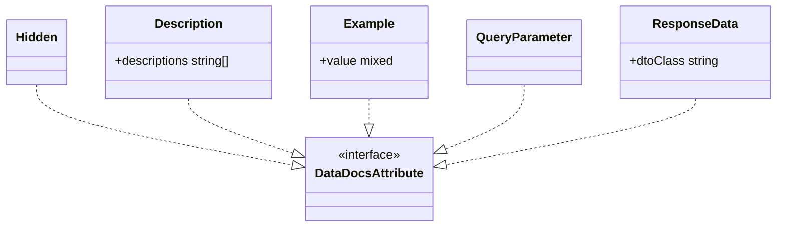

# Public Documentation Attributes

Core canvas. Owns `src/Attributes/**`, `DescriptionProcessor`, `ExampleProcessor`, `QueryParameterProcessor`, and the registry rows `Description`, `Example`, `QueryParameter`.

Related canvases: pipeline canvases (`Hidden` is read by HiddenStage, not by processors); attribute processing framework (`AttributeProcessor`, registry); documentation records (`ParameterLocation`); Scribe strategies (`ResponseData` on controller methods).

## Requirements

- Let Data-class authors mark properties to hide, describe, exemplify, or place in the query string.
- Let controller authors name a response Data class for documentation.
- Give the pipeline a marker type so property-level docs attributes can be collected together.

## Entities

These are PHP 8 attributes in `Abrha\LaravelDataDocs\Attributes`. They hold data only; they do not process context.

Three processors in `Abrha\LaravelDataDocs\AttributeProcessing\Processors` turn the property-level attributes into context fields: `DescriptionProcessor`, `ExampleProcessor` and `QueryParameterProcessor`, each `final` and implementing `AttributeProcessor` directly. `Hidden` and `ResponseData` have no processor.

## Approach

Marker and payload attributes. `DataDocsAttribute` is an empty interface. AttributeProcessingStage collects property attributes of that interface. Hidden is also a `DataDocsAttribute` but is handled earlier by HiddenStage via class presence, and has no registry processor. ResponseData targets methods, so the property pipeline never sees it.

Docblocks on these classes include usage examples and PHP code fences. That is source-as-is; this canvas does not treat those comments as runtime behavior.

A subclass of `Description`, `Example` or `QueryParameter` is collected but does nothing: the registry looks a processor up by the exact class (framework canvas). A `Hidden` subclass is honoured because Spatie files it under its parent. A custom `DataDocsAttribute` implementor is collected but does nothing until a processor is registered for its class.

Known divergences:

- `Hidden` implements `DataDocsAttribute` but is not registered in `AttributeProcessorRegistry`.
- `ResponseData` implements `DataDocsAttribute` but uses `TARGET_METHOD`.
- `Description` is repeatable and accepts variadic strings in one instance.
- `DataDocsAttribute`’s class docblock claims implementors are automatically recognized by AttributeProcessingStage. That is false for Hidden (HiddenStage) and ResponseData (method-only).
- The `QueryParameter` docblock and the README say that a GET request treats every property as a query parameter by default. `ParameterFilter` does that only while no property is marked; once one is marked, unmarked properties stay in the body (DTO extraction canvas).

## Structure

One interface, five attributes; the package ships no subclasses (a user subclass of `Description`, `Example` or `QueryParameter` does nothing, see Approach). Processors and strategies depend inward on these types. Attributes do not depend on pipeline or Scribe.

The three processors live in `src/AttributeProcessing/Processors/` beside the family processors, but this canvas owns them. They depend on `ParameterContext`, and `QueryParameterProcessor` on `ParameterLocation`.

## Operations

### DataDocsAttribute

- Empty interface. No methods.
- Source file has a class docblock stating that implementors are recognized by AttributeProcessingStage. Runtime behavior is the empty contract only.

### Hidden

- PHP attribute: `TARGET_PROPERTY` only, not repeatable.
- No constructor arguments.

### Description

- PHP attribute: `TARGET_PROPERTY` and `IS_REPEATABLE`.
- Constructor: variadic `string ...$descriptions` stored in readonly `descriptions` array (may be empty if called with no strings).
- Class docblock states the placement: custom text follows the generated type sentence and precedes the validation and requirement sentences, wherever the attribute is declared. That holds because `TypeDescriptionStage` runs after `AttributeProcessingStage` and prepends the type sentence, `AttributeProcessingStage` processes `DataDocsAttribute` instances before Spatie validation rules, and the requirement sentences are appended later by the pipeline. A custom type's sentences, appended earlier by `CustomTypeStage`, come before the `Description` text. `README.md` states the order for the type and validation sentences only; it does not mention the requirement sentences or a custom type's sentences.

### Example

- PHP attribute: `TARGET_PROPERTY`.
- Constructor: `mixed $value` stored as readonly `value`. A literal `null` example is stored as null.

### QueryParameter

- PHP attribute: `TARGET_PROPERTY`.
- No constructor arguments.

### ResponseData

- PHP attribute: `TARGET_METHOD`.
- Constructor: readonly `string $dtoClass` (documented as a class-string). No runtime class_exists check.

### Processors

Package attributes are read via public properties, not `parameters()`. Registered after every validation-attribute row; `AttributeProcessingStage` runs them before any validation attribute, because it visits `DataDocsAttribute` instances first.

| Attribute | Processor | Writes | Behaviour |
| --- | --- | --- | --- |
| `Description` | `DescriptionProcessor` | `descriptions[]` | appends `$attribute->descriptions` via spread, as written: no punctuation added and no escaping. `AttributeProcessingStage` later drops empty and `'0'` fragments (bare `array_filter`) |
| `Example` | `ExampleProcessor` | `example` | sets it to `$attribute->value` |
| `QueryParameter` | `QueryParameterProcessor` | `location` | sets `ParameterLocation::QUERY`; never sets `BODY`, which is the default `ParameterContext::toParameter` applies; does not read the attribute |

## Norms

- Native PHP `#[Attribute]` with explicit targets.
- Implement `DataDocsAttribute` even when the consumer is not AttributeProcessingStage.
- Public readonly payloads; no getters.
- Verbose class-level docblocks with `@example` on several attributes; Hidden and QueryParameter have prose docblocks without fenced examples.
- Processors: one Pest file each under `tests/Unit/AttributeProcessing/Processors/`; the attributes themselves one file each under `tests/Unit/Attributes/`.

## Safeguards

- Description is the only repeatable attribute in this set.
- On a Data property, Description text lands after the type sentence and before every validation and requirement sentence, independent of where the attribute is declared. `tests/Integration/Pipeline/DescriptionOrderTest.php` pins one complete description through the default pipeline, with `Description` declared last.
- ResponseData does not validate that `dtoClass` exists or is a Laravel Data class; `ParameterGenerator` returns no fields for a class that does not exist (DTO extraction canvas).
- Example allows any PHP value including null; null is indistinguishable later from “no example” at ExampleGenerationStage (`example !== null`).
- An explicit `#[Example]` is published as given: generation applies only to a field with no example (example generation canvas), so an example that breaks the field's own rules is the author's to fix.
- QueryParameter does not encode HTTP method; GET vs body routing is ParameterFilter’s job.
- A non-null `#[Example]` value is never overwritten by a validation-attribute processor: `ExampleProcessor` is the only processor that writes `example`.
