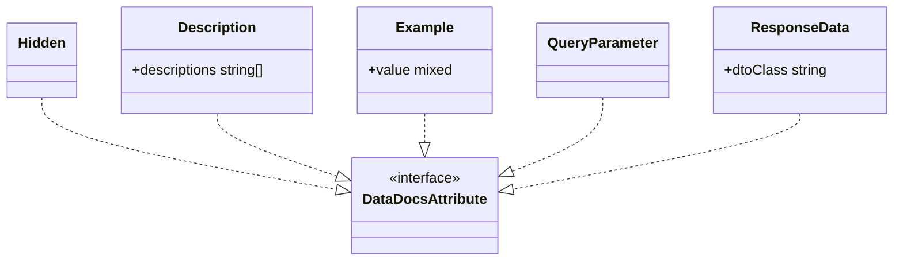

# Public Documentation Attributes

Core canvas. Owns `src/Attributes/**`, `DescriptionProcessor`, `ExampleProcessor`, `QueryParameterProcessor`, and the registry rows `Description`, `Example`, `QueryParameter`.

Related canvases: pipeline canvases (`Hidden` is read by HiddenStage, not by processors); attribute processing framework (`AttributeProcessor`, registry); documentation records (`ParameterLocation`); Scribe strategies (`ResponseData` and method-level `Description`).

## Requirements

- Let Data-class authors mark properties to hide, describe, exemplify, or place in the query string.
- Let controller authors name a response Data class for documentation.
- Let controller authors attach endpoint description text with the same `Description` attribute used on Data properties, including next to `ResponseData`.
- Give the pipeline a marker type so property-level docs attributes can be collected together.

## Entities

These are PHP 8 attributes in `Abrha\LaravelDataDocs\Attributes`. They hold data only; they do not process context.

Three processors in `Abrha\LaravelDataDocs\AttributeProcessing\Processors` turn the property-level attributes into context fields: `DescriptionProcessor`, `ExampleProcessor` and `QueryParameterProcessor`, each `final` and implementing `AttributeProcessor` directly. `Hidden` and `ResponseData` have no processor.

## Approach

Marker and payload attributes. `DataDocsAttribute` is an empty interface. AttributeProcessingStage collects property attributes of that interface. Hidden is also a `DataDocsAttribute` but is handled earlier by HiddenStage via class presence, and has no registry processor. ResponseData targets methods, so the property pipeline never sees it. Description targets both properties and methods; only property instances reach DescriptionProcessor. Method instances are read by `GetFromDescriptionAttribute`.

Docblocks on these classes include usage examples and PHP code fences. That is source-as-is; this canvas does not treat those comments as runtime behavior.

A subclass of `Description`, `Example` or `QueryParameter`, declared with its own `#[Attribute]` (PHP attributes are not inherited, and Spatie fails to load a Data class using a class without one), is processed as the attribute it extends (the registry falls back to the nearest registered parent, framework canvas), and a `Hidden` subclass is honoured because Spatie files it under its parent. A custom `DataDocsAttribute` implementor is collected but does nothing until a processor is registered for its class or a parent.

Known divergences:

- `Hidden` implements `DataDocsAttribute` but is not registered in `AttributeProcessorRegistry`.
- `ResponseData` implements `DataDocsAttribute` but uses `TARGET_METHOD`.
- `Description` is repeatable, accepts variadic strings in one instance, and targets both properties and methods.
- `DataDocsAttribute`’s class docblock claims implementors are automatically recognized by AttributeProcessingStage. That is false for Hidden (HiddenStage), ResponseData (method-only), and method-level Description (`GetFromDescriptionAttribute`).

## Structure

One interface, five attributes; the package ships no subclasses (a user subclass is processed as its parent, see Approach). Processors and strategies depend inward on these types. Attributes do not depend on pipeline or Scribe.

The three processors live in `src/AttributeProcessing/Processors/` beside the family processors, but this canvas owns them. They depend on `ParameterContext`, and `QueryParameterProcessor` on `ParameterLocation`.

## Operations

### DataDocsAttribute

- Empty interface. No methods.
- Source file has a class docblock stating that implementors are recognized by AttributeProcessingStage. Runtime behavior is the empty contract only.

### Hidden

- PHP attribute: `TARGET_PROPERTY` only, not repeatable.
- No constructor arguments.

### Description

- PHP attribute: `TARGET_PROPERTY`, `TARGET_METHOD`, and `IS_REPEATABLE`.
- Constructor: variadic `string ...$descriptions` stored in readonly `descriptions` array (may be empty if called with no strings).
- Class docblock states the placement on Data properties: custom text follows the generated type sentence and any `#[In]` / `#[NotIn]` value sentences, which `TypeDescriptionStage` writes together with the type sentence (parameter metadata pipeline canvas), and precedes the other validation and requirement sentences, wherever the attribute is declared. That holds because `TypeDescriptionStage` runs after `AttributeProcessingStage` and prepends the type sentence, `AttributeProcessingStage` processes `DataDocsAttribute` instances before Spatie validation rules, and the requirement sentences are appended later by the pipeline. A custom type's sentences, appended earlier by `CustomTypeStage`, come before the `Description` text. On methods, the docblock says the text sets the Scribe endpoint description and may sit next to `ResponseData`. `README.md` states the same order for the type and value sentences; it does not mention a custom type's sentences.

### Example

- PHP attribute: `TARGET_PROPERTY`.
- Constructor: `mixed $value` stored as readonly `value`. A literal `null` example is stored as null.

### QueryParameter

- PHP attribute: `TARGET_PROPERTY`.
- No constructor arguments.

### ResponseData

- PHP attribute: `TARGET_METHOD`.
- Constructor: readonly `string $dtoClass` (documented as a class-string). No runtime class_exists check.

### Processors

Package attributes are read via public properties, not `parameters()`. Registered after every validation-attribute row; `AttributeProcessingStage` runs them before any validation attribute, because it visits `DataDocsAttribute` instances first. Package attributes are not validation rules, so the framework's `#[Rule]` replacement (`ReplacedRules`) never skips or repeats them.

| Attribute | Processor | Writes | Behaviour |
| --- | --- | --- | --- |
| `Description` | `DescriptionProcessor` | `descriptions[]` | appends `$attribute->descriptions` via spread, as written: no punctuation added and no escaping. `AttributeProcessingStage` later drops empty and `'0'` fragments (bare `array_filter`) |
| `Example` | `ExampleProcessor` | `example` | sets it to `$attribute->value` |
| `QueryParameter` | `QueryParameterProcessor` | `location` | sets `ParameterLocation::QUERY`; never sets `BODY`, which is the default `ParameterContext::toParameter` applies; does not read the attribute |

## Norms

- Native PHP `#[Attribute]` with explicit targets.
- Implement `DataDocsAttribute` even when the consumer is not AttributeProcessingStage.
- Public readonly payloads; no getters.
- Verbose class-level docblocks with `@example` on several attributes; Hidden and QueryParameter have prose docblocks without fenced examples.
- Processors: one Pest file each under `tests/Unit/AttributeProcessing/Processors/`; the attributes themselves one file each under `tests/Unit/Attributes/`.

## Safeguards

- Description is the only repeatable attribute in this set and the only one that targets both properties and methods.
- Method-level Description does not require ResponseData on the same method.
- On a Data property, Description text lands after the type sentence and the `#[In]` / `#[NotIn]` value sentences, and before every other validation and requirement sentence, independent of where the attribute is declared. The README states the same order. `tests/Integration/Pipeline/DescriptionOrderTest.php` pins one complete description through the default pipeline, with `Description` declared last, one with `In` and `NotIn` declared before and after `Description` (where `NotIn` is folded into the allowed set), and one with only a `NotIn` declared after `Description`, whose own sentence precedes the custom text. The same file runs consumer subclasses of `Example`, `QueryParameter` and `Hidden` through the pipeline and pins that each behaves as its parent.
- ResponseData does not validate that `dtoClass` exists or is a Laravel Data class; `ParameterGenerator` returns no fields for one that is not (DTO extraction canvas).
- Example allows any PHP value including null; null is indistinguishable later from “no example” at ExampleGenerationStage (`example !== null`).
- An explicit `#[Example]` is published as given: generation, the pattern filter and the `NotIn` redraw apply only to generated examples (example generation canvas), so an example that breaks the field's own rules is the author's to fix. Such an example also decides nothing about which pattern is published: `publishedPattern` weighs the example only when every rule of the field accepts it: its pattern and format rules, its length and numeric bounds, and its `#[In]` set (parameter metadata canvas; `InTest` "keeps an approximate pattern beside an explicit example Laravel rejects" and "…for a bound or the In set": `#[Example('cafébar'), Lowercase, Max(3)]` and `#[Example('café'), Lowercase, In(['abc', 'xyz'])]` keep `^[a-z]+$`).
- QueryParameter does not encode HTTP method; GET vs body routing is ParameterFilter’s job.
- A non-null `#[Example]` value is never overwritten by a validation-attribute processor: `ExampleProcessor` runs first, and any processor that writes `example` does so only when it is null (today the acceptance processors, cross-field and acceptance canvas), so `#[Example(null)]` can be. `UrlProcessor` records a scheme instead of writing the example (identifiers canvas).
- The `QueryParameter` docblock and the README state the GET rule as `ParameterFilter` applies it (DTO extraction canvas): on a GET with no marked property every property is a query parameter; once one is marked, unmarked properties stay in the body.
