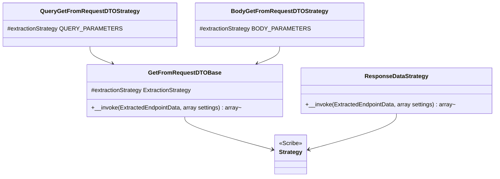

# Scribe Strategies

Core canvas. Owns `src/Strategies/**`.

Related canvases: DTO extraction (finder, generator, filter); pipeline factory; documentation records (`ExtractionStrategy`, `Parameter::toArray`); public attributes (`ResponseData`).

## Requirements

- For Scribe, fill query parameters and body parameters from the first Spatie `Data` subclass argument on the endpoint method (DTO extraction canvas).
- For Scribe, fill response fields from a `ResponseData` attribute on the endpoint method, when present.
- Reuse the same pipeline and generator as the rest of the package; do not reimplement type mapping in the strategy.

## Entities

Query and body classes share the name `GetFromRequestDTOStrategy` in different namespaces (`Strategies\QueryParameters` and `Strategies\BodyParameters`).

## Approach

Scribe `Strategy` subclasses. Request strategies share one invokable that branches only on `extractionStrategy`. Each call `new`s `ParameterGenerator` with `PipelineFactory::createDefault(config('data-docs', []))` and `app(DataConfig::class)`, then maps remaining Parameters through `toArray()`.

Response strategy does not use ParameterFilter or RequestDTOFinder. It reads `ResponseData` via `ReflectionMethod::getAttributes`. On any `Exception` while reading or instantiating `ResponseData`, it returns null (Scribe skip) rather than an empty array; an `Error` is not caught. Errors from parameter generation are not caught and reach Scribe.

Known divergences:

- Request strategies return `[]` when no DTO is found; response strategy returns `null` when no attribute or on exception.
- `GetFromRequestDTOBase` declares return `?array` but successful and missing-DTO paths return arrays, never null.
- Pipeline is created on every strategy invocation (new Faker, new pipeline), not reused.
- Response parameters are not filtered by HTTP method or location; every generated Parameter is serialized. The description sentences are the request ones (the pipeline has no response mode), so a nullable response field reads "A null value is accepted.". Parameters are published under the property names, not Laravel Data's mapped input or output names.
- The strategies always build the default pipeline from `config('data-docs', [])`; a custom `ParameterPipelineStage` reaches Scribe output only through a strategy of the application's own. The README's pipeline-stage example only notes that the pipeline must be created elsewhere, "typically in a service provider or strategy".
- Query/body subclasses only set the protected enum; they add no other behavior.
- `settings` argument is unused.
- A null `method` reaches `RequestDTOFinder`, whose `ReflectionFunctionAbstract` parameter is not nullable, so a request strategy fails with a `TypeError` instead of returning `[]`.
- An argument-less `#[ResponseData]` throws `ArgumentCountError` when instantiated. It is an `Error`, not an `Exception`, so the response strategy does not catch it and it reaches Scribe.

## Structure

`src/Strategies/GetFromRequestDTOBase.php`, `QueryParameters/GetFromRequestDTOStrategy.php`, `BodyParameters/GetFromRequestDTOStrategy.php`, `ResponseDataStrategy.php`. Base is a concrete class, not abstract, but is not useful without `extractionStrategy` being set (uninitialized typed property would error if base were invoked directly).

## Operations

### GetFromRequestDTOBase

- Extends Knuckles Scribe `Strategy`.
- Protected `ExtractionStrategy $extractionStrategy` must be set by subclass property default.
- `__invoke(ExtractedEndpointData $endpointData, array $settings = [])`:
  - DTO = `RequestDTOFinder::getInstance()($endpointData->method)`, called even when `method` is null (Camel types it nullable). If falsy, return `[]`.
  - Build ParameterGenerator with default pipeline from `config('data-docs', [])` and container `DataConfig`.
  - `$parameters = $parameterGenerator($dtoClass->getName())`.
  - Target location QUERY if extractionStrategy is QUERY_PARAMETERS, else BODY.
  - `ParameterFilter::filterByHttpMethod($parameters, $endpointData->httpMethods, $targetLocation)`.
  - Return `array_map` of `Parameter::toArray` (keys preserved from the filter/generator map).

### QueryParameters\GetFromRequestDTOStrategy

- Sets `extractionStrategy` to `ExtractionStrategy::QUERY_PARAMETERS`.

### BodyParameters\GetFromRequestDTOStrategy

- Sets `extractionStrategy` to `ExtractionStrategy::BODY_PARAMETERS`.

### ResponseDataStrategy

- `__invoke`: resolve DTO class from `getResponseDtoClass`; if null, return null. Else generate parameters and `array_map` `toArray` (no filter). Keys from generator.
- `getResponseDtoClass`: try `$endpointData->method?->getAttributes(ResponseData::class)` (exact class; a subclass is not found); empty or missing method → null. Instantiate first attribute, return `dtoClass`. Catch `Exception` → null.

## Norms

- Scribe strategy folder layout (QueryParameters / BodyParameters) matching Scribe’s own strategies.
- Laravel `config()` and `app()` inside `__invoke`, not constructor injection.
- Identical generator construction duplicated in base and ResponseDataStrategy.

## Safeguards

- No DTO on the method yields empty query/body contributions, not a failure.
- An `Exception` from ResponseData instantiation is swallowed.
- `toArray` output is what Scribe stores; location is not in that array (filtering already happened).
- Response strategy does not verify `dtoClass` itself; `ParameterGenerator` returns `[]` for a class that does not exist. A missing method returns null.
