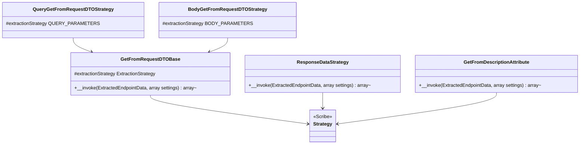

# Scribe Strategies

Core canvas. Owns `src/Strategies/**`.

Related canvases: DTO extraction (finder, generator, filter); pipeline factory; documentation records (`ExtractionStrategy`, `Parameter::toArray`); public attributes (`ResponseData`, method-level `Description`).

## Requirements

- For Scribe, fill query parameters and body parameters from the first argument on the endpoint method that Laravel Data validates from the request (`Data` or `Dto`, any `ValidateableData`; DTO extraction canvas).
- For Scribe, fill response fields from a `ResponseData` attribute on the endpoint method, when present.
- For Scribe, fill endpoint `description` metadata from `Description` attributes on the endpoint method, when present. This does not require `ResponseData` on the same method.
- Reuse the same pipeline and generator as the rest of the package; do not reimplement type mapping in the strategy.

## Entities

Query and body classes share the name `GetFromRequestDTOStrategy` in different namespaces (`Strategies\QueryParameters` and `Strategies\BodyParameters`).

## Approach

Scribe `Strategy` subclasses. Request strategies share one invokable that branches only on `extractionStrategy`. Each call `new`s `ParameterGenerator` with `PipelineFactory::createDefault(config('data-docs', []))` and `app(DataConfig::class)`, then maps remaining Parameters through `toArray()`.

Response strategy does not use ParameterFilter or RequestDTOFinder. It reads `ResponseData` via `ReflectionMethod::getAttributes`. On any Throwable while reading or instantiating `ResponseData`, it returns null (Scribe skip) rather than an empty array. Errors from parameter generation are not caught and reach Scribe.

GetFromDescriptionAttribute is a metadata strategy. It only sets `description` from method-level `Description` attributes and returns null when there is nothing to add. It does not construct a pipeline or call `config()` / `app()`.

Known divergences:

- Request strategies return `[]` when no DTO is found; response strategy returns `null` when no attribute or on exception; GetFromDescriptionAttribute returns `null` when there is no usable description.
- `GetFromRequestDTOBase` declares return `?array` but successful and missing-DTO paths return arrays, never null.
- Pipeline is created on every strategy invocation (new Faker, new pipeline), not reused.
- Response parameters are not filtered by HTTP method or location; every generated Parameter is serialized. No confirmation companion is generated for a response (DTO extraction canvas). The description sentences are the request ones (the pipeline has no response mode), so a nullable response field reads "A null value is accepted.", and a `#[Confirmed]` response field still asks for a `{input}_confirmation` value that the response does not publish. Field references in cross-field sentences keep the literal name written in the attribute, which is what Laravel validates; Laravel Data does not map it, so it matches neither the output name nor, when the referenced property has an input mapping, the published input name.
- The strategies always build the default pipeline from `config('data-docs', [])`; a custom `ParameterPipelineStage` reaches Scribe output only through a strategy of the application's own. The README says so.
- Query/body subclasses only set the protected enum; they add no other behavior.
- `settings` argument is unused.
- GetFromDescriptionAttribute joins fragments with `array_filter` without a callback, so a description string `"0"` is dropped as empty.

## Structure

`src/Strategies/GetFromRequestDTOBase.php`, `QueryParameters/GetFromRequestDTOStrategy.php`, `BodyParameters/GetFromRequestDTOStrategy.php`, `ResponseDataStrategy.php`, `Metadata/GetFromDescriptionAttribute.php`. Base is a concrete class, not abstract, but is not useful without `extractionStrategy` being set (uninitialized typed property would error if base were invoked directly).

## Operations

### GetFromRequestDTOBase

- Extends Knuckles Scribe `Strategy`.
- Protected `ExtractionStrategy $extractionStrategy` must be set by subclass property default.
- `__invoke(ExtractedEndpointData $endpointData, array $settings = [])`:
  - DTO = `RequestDTOFinder::getInstance()($endpointData->method)`, or null without calling the finder when `method` is null (Camel types it nullable). If falsy, return `[]`.
  - Build ParameterGenerator with default pipeline from `config('data-docs', [])` and container `DataConfig`, publishing input names (the default).
  - `$parameters = $parameterGenerator($dtoClass->getName())`.
  - Target location QUERY if extractionStrategy is QUERY_PARAMETERS, else BODY.
  - `ParameterFilter::filterByHttpMethod($parameters, $endpointData->httpMethods, $targetLocation)`.
  - Return `array_map` of `Parameter::toArray` (keys preserved from the filter/generator map).

### QueryParameters\GetFromRequestDTOStrategy

- Sets `extractionStrategy` to `ExtractionStrategy::QUERY_PARAMETERS`.

### BodyParameters\GetFromRequestDTOStrategy

- Sets `extractionStrategy` to `ExtractionStrategy::BODY_PARAMETERS`.

### ResponseDataStrategy

- `__invoke`: resolve DTO class from `getResponseDtoClass`; if null, return null. Else generate parameters and `array_map` `toArray` (no filter). Keys from generator.
- `getResponseDtoClass`: try `$endpointData->method?->getAttributes(ResponseData::class, ReflectionAttribute::IS_INSTANCEOF)` (a subclass counts); empty or missing method → null. Instantiate first attribute, return `dtoClass`. Catch `Throwable` → null. `ResponseDataStrategyTest` pins a subclass.

### GetFromDescriptionAttribute

- Extends Scribe `Strategy`. Constructor is the parent `DocumentationConfig` only. Lives in `Strategies\Metadata` so it can be registered under Scribe `strategies.metadata`.
- `__invoke`: extract description; if null, return null; else return map with key `description` only. `$settings` is unused.
- `extractDescription`: read all `Description` attributes on `$endpointData->method` (repeatable; `IS_INSTANCEOF`, so a subclass counts). Flatten each instance’s `descriptions` array in declaration order. Join with a single space after `array_filter` on the parts (empty strings, `null`, `false`, `0`, and `"0"` are dropped). An attribute that throws while instantiating is skipped on its own, so the others still count. If no attributes, missing method, or the combined string is empty, return null.
- Does not read `ResponseData`. Does not set title, group, or authenticated.

## Norms

- Scribe strategy folder layout (QueryParameters / BodyParameters / Metadata) matching Scribe’s own strategies.
- Laravel `config()` and `app()` inside `__invoke` on request and response-field strategies, not constructor injection. GetFromDescriptionAttribute does not use the container.
- Identical generator construction duplicated in base and ResponseDataStrategy.
- Tests: one Pest file per strategy class family under `tests/Unit/Strategies/`. `GetFromRequestDTOStrategyTest` covers both request strategies through a mocked `ExtractedEndpointData`; `ResponseDataStrategyTest` and `Metadata/GetFromDescriptionAttributeTest` cover the other two.

## Safeguards

- No DTO on the method, or no method at all, yields empty query/body contributions, not a failure. Pinned for both request strategies in `GetFromRequestDTOStrategyTest`.
- Invalid ResponseData instantiation is swallowed. Pinned in `ResponseDataStrategyTest` with an argument-less `#[ResponseData]`, whose `newInstance()` throws. A wrongly typed scalar argument is not a usable fixture, because coercive typing turns `#[ResponseData(123)]` into the string `"123"`.
- Invalid or empty method-level Description instantiation yields null metadata, not an empty description string.
- Registering GetFromDescriptionAttribute after Scribe docblock/attribute metadata strategies lets this attribute override those sources for `description` only (Scribe merge order is the app’s `config/scribe.php`).
- `toArray` output is what Scribe stores; location is not in that array (filtering already happened). Pinned in `GetFromRequestDTOStrategyTest`, which also checks the POST body/query split and the GET-without-query-attributes rule.
- The response strategy builds `ParameterGenerator` with `outputNames: true`, so response fields carry Laravel Data's output names; the request strategies publish input names (DTO extraction canvas). `ResponseDataStrategyTest` pins the output name of a mapped property, and `GetFromRequestDTOStrategyTest` the input name of a mapped property and a `Dto` argument's fields.
- Response strategy does not verify `dtoClass` itself; `ParameterGenerator` returns `[]` for a class that does not exist or is not a Laravel Data class. A missing method returns null. Pinned in `ResponseDataStrategyTest`.
