# Parameter Metadata Pipeline

Core canvas. Owns `src/Pipeline/**` except what two sibling canvases own: requirement resolution (`RequiredStage`, `RequirementDescriptionStage`, `Pipeline/Support/**`) and example generation (`ExampleGenerationStage`). This canvas owns the stage contract and runner, the factory and the default stage order, the shared `ParameterContext`, and the hidden, type, custom-type, attribute-processing, type-description and default-value stages.

Related canvases: requirement resolution (required / nullable and the requirement sentences); example generation (the `example`); documentation records; public attributes; attribute processing framework; custom type extension; DTO parameter extraction; every family canvas that writes a context field.

## Requirements

- Produce OpenAPI-oriented parameter metadata from a Spatie Laravel Data property without requiring callers to assemble that metadata by hand.
- Skip documentation for properties marked hidden so they never receive type, validation, description, or example processing.
- Map PHP/Spatie data types (scalars, arrays, nested data objects, enums) onto documentation types consumers expect (`string`, `integer`, `boolean`, `number`, `object`, and `[]` variants).
- Allow project configuration and registered custom-type processors to override how non-standard class types appear in docs.
- Fold Spatie Laravel Data validation rules and package documentation attributes into the same parameter record (constraints, extra description fragments, examples, formats).
- Emit human-readable descriptions that state the type or allowed enum values, and any `#[In]` / `#[NotIn]` value set, then any extra fragments, then a default-value sentence when a default exists.
- Decide requirement status and state it in prose (requirement resolution canvas), and generate a sample `example` when none was supplied (example generation canvas).

Boundaries of this spec: the sequential pipeline, its factory, the shared mutable context, and the default stages other than the three the sibling canvases own. Attribute processor internals, custom-type processor internals, and Parameter value-object serialization beyond `toParameter()` are outside this canvas except as collaborators.

## Entities

```mermaid
classDiagram
    class ParameterPipelineStage {
        <<interface>>
        +process(ParameterContext context) ParameterContext
    }

    class ParameterPipeline {
        -stages ParameterPipelineStage[]
        +addStage(ParameterPipelineStage stage) ParameterPipeline
        +process(ParameterContext context) ParameterContext
    }

    class PipelineFactory {
        +createDefault(array dataDocsConfig) ParameterPipeline$
    }

    class ParameterContext {
        +name string
        +property DataProperty
        +isHidden bool
        +hasNestedParameters bool
        +hasArrayParameters bool
        +type string~
        +required bool~
        +nullable bool~
        +onlyValidatedWhenPresent bool
        +presentAcceptsEmpty bool
        +neverSatisfiable bool
        +numericString bool
        +allowedValues string[]~
        +excludedValues string[]~
        +confirmationCompanion ConfirmationCompanion~
        +location ParameterLocation~
        +description string
        +example mixed
        +enumInfo EnumInfo~
        +dataClass string~
        +default mixed
        +descriptions string[]
        +format string~
        +dateFormat string~
        +uriScheme string~
        +exampleFormat string~
        +minimum int|float~
        +maximum int|float~
        +exclusiveMinimum int|float~
        +exclusiveMaximum int|float~
        +pattern string~
        +valuePatterns string[]
        +valueRegexes string[]
        +regexPatterns string[]
        +valueRules string[]
        +minLength int~
        +maxLength int~
        +minItems int~
        +maxItems int~
        +multipleOf int~
        +exampleMultipleOf int|float~
        +itemSchema array
        +allowedValueList() array~
        +acceptedAllowedValues() string[]~
        +matchesValueRules(string value) bool
        +keepEnumCases(callable keep) void
        +patternIsApproximate() bool
        +toParameter() Parameter
    }

    class HiddenStage
    class TypeStage
    class CustomTypeStage {
        -customTypesConfig CustomTypeConfig[]
    }
    class AttributeProcessingStage
    class TypeDescriptionStage
    class DefaultValueStage
    class DefaultValueDescriptionStage
    class RequiredStage
    class RequirementDescriptionStage
    class ExampleGenerationStage

    ParameterPipeline --> ParameterPipelineStage : owns ordered stages
    ParameterPipeline ..> ParameterContext : processes
    PipelineFactory ..> ParameterPipeline : builds default
    PipelineFactory ..> CustomTypeConfig : from custom_types config
    PipelineFactory ..> RequirementResolver : fromConfig()
    HiddenStage ..|> ParameterPipelineStage
    TypeStage ..|> ParameterPipelineStage
    CustomTypeStage ..|> ParameterPipelineStage
    AttributeProcessingStage ..|> ParameterPipelineStage
    TypeDescriptionStage ..|> ParameterPipelineStage
    DefaultValueStage ..|> ParameterPipelineStage
    DefaultValueDescriptionStage ..|> ParameterPipelineStage
    RequiredStage ..|> ParameterPipelineStage
    RequirementDescriptionStage ..|> ParameterPipelineStage
    ExampleGenerationStage ..|> ParameterPipelineStage
    TypeStage ..> EnumInfo : writes
    AttributeProcessingStage ..> EnumInfo : narrows or clears, via In / NotIn
    CustomTypeStage ..> CustomTypeConfig : applies
    ParameterContext ..> EnumInfo : optional
    ParameterContext ..> ParameterLocation : unused by stages
    ParameterContext ..> ConfirmationCompanion : carries, never publishes
    ParameterContext ..> Parameter : materializes
```

Collaborating types used by this module but not owned by it:

- `DataProperty` (Spatie): reflection of the property; stages read `attributes`, `type` (kind, type, dataClass, iterableItemType, isNullable, isOptional, `getAcceptedTypes()`), `hasDefaultValue`, `defaultValue`, `cast` (the resolver's `isPlainString`), and `inputMappedName` / `outputMappedName` (read by the DTO extraction canvas and `ConfirmedProcessor`, not by stages).
- `Hidden` attribute: presence on the property sets `isHidden`.
- `CustomTypeConfig`: readonly bag of documentation type plus constraint fields; built via `fromArray` which requires `type` and `descriptions` keys.
- `CustomTypeProcessorRegistry` singleton and `CustomTypeProcessor`: optional fallback after config lookup.
- `AttributeProcessorRegistry` singleton: maps attribute/rule class names to processors; missing processor is ignored (`?->`).
- `DataDocsAttribute` and Spatie `ValidationRule`: attribute families processed in that order.
- `EnumInfo` / `EnumType`: enum documentation payload; `toArray()` returns case names for pure enums and backing values for backed enums.
- `Parameter`: output record. `toParameter()` defaults missing type to `string`, required to `false`, nullable to `true`, location to `BODY`. Null OpenAPI constraint fields are dropped; `0` and other non-null values are kept.
- `ParameterLocation`: `QUERY` / `BODY`. No pipeline stage assigns `location`.
- `ConfirmationCompanion`: readonly record of a `#[Confirmed]` companion's name and two sentences. Written onto the context only by `ConfirmedProcessor` (cross-field and acceptance canvas) and read only by `ParameterGenerator` (DTO extraction canvas). No stage reads or writes it.
- The requirement collaborators (`DataConfig`, `RuleInferrer`, `PropertyRules`, the requirement rule classes, `ValidationContext` / `ValidationPath`) are listed in the requirement resolution canvas; Faker in the example generation canvas.

## Approach

The module is a linear pipeline: a mutable `ParameterContext` is passed through ordered stages. Each stage implements `ParameterPipelineStage` and returns the same context instance after mutation. The pipeline is a simple list with `addStage` appending; there is no remove, insert-at-index, or named-stage API.

Default order is fixed in `PipelineFactory::createDefault`: Hidden, Type, CustomType, AttributeProcessing, TypeDescription, DefaultValue, DefaultValueDescription, Required, RequirementDescription, ExampleGeneration.

Requirement status is reconciled, not recomputed: the decisions are recorded in the requirement resolution canvas. Example generation runs last: see the example generation canvas.

Trade-offs present in the code:

- Mutability over immutability: context fields are public and written in place so stages can share work without copying.
- Service location over constructor injection for both registries; only custom-type config and Faker are injected.
- Early exit after any stage that leaves `isHidden` true. Only HiddenStage sets that flag in the default pipeline, so later stages never run for hidden properties.
- Description assembly is split: fragments accumulate in `descriptions[]` (custom types, attribute processors), then AttributeProcessingStage concatenates them onto `description`, then TypeDescriptionStage prepends a type/enum sentence and the value-set sentences, then DefaultValueDescriptionStage appends a default sentence.

Integration: in-process PHP. Factory reads `dataDocsConfig['custom_types']` as a map of class name to config arrays. Stages call Spatie property metadata and PHP enum/`enum_exists`/`ReflectionEnum`. ExampleGenerationStage performs Faker I/O only in the sense of generating values; no network or filesystem.

Known divergences (codified as-is, not proposed fixes):

- Workspace guidance prefers readonly/immutable metadata objects; `ParameterContext` is a bag of public writable fields. `name` and `property` are the only readonly constructor properties.
- `location`, `hasNestedParameters`, and `hasArrayParameters` are written or defaulted but never consumed by later stages in this module.
- `confirmationCompanion` is carried through the pipeline untouched: written by an attribute processor, consumed only outside this module by `ParameterGenerator`.
- TypeStage can produce type `[]` (empty item type plus suffix). CustomTypeStage treats `[]` as a standard type and does not fall through to custom-type handling.
- `TypeStage::setEnumInfo` swallows `TypeError` and leaves type/enumInfo unchanged for that path.
- `DefaultValueDescriptionStage` skips when `context->default !== null` is false, so a documented default of PHP `null` never gets a “Defaults to” sentence even if `hasDefaultValue` is true.
- Default-value description uses `property->defaultValue` for enum display (`BackedEnum` as name and value, `UnitEnum` as name) but `context->default` for booleans, arrays, and objects.
- Scalar type detection walks `bool`, `int`, `float`, `string` and takes the first `acceptsType` hit, so overlapping acceptors follow that priority.
- AttributeProcessingStage runs before TypeDescriptionStage, so type/enum sentences appear at the front of the final description even when attributes ran first.
- Stage and pipeline classes carry no explanatory comments beyond those listed in Norms; `RequirementResolver` and `RequiredStage` are the requirement resolution canvas's deliberate exceptions.
- Format rules that need the network (`active_url`, `email:dns`, `Password`'s `uncompromised`), and a `Password`'s custom rules (they may read the rest of the request or application state), do not narrow an `#[In]` set: they record no `valueRules` entry, so a value only they reject is still published, stated and drawn. Neither do attributes the package does not register (`Timezone`, `MacAddress`, `NotRegex`, `MaxDigits`, `After`, …).
- An enum-typed field is not filtered by `valuePatterns`: `acceptedAllowedValues()` filters `allowedValues` only, so `#[StartsWith('d')] Status` still publishes, states and draws every case, including those the pattern rejects. Only `In`, `NotIn`, `Accepted` and `Declined` narrow `enumInfo`.
- The `custom_types` config path publishes its `type` as given, while the processor path replaces any type outside `STANDARD_TYPES`; only the standard types (`string`, `integer`, `number`, `boolean`, `object`, or one of them with `[]`) are valid there, as the README states, and a bare `array` is published by Scribe as `string[]`.
- `STANDARD_TYPES` in CustomTypeStage is a closed list; a type outside it, such as the class name `DateTimeImmutable[]` TypeStage writes for an array of a class, falls through to custom-type handling and, with no config or processor, to the string fallback (`string[]` for an array).

## Structure

Namespace `Abrha\LaravelDataDocs\Pipeline`. Stages live in `Pipeline\Stages`. Context lives in `Pipeline\Context`. The requirement seam and its value object live in `Pipeline\Support`.

Dependency direction (leaf toward orchestrator):

1. `ParameterPipelineStage` (contract).
2. `RequirementStatus` and `RequirementResolver` (requirement resolution canvas).
3. Stage classes (depend on context + collaborators; `RequiredStage` additionally requires `RequirementResolver`).
4. `ParameterPipeline` (depends on stage contract and context).
5. `PipelineFactory` (depends on pipeline, all default stages, `CustomTypeConfig`, `RequirementResolver`, Faker factory).

`RequirementResolver` is the only class permitted to import Spatie's validation internals (`PropertyRules`, `RequiringRule`, `ValidationContext`, `ValidationPath`); the rule and its scope are in the requirement resolution canvas.

Call graph for a default run:

`PipelineFactory::createDefault` → `RequirementResolver::fromConfig` → `ParameterPipeline::addStage` (ten times) → caller `ParameterPipeline::process` → each `stage->process` until hidden or exhausted → optional later `ParameterContext::toParameter`.

There is no inheritance among stages. All stage classes are `final`, as are `RequirementResolver` and `RequirementStatus`. `PipelineFactory` is a static factory, not a pipeline stage.

Layering: this is a domain processing layer. It does not own HTTP, OpenAPI document assembly, or Laravel container binding (those sit outside this canvas).

## Operations

### ParameterPipelineStage

- Responsibility: single contract for a context transformation.
- Method `process(ParameterContext $context)` returns `ParameterContext`. Implementations in this module return the same instance after mutation.

### ParameterPipeline

- Responsibility: run stages in append order; stop when the context is hidden.
- Method `addStage(ParameterPipelineStage $stage)` appends and returns `$this` for chaining. Stages array is private with no getter.
- Method `process(ParameterContext $context)` iterates stages, reassigns `$context` to each stage result, and immediately returns if `isHidden` is true. If no stage hides the property, returns the context after the last stage.

### PipelineFactory

- Responsibility: build the default stage sequence and custom-type map.
- Static method `createDefault(array $dataDocsConfig = [])`:
  - Reads `$dataDocsConfig['custom_types']` or an empty array.
  - For each entry, keys are class names and values are arrays passed to `CustomTypeConfig::fromArray` (requires `type` and `descriptions`).
  - Instantiates `ParameterPipeline` and adds stages in this order: HiddenStage (no deps), TypeStage (no deps), CustomTypeStage with the config map, AttributeProcessingStage (no deps), TypeDescriptionStage, DefaultValueStage, DefaultValueDescriptionStage, RequiredStage with `RequirementResolver::fromConfig()`, RequirementDescriptionStage (no deps), ExampleGenerationStage with `Faker\Factory::create()`.
  - `RequirementResolver::fromConfig()` is evaluated once per `createDefault` call, so the inferrer list is read once and reused across every property.
  - Returns the pipeline. Does not process any property.

### ParameterContext

- Responsibility: accumulate documentation fields for one named property.
- Constructor takes readonly `name` (string) and readonly `property` (`DataProperty`).
- Defaults: `isHidden` false, nested/array flags false, `onlyValidatedWhenPresent` false, `presentAcceptsEmpty` false, `neverSatisfiable` false, `numericString` false, `allowedValues` and `excludedValues` null, `confirmationCompanion` null, `type`/`required`/`nullable`/`location`/`enumInfo`/`dataClass`/`format`/`dateFormat`/`uriScheme`/`exampleFormat`/`pattern`, numeric constraints and `exampleMultipleOf` null, `valuePatterns`, `valueRegexes`, `valueRules` and `itemSchema` empty arrays, `description` empty string, `example` null, `default` null, `descriptions` empty array.
- `onlyValidatedWhenPresent`, `presentAcceptsEmpty` and `neverSatisfiable` are non-nullable bools (unlike `required`/`nullable`, which are nullable). They drive description text only and are deliberately absent from `toParameter()`, so they reach neither `Parameter` nor `openApiAttributes`.
- `numericString` is a non-nullable bool, declared after `neverSatisfiable`. It means "this `string` field only passes validation with a numeric value", and is set only by a comparison processor that receives a literal bound (size and bounds canvas), which also records that bound in the numeric constraint fields. It is read by `toParameter()` and `ExampleGenerationStage`, and never published itself.
- `allowedValues` is a `?array` of strings, declared after `numericString`: the string forms of the values an `#[In]` accepts, written by `InProcessor` and narrowed by `NotInProcessor` (enumerated values and text patterns family); `[]` means no value is accepted. On a PHP-enum field the family narrows `enumInfo` instead, through `keepEnumCases(callable $keep)`, which keeps the cases `$keep` accepts and, when none survives, clears `enumInfo` and sets `allowedValues` to `[]`, so the field is then described and exemplified through the non-enum branches. `excludedValues` is a `?array` of strings declared after it: the string forms an `#[NotIn]` rejects, written only by `NotInProcessor`, which on a `boolean` field keeps only the forms a boolean can take (`'1'`, `'0'`, `''`), since the field's own type rule rejects any other value. Neither is published by `toParameter()` other than through `allowedValueList()`. `acceptedAllowedValues()` returns `allowedValues` less any value `matchesValueRules()` rejects or the field's bounds rule out, so `#[In(['eur', 'USD']), Uppercase]` allows only `USD`, `#[In(['in_progress']), Lowercase]` keeps `in_progress`, `#[In(['abc', 'ab1']), Alpha, Lowercase]` allows only `abc` in either declaration order, and `#[In(['ab', 'abcdef']), Max(3)]` allows only `ab`; it returns null when `allowedValues` is null. `matchesValueRules(string $value)` is true when every one of `valuePatterns` matches (as the stage matches patterns, `\x01…\x01u`), every one of `valueRegexes` matches as declared, and every one of `valueRules` passes Laravel's validator, which on a `boolean` field is given `'1'` as `true` and `''` as `false` (so `declined` keeps `false`, which it rejects as `''`: `#[In([true, false]), Declined] bool` allows only `false`); a pattern PHP cannot compile, or a rule the validator throws on, is skipped. The bounds check (`withinBounds`) does not apply an array field's own bounds, which count items; it checks each value against the item constraints a custom type publishes under `items` (`withinItemSchema` over `itemSchema`: `minLength`/`maxLength` for string items, the numeric bounds and `multipleOf` for integer and number items), so a `Money[]` entry with `minLength: 3` narrows `#[In(['123', '12'])]` to `123` (`CustomTypeStageTest` "draws the items of an array custom type from its published item schema and narrows #[In] by it"); on a `string` field it applies `minLength`/`maxLength` by `mb_strlen`; on an `integer` or `number` field, or a `string` field with `numericString`, the value must be numeric and meet `minimum`, `maximum`, `exclusiveMinimum`, `exclusiveMaximum` and be a multiple of each divisor set, `multipleOf` and `exampleMultipleOf` alike (a digit count on a `float` writes `multipleOf: 1` beside a fractional `MultipleOf`). `allowedValueList()` returns those typed to the field's base type (`integer` → int, `number` → float, otherwise string), or null when there are none. On a `boolean` field Laravel compares `true` as `'1'` and `false` as `''` (a PHP `false` in a rule is written `""`), so `'1'` → `true`, `''` → `false`, and `'0'` is left out: only `0` or `"0"` passes it, neither of which a boolean schema can express (example generation gives such a field the example `0`).
- `valuePatterns` is a `list<string>`, default `[]`, declared after `pattern`: the patterns that decide which `#[In]` values count as accepted and which pattern examples are kept, one per pattern rule, because Laravel enforces every one while the published `pattern` holds only the last writer's. Each pattern rule appends to it: `StartsWith`, `EndsWith` and the static pattern rows append their pattern, except the ASCII character-class rows, which only approximate Laravel's rule and append Laravel's own (`[\pL\pM]` for `Alpha`, `[\pL\pM\pN_-]` for `AlphaDash`, `[\pL\pM\pN]` for `AlphaNumeric`, no `\p{Lu}`/`\p{Lt}` for `Lowercase`, no `\p{Ll}`/`\p{Lt}` for `Uppercase`; attribute processing framework and enumerated values canvases); the digit rules append their digit pattern even when another attribute's pattern stays the published one (arrays and type assertions canvas). `CustomTypeStage` sets it to `[config pattern]` (or `[]`) from config, and to `[pattern]` after a custom type processor that sets `pattern` and leaves `valuePatterns` empty; a processor's own value patterns are kept. It is never published.
- `valueRegexes` is a `list<string>`, default `[]`, declared after `valuePatterns`: the regexes `#[Regex]` declares, delimiters and flags included, which `RegexProcessor` appends when PHP compiles them (enumerated values canvas). They are matched as Laravel runs them, so a regex declared without `u` rejects `café` for `^\w+$`, which a translated pattern matched in UTF mode would accept. It is never published.
- `regexPatterns` is a `list<string>`, default `[]`, declared after `valueRegexes`: the ECMA-262 patterns `#[Regex]` publishes, each the exact translation of a declared regex, which `RegexProcessor` appends beside `pattern` (enumerated values canvas), so a published pattern among them is not an approximation. It is never published separately.
- `valueRules` is a `list<string|object>`, default `[]`, declared after `valueRegexes`: Laravel rules of the field's format rules that need no network: the strings `email:rfc`, `url:https`, `uuid`, `ip`, `ipv4`, `ipv6`, `json` (appended by `EmailProcessor`, `UrlProcessor` and the static format rows, identifiers canvas), `accepted` and `declined` (`AcceptedProcessor`, `DeclinedProcessor`, cross-field acceptance canvas), `date` and `date_format:{formats}` (`DateProcessor`, `DateFormatProcessor`, dates and times canvas), and a rebuilt Illuminate `Password` rule object without `uncompromised` or the application's custom rules (`PasswordProcessor`, identifiers canvas). `matchesValueRules()` runs each through the container's validation factory (`Illuminate\Contracts\Validation\Factory`), passing it as `[$rule]` and a boolean's `'1'`/`''` as `true`/`false`, and skips one that throws. It is never published.
- `exampleMultipleOf` is an `int|float|null`, declared after `multipleOf`: a divisor `multipleOf` cannot publish, written by `MultipleOfProcessor` as the absolute value of a fractional or negative non-zero divisor (size and bounds canvas), so a numeric example is still a multiple of it (example generation canvas), and an `#[In]` value is accepted only when it is a multiple of both `multipleOf` and `exampleMultipleOf`. It is never published.
- `itemSchema` is an `array<string, int|float|string>`, default `[]`, declared after `multipleOf`: the item constraints `CustomTypeStage` sets aside for an array of a custom type. `toParameter` publishes it as the bag's `items` key (`publishedItemSchema`), its `pattern` left out when a published `#[In]` item rejects it, as `publishedPattern` does for a scalar (a processor's own value patterns may accept `café` beside `^[a-z]+$`), and the key left out when empty; the package and OpenAPI glue canvas merges it into the schema's `items`.
- `enumInfo` is written by `TypeStage`, and replaced by a narrowed copy, or cleared, through `keepEnumCases` during attribute processing: by the enumerated values family's `ValueListProcessor::narrowEnum` and the cross-field acceptance family's `AcceptanceProcessor::narrowEnum`.
- `exampleFormat` is a `?string`, declared after `uriScheme`: a format used for example generation only, written by an attribute that has no exact OpenAPI format (`IP`'s static row → `ipv4`, `DateProcessor` → `date`, dates and times canvas) and never published.
- `uriScheme` is a `?string`, declared directly after `dateFormat`: the protocol the `uri` example uses instead of `https`, written only by `UrlProcessor` (identifiers family) when its protocol list holds no `https`, and read only by `ExampleGenerationStage`. It is never published.
- The four numeric bound fields, `minimum`, `maximum`, `exclusiveMinimum` and `exclusiveMaximum`, are `int|float|null`, so a fractional bound (`#[GreaterThan(0.5)]`) is held and published exactly. The size and bounds processors write an integral value as an int, so `5.0` is published as `5`. The length, item-count and `multipleOf` fields stay `?int`.
- `confirmationCompanion` is a `?ConfirmationCompanion`, declared after `excludedValues`. It is carried, never published: written only by `ConfirmedProcessor`, read only by `ParameterGenerator`, and absent from `toParameter()` like the three flags above.
- `dateFormat` is a `?string`, declared directly after `format`. It holds a PHP date format that every value it produces passes, and is written only by `DateFormatProcessor` (dates and times canvas), which sets it to the first declared format a value can satisfy. It is read only by `ExampleGenerationStage`, and never published: the OpenAPI `format` is a separate field, and the PHP format reaches the reader through the description.
- Method `toParameter()` builds `Parameter` with defaults listed under Entities. `enumValues` is `enumInfo?->toArray()`, else `allowedValueList()`. `openApiAttributes` includes default, format, min/max, exclusive min/max, pattern, length and items bounds, multipleOf, and `items` (the item schema, its pattern reconciled with the published `#[In]` items as above, null when empty), with nulls removed via `array_filter` using `!== null`. The pattern is `publishedPattern(enumInfo === null ? enumValues : null)`: left out when an `#[In]` set is published and one of its string values fails the pattern, since the set is exact and the pattern would make the schema unsatisfiable (`#[In(['in_progress']), Lowercase]` publishes the set and no `^[a-z]+$`). A pattern that only approximates Laravel's rule (`patternIsApproximate()`: `valuePatterns` is not empty and holds neither it nor `regexPatterns`, as with the ASCII character classes; a pattern with nothing behind it is the rule, and a declared regex's translation is exact, so `#[Regex('/^\d{3}$/'), Lowercase]` judges the `^[a-z]+$` `Lowercase` writes last and leaves it out beside the example `333`, while `#[Lowercase, Regex('/^[a-z]{3}$/')]` keeps the regex translation; `EnumeratedTextPatternsTest` "judges an approximate pattern beside a Regex by the example too, and keeps a regex pattern") is also left out when it rejects a value Laravel's rules accept: a value counts as accepted when `acceptsValue` holds, the test `acceptedAllowedValues()` applies: `matchesValueRules`, the bounds (`withinBounds`) and, when an `#[In]` set exists, membership of it. On an enum-typed field, any case so accepted, all of them checked, so the result never depends on the case drawn as the example (`#[Lowercase]` on an enum with `draft`, `in_progress` and `Published` publishes no `^[a-z]+$`, since `in_progress` passes `lowercase`, while `#[Uppercase]` on it keeps `^[A-Z]+$`, since no case passes `uppercase`, and `#[Lowercase, Max(5)]` on it keeps `^[a-z]+$`, since `in_progress` fails `max:5`; `InTest` `stage_lower`, `stage_upper`, `stage_lower_max`, pinned over repeated builds); on any other field, the example when it is so accepted (`#[Lowercase, Digits(3)]` publishes no `^[a-z]+$` beside the example `007`, `EnumeratedTextPatternsTest`), so an author's `#[Example]` that Laravel rejects, for a pattern, format, bound or the `#[In]` set, decides nothing (`#[Example('ABC'), Lowercase]`, `#[Example('cafébar'), Lowercase, Max(3)]` and `#[Example('café'), Lowercase, In(['abc', 'xyz'])]` keep `^[a-z]+$`; `InTest` "keeps an approximate pattern beside an explicit example Laravel rejects" and "…for a bound or the In set"). An exact pattern on an enum-typed field is always kept: the case list is not narrowed by the pattern rules, so `#[StartsWith('e')]` on an enum publishes `^(e)` beside every case (`InTest` `role_prefixed`; `ParameterContextTest` "keeps the exact pattern of an enum…"). When `numericString` is true, `minimum`, `maximum`, `exclusiveMinimum`, `exclusiveMaximum` and `multipleOf` are left out (`MultipleOf` on a `string` field sets `numericString`, size and bounds canvas): a string schema ignores them, and the rule is stated in the description. They stay on the context for example generation.

### HiddenStage

- Responsibility: detect the Hidden attribute.
- Sets `isHidden` to whether `$context->property->attributes->has(Hidden::class)`.
- Does not clear other fields. Returning with `isHidden` true causes the pipeline to stop.

### TypeStage

- Responsibility: set documentation type, nested/array flags, data class, and enum info from Spatie type metadata.
- Reads `$context->property->type->kind`. Sets `hasNestedParameters` when kind is `DataTypeKind::DataObject`, `hasArrayParameters` when kind is `DataTypeKind::DataArray`.
- If either nested flag is true: sets `type` to `object[]` for data arrays else `object`, sets `dataClass` from `$context->property->type->dataClass`, returns without scalar/enum handling.
- Otherwise gets `$context->property->type->type`. If `findAcceptedScalarType` finds a TYPE_MAP key (`bool` → `boolean`, `int` → `integer`, `float` → `number`, `string` → `string`) via `acceptsType` in that key order, sets `type` and returns.
- Else if the type `acceptsType('array')`: uses `iterableItemType`; documentation type is `(TYPE_MAP[item] ?? item)` plus `[]`, or just `[]` when item type is empty. If item type is non-empty and `enum_exists(itemType)`, calls `setEnumInfo` with `isArray` true.
- Else if `findAcceptedTypeForBaseType(UnitEnum::class)` returns a class, calls `setEnumInfo` with `isArray` false.
- Else if the type is Spatie `NamedType`, sets `type` to TYPE_MAP of `NamedType->name` or the raw name.
- Otherwise leaves `type` as it was (typically null).
- Private `setEnumInfo(context, enumClass, isArray)`: no-op if `enum_exists` is false. Loads `enumClass::cases()`. If first case is `BackedEnum`, reflects backing type name; if present, maps it through TYPE_MAP, suffixes `[]` when `isArray`, sets `enumInfo` to INT_BACKED when backing name is `int` else STRING_BACKED, with the cases array. If not backed, type is `string` or `string[]` and `enumInfo` is PURE. Catches `TypeError` and does nothing.

### CustomTypeStage

- Responsibility: replace non-standard types using config, then registry, then a string fallback.
- Constructor stores `array<string, CustomTypeConfig> $customTypesConfig` (default empty), keyed by class name matching `context->type`.
- If `isStandardType(context->type)`: return unchanged. Standard set: `string`, `integer`, `boolean`, `number`, `object`, `[]`, `string[]`, `integer[]`, `boolean[]`, `number[]`, `object[]`. Null type is treated as standard (skip).
- Else look up `customTypesConfig[context->type]`. On hit, `applyConfigToContext`: overwrite `type` with config type; merge config `descriptions` onto `context->descriptions`; copy pattern, format, min/max, exclusive min/max, length/items bounds, multipleOf from config onto context (including nulls, which overwrite previous values). Then `setItemConstraintsAside`.
- Else `CustomTypeProcessorRegistry::getInstance()->getProcessorFor(className)`; if a processor exists, call `process(className, context)`; when the processor set `pattern` and left `valuePatterns` empty, set `valuePatterns` to `[pattern]`; if the processor left a type that is not in `STANDARD_TYPES` (the class name), set `string`, or `string[]` when `className` ends with `[]`, so no class name is published as an OpenAPI type, and for an array class append `"Each item must be a {base}."` unless the processor already wrote it (the scalar branch appends nothing: the processor describes the type); then `setItemConstraintsAside`; return.
- `setItemConstraintsAside`: when the resulting `type` ends with `[]`, each non-null field of `ITEM_FIELDS` (`format`, `pattern`, `minLength`, `maxLength`, `minimum`, `maximum`, `exclusiveMinimum`, `exclusiveMaximum`, `multipleOf`) moves into `itemSchema` and is cleared on the context, so the custom type's constraints describe each item while the array-level fields stay free for attributes, whose rules Laravel applies to the array itself. `valuePatterns` keeps the pattern, which still decides the `#[In]` items. `CustomTypeStageTest` pins a `Money[]` config entry, and that the processor fallback writes the item sentence once.
- Else, for a `className` ending in `[]`, set `type` to `string[]` and append `"Each item must be a {base}."`, so an array of an unconfigured class is still published as an array; otherwise set `type` to `string` and append `"Must be a {className}."`.

### AttributeProcessingStage

- Responsibility: run registered processors for documentation attributes and validation rules, then fold `descriptions` into `description`.
- Gets `AttributeProcessorRegistry::getInstance()`.
- For each property attribute of type `DataDocsAttribute`, `getProcessorFor(attribute class)` and `process(attribute, context)` if non-null.
- Then the same for each rule in `ReplacedRules::documentedRules($context->property)`: the declared Spatie `ValidationRule` attributes, with each `#[Rule(...)]` replaced by the rule objects it expands to, so a rule string is documented by the same processor as the attribute it stands for (attribute processing framework canvas). It skips one that `ReplacedRules::isReplaced($rule, $context->property)` reports replaced by a later declaration, so a replaced attribute writes nothing.
- If `descriptions` is non-empty, sets `description` to `combineDescriptions`: filters empty strings from `[base description, ...descriptions]` and joins with a single space. Does not clear `descriptions`.

### TypeDescriptionStage

- Responsibility: prepend a type or enum sentence, and the allowed- and rejected-value sentences, to `description`.
- Value sentences, after the type or enum sentence, over `acceptedAllowedValues()`; on a `boolean` field `'1'` reads `true`, `''` reads `false`, and `'0'` reads `"0"`, a value only `0` or `"0"` passes: when `enumInfo` is null and the accepted set is not null, `Must be one of: <code>a</code>, <code>b</code>.` (`Each item must be one of: …` for an array type), or `Note: the list of allowed values is empty, so any request that sends this field fails validation.` for `[]`; when `excludedValues` is not empty and either the type is an array or there is neither an enum nor an allowed set, `Must not be one of: <code>a</code>, <code>b</code>.` (`Must include at least one item that is not one of: …` for an array type). They are written here, not by the processors, because `In` and `NotIn` may be declared in either order and the sentence must state the reconciled set.
- The lead is the enum sentence when `enumInfo` is set (TYPE_DESCRIPTIONS is then not applied), else the TYPE_DESCRIPTIONS sentence for `type`, else nothing. The value sentences follow the lead, and the joined text is prepended only when it is not empty.
- Enum sentence: each case formatted as `<code>{name}</code>` for PURE, or `<code>{name}</code> ({value})` for STRING_BACKED and INT_BACKED. If `type` ends with `[]`: `"Must be an array of enums. Each item must be one of: {joined}."` otherwise `"Must be one of: {joined}."`
- TYPE_DESCRIPTIONS sentences: `Must be a boolean.` / integer / number / string / object / array-of-objects / array-of-strings / integers / booleans / numbers.
- A type missing from that map (including `[]` and unknown names) has no lead; it changes `description` only when there are value sentences.
- Prepend: if existing description is empty, use the type sentence alone; else `typeSentence + space + existing`.

### DefaultValueStage

- Responsibility: copy a default onto the context in a docs-friendly form.
- If `property->hasDefaultValue` is false, leave `default` unchanged (typically null).
- Else take `property->defaultValue`. If it is `BackedEnum`, store `value`. Else if `UnitEnum`, store `name`. Else store the value as-is (including `null`, `false`, arrays, objects).

### DefaultValueDescriptionStage

- Responsibility: append a default sentence when `context->default` is not null.
- Description text uses: a `BackedEnum` `property->defaultValue` → `Defaults to <code>{name}</code> ({value}).`; `UnitEnum` from `property->defaultValue` → `name`; boolean `context->default` → `true`/`false` strings; array or object `context->default` → `json_encode`; otherwise the `context->default` value interpolated into `"Defaults to <code>{value}</code>."`
- Append via `trim(existing + space + new)`.

`RequiredStage`, `RequirementDescriptionStage`, `RequirementResolver` and `RequirementStatus` are specified in the requirement resolution canvas; `ExampleGenerationStage` in the example generation canvas.

## Norms

- PHP, PSR-4 namespace `Abrha\LaravelDataDocs\...`, `final` classes, interface for stages only.
- No explanatory comments in stage/pipeline classes, with deliberate exceptions: `RequirementResolver` and `RequiredStage` (requirement resolution canvas), and method docblocks that record an external fact (example generation canvas lists its own). In this canvas's classes: CustomTypeStage has a `@param array<string, CustomTypeConfig>` docblock on the constructor, a docblock on `setItemConstraintsAside` and inline comments on the processor's own value patterns and the item sentence; `ParameterContext` (`allowedValues`, `excludedValues`, `valuePatterns`, `valueRegexes`, `valueRules`, `itemSchema`, `exampleMultipleOf`, `allowedValueList`, `acceptedAllowedValues`, `matchesValueRules`, `withinBounds`, `publishedPattern`, `patternIsApproximate`) and `TypeDescriptionStage` (why the value sentences are written there, how a boolean's values read) carry such docblocks, plus `@param`/`@return` shapes.
- Mutable public properties on context; stages do not clone the context.
- Fluent `addStage` on the pipeline; factory uses chained `addStage`.
- Singleton `getInstance()` for AttributeProcessorRegistry and CustomTypeProcessorRegistry; stages do not receive those as constructor arguments. (`RequirementResolver` is constructor-injected into `RequiredStage`: requirement resolution canvas.)
- Optional processor calls use nullsafe `?->process`.
- Documentation strings use HTML `<code>` for enum cases and default values.
- Type maps and description maps are private class constants, not config.
- Tests (outside this source folder but mirroring it): Pest, one test file per class under `tests/Unit/Pipeline/`, including `PipelineFactoryTest` and `ParameterContextTest`. Stages are unit-tested in isolation, not only through `ParameterPipeline`.
- `PipelineFactoryTest` asserts the exact ten-class stage order by reflection, because ordering is observable behaviour rather than an implementation detail.
- Naming: `*Stage` for stages, `process` as the stage method, `isHidden` / `has*` boolean flags, OpenAPI-ish constraint field names (`minLength`, `exclusiveMinimum`, `multipleOf`).
- Error handling is mostly absent: no thrown domain exceptions in this module. TypeStage catches `TypeError` with an empty handler.

## Safeguards

Functional:

- Hidden properties stop the pipeline; subsequent stages must not run once `isHidden` is true.
- Nested Spatie data objects/arrays are typed as `object` / `object[]` and skip scalar enum mapping in TypeStage.
- CustomTypeStage does not rewrite types in its STANDARD_TYPES list (including null and `[]`).
- Attribute processors that are not registered are skipped; processing continues.
- `toParameter()` always produces a Parameter even when type/required/nullable/location were never set.

Data / format:

- Scalar documentation types are only the four TYPE_MAP targets unless NamedType falls through to a raw PHP name or custom-type handling.
- Enum backed-type detection uses `ReflectionEnum::getBackingType()?->getName()`; missing backing type name skips enumInfo assignment for that backed branch.
- OpenAPI constraint fields on Parameter omit nulls only.
- Description combination drops empty fragments then joins with spaces.
- `confirmationCompanion` must not surface in `Parameter` or `openApiAttributes`. `ParameterContextTest` pins that it defaults to null and is absent from `toParameter()`.
- `numericString` never surfaces in `Parameter`, and while it is true no numeric bound surfaces in `openApiAttributes`. `ParameterContextTest` pins both.
- `dateFormat` never surfaces in `Parameter` or `openApiAttributes`. `ParameterContextTest` pins that it defaults to null and is absent from `toParameter()`.
- `excludedValues`, `uriScheme` and `exampleFormat` never surface in `Parameter` or `openApiAttributes`, and `allowedValues` surfaces only as `enumValues`, typed by `allowedValueList()`. `ParameterContextTest` pins the typing for each base type, the null list for an unset or empty set, and that excluded values are not published.
- A fractional numeric bound is published exactly and an integral one as an int. `ParameterContextTest` pins both in `openApiAttributes`.
- `#[In]` values one of the field's pattern rules, offline format rules or bounds rejects are neither published, stated nor drawn. `InTest` pins `#[In(['eur', 'USD']), Uppercase]` publishing only `USD`, two pattern rules on one field in either order (`alpha_lower`, `lower_alpha`, `starts_lower`, and `upper_starts`, whose two rules reject every value), length, numeric and divisor bounds (`in_max`, `in_min`, `in_int_max`, `in_multiple`), a declared regex with and without `u` (`in_regex_ascii`, `in_regex_unicode`), a digit rule only it decides (`in_digits_prefixed`), a digit count with a fractional divisor (`in_digit_multiple`) and the format rules (`in_email`, `in_ip`, `in_uuid`, `in_json`, `in_url`, `in_date`, `in_date_format`, `in_password`), against Laravel's validator, and the boolean and integer sets beside `Accepted`/`Declined` in either order (`bool_false_declined`, `bool_declined`, `bool_declined_first`, `bool_declined_no`, `bool_accepted`, `bool_accepted_first`, `int_declined`, `int_accepted_first`), and validates the examples; it also pins that a published pattern rejecting an allowed value is left out; `ParameterContextTest` pins `acceptedAllowedValues()` filtering by `valuePatterns`, returning every value with no pattern, filtering nothing for an uncompilable pattern and returning null for an unset set, and `publishedPattern` keeping an enum's pattern and dropping one an allowed value fails; `ParameterContextTest` pins the boolean value-rule forms, `keepEnumCases` and the bounds and `#[In]` weighing of an example; `CustomTypeStageTest` pins the `valuePatterns` a config entry and a processor leave (a processor's own kept), an approximate `items.pattern` left out beside an `#[In]` item only a processor's value pattern accepts, and, through the default pipeline, a processor pattern narrowing an `#[In]` set; `TypeDescriptionStageTest` pins the filtered sentence and the boolean rendering (`true`, `false`, `"0"`). On a boolean field the `#[In([true, false])]` set is the same whether or not the validation rules were built first (Spatie's `getRule` rewrites the cached attribute's `false` to `''`, which reads as `false` too); `InTest` pins it. A `NotIn` on a boolean field states only the boolean forms; `NotInTest` pins `#[NotIn(['no', '0'])] bool`.

Performance / integration:

- No timeouts, retries, or caching in this module.
- `CustomTypeConfig::fromArray` is called for every custom type entry at factory time; missing required keys fail at construction, not at process time.

Security:

- No authentication, secret handling, or sanitization of description HTML; attribute/config strings are interpolated into descriptions.

Business / ordering:

- Default factory stage order is part of observable behavior (description prepend/append and example constraints depend on it).
- Required/nullable are computed after descriptions and defaults are written, and they now do feed description text: RequirementDescriptionStage runs immediately after RequiredStage and appends its sentence last, after the type sentence, attribute fragments, and default sentence. Moving RequiredStage earlier than AttributeProcessingStage would reintroduce the overwrite defect; moving RequirementDescriptionStage away from its position changes observable sentence order.
- Custom type config overwrites constraint fields including with null, which can clear values previously set (none are set before this stage in the default order except type/enum from TypeStage).
