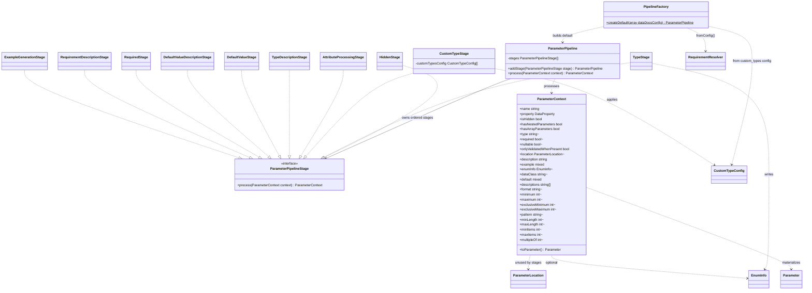

# Parameter Metadata Pipeline

Core canvas. Owns `src/Pipeline/**` except what two sibling canvases own: requirement resolution (`RequiredStage`, `RequirementDescriptionStage`, `Pipeline/Support/**`) and example generation (`ExampleGenerationStage`). This canvas owns the stage contract and runner, the factory and the default stage order, the shared `ParameterContext`, and the hidden, type, custom-type, attribute-processing, type-description and default-value stages.

Related canvases: requirement resolution (required / nullable and the requirement sentences); example generation (the `example`); documentation records; public attributes; attribute processing framework; custom type extension; DTO parameter extraction; every family canvas that writes a context field.

## Requirements

- Produce OpenAPI-oriented parameter metadata from a Spatie Laravel Data property without requiring callers to assemble that metadata by hand.
- Skip documentation for properties marked hidden so they never receive type, validation, description, or example processing.
- Map PHP/Spatie data types (scalars, arrays, nested data objects, enums) onto documentation types consumers expect (`string`, `integer`, `boolean`, `number`, `object`, and `[]` variants).
- Allow project configuration and registered custom-type processors to override how non-standard class types appear in docs.
- Fold Spatie Laravel Data validation rules and package documentation attributes into the same parameter record (constraints, extra description fragments, examples, formats).
- Emit human-readable descriptions that state the type or allowed enum values, then any extra fragments, then a default-value sentence when a default exists.
- Decide requirement status and state it in prose (requirement resolution canvas), and generate a sample `example` when none was supplied (example generation canvas).

Boundaries of this spec: the sequential pipeline, its factory, the shared mutable context, and the default stages other than the three the sibling canvases own. Attribute processor internals, custom-type processor internals, and Parameter value-object serialization beyond `toParameter()` are outside this canvas except as collaborators.

## Entities

Collaborating types used by this module but not owned by it:

- `DataProperty` (Spatie): reflection of the property; stages read `attributes`, `type` (kind, type, dataClass, iterableItemType, isNullable, isOptional), `hasDefaultValue` and `defaultValue`.
- `Hidden` attribute: presence on the property sets `isHidden`.
- `CustomTypeConfig`: readonly bag of documentation type plus constraint fields; built via `fromArray` which requires `type` and `descriptions` keys.
- `CustomTypeProcessorRegistry` singleton and `CustomTypeProcessor`: optional fallback after config lookup.
- `AttributeProcessorRegistry` singleton: maps attribute/rule class names to processors; missing processor is ignored (`?->`).
- `DataDocsAttribute` and Spatie `ValidationRule`: attribute families processed in that order.
- `EnumInfo` / `EnumType`: enum documentation payload; `toArray()` returns case names for pure enums and backing values for backed enums.
- `Parameter`: output record. `toParameter()` defaults missing type to `string`, required to `false`, nullable to `true`, location to `BODY`. Null OpenAPI constraint fields are dropped; `0` and other non-null values are kept.
- `ParameterLocation`: `QUERY` / `BODY`. No pipeline stage assigns `location`.
- The requirement collaborators (`DataConfig`, `RuleInferrer`, `PropertyRules`, the requirement rule classes, `ValidationContext` / `ValidationPath`) are listed in the requirement resolution canvas; Faker in the example generation canvas.

## Approach

The module is a linear pipeline: a mutable `ParameterContext` is passed through ordered stages. Each stage implements `ParameterPipelineStage` and returns the same context instance after mutation. The pipeline is a simple list with `addStage` appending; there is no remove, insert-at-index, or named-stage API.

Default order is fixed in `PipelineFactory::createDefault`: Hidden, Type, CustomType, AttributeProcessing, TypeDescription, DefaultValue, DefaultValueDescription, Required, RequirementDescription, ExampleGeneration.

Requirement status is reconciled, not recomputed: the decisions are recorded in the requirement resolution canvas. Example generation runs last: see the example generation canvas.

Trade-offs present in the code:

- Mutability over immutability: context fields are public and written in place so stages can share work without copying.
- Service location over constructor injection for both registries; only custom-type config and Faker are injected.
- Early exit after any stage that leaves `isHidden` true. Only HiddenStage sets that flag in the default pipeline, so later stages never run for hidden properties.
- Description assembly is split: fragments accumulate in `descriptions[]` (custom types, attribute processors), then AttributeProcessingStage concatenates them onto `description`, then TypeDescriptionStage prepends a type/enum sentence, then DefaultValueDescriptionStage appends a default sentence.

Integration: in-process PHP. Factory reads `dataDocsConfig['custom_types']` as a map of class name to config arrays. Stages call Spatie property metadata and PHP enum/`enum_exists`/`ReflectionEnum`. ExampleGenerationStage performs Faker I/O only in the sense of generating values; no network or filesystem.

Known divergences (codified as-is, not proposed fixes):

- Workspace guidance prefers readonly/immutable metadata objects; `ParameterContext` is a bag of public writable fields. `name` and `property` are the only readonly constructor properties.
- `location`, `hasNestedParameters`, and `hasArrayParameters` are written or defaulted but never consumed by later stages in this module.
- TypeStage can produce type `[]` (empty item type plus suffix). CustomTypeStage treats `[]` as a standard type and does not fall through to custom-type handling.
- `TypeStage::setEnumInfo` swallows `TypeError` and leaves type/enumInfo unchanged for that path.
- `DefaultValueDescriptionStage` skips when `context->default !== null` is false, so a documented default of PHP `null` never gets a “Defaults to” sentence even if `hasDefaultValue` is true.
- Default-value description uses `property->defaultValue` for `UnitEnum` display but `context->default` for booleans, arrays, and objects.
- Scalar type detection walks `bool`, `int`, `float`, `string` and takes the first `acceptsType` hit, so overlapping acceptors follow that priority.
- AttributeProcessingStage runs before TypeDescriptionStage, so type/enum sentences appear at the front of the final description even when attributes ran first.
- Stage and pipeline classes carry no explanatory comments beyond those listed in Norms; `RequirementResolver` and `RequiredStage` are the requirement resolution canvas's deliberate exceptions.
- `STANDARD_TYPES` in CustomTypeStage is a closed list; a type outside it, such as the class name `DateTimeImmutable[]` TypeStage writes for an array of a class, falls through to custom-type handling and, with no config or processor, to the string fallback, so an array of a class is published as `string`.

## Structure

Namespace `Abrha\LaravelDataDocs\Pipeline`. Stages live in `Pipeline\Stages`. Context lives in `Pipeline\Context`. The requirement seam and its value object live in `Pipeline\Support`.

Dependency direction (leaf toward orchestrator):

1. `ParameterPipelineStage` (contract).
2. `RequirementStatus` and `RequirementResolver` (requirement resolution canvas).
3. Stage classes (depend on context + collaborators; `RequiredStage` additionally requires `RequirementResolver`).
4. `ParameterPipeline` (depends on stage contract and context).
5. `PipelineFactory` (depends on pipeline, all default stages, `CustomTypeConfig`, `RequirementResolver`, Faker factory).

`RequirementResolver` is the only class permitted to import Spatie's validation internals (`PropertyRules`, `RequiringRule`, `ValidationContext`, `ValidationPath`); the rule and its scope are in the requirement resolution canvas.

Call graph for a default run:

`PipelineFactory::createDefault` → `RequirementResolver::fromConfig` → `ParameterPipeline::addStage` (ten times) → caller `ParameterPipeline::process` → each `stage->process` until hidden or exhausted → optional later `ParameterContext::toParameter`.

There is no inheritance among stages. All stage classes are `final`, as are `RequirementResolver` and `RequirementStatus`. `PipelineFactory` is a static factory, not a pipeline stage.

Layering: this is a domain processing layer. It does not own HTTP, OpenAPI document assembly, or Laravel container binding (those sit outside this canvas).

## Operations

### ParameterPipelineStage

- Responsibility: single contract for a context transformation.
- Method `process(ParameterContext $context)` returns `ParameterContext`. Implementations in this module return the same instance after mutation.

### ParameterPipeline

- Responsibility: run stages in append order; stop when the context is hidden.
- Method `addStage(ParameterPipelineStage $stage)` appends and returns `$this` for chaining. Stages array is private with no getter.
- Method `process(ParameterContext $context)` iterates stages, reassigns `$context` to each stage result, and immediately returns if `isHidden` is true. If no stage hides the property, returns the context after the last stage.

### PipelineFactory

- Responsibility: build the default stage sequence and custom-type map.
- Static method `createDefault(array $dataDocsConfig = [])`:
  - Reads `$dataDocsConfig['custom_types']` or an empty array.
  - For each entry, keys are class names and values are arrays passed to `CustomTypeConfig::fromArray` (requires `type` and `descriptions`).
  - Instantiates `ParameterPipeline` and adds stages in this order: HiddenStage (no deps), TypeStage (no deps), CustomTypeStage with the config map, AttributeProcessingStage (no deps), TypeDescriptionStage, DefaultValueStage, DefaultValueDescriptionStage, RequiredStage with `RequirementResolver::fromConfig()`, RequirementDescriptionStage (no deps), ExampleGenerationStage with `Faker\Factory::create()`.
  - `RequirementResolver::fromConfig()` is evaluated once per `createDefault` call, so the inferrer list is read once and reused across every property.
  - Returns the pipeline. Does not process any property.

### ParameterContext

- Responsibility: accumulate documentation fields for one named property.
- Constructor takes readonly `name` (string) and readonly `property` (`DataProperty`).
- Defaults: `isHidden` false, nested/array flags false, `onlyValidatedWhenPresent` false, `type`/`required`/`nullable`/`location`/`enumInfo`/`dataClass`/`format`/`pattern` and numeric constraints null, `description` empty string, `example` null, `default` null, `descriptions` empty array.
- `onlyValidatedWhenPresent` is a non-nullable bool (unlike `required`/`nullable`, which are nullable). It drives description text only and is deliberately absent from `toParameter()`, so it reaches neither `Parameter` nor `openApiAttributes`.
- `enumInfo` is written only by `TypeStage`.
- Method `toParameter()` builds `Parameter` with defaults listed under Entities. `enumValues` is `enumInfo?->toArray()`. `openApiAttributes` includes default, format, min/max, exclusive min/max, pattern, length and items bounds, multipleOf, with nulls removed via `array_filter` using `!== null`.

### HiddenStage

- Responsibility: detect the Hidden attribute.
- Sets `isHidden` to whether `$context->property->attributes->has(Hidden::class)`.
- Does not clear other fields. Returning with `isHidden` true causes the pipeline to stop.

### TypeStage

- Responsibility: set documentation type, nested/array flags, data class, and enum info from Spatie type metadata.
- Reads `$context->property->type->kind`. Sets `hasNestedParameters` when kind is `DataTypeKind::DataObject`, `hasArrayParameters` when kind is `DataTypeKind::DataArray`.
- If either nested flag is true: sets `type` to `object[]` for data arrays else `object`, sets `dataClass` from `$context->property->type->dataClass`, returns without scalar/enum handling.
- Otherwise gets `$context->property->type->type`. If `findAcceptedScalarType` finds a TYPE_MAP key (`bool` → `boolean`, `int` → `integer`, `float` → `number`, `string` → `string`) via `acceptsType` in that key order, sets `type` and returns.
- Else if the type `acceptsType('array')`: uses `iterableItemType`; documentation type is `(TYPE_MAP[item] ?? item)` plus `[]`, or just `[]` when item type is empty. If item type is non-empty and `enum_exists(itemType)`, calls `setEnumInfo` with `isArray` true.
- Else if `findAcceptedTypeForBaseType(UnitEnum::class)` returns a class, calls `setEnumInfo` with `isArray` false.
- Else if the type is Spatie `NamedType`, sets `type` to TYPE_MAP of `NamedType->name` or the raw name.
- Otherwise leaves `type` as it was (typically null).
- Private `setEnumInfo(context, enumClass, isArray)`: no-op if `enum_exists` is false. Loads `enumClass::cases()`. If first case is `BackedEnum`, reflects backing type name; if present, maps it through TYPE_MAP, suffixes `[]` when `isArray`, sets `enumInfo` to INT_BACKED when backing name is `int` else STRING_BACKED, with the cases array. If not backed, type is `string` or `string[]` and `enumInfo` is PURE. Catches `TypeError` and does nothing.

### CustomTypeStage

- Responsibility: replace non-standard types using config, then registry, then a string fallback.
- Constructor stores `array<string, CustomTypeConfig> $customTypesConfig` (default empty), keyed by class name matching `context->type`.
- If `isStandardType(context->type)`: return unchanged. Standard set: `string`, `integer`, `boolean`, `number`, `object`, `[]`, `string[]`, `integer[]`, `boolean[]`, `number[]`, `object[]`. Null type is treated as standard (skip).
- Else look up `customTypesConfig[context->type]`. On hit, `applyConfigToContext`: overwrite `type` with config type; merge config `descriptions` onto `context->descriptions`; copy pattern, format, min/max, exclusive min/max, length/items bounds, multipleOf from config onto context (including nulls, which overwrite previous values).
- Else `CustomTypeProcessorRegistry::getInstance()->getProcessorFor(className)`; if a processor exists, call `process(className, context)` and return.
- Else set `type` to `string` and append `"Must be a {className}"` to `descriptions`.

### AttributeProcessingStage

- Responsibility: run registered processors for documentation attributes and validation rules, then fold `descriptions` into `description`.
- Gets `AttributeProcessorRegistry::getInstance()`.
- For each property attribute of type `DataDocsAttribute`, `getProcessorFor(attribute class)` and `process(attribute, context)` if non-null.
- Then the same for each attribute of type Spatie `ValidationRule`.
- If `descriptions` is non-empty, sets `description` to `combineDescriptions`: filters empty strings from `[base description, ...descriptions]` and joins with a single space. Does not clear `descriptions`.

### TypeDescriptionStage

- Responsibility: prepend a type or enum sentence to `description`.
- The sentence is the enum sentence when `enumInfo` is set (TYPE_DESCRIPTIONS is then not applied), else the TYPE_DESCRIPTIONS sentence for `type`, else nothing, in which case `description` is left unchanged.
- Enum sentence: each case formatted as `<code>{name}</code>` for PURE, or `<code>{name}</code> ({value})` for STRING_BACKED and INT_BACKED. If `type` ends with `[]`: `"Must be an array of enums. Each item must be one of: {joined}."` otherwise `"Must be one of: {joined}."`
- TYPE_DESCRIPTIONS sentences: `Must be a boolean.` / integer / number / string / object / array-of-objects / array-of-strings / integers / booleans / numbers.
- A type missing from that map (including `[]` and unknown names) does not change `description`.
- Prepend: if existing description is empty, use the type sentence alone; else `typeSentence + space + existing`.

### DefaultValueStage

- Responsibility: copy a default onto the context in a docs-friendly form.
- If `property->hasDefaultValue` is false, leave `default` unchanged (typically null).
- Else take `property->defaultValue`. If it is `BackedEnum`, store `value`. Else if `UnitEnum`, store `name`. Else store the value as-is (including `null`, `false`, arrays, objects).

### DefaultValueDescriptionStage

- Responsibility: append a default sentence when `context->default` is not null.
- Description text uses: `UnitEnum` from `property->defaultValue` → `name`; boolean `context->default` → `true`/`false` strings; array or object `context->default` → `json_encode`; otherwise the `context->default` value interpolated into `"Defaults to <code>{value}</code>."`
- Append via `trim(existing + space + new)`.

`RequiredStage`, `RequirementDescriptionStage`, `RequirementResolver` and `RequirementStatus` are specified in the requirement resolution canvas; `ExampleGenerationStage` in the example generation canvas.

## Norms

- PHP, PSR-4 namespace `Abrha\LaravelDataDocs\...`, `final` classes, interface for stages only.
- No explanatory comments in stage/pipeline classes, with deliberate exceptions: `RequirementResolver` and `RequiredStage` (requirement resolution canvas). In this canvas's classes, CustomTypeStage has a single `@param array<string, CustomTypeConfig>` docblock on the constructor.
- Mutable public properties on context; stages do not clone the context.
- Fluent `addStage` on the pipeline; factory uses chained `addStage`.
- Singleton `getInstance()` for AttributeProcessorRegistry and CustomTypeProcessorRegistry; stages do not receive those as constructor arguments. (`RequirementResolver` is constructor-injected into `RequiredStage`: requirement resolution canvas.)
- Optional processor calls use nullsafe `?->process`.
- Documentation strings use HTML `<code>` for enum cases and default values.
- Type maps and description maps are private class constants, not config.
- Tests (outside this source folder but mirroring it): Pest, one test file per class under `tests/Unit/Pipeline/`, including `PipelineFactoryTest` and `ParameterContextTest`. Stages are unit-tested in isolation, not only through `ParameterPipeline`.
- `PipelineFactoryTest` asserts the exact ten-class stage order by reflection, because ordering is observable behaviour rather than an implementation detail.
- Naming: `*Stage` for stages, `process` as the stage method, `isHidden` / `has*` boolean flags, OpenAPI-ish constraint field names (`minLength`, `exclusiveMinimum`, `multipleOf`).
- Error handling is mostly absent: no thrown domain exceptions in this module. TypeStage catches `TypeError` with an empty handler.

## Safeguards

Functional:

- Hidden properties stop the pipeline; subsequent stages must not run once `isHidden` is true.
- Nested Spatie data objects/arrays are typed as `object` / `object[]` and skip scalar enum mapping in TypeStage.
- CustomTypeStage does not rewrite types in its STANDARD_TYPES list (including null and `[]`).
- Attribute processors that are not registered are skipped; processing continues.
- `toParameter()` always produces a Parameter even when type/required/nullable/location were never set.

Data / format:

- Scalar documentation types are only the four TYPE_MAP targets unless NamedType falls through to a raw PHP name or custom-type handling.
- Enum backed-type detection uses `ReflectionEnum::getBackingType()?->getName()`; missing backing type name skips enumInfo assignment for that backed branch.
- OpenAPI constraint fields on Parameter omit nulls only.
- Description combination drops empty fragments then joins with spaces.

Performance / integration:

- No timeouts, retries, or caching in this module.
- `CustomTypeConfig::fromArray` is called for every custom type entry at factory time; missing required keys fail at construction, not at process time.

Security:

- No authentication, secret handling, or sanitization of description HTML; attribute/config strings are interpolated into descriptions.

Business / ordering:

- Default factory stage order is part of observable behavior (description prepend/append and example constraints depend on it).
- Required/nullable are computed after descriptions and defaults are written, and they now do feed description text: RequirementDescriptionStage runs immediately after RequiredStage and appends its sentence last, after the type sentence, attribute fragments, and default sentence. Moving RequiredStage earlier than AttributeProcessingStage would reintroduce the overwrite defect; moving RequirementDescriptionStage away from its position changes observable sentence order.
- Custom type config overwrites constraint fields including with null, which can clear values previously set (none are set before this stage in the default order except type/enum from TypeStage).
