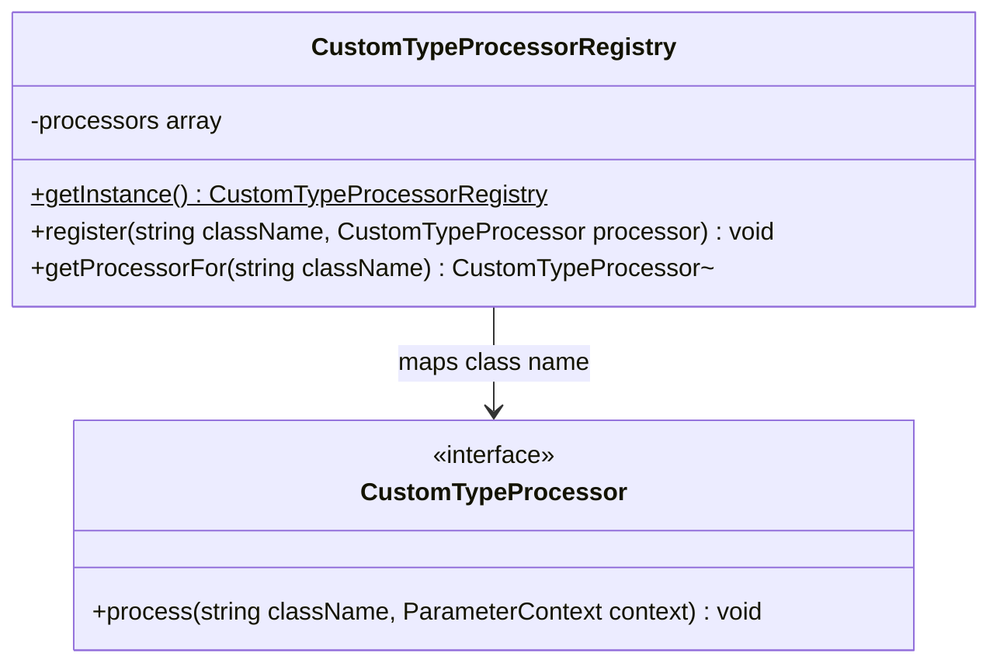

# Custom Type Extension Point

Core canvas. Owns `src/CustomTypeProcessing/**`.

Related canvases: parameter metadata pipeline (its `CustomTypeStage` calls the registry after config lookup); documentation records (`CustomTypeConfig` is not this module).

## Requirements

- Allow replacing documentation for a PHP class name that is not a standard OpenAPI scalar/object/array type, without editing CustomTypeStage.
- Provide a process-wide registry of class name to processor.
- Ship with no built-in class processors.

## Entities

`ParameterContext` is owned by the parameter metadata pipeline canvas. This module only mutates it through `CustomTypeProcessor::process`.

## Approach

Singleton service locator, same pattern as `AttributeProcessorRegistry`: private constructor, private clone, `__wakeup` throws, `getInstance` lazy-creates. Default registration is an empty method. Config-based custom types are applied in CustomTypeStage *before* this registry and are out of scope here.

Known divergences:

- `registerDefaults` is empty; the extension point exists but the package registers nothing.
- No unregister, no overwrite policy documented; `register` overwrites the same class key.
- Processors receive the class name string that was in `context->type`, which may not be a real class.

## Structure

`src/CustomTypeProcessing/`: interface plus singleton registry. CustomTypeStage is the only in-package caller.

## Operations

### CustomTypeProcessor

- Method `process(string $className, ParameterContext $context): void`. Implementations may set any writable context field (`name` and `property` are readonly). Attribute processors run afterwards and may overwrite what they set, and a `pattern` they set is published verbatim. No return value; stage does not inspect success.

### CustomTypeProcessorRegistry

- `final` class.
- Private constructor calls `registerDefaults()`.
- Private `__clone`.
- `__wakeup` throws Exception `Cannot unserialize singleton`.
- `getInstance()` returns the same instance for the process.
- `register(string $className, CustomTypeProcessor $processor)` stores by exact class-name key.
- `getProcessorFor(string $className)` returns the processor or null; no inheritance/interface matching.
- `registerDefaults()` currently registers nothing.

## Norms

- Namespace `Abrha\LaravelDataDocs\CustomTypeProcessing`.
- Singleton with unserialize guard throwing `\Exception`, not a domain exception type.
- Map lookup is exact string match on `context->type`. `Foo[]` (an array of `Foo`, as `TypeStage` writes it) is a distinct key: document arrays of `Foo` by registering a processor for `Foo[]` too, which sets an array type and an array example (it receives `$className`, so one processor can branch on the `[]` suffix). Without a `Foo[]` processor or config entry, the field is published as `string` with "Must be a Foo[]" (parameter metadata pipeline canvas).
- A processor's `type` is published as given; `CustomTypeStage` does not check it against its standard types.

## Safeguards

- Missing processor is null; CustomTypeStage then coerces type to `string`, for an array key too (that fallback is pipeline-owned).
- Registry is process-global; tests that register processors can leak across cases if the singleton is not reset (no reset API exists).
- No validation that `$className` is an existing class.
