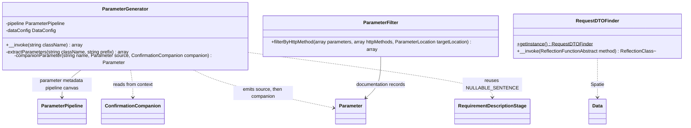

# DTO Parameter Extraction

Core canvas. Owns `src/Services/**`.

Related canvases: parameter metadata pipeline (process, `toParameter`, nested flags, `confirmationCompanion`); requirement resolution (`RequirementDescriptionStage::NULLABLE_SENTENCE`, and the rule that only `RequiredStage` decides requirement, to which the companion is the sanctioned exception); example generation (the final `example` the companion copies); documentation records (`Parameter`, `ParameterLocation`, `ConfirmationCompanion`); cross-field and acceptance (`ConfirmedProcessor` records the companion and its sentences); Scribe strategies (sole production callers).

## Requirements

- Walk a Spatie Laravel Data class and produce a name-keyed map of `Parameter` records, including nested object and object-array properties under dotted (and `[]`) names.
- Skip hidden properties and do not recurse into them.
- Publish the confirmation field a property implies as a real parameter when it carries `#[Confirmed]`, directly after its source, indistinguishable from a declared one to consumers and code generators.
- Find the first controller/method parameter whose type is a subclass of Spatie `Data`.
- Split a Parameter list into query vs body for a given HTTP method, with a GET special case when no property was marked query.

## Entities

## Approach

Three unrelated services in one folder. ParameterGenerator is a recursive invokable using Spatie `DataConfig::getDataClass`. ParameterFilter is a pure function over Parameter arrays. RequestDTOFinder is a singleton invokable over method reflection.

ParameterGenerator constructs a new `ParameterContext` per property and discards the context after `toParameter`, except it reads `isHidden`, `hasNestedParameters`, `hasArrayParameters`, and `dataClass` for control flow, and `confirmationCompanion` to emit a companion.

**A `#[Confirmed]` property may yield a second, synthesised parameter.** `ConfirmedProcessor` (cross-field and acceptance canvas) records a `ConfirmationCompanion` on the source's context: the companion's bare name and two sentences, so field-name markup stays in that layer. ParameterGenerator turns it into a `Parameter` after the source's pipeline run, because the companion needs the source's resolved `required`, `nullable` and final `example`, which exist only after `RequiredStage` and `ExampleGenerationStage`, and because ParameterGenerator is the only emitter of parameters and the only place that knows the prefix and the sibling properties. Scribe strategies are too late: prefixes and hidden/location decisions are already flattened there.

**The companion mirrors its source, and this is the single sanctioned exception to "only `RequiredStage` decides requirement".** Laravel runs `confirmed` only when the source is validated, so the companion's `required` and `nullable` are the source parameter's, copied verbatim (D3, signed off on 2026-09-25). So are `location`, `type`, `enumValues`, `example` (so the published pair satisfies `confirmed`) and `openApiAttributes` minus `default`: the companion must equal the source, so its format, pattern and bounds hold too, while a default belongs to the Data object, not to a request field. The exception is allowed because the companion has no `DataProperty` for `RequirementResolver` to read and nothing is inferred from attributes. It is stated in ParameterGenerator's class docblock so later stories do not copy it loosely.

The companion's description is not the source's (which would repeat the source's constraint sentences and its "A matching … value must be sent with it."). It is up to three sentences joined with single spaces, empty entries skipped: the recorded match sentence; the recorded "Required when … is sent." only when the source is not required; and `RequirementDescriptionStage::NULLABLE_SENTENCE` only when the source is nullable. There is no type sentence: the type is in the schema, and "must match" binds it to the source.

**Provenance.** Companion emission comes from STORY-001-003 (analysis `spdd/analysis/GGQPA-XXX-202609251435-[Analysis]-cross-field-comparison-acceptance-attributes.md`).

Known divergences:

- RequestDTOFinder returns the first matching Data subclass, not the one that is a “request” DTO by name.
- Union/intersection parameter types are skipped (`ReflectionNamedType` only).
- ParameterFilter GET special case: if the method list is exactly one element `GET` and no parameter has QUERY location, query extraction receives all parameters and body extraction receives none. Non-GET always filters by location only (default location BODY from `toParameter`).
- ParameterGenerator returns empty array if `class_exists` is false; `getDataClass` errors are not caught. Nested recursion can throw `ReflectionException` (docblock on `extractParameters` only).
- Nested prefix for arrays is `parentName[]` then `.child`: array children are named `items[].id` only; no `items.id` alias is published.
- The companion carries no type sentence ("Must be a string."); its type is published in the schema.
- A custom companion name a `Confirmed` subclass reports as a plain string (`parameters(): ['repeat']`) is published under the source's prefix (`profile.repeat`), while Laravel reads that name from the root of the data, so the documented contract fails for such a nested declaration; a name reported as a `FieldReference` is resolved against the path by Spatie and is published correctly (cross-field acceptance canvas).
- For a nullable source sent as `null`, Laravel skips `confirmed`. The companion's "Required when … is sent." is then slightly stricter than runtime, which is safe for a consumer.
- A declared property named like the companion suppresses the companion even when it is `#[Hidden]`, so that field is then absent from the contract. Hiding it is the developer's explicit choice.
- `#[Confirmed]` on a nested Data or Data-array property keeps its source sentence but publishes no companion: `same` would compare whole structures, and a childless `object` companion would mislead.
- Faker-generated examples stay random across builds; only equality between a source and its companion is guaranteed.
- A `#[Confirmed]` source that is also prohibited (for example `#[Confirmed, Prohibited]`) still publishes its companion, which says "Required when … is sent." while the source says it must not be sent. Each sentence is true on its own and the declaration itself is contradictory; like `#[Same('a'), Different('a')]`, it gets no advisory.

## Structure

`src/Services/`. No dependencies between the three classes. Strategies wire them together. ParameterGenerator additionally depends on `ValueObjects\ConfirmationCompanion`, `ValueObjects\Parameter` and `Pipeline\Stages\RequirementDescriptionStage` (for its public `NULLABLE_SENTENCE` only).

## Operations

### ParameterGenerator

- Constructor: `ParameterPipeline`, Spatie `DataConfig`.
- `__invoke(string $className): array`: if class does not exist, return `[]`; else `extractParameters(className, prefix '')`.
- `extractParameters(className, prefix)`: load data class from DataConfig; before the loop, collect `declaredNames`, the bare names of every property of that class (hidden or not); foreach property, fullName is `prefix.propertyName` or just `propertyName` when prefix is empty; new ParameterContext(fullName, property); pipeline process; if `isHidden`, continue (no map entry, no companion, no recurse); else store `parameters[fullName] = context->toParameter()`; then, directly after the source and before any recursion, emit the companion when all three hold:
  1. `context->confirmationCompanion` is not null;
  2. neither `hasNestedParameters` nor `hasArrayParameters` is set on the source;
  3. the companion's bare name is not in `declaredNames` (strict `in_array`), whether that property is `#[Hidden]` or not. The explicit check is required because assigning an existing array key would keep its earlier position.

  Its key uses the same join as the source, `prefix.name` or `name` when prefix is empty, so `profile.password` yields `profile.password_confirmation` and `users[].password` yields `users[].password_confirmation`; `parameters[key] = companionParameter(key, sourceParameter, companion)`. Then, if hasNestedParameters or hasArrayParameters, recurse with `dataClass` and prefix `fullName` plus `[]` when hasArrayParameters, then array_merge nested into the map (later keys overwrite earlier on collision).
- Private `companionParameter(string $name, Parameter $source, ConfirmationCompanion $companion): Parameter`: `description` is `implode(' ', array_filter([matchSentence, source->required ? '' : requiredWhenSentSentence, source->nullable ? RequirementDescriptionStage::NULLABLE_SENTENCE : '']))`. Returns a new `Parameter` with that name and description, and `type`, `required`, `nullable`, `location`, `example` and `enumValues` from the source, and `openApiAttributes` = `array_diff_key(source->openApiAttributes, ['default' => true])`. Performs no I/O and builds no markup of its own; it only joins sentences it receives.
- Class docblock: a `#[Confirmed]` property may yield a second, synthesised parameter whose `required`, `nullable`, `location`, `type`, `enumValues`, `example` and `openApiAttributes` (minus `default`) are copied from the source's finished parameter; this is the only requirement decision made outside `RequiredStage`, and it infers nothing, because the companion has no property for the resolver to read and `confirmed` runs only when the source does. It is the only comment in the class besides the `@throws` on `extractParameters`.

### ParameterFilter

- `filterByHttpMethod(parameters, httpMethods, targetLocation)`: if httpMethods has exactly one value and it is the string `GET`, use GET rules; else `filterByLocation`.
- GET rules: if no Parameter in the list has location QUERY, return entire list when target is not BODY, or `[]` when target is BODY. If any QUERY exists, filter by target location like non-GET.
- `filterByLocation`: array_filter where `Parameter::matchesLocation`.
- `hasParametersWithLocation`: foreach, true if instance of Parameter and matchesLocation. Non-Parameter values are ignored for the “has query” scan.

### RequestDTOFinder

- Singleton: private constructor (empty), private clone, `__wakeup` throws `Cannot unserialize singleton`, `getInstance`.
- `__invoke(ReflectionFunctionAbstract $method): ?ReflectionClass`: foreach method parameters, skip if type is not ReflectionNamedType; skip if class does not exist; reflect class; if `isSubclassOf(Data::class)` return that ReflectionClass. Otherwise null after the loop. Does not treat Data itself as a match (subclass only).

## Norms

- Invokable style on Generator and Finder.
- Finder singleton; Generator and Filter are constructed per call by strategies (new each request).
- Nested names use dot and `[]` concatenation, not a dedicated path type. A companion key uses the same join as its source.
- ParameterGenerator builds no description markup; the companion's sentences come from the attribute layer and the pipeline's `NULLABLE_SENTENCE`.

## Safeguards

- Hidden properties are omitted and not recursed. A hidden source has no companion, because the hidden `continue` runs before emission.
- A companion never duplicates a key: it is not emitted when a property of the same Data class has its bare name, hidden or not, so at most one parameter exists per key. It is never emitted for a nested or array Data source.
- A companion always sits directly after its source key. `CrossFieldComparisonTest` pins the root, nested (`profile.`) and array (`users[].`) cases, and that the last key is still the last declared property.
- The companion's `required` and `nullable` are copied from the source's resolved parameter, never inferred; for every declared property requirement is still decided by `RequiredStage` alone. `CrossFieldComparisonTest` pins a required and a nullable source (AC11), and the example copy over five generations (AC12).
- Properties carrying no `#[Confirmed]` get no extra parameter, and key order is unchanged; the pre-existing tests in `tests/Integration/ParameterGeneratorTest.php` pass unmodified (later additions only add cases).
- A missing root class yields `[]`, not an exception.
- GET with mixed query-marked and unmarked fields: unmarked BODY defaults are dropped from the query strategy and kept only if a body strategy runs (body strategy is typically not used for GET by Scribe config — that wiring is outside this canvas).
- Filter does not convert arrays of `toArray()` hashes; it requires `Parameter` instances.
- Finder does not scan return types or attributes; only method parameters.
