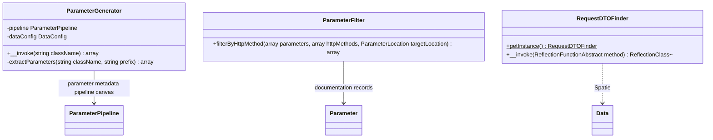

# DTO Parameter Extraction

Core canvas. Owns `src/Services/**`.

Related canvases: parameter metadata pipeline (process, `toParameter`, nested flags); documentation records (`Parameter`, `ParameterLocation`); Scribe strategies (sole production callers).

## Requirements

- Walk a Spatie Laravel Data class and produce a name-keyed map of `Parameter` records, including nested object and object-array properties under dotted (and `[]`) names.
- Skip hidden properties and do not recurse into them.
- Find the first controller/method parameter whose type is a subclass of Spatie `Data`.
- Split a Parameter list into query vs body for a given HTTP method, with a GET special case when no property was marked query.

## Entities

## Approach

Three unrelated services in one folder. ParameterGenerator is a recursive invokable using Spatie `DataConfig::getDataClass`. ParameterFilter is a pure function over Parameter arrays. RequestDTOFinder is a singleton invokable over method reflection.

ParameterGenerator constructs a new `ParameterContext` per property and discards the context after `toParameter`, except it reads `isHidden`, `hasNestedParameters`, `hasArrayParameters`, and `dataClass` for control flow.

Known divergences:

- RequestDTOFinder returns the first matching Data subclass, not the one that is a “request” DTO by name.
- Union/intersection parameter types are skipped (`ReflectionNamedType` only).
- ParameterFilter GET special case: if the method list is exactly one element `GET` and no parameter has QUERY location, query extraction receives all parameters and body extraction receives none. Non-GET always filters by location only (default location BODY from `toParameter`).
- ParameterGenerator returns empty array if `class_exists` is false; `getDataClass` errors are not caught. Nested recursion can throw `ReflectionException` (docblock on `extractParameters` only).
- Nested prefix for arrays is `parentName[]` then `.child`: array children are named `items[].id` only; no `items.id` alias is published.

## Structure

`src/Services/`. No dependencies between the three classes. Strategies wire them together.

## Operations

### ParameterGenerator

- Constructor: `ParameterPipeline`, Spatie `DataConfig`.
- `__invoke(string $className): array`: if class does not exist, return `[]`; else `extractParameters(className, prefix '')`.
- `extractParameters(className, prefix)`: load data class from DataConfig; foreach property, fullName is `prefix.propertyName` or just `propertyName` when prefix is empty; new ParameterContext(fullName, property); pipeline process; if `isHidden`, continue (no map entry, no recurse); else store `parameters[fullName] = context->toParameter()`; if hasNestedParameters or hasArrayParameters, recurse with `dataClass` and prefix `fullName` plus `[]` when hasArrayParameters, then array_merge nested into the map (later keys overwrite earlier on collision).
- The `@throws` on `extractParameters` is the only comment in the class.

### ParameterFilter

- `filterByHttpMethod(parameters, httpMethods, targetLocation)`: if httpMethods has exactly one value and it is the string `GET`, use GET rules; else `filterByLocation`.
- GET rules: if no Parameter in the list has location QUERY, return entire list when target is not BODY, or `[]` when target is BODY. If any QUERY exists, filter by target location like non-GET.
- `filterByLocation`: array_filter where `Parameter::matchesLocation`.
- `hasParametersWithLocation`: foreach, true if instance of Parameter and matchesLocation. Non-Parameter values are ignored for the “has query” scan.

### RequestDTOFinder

- Singleton: private constructor (empty), private clone, `__wakeup` throws `Cannot unserialize singleton`, `getInstance`.
- `__invoke(ReflectionFunctionAbstract $method): ?ReflectionClass`: foreach method parameters, skip if type is not ReflectionNamedType; skip if class does not exist; reflect class; if `isSubclassOf(Data::class)` return that ReflectionClass. Otherwise null after the loop. Does not treat Data itself as a match (subclass only).

## Norms

- Invokable style on Generator and Finder.
- Finder singleton; Generator and Filter are constructed per call by strategies (new each request).
- Nested names use dot and `[]` concatenation, not a dedicated path type.

## Safeguards

- Hidden properties are omitted and not recursed.
- A missing root class yields `[]`, not an exception.
- GET with mixed query-marked and unmarked fields: unmarked BODY defaults are dropped from the query strategy and kept only if a body strategy runs (body strategy is typically not used for GET by Scribe config — that wiring is outside this canvas).
- Filter does not convert arrays of `toArray()` hashes; it requires `Parameter` instances.
- Finder does not scan return types or attributes; only method parameters.
