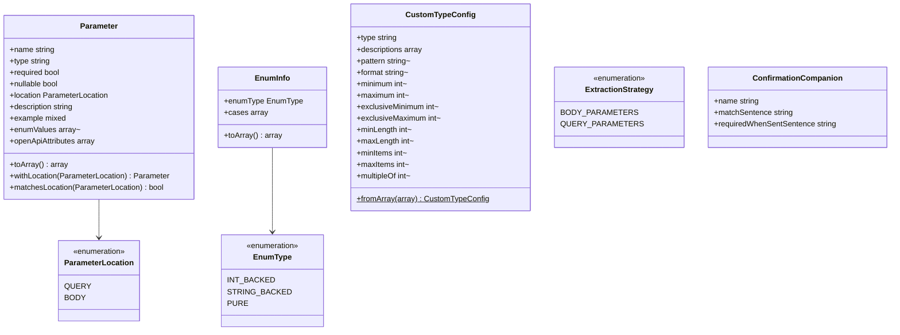

# Documentation Records

Core canvas. Owns `src/ValueObjects/**`.

Related canvases: pipeline canvases (fills most fields via `ParameterContext::toParameter`); public attributes (`QueryParameterProcessor` sets location before materialization); cross-field and acceptance (`ConfirmedProcessor` produces `ConfirmationCompanion`); DTO extraction and Scribe strategies (filter and serialize `Parameter`).

## Requirements

- Carry a finished parameter’s documentation fields as a transferable record after the pipeline, independent of Spatie `DataProperty`.
- Represent OpenAPI-ish extras (default, format, bounds, pattern, multipleOf) as a side bag that the package's OpenAPI generator merges into each field's schema (package + OpenAPI glue canvas), rather than Scribe merging it later.
- Distinguish query vs body placement for filtering, without requiring that placement to appear in the Scribe array payload.
- Describe enums for both documentation text (elsewhere) and example/enum lists via a typed case list, and carry a field's documented allowed-value list as `enumValues`: the enum's case names or backing values.
- Represent project custom-type config as a readonly constraint bag constructed from a PHP array.
- Label whether a Scribe strategy is extracting query or body parameters.
- Carry what the attribute layer knows about a `#[Confirmed]` confirmation companion to the parameter generator.

## Entities

All of these types are `final` classes or backed/unit enums under `Abrha\LaravelDataDocs\ValueObjects`. `Parameter` properties are public and writable after construction. The other classes use readonly constructor properties; `ConfirmationCompanion` is a `final readonly class`.

`ConfirmationCompanion` comes from STORY-001-003 (analysis `spdd/analysis/GGQPA-XXX-202609251435-[Analysis]-cross-field-comparison-acceptance-attributes.md`). `ConfirmedProcessor` (cross-field and acceptance canvas) produces it and stores it on `ParameterContext::$confirmationCompanion`; `ParameterGenerator` (DTO extraction canvas) consumes it to emit the companion `Parameter`. It never reaches `Parameter` or Scribe itself.

## Approach

Plain PHP records, not a persistence layer. No validation on construct except `CustomTypeConfig::fromArray` requiring `type` and `descriptions` keys (missing keys error at PHP argument time). `Parameter::toArray` is the Scribe-facing shape: it omits `location` and remaps `openApiAttributes` to `custom.openAPI` when non-empty.

Known divergences:

- `Parameter` is mutable; `withLocation` returns a new instance and does not mutate the original, so two styles coexist. `withLocation` has no production caller today: `QueryParameterProcessor` sets the location on the context before `toParameter`, and the companion copies it through the constructor.
- `toArray` never emits `location`, `enumValues` when null, or empty `openApiAttributes`.
- `EnumInfo::toArray` returns names for PURE and backing values for backed enums; it does not include both.
- `CustomTypeConfig::fromArray` does not default `type` or `descriptions`.
- `CustomTypeConfig::fromArray` passes the nine bounds to the `?int` constructor parameters unchecked. The class has no `strict_types`, so PHP coerces what it can: a numeric string is converted and a fractional value truncated (`multipleOf: 0.01` becomes `0`, with a deprecation notice); a non-numeric or non-finite value fails with `TypeError`. A negative length or item count, or a `multipleOf` of zero or less, is accepted.
- `ExtractionStrategy` is an int-backed enum used only as a strategy discriminator, not serialized to docs.

## Structure

Package `src/ValueObjects/`. No internal dependencies among these types except `Parameter` → `ParameterLocation` and `EnumInfo` → `EnumType`; `ConfirmationCompanion` depends on nothing. Callers live in pipeline, processors, factory, filter, and Scribe strategies.

## Operations

### Parameter

- Constructor required: `name`, `type`, `required`, `nullable`, `location`. Optional: `description` default empty string, `example` default null, `enumValues` default null, `openApiAttributes` default empty array.
- Method `toArray()`: always includes name, required, type, nullable, description, example. Adds `enumValues` only when not null; it is the documented allowed-value list, the enum's case list, null for a field that is not an enum (pipeline canvases). If `openApiAttributes` is non-empty, adds `custom` → `openAPI` with that array. Does not include location.
- Method `withLocation(ParameterLocation)`: returns a new `Parameter` copying all fields with the new location.
- Method `matchesLocation(ParameterLocation)`: strict enum equality on `location`.

### ParameterLocation

- String-backed: `QUERY` = `query`, `BODY` = `body`.

### EnumType

- Unit enum cases: `INT_BACKED`, `STRING_BACKED`, `PURE`.

### EnumInfo

- Constructor: `enumType`, `cases` (list of enum case objects: every case, as `TypeStage` stores them).
- Method `toArray()`: PURE maps each case to `name`; INT_BACKED and STRING_BACKED map each case to `value`.

### CustomTypeConfig

- Constructor sets type, descriptions, and optional constraint fields defaulting to null.
- Static `fromArray(array $config)`: reads `type` and `descriptions` without defaults; optional keys `pattern`, `format`, `minimum`, `maximum`, `exclusiveMinimum`, `exclusiveMaximum`, `minLength`, `maxLength`, `minItems`, `maxItems`, `multipleOf` default to null if absent.

### ExtractionStrategy

- Int-backed: `BODY_PARAMETERS` = 1, `QUERY_PARAMETERS` = 2.

### ConfirmationCompanion

- `final readonly class` with three constructor-promoted string properties: `name` (the companion's bare name, without prefix, e.g. `password_confirmation`), `matchSentence` (e.g. `Must match the value of <b><i>password</i></b>.`) and `requiredWhenSentSentence` (e.g. `Required when <b><i>password</i></b> is sent.`).
- No methods and no validation. One-line docblock naming its producer (`ConfirmedProcessor`) and consumer (`ParameterGenerator`).

## Norms

- Namespace `Abrha\LaravelDataDocs\ValueObjects`.
- `final` classes; enums for closed sets.
- Mixed `example` and mixed-adjacent enum case arrays; no value objects wrapping examples.
- Scribe payload key `custom.openAPI` rather than flattening constraints onto the top-level array.

## Safeguards

- `matchesLocation` is the only comparison of a parameter's location in `ParameterFilter`.
- `CustomTypeConfig::fromArray` fails if `type` or `descriptions` is missing.
- Null `enumValues` is omitted from `toArray` rather than emitted as empty.
- Empty `openApiAttributes` does not create a `custom` key.
- No sanitization of description or example values stored on `Parameter`.
