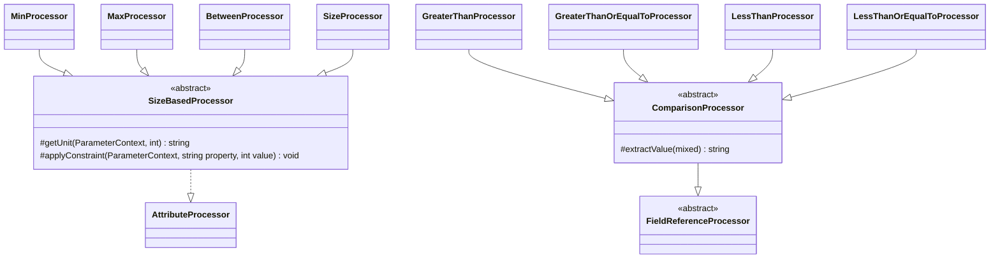

# Size and Bounds Attributes

Family canvas, pre-SPDD (no story of its own). Owns `MinProcessor`, `MaxProcessor`, `BetweenProcessor`, `SizeProcessor`, `MultipleOfProcessor`, `GreaterThanProcessor`, `GreaterThanOrEqualToProcessor`, `LessThanProcessor`, `LessThanOrEqualToProcessor`, `Processors/Base/SizeBasedProcessor`, `Processors/Base/ComparisonProcessor`, and the registry rows `Min`, `Max`, `Between`, `Size`, `MultipleOf`, `GreaterThan`, `GreaterThanOrEqualTo`, `LessThan`, `LessThanOrEqualTo`.

Extended by STORY-001-005 (dates), STORY-001-006 (files) and STORY-001-007 (arrays): each adds a type branch to `SizeBasedProcessor` here, and its own family canvas refers to that branch. This is the one planned case of a story editing a second family (`INDEX.md`).

Related canvases: attribute processing framework (`FieldReferenceProcessor`, `operand`); pipeline canvases (`ParameterContext`'s constraint fields, all `?int`; `TypeStage` writes the `type` the unit is chosen by; `ExampleGenerationStage` reads the bounds).

Reverse-codified from the v0.4.0 code with `/spdd-reverse`.

## Requirements

- Apply min/max/size/between differently for strings, arrays and numbers.
- Publish a numeric or field-referencing comparison bound (`GreaterThan`, `GreaterThanOrEqualTo`, `LessThan`, `LessThanOrEqualTo`).
- Publish a `multipleOf` divisor.

## Entities

`MultipleOfProcessor` implements `AttributeProcessor` directly. `ComparisonProcessor` was rebased onto `FieldReferenceProcessor` without changing its own signature, so the four comparison processors were not touched for that reason alone.

## Approach

**A bound is written as declared.** Each processor reads its argument from `parameters()` and, when it is not null, writes it to the constraint field the documented type selects and appends one sentence. There is no other guard: the argument's type is not checked before use.

**A comparison operand renders as a field or a value.** The four comparison processors render their operand through `operand()`, so a literal bound stays `<code>5</code>` and a `FieldReference` becomes `<b><i>min_price</i></b>`. They are the only shipped path besides the `ConditionProcessor`-based families that can receive a `FieldReference`.

Known divergences:

- Size-based `applyConstraint` no-ops for types other than string, `[]` suffix, integer, and number, but `getUnit` still returns `characters` for those other types, so a description can claim characters without setting a constraint field.
- `getUnit` and `applyConstraint` take an `int`, and the processor files do not declare strict types, so a float argument is coerced: an integral float (`5.0`) is written as that int, a fractional one is truncated (`Min(2.5)` on a string publishes `minLength: 2`) while the sentence states `2.5`, and `INF`, `NAN`, a float beyond the int range or an `ExternalReference` (Spatie types these arguments `…|ExternalReference`) throws a `TypeError`, failing the whole docs build. Untested.
- `MultipleOfProcessor` writes the declared value to the `?int` field `multipleOf` unchecked: a fractional divisor is truncated, so `#[MultipleOf(0.5)]` publishes the invalid `multipleOf: 0`; a zero or negative divisor is published as declared; `INF`, `NAN` and an `ExternalReference` throw. A zero `multipleOf` on an integer or number field makes example generation divide by zero.
- Comparison processors always write their numeric field: the value when `extractValue` is `is_numeric`, otherwise null. A field reference therefore gets a description sentence and clears the field.
- Comparison values are cast with `(int)`, truncating toward zero: `GreaterThan(0.5)` publishes `exclusiveMinimum: 0`, a wrong bound rather than a dropped one. Untested.
- Every processor in this family overwrites the field it writes, and attributes run in declaration order, so the last declared attribute that writes a field wins, including over a bound set earlier by a custom-type config (`CustomTypeStage` runs first). `GreaterThanOrEqualTo` and `LessThanOrEqualTo` write the same `minimum` / `maximum` fields as `Min`, `Max`, `Between` and `Size` do for integer and number types: between two literal bounds the last declared wins, and `#[Min(5), GreaterThanOrEqualTo('floor')]` publishes no `minimum` at all.
- Two attributes that contradict each other publish a contradictory schema with ordinary sentences (`#[Min(5), Max(2)] string` publishes `minLength: 5`, `maxLength: 2`); a processor sees only its own attribute, so no note is written.
- `MultipleOfProcessor`'s description omits `<code>`, unlike its siblings; it is the one fragment in this family with no markup.

## Structure

`Processors/Base/SizeBasedProcessor.php` implements `AttributeProcessor` directly and is unrelated to the other bases. `Processors/Base/ComparisonProcessor.php` extends `FieldReferenceProcessor`. `MinProcessor`, `MaxProcessor`, `BetweenProcessor`, `SizeProcessor` extend `SizeBasedProcessor`; the four comparison processors extend `ComparisonProcessor`; `MultipleOfProcessor` stands alone.

## Operations

### SizeBasedProcessor

- `getUnit(context, int value)`: type string → character/characters by value === 1; type ending in `[]` → item/items; integer or number → empty string; else `characters`.
- `applyConstraint(context, property, int value)`: property is `min` or `max`. String → `minLength`/`maxLength`. Array suffix → `minItems`/`maxItems`. Integer or number → `minimum`/`maximum`. The value is written as given, overwriting the field. Other types: no field write.

### ComparisonProcessor

- `extractValue`: delegates to `extractFieldName`. Signature and visibility are unchanged from before the rebase, so third-party subclasses are unaffected.

### Attributes

`{unit}` comes from `getUnit`; when it is empty (integer or number), the "Must be …" form is used instead of "Must have …".

| Attribute | Processor (base) | Reads / guards | Writes | Sentence | Requirement effect | Example rule |
| --- | --- | --- | --- | --- | --- | --- |
| `Min` | `MinProcessor` (`SizeBasedProcessor`) | `parameters()[0]`, when not null | `applyConstraint(min)` | `Must have minimum <code>{value}</code> {unit}.` / `Must be minimum <code>{value}</code>.` | none | generation reads the bound |
| `Max` | `MaxProcessor` (same) | same | `applyConstraint(max)` | `Must have maximum <code>{value}</code> {unit}.` / `Must be maximum <code>{value}</code>.` | none | generation reads the bound |
| `Between` | `BetweenProcessor` (same) | `parameters()[0]` and `[1]`, both not null | `applyConstraint(min)` and `(max)` | `Must have between <code>{min}</code> and <code>{max}</code> {unit}.` / `Must be between <code>{min}</code> and <code>{max}</code>.`; the unit is singular only when both bounds are the int 1 (`=== 1`) | none | generation reads the bounds |
| `Size` | `SizeProcessor` (same) | single value, when not null | `applyConstraint` min and max to the same value | `Must have exactly <code>{value}</code> {unit}.` / `Must be exactly <code>{value}</code>.` | none | generation reads the bounds |
| `MultipleOf` | `MultipleOfProcessor` | first parameter, when not null | `multipleOf` = the declared value | `Must be a multiple of {value}.` (no `<code>`) | none | generation picks a multiple |
| `GreaterThan` | `GreaterThanProcessor` (`ComparisonProcessor`) | first parameter, when not null | `exclusiveMinimum` = int of the value when `is_numeric`, else null | `Must be greater than {operand}.` | none | generation reads the bound |
| `GreaterThanOrEqualTo` | `GreaterThanOrEqualToProcessor` (same) | same | `minimum` = int of the value when `is_numeric`, else null | `Must be greater than or equal to {operand}.` | none | same |
| `LessThan` | `LessThanProcessor` (same) | same | `exclusiveMaximum` = int of the value when `is_numeric`, else null | `Must be less than {operand}.` | none | same |
| `LessThanOrEqualTo` | `LessThanOrEqualToProcessor` (same) | same | `maximum` = int of the value when `is_numeric`, else null | `Must be less than or equal to {operand}.` | none | same |

- The value compared by `is_numeric` is `extractValue` of the parameter: a `FieldReference`'s name, anything else cast to string. A comparison reference is never numeric, so it nulls the constraint field.

## Norms

- Size-based processors choose wording and field by the documented `type`; a new type branch is added in `SizeBasedProcessor`, not in the four subclasses.

## Safeguards

- Size-based and `MultipleOf` processors skip constraint application and description when the first (or both, for `Between`) parameter is null.
- Numeric comparison OpenAPI fields are not set from non-numeric values (including field names); descriptions still mention those names.
- Each processor has one Pest file under `tests/Unit/AttributeProcessing/Processors/`: the Min, Max and Size files cover the integer, string and array branches, the Between file integer and string, and the MultipleOf and four comparison files one integer case each. The four comparison files also pin a `FieldReference`, rendered as a field name with the constraint field left null. No file covers a float or an `ExternalReference`.
