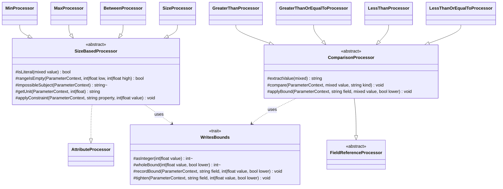

# Size and Bounds Attributes

Family canvas, pre-SPDD (no story of its own). Owns `MinProcessor`, `MaxProcessor`, `BetweenProcessor`, `SizeProcessor`, `MultipleOfProcessor`, `GreaterThanProcessor`, `GreaterThanOrEqualToProcessor`, `LessThanProcessor`, `LessThanOrEqualToProcessor`, `Processors/Base/SizeBasedProcessor`, `Processors/Base/ComparisonProcessor`, `Processors/Base/WritesBounds`, and the registry rows `Min`, `Max`, `Between`, `Size`, `MultipleOf`, `GreaterThan`, `GreaterThanOrEqualTo`, `LessThan`, `LessThanOrEqualTo`.

Extended by STORY-001-005 (dates), STORY-001-006 (files) and STORY-001-007 (arrays): each adds a type branch to `SizeBasedProcessor` here, and its own family canvas refers to that branch. This is the one planned case of a story editing a second family (`INDEX.md`).

Related canvases: attribute processing framework (`FieldReferenceProcessor`, `operand`); pipeline canvases (`ParameterContext`'s numeric bound fields, `int|float`, and its length, item-count and `multipleOf` fields, `?int`; `TypeStage` writes the `type` the unit is chosen by; `ExampleGenerationStage` reads the bounds).

Reverse-codified from the code; carved out of the former attribute processors canvas, git history keeps it.

## Requirements

- Apply min/max/size/between differently for strings, arrays and numbers.
- Publish a numeric or field-referencing comparison bound (`GreaterThan`, `GreaterThanOrEqualTo`, `LessThan`, `LessThanOrEqualTo`), worded by what the validator actually compares for the field's documented type.
- Publish a `multipleOf` divisor only in a form OpenAPI accepts.
- Publish every finite numeric bound exactly, fractional ones included; never publish a truncated one.
- When several attributes bound the same field, publish the strictest, whatever order they are declared in, because the validator enforces all of them. A bound a later same-class `#[Rule]` replaces is not enforced, and the framework skips it before this family runs; a rule string (`#[Rule('min:3')]`, `#[Rule('gt:5')]`) reaches these processors as the attribute it expands to (framework canvas).

## Entities

`MultipleOfProcessor` implements `AttributeProcessor` directly. `WritesBounds` is a family-private trait holding the two rules every bound in this family is written by: exact integer conversion and tightening. `ComparisonProcessor` was rebased onto `FieldReferenceProcessor` without changing its own signature, so the four comparison processors were not touched for that reason alone.

## Approach

**An argument that cannot be documented is skipped.** Spatie types the arguments of `Min`, `Max`, `Size`, `Between` and `MultipleOf` as `…|ExternalReference`. Each processor tests the argument's type before using it and returns without writing anything when it is not a literal it can render. An `ExternalReference` is never dereferenced, so a referenced bound is simply not documented. `INF`, `-INF` and `NAN` are treated the same way.

**A bound is published exactly.** Spatie's `Min`, `Max`, `Size`, `Between`, `MultipleOf` and the comparisons accept floats. `ParameterContext`'s numeric bound fields (`minimum`, `maximum`, `exclusiveMinimum`, `exclusiveMaximum`) are `int|float`, so a numeric bound is written as declared: an integral float (`5.0`) as that int, any other finite float (`0.5`, `1e20`) as the float, which OpenAPI accepts. The length, item-count and `multipleOf` fields stay `?int`. A length or count is a whole number, so a fractional length or count bound has an exact whole-number equivalent, which is written instead: a lower bound rounds up and an upper bound rounds down. Verified against Laravel's validator on 2026-09-25: `min:2.5` needs 3 characters or items, `max:2.5` allows 2, `between:1.5,2.5` means exactly 2. A negative length or count bound writes nothing: a negative lower bound constrains nothing, and a negative upper bound would be invalid OpenAPI. An out-of-range value writes nothing either. `multipleOf` is additionally written only when positive, as OpenAPI requires.

**A bound tightens, it never overwrites.** `Min`, `Max`, `Between`, `Size` and the four comparisons all write `minimum`/`maximum` (or the length and item bounds), and attributes run in declaration order. The validator enforces every one of them, so the published bound is the strictest: a lower bound keeps the larger value and an upper bound the smaller, whichever attribute was declared first. `#[Min(5), GreaterThanOrEqualTo(3)]` and `#[GreaterThanOrEqualTo(3), Min(5)]` both publish `minimum: 5`.

**A comparison bound is written only when it is exact.** A comparison processor writes its field for an `int` or any finite `float`, through the same `recordBound` rule as the size-based numeric bounds: an integral float as an int, any other as the float. A `FieldReference` writes nothing either: it states the rule in words, and must not clear a bound another attribute already set.

**What a comparison compares depends on the field.** Verified against Laravel's validator on 2026-09-25 (`validateGt` and siblings, `getSize`, `shouldBeNumeric`); `ComparisonBoundsRuntimeTest` pins each case:

- A **literal** bound (`#[GreaterThan(5)]`) compares numbers only. `shouldBeNumeric` adds a numeric rule whenever the submitted value is numeric, and a non-numeric value against a numeric bound fails outright. On an `integer`/`number` field that is the ordinary numeric bound. On a `string` field the value must be a numeric string, compared as a number: `"9"` and `"123456"` pass, `"abcdef"` never does. On an array field nothing passes, the empty array included.
- A **field reference** (`#[GreaterThan('other')]`) compares two numeric values as numbers; otherwise it compares the size of two values of the same type: string length, or array item count.

So a literal bound on a `string` field is published as a number rule ("Must be a number greater than …"). It sets `numericString` on the context and records the bound in the numeric field through `applyBound`, so the example is a numeric string within it, a decimal one when no whole number lies between the bounds (`#[GreaterThan(0.5), LessThan(0.9)]` gets a value such as `"0.73"`, written to the field's length bounds, `"0.7300"` with `Min(6)` and `"0.7"` with `Max(3)`), and a whole multiple padded with leading zeros when a whole divisor applies (`MultipleOf`, row below); `toParameter()` keeps the numeric field out of the string schema, which would ignore it (parameter metadata pipeline canvas). A literal bound on an array field is published as a note that any request sending the field fails, and writes nothing. A reference on a `string` field states both comparisons; on an array field it states the item-count comparison. Integer, number and every other type keep the numeric wording and write the numeric field.

**A comparison operand renders as a field or a value.** The four comparison processors render a literal bound through `operand()`, so it stays `<code>5</code>`, and a `FieldReference` through `fieldName` of the first part `fieldNames` splits from it, since Laravel reads the first field of a reference written `'a,b'` (`ConditionValuesTest` pins `GreaterThan('first,second')` against the validator), so it becomes `<b><i>min_price</i></b>`. They are the only shipped path besides the `ConditionProcessor`-based families that can receive a `FieldReference`.

Known divergences:

- Size-based `applyConstraint` no-ops for types other than string, `[]` suffix, integer, and number, but `getUnit` still returns `characters` for those other types, so a description can claim characters without setting a constraint field.
- Tightening also applies against a bound set earlier by a custom-type config (`CustomTypeStage` runs first): an attribute can narrow a configured bound but no longer loosen it. Before the fix, the attribute overwrote it.
- On a numeric-string field (a `string` with a literal comparison bound), `#[Min]`, `#[Max]`, `#[Between]` and `#[Size]` still bound the **length**, in either declaration order: verified on 2026-09-25, `"123"` fails `#[GreaterThan(5), Min(4)]` and `#[Min(4), GreaterThan(5)]` alike. Their sentence says "characters", which is right. The example honours both kinds of bound (example generation canvas).
- The example of a field published with an impossible-range note cannot pass, since no value of the documented type can (a fraction still passes an `int` field's `numeric` rule); it is still generated.
- A negative `Max` on a string or array field, which no value meets at runtime, is described as an ordinary rule but publishes no bound; a negative `Size` or `Between` upper bound there gets the impossible-range note.
- A float bound beyond the int range (`1e20`) is published, but an integer example clamps it to the int range: a lower bound beyond it gives `PHP_INT_MAX`, and a `multipleOf` example whose product would leave the range gives `PHP_INT_MAX` (or `PHP_INT_MIN`) on an integer field and a float on a number field, never a wrapped value (example generation canvas).
- Two attributes that contradict each other publish a contradictory schema with ordinary sentences: `#[Min(5), Max(2)] string` publishes `minLength: 5`, `maxLength: 2`; `#[Min(5), LessThan(3)] int`, and `#[MultipleOf(10), Between(1, 5)] int`, whose range holds no multiple, likewise. No request passes, and each sentence is true on its own; a processor sees only its own attribute, so no note is written.
- A string-backed enum is documented as `string`, so a literal comparison bound on one is published as a number rule, although no case value is numeric and every request that sends the field fails.
- A reference comparison between values of different types (a string against an array) fails at runtime; the sentence does not say so.
- `Digits` and `DigitsBetween` (arrays and type assertions canvas) also tighten `minimum`/`maximum` and the length bounds, by the same rule as `tighten`, but through their own family's base class: they do not use `WritesBounds`, so a change to the trait does not reach them.
- A size-based or `MultipleOf` attribute whose argument is an `ExternalReference` produces no description and no constraint, so the published document says nothing about that bound. For `Between` one reference drops both bounds.
- A fractional, negative or int-overflowing `MultipleOf` is documented in words only; the published schema carries no `multipleOf` for it. A fractional or negative divisor is still written to `exampleMultipleOf` (its absolute value), so the example is a multiple of it where the range holds one, also beside a digit count's `multipleOf: 1` on a `float` (a multiple of both). A field with any divisor draws from a range with room for a multiple, at least ten divisors (and 100) wide: with no lower bound, from 0 up to an upper bound above 0, or from that room below an upper bound at or below 0; with no upper bound, up to that room above the lower. So `#[MultipleOf(0.3), LessThan(1.1)]`, `#[MultipleOf(2.5), LessThan(2)]` and `#[MultipleOf(5), LessThan(3)] int` get a multiple (0 is one), and so do divisors beyond 1–100 (`#[MultipleOf(250.5)] float`, `#[MultipleOf(-500)] int`, `#[Min(1), MultipleOf(500)] int`, `#[MultipleOf(250), LessThan(0)] int`); an overflowing one gets an ordinary example. A divisor with more than ten decimals (`MultipleOf(0.3333333333333333)`) is rounded to ten when the example is drawn, so that example fails.
- `MultipleOfProcessor`'s description omits `<code>`, unlike its siblings; it is the one fragment in this family with no markup.

## Structure

`Processors/Base/SizeBasedProcessor.php` implements `AttributeProcessor` directly and is unrelated to the other bases. `Processors/Base/ComparisonProcessor.php` extends `FieldReferenceProcessor`. Both use the trait `Processors/Base/WritesBounds.php`. `MinProcessor`, `MaxProcessor`, `BetweenProcessor`, `SizeProcessor` extend `SizeBasedProcessor`; the four comparison processors extend `ComparisonProcessor`; `MultipleOfProcessor` stands alone.

## Operations

### WritesBounds

- `asInteger(int|float $value): ?int`: an int as-is; a float that is integral and within `[PHP_INT_MIN, PHP_INT_MAX)` cast to int; otherwise null. Docblock states why truncation is refused. Moved here unchanged from `SizeBasedProcessor`.
- `recordBound(ParameterContext $context, string $field, int|float $value, bool $lower): void`: for a numeric bound field. Returns without writing for a non-finite value; otherwise `tighten`s the field with `asInteger($value) ?? $value`, so an integral float is written as an int.
- `wholeBound(int|float $value, bool $lower): ?int`: the whole-number equivalent of a length or count bound, `ceil` for a lower bound and `floor` for an upper one, then `asInteger`. Returns null for a non-finite or out-of-range value, and for a negative result.
- `tighten(ParameterContext $context, string $field, int|float $value, bool $lower): void`: writes `$value` to `$context->$field` when the field is null; otherwise keeps `max(current, value)` for a lower bound and `min(current, value)` for an upper one. Docblock states why: the validator enforces every declared bound.

### SizeBasedProcessor

- Uses `WritesBounds`.
- `isLiteral(mixed $value): bool`: true for `int` or a finite `float`, false otherwise (including `null`, `ExternalReference`, `INF`, `NAN`). Docblock names the `ExternalReference` and non-finite cases.
- `getUnit(context, int|float value)`: type string → character/characters by value == 1 (so `Size(1.0)` reads `1 character`); type ending in `[]` → item/items; integer or number → empty string; else `characters`.
- `applyConstraint(context, property, int|float value)`: property is `min` or `max`, `min` a lower bound. Integer or number → `minimum`/`maximum`, through `recordBound`, so a fractional numeric bound is written as the float. String → `minLength`/`maxLength`, and array suffix → `minItems`/`maxItems`, through `wholeBound`, and `tighten`ed; nothing is written when `wholeBound` returns null. Other types: no field write.

### ComparisonProcessor

- Uses `WritesBounds`.
- `extractValue`: delegates to `extractFieldName`. Signature and visibility are unchanged from before the rebase, so third-party subclasses are unaffected. No shipped processor calls it any more.
- `compare(ParameterContext $context, mixed $value, string $kind): void`: `$kind` is `gt`, `gte`, `lt` or `lte`; a private constant `KINDS` maps each to its numeric field, its direction, its relation (`greater than`, `greater than or equal to`, `less than`, `less than or equal to`) and its item-count relation (`more items than`, `at least as many items as`, `fewer items than`, `at most as many items as`). A literal is an `int` or `float`; anything else is a reference. It appends one sentence and writes at most one field:

| Documented type | Operand | Sentence | Writes |
| --- | --- | --- | --- |
| `string` | literal | `Must be a number {relation} {operand}.` | `numericString` = true, and `applyBound` on the numeric field (kept out of the schema by `toParameter()`) |
| `string` | reference | `Must be {relation} {operand}, compared as numbers when both values are numeric and by length otherwise.` | nothing |
| ends with `[]` | literal | `Note: must be {relation} {operand}, which no array can be, so any request that sends this field fails validation.` | nothing |
| ends with `[]` | reference | `Must have {item relation} {operand}.` | nothing |
| anything else | either | `Must be {relation} {operand}.` | `applyBound` on the numeric field |

- `applyBound(ParameterContext $context, string $field, mixed $value, bool $lower): void`: returns without writing unless `$value` is an `int` or a finite `float`; then `recordBound`s it, so a fractional bound is written as the float. A `FieldReference` therefore writes nothing.

### Attributes

`{unit}` comes from `getUnit`; when it is empty (integer or number), the "Must be …" form is used instead of "Must have …".

| Attribute | Processor (base) | Reads / guards | Writes | Sentence | Requirement effect | Example rule |
| --- | --- | --- | --- | --- | --- | --- |
| `Min` | `MinProcessor` (`SizeBasedProcessor`) | `parameters()[0]`, only when `isLiteral` | `applyConstraint(min)` | `Must have minimum <code>{value}</code> {unit}.` / `Must be minimum <code>{value}</code>.` | none | generation reads the bound |
| `Max` | `MaxProcessor` (same) | same | `applyConstraint(max)` | `Must have maximum <code>{value}</code> {unit}.` / `Must be maximum <code>{value}</code>.` | none | generation reads the bound |
| `Between` | `BetweenProcessor` (same) | `parameters()[0]` and `[1]`, both `isLiteral` | `applyConstraint(min)` and `(max)` | `Must have between <code>{min}</code> and <code>{max}</code> {unit}.` / `Must be between <code>{min}</code> and <code>{max}</code>.`; the unit is singular only when both bounds equal 1 (`== 1`, so `Between(1.0, 1.0)` reads "1 character") | none | generation reads the bounds |
| `Size` | `SizeProcessor` (same) | single value, only when `isLiteral` | `applyConstraint` min and max to the same value; nothing for an impossible size (below) | `Must have exactly <code>{value}</code> {unit}.` / `Must be exactly <code>{value}</code>.`; impossible size: see below | none | generation reads the bounds |
| `MultipleOf` | `MultipleOfProcessor` | first parameter, only when `int` or finite `float` | `multipleOf`, only when the divisor exists and is positive; on a `string` field `numericString` = true, since `multiple_of` rejects any value that is not numeric (`toParameter` then publishes no `multipleOf`) | `Must be a multiple of {value}.` (no `<code>`), always appended, using the declared value; on a `string` field `Must be a number that is a multiple of {value}.`; for a divisor of 0, which Laravel's `multiple_of` fails for every value (0 included), `Note: must be a multiple of 0, which no value can be, so any request that sends this field fails validation.` | none | a multiple of `multipleOf`; for a fractional or negative divisor, `exampleMultipleOf` = its absolute value, never published, and generation picks a multiple of that (example generation canvas); on a `string` field a numeric string that is a multiple: with a whole divisor (the least common multiple of `multipleOf` and a whole `exampleMultipleOf`) a whole multiple within the length and numeric bounds, `0` when the bounds admit no other (`#[MultipleOf(1000), Max(3)]`, `#[MultipleOf(5), LessThan(3)]`), padded with leading zeros like any numeric string; with a fractional divisor a multiple drawn within the length cap and written to the length bounds (leading zeros for a whole one, trailing zeros after a point, never a bare point), never shortened into a non-multiple; either way the example is one the field's pattern rules accept, so a digit rule, a `\d` regex or a prefix beside it passes (`#[Digits(3), MultipleOf(3)] string` gets a value such as `"027"`, `#[Digits(3), MultipleOf(1.5)]` `"033"`, `#[MultipleOf(5), Regex('/^\d{3}$/')]` `"035"`) |
| `GreaterThan` | `GreaterThanProcessor` (`ComparisonProcessor`) | first parameter, when not null | `compare(gt)`: `exclusiveMinimum`, lower, on any type but `string` and arrays | by type, see `compare`; numeric: `Must be greater than {operand}.` | none | numeric type: generation reads the bound; `string` with a literal bound: a numeric string within it, decimal when no whole number lies in the range; otherwise a word |
| `GreaterThanOrEqualTo` | `GreaterThanOrEqualToProcessor` (same) | same | `compare(gte)`: `minimum`, lower | numeric: `Must be greater than or equal to {operand}.` | none | same |
| `LessThan` | `LessThanProcessor` (same) | same | `compare(lt)`: `exclusiveMaximum`, upper | numeric: `Must be less than {operand}.` | none | same |
| `LessThanOrEqualTo` | `LessThanOrEqualToProcessor` (same) | same | `compare(lte)`: `maximum`, upper | numeric: `Must be less than or equal to {operand}.` | none | same |

- **An impossible range is published as a note.** On a field that holds whole values, a `string`, an array or an `integer`, `Size(value)` and `Between(low, high)` can never pass when no whole number lies in the range, that is when `ceil(low) > floor(high)` (`Size` is the case `low = high`); on a `string` or array field also when `floor(high) < 0`, since a length or item count is never negative (`Size(-1)`, `Between(-5, -2)`). On a `number` field, which accepts fractions, only a reversed range, `low > high`, can never pass, so a fractional `Size` there is satisfiable. The impossible ranges are: a fractional `Size` (`#[Size(2.5)]`), a fractional `Between` with no whole number inside (`#[Between(2.2, 2.8)]`), and a reversed `Between` (`#[Between(5, 2)]`), the last also on a `number` field. Verified on 2026-09-25: `size:2.5`, `between:2.2,2.8` and `between:5,2` reject every string, array and integer, while `numeric\|size:2.5` and `numeric\|between:2.2,2.8` accept `2.5`, and `between:2.5,3.5` accepts the integer 3; `numeric\|between:5,2` rejects every number, while `numeric\|between:2.5,2.5` accepts `2.5`. Such a field writes no bound, which would be contradictory (`minLength: 3`, `maxLength: 2`), and its sentence is the attribute's sentence turned into a note: `Note: must have exactly <code>{value}</code> {unit}, which no {string\|array} can have, so any request that sends this field fails validation.` / `Note: must have between <code>{low}</code> and <code>{high}</code> {unit}, which no {string\|array} can have, …`, or for an integer or a number `Note: must be exactly <code>{value}</code>, which no integer can be, …` / `Note: must be between <code>{low}</code> and <code>{high}</code>, which no {integer\|number} can be, …`. The tail comes from `impossibleOutcome(context, low, high)`: on an `integer` field with a range that is not reversed it is `so any integer sent fails validation`, because Spatie gives an `int` property Laravel's `numeric` rule, not `integer`, so a fractional value such as `2.5` passes `#[Size(2.5)] int` and is then truncated to `2`; everywhere else it is `so any request that sends this field fails validation`. The check is `SizeBasedProcessor::rangeIsEmpty(context, low, high)`, with `impossibleSubject(context)` naming the string, array, integer or number; a field of any other type is never checked. A range that holds a whole number, and a non-reversed range on a `number` field, are unaffected. `SizeProcessorTest` and `BetweenProcessorTest` pin each case, the negative ones (`Size(-1)`, `Between(-5, -2)`) included, and `SizeBoundsTightenTest` pins the runtime behaviour, including the rules Laravel Data gives an `int` property with a range no integer is in (`numeric`, not `integer`: every integer fails, `2.5` passes). `SizeProcessorTest` pins `Size(1.0)` in the singular.
- `MultipleOf` divisor: an int as-is, or a float that is integral, at least 1 and below `PHP_INT_MAX` cast to int, else none. A divisor that is none or not positive, and not zero, is written as its absolute value to `exampleMultipleOf` instead. An inline comment states the positive-int reason.
- A comparison sentence is appended whenever the first parameter is not null, including for a fractional float or a field reference that writes no field. A non-finite float (`INF`, `NAN`) writes nothing at all, sentence included: Spatie passes it to the rule as a string that is not numeric, which Laravel reads as a field name.

## Norms

- Size-based processors choose wording and field by the documented `type`; a new type branch is added in `SizeBasedProcessor`, not in the four subclasses.

## Safeguards

- Size-based processors skip constraint application and description unless the first (or both, for `Between`) parameter is an `int` or finite `float` literal. A numeric bound is written exactly, a fractional one as the float; a fractional length or item-count bound is written as its whole-number equivalent, and a negative one writes nothing. No constraint field is ever written from a truncated value, by a size-based or a comparison processor. The four comparison Pest files and the Min, Max, Size and Between Pest files pin a fractional bound on a numeric field; the Min, Max and Between files also pin a fractional and a negative length or item-count bound. `SizeBoundsTightenTest` validates generated string and array examples against Laravel for fractional `Min`, `Max` and `Between` and pins Laravel's whole-number reading of them. `BetweenProcessorTest` pins `INF` and a fractional bound (`2.5`), with no overflowing or `NAN` case.
- A negative `Size` / `Between` length or item count and a `MultipleOf(0)` are published as notes, never as ordinary rules. `SizeBoundsTightenTest` publishes each through the default pipeline and pins, against Laravel's validator, that every non-empty value fails them.
- No bound in this family loosens a bound already on the context. `SizeBoundsTightenTest` runs representative pairs of attributes that share a field (`Min`/`GreaterThanOrEqualTo`, `Max`/`LessThanOrEqualTo`, `Between`/`GreaterThanOrEqualTo`, `Size`/`Min`) through the default pipeline in both declaration orders and asserts the same, strictest bound, and that a field reference keeps a literal bound.
- `multipleOf` is never published as zero, negative or truncated. The Min, Max, Size and MultipleOf Pest files pin an `ExternalReference`, `INF` and `NAN`, and the MultipleOf file fractional and overflowing floats; `SizeBoundsTightenTest` pins that `MultipleOf(0)` is published as a note with no `multipleOf`, and that `MultipleOf(0.1)`, `(0.25)`, `(0.5)` on an `int`, `(-3)` on an `int`, `(-0.2)` and `(0.3)` with `Between(1, 2)` publish no `multipleOf` while their examples pass the rule, as the PHP value and after a JSON round trip. It also pins `MultipleOf` on a `string` field ("states MultipleOf on a string field as a numeric rule…": `MultipleOf(5)`, `GreaterThan(0), MultipleOf(7)`, `MultipleOf(0.5)`, beside `Digits(3)` and `Digits(4)`, beside `Regex('/^\d+$/')` with `Min(3)`, and with `Max(3)`, `Max(1)` and `Max(2)`): the numeric sentence, no `multipleOf`, and examples that pass the rule; and a divisor with only an upper bound below it (`multiple_below_divisor_float`, `multiple_large_below_two`, `multiple_negative_below_two`, and the published-`multipleOf` rows `published_multiple_below`, `published_multiple_max_float`). `ExampleGenerationRound7Test` validates divisors beyond the default range on `int` and `float` fields, numeric strings whose only multiple is 0, beside a pattern with no length bound, beside a digit rule with a fractional divisor, and a fractional divisor with a one-character length, also against the published pattern.
- Numeric comparison OpenAPI fields are not set, and not cleared, by a field reference; descriptions still mention the referenced name.
- A non-finite comparison literal documents nothing. `GreaterThanProcessorTest` pins representative combinations across the four comparisons and the integer, number, string and array types (`INF`, `-INF` and `NAN`).
- No numeric comparison field is published on a `string` or array field. `ComparisonBoundsRuntimeTest` publishes each comparison through the default pipeline on an integer, a string and an array property, asserts the sentence and the absence of a numeric field from the published parameter, validates each literal comparison's generated string example with Laravel, and checks each claim against Laravel's validator: a numeric string passes and a non-numeric one fails a literal bound, every array (the empty one included) fails it, and a reference compares string length and item count. A change to how Laravel compares fails the test.
