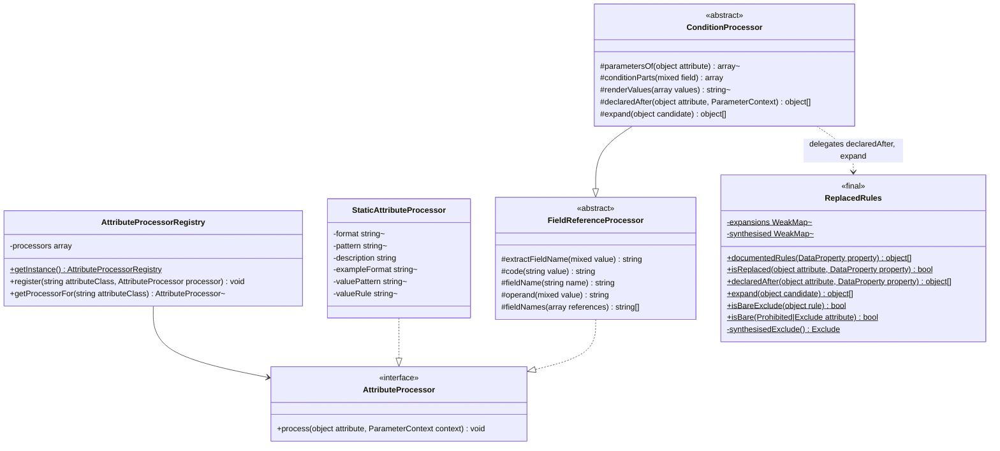

# Attribute Processing Framework

Core canvas. Owns `src/AttributeProcessing/AttributeProcessor.php`, `AttributeProcessorRegistry.php` (the mechanism and the order families register in, not the rows), `Processors/StaticAttributeProcessor.php` (the mechanism, not its rows), `Processors/Base/FieldReferenceProcessor.php`, `Processors/Base/ConditionProcessor.php` and `ReplacedRules.php`.

Related canvases: pipeline canvases (`AttributeProcessingStage` looks up this registry; `ParameterContext` is pipeline-owned); every family canvas (each specifies its own processors and registry rows, see `INDEX.md`); public attributes (`Description`, `Example`, `QueryParameter` rows and processors); documentation records (`ParameterLocation`, `ConfirmationCompanion`).

Carved out of the former attribute processors canvas; git history keeps it.

## Requirements

- Map a Spatie Laravel Data validation attribute or a package docs attribute onto fields of `ParameterContext` (constraints, format, pattern, location, example, description fragments).
- Support Spatie rules that only need a fixed format, pattern and sentence without a dedicated class each.
- Register a default table of attribute class → processor at first use, made of the rows each family canvas specifies.
- Distinguish, in description text, a **field name** from a **value**, so a reader of "Required when account_type is business" can tell which token is which without parsing the grammar.
- Give every family that names another field or states a condition one shared way to read attribute parameters and render values.
- Ignore unknown attribute classes (caller uses nullsafe).
- Never throw out of a processor. A malformed attribute declaration degrades to silence rather than failing the documentation build.

## Entities

Extended by family canvases: `ComparisonProcessor` (size and bounds) extends `FieldReferenceProcessor`; `RequirementConditionProcessor` (conditional requirement), `ProhibitionExclusionProcessor` (prohibition and exclusion) and `AcceptanceProcessor` (cross-field and acceptance) extend `ConditionProcessor`, as do the cross-field comparison (`Same`, `Different`, `InArray`) and confirmation processors directly. Family bases that implement `AttributeProcessor` directly include `SizeBasedProcessor` (size and bounds), `ValueListProcessor` (enumerated values) and `DigitCountProcessor` (arrays and type assertions), as do standalone processors such as `Email`, `Url`, `Password`, `Regex`, `DateFormat`, `StartsWith`, `EndsWith` and `MultipleOf`.

`FieldReferenceProcessor` is the shared root of everything that can name another field. It exists because two otherwise unrelated families need the same two things: turning a Spatie `FieldReference` into a printable name, and rendering a token as either a field or a value.

`ConditionProcessor` holds the condition rendering shared by the requirement, prohibition, exclusion, comparison, confirmation and acceptance families, and the two reads of what upstream sees after an attribute (`declaredAfter`, `expand`), with no opinion on whether a condition is enforced. Deciding that is family-private, because upstream displaces rules differently by kind: a requiring rule is replaced by any later requiring rule and stripped by `Present` (conditional requirement canvas), any other rule only by a later rule of its own class (prohibition and exclusion canvas).

`ParameterContext` is pipeline-owned. Processors write public fields and append to `descriptions`; they do not call `toParameter`. A processor may also write only context state and leave its sentence to a pipeline stage, when the sentence depends on attributes declared after it: `In` and `NotIn` record `allowedValues` / `excludedValues` and `TypeDescriptionStage` writes the reconciled sentence (enumerated values canvas).

## Approach

Plugin table: singleton registry constructed with `registerDefaults()`. `AttributeProcessingStage` iterates `DataDocsAttribute` instances first, then Spatie `ValidationRule` instances, and looks up `attribute::class`.

Three implementation styles: (1) `StaticAttributeProcessor` instances configured in the registry, (2) subclasses of a base class, (3) standalone processors. Which style an attribute uses is its family canvas's decision.

Spatie attributes are read via `parameters()` (array of constructor args). Package attributes are read via public properties.

**Reading `parameters()` is not safe for every attribute.** `RequiredWith`, `RequiredWithAll`, `RequiredWithout` and `RequiredWithoutAll` declare `protected array $fields` with no default and populate it only inside a `foreach` over the flattened constructor arguments, so `#[RequiredWith]` or `#[RequiredWith([])]` leaves it uninitialised and `parameters()` throws `Error: Typed property … must not be accessed before initialization`. Verified by execution against `spatie/laravel-data ^4.14` when the conditional family was designed; the tests pin it with real attributes for `RequiredWith([])` and `Prohibits()`, and for the other three through stand-ins (`MalformedConditionAttributeTest`). `Prohibits` has the same defect (`#[Prohibits]` with no fields). Every processor extending `ConditionProcessor` that reads parameters therefore does so through `parametersOf`, which absorbs it. This is an upstream defect the package swallows rather than reports: a documentation build must not fail over one attribute, but the declaration is genuinely broken and the developer gets no signal from us.

**Two token kinds, two renderings.** A value the consumer sends is wrapped in `<code>`; a field name they send it under is wrapped in `<b><i>`. Before the conditional family landed, every processor used `<code>` for both, which left "Required when account_type is business" carrying no signal about which token was the field. The convention is package-wide: any processor that can receive a `FieldReference` renders it through `operand()` or `fieldName()`, so field names never render two ways in one document.

**A referenced field is named as written, and never looked up.** Condition and comparison sentences render the referenced name verbatim, which may differ from the published name for a nested property (the path prefix is not rendered) and may name a `#[Hidden]` property; a request parameter is published under its input name and Laravel Data resolves a reference by the name as written, so a reference naming a PHP property rather than its input name is rendered as written although it resolves to nothing at runtime. A comma-joined string reference is split as Laravel splits it (`fieldNames`) and read the way each rule reads it: every part for `RequiredWith*`, `Prohibits`, `ExcludeWithout` and `Different`; the first part for `ExcludeWith`, `Same`, `InArray` and a comparison; and for a condition (`RequiredIf`, `AcceptedIf`, `DeclinedIf`, `ProhibitedIf`, `ExcludeIf` and their `Unless` forms) the first part as the field and the rest as leading compared values (`conditionParts`). At root level it then names the fields Laravel reads; in a nested Data object Spatie prefixes the whole string, so only the first part carries the path and Laravel reads the other parts from the root, while the sentence names them as siblings. Resolving either would require sibling lookup, which is deliberately avoided so a dangling reference cannot fail the build.

**A `#[Rule(...)]` is documented through the rules it expands to.** `RuleNormalizer` turns a declared `#[Rule('min:3')]` into the same attribute objects Laravel Data enforces (`Min(3)`; `Rule('min:3|max:9')` gives `Min(3)` and `Max(9)`; `email:dns`, `required_if:a,x`, `confirmed`, `date_format:Y-m-d` and the others give `Email`, `RequiredIf`, `Confirmed`, `DateFormat`, …), verified on 2026-09-26. `AttributeProcessingStage` walks `ReplacedRules::documentedRules`, the declared validation attributes with each `Rule` replaced by its expansion, and runs each through the registry like a declared attribute, so a rule string is documented by the same processor, with the same sentence, bounds and example. An expanded rule stands at its `Rule`'s position: `declaredAfter` and `isReplaced` find it through the `Rule` it came from, because `expand` remembers each `Rule`'s expansion (a `WeakMap`), so every processor that reads declaration order (the conditional requirement suppression, the prohibition check) treats it as declared where the `Rule` is.

**A replaced attribute is not documented at all.** Upstream `AttributesRuleInferrer` adds the declared validation attributes in order, and `PropertyRules::add` first drops every collected rule that is `instanceof` the class of a rule being added. So a later declaration, in practice a `#[Rule(...)]`, that expands to a rule of an attribute's class replaces that attribute, even when it re-adds an equal rule: `removeType` drops by class before the push, so the enforced rule is always the later declaration's. Verified on 2026-09-26 against real Data classes' `getValidationRules`, in every family: `#[Min(5), Rule('min:3')]` enforces `min:3` only, as do `Email`/`email:dns`, `Regex`, `Same`, `DateFormat`, `Digits` and `GreaterThan` with a later same-class `Rule`; `#[Min(5), Rule('min:5')]` and `#[Max(10), Rule('max:10|min:2')]` enforce the rule's equal copy once; `#[Min(5), Rule('max:10')]` keeps both; `#[Rule('min:3'), Min(5)]` enforces `min:5`. An equal later rule is documented through its own expansion, so keeping the attribute too would publish its sentence twice (`#[Prohibited, Rule('prohibited')]`, `#[Filled, Rule('filled')]`, `#[Confirmed, Rule('confirmed')]` did, until 2026-09-26). A replaced attribute's sentence would be false and its schema writes (bounds, format, pattern, example) stricter or looser than what runs, so `AttributeProcessingStage` (parameter metadata pipeline canvas) does not call its processor: `ReplacedRules::isReplaced` decides. Only same-class replacement is covered here; the requiring rules' cross-class displacement and `Present`'s strip stay with the conditional requirement family, because testing them needs Spatie's `RequiringRule`, which `tests/ArchTest.php` confines to `RequirementResolver`.

Known divergences:

- A `#[Rule]` keyword that `RuleNormalizer` expands to a plain `Rule` (an unknown keyword) or to a class with no processor (`string`, `numeric`, `array`) documents nothing of its own. `required` and the other requiring keywords are documented by the pipeline's requirement resolution, not by a registry row. The one plain `Rule` read anyway is a bare `exclude`: Spatie has no keyword for it, so it stays a `Rule` upstream yet excludes the field, and `expand` returns `new Exclude()` for it, documented like the attribute (prohibition and exclusion canvas).
- Two rules from one `#[Rule]` (`Rule('min:3|max:9')`) are added upstream in one call, so neither replaces the other; each is documented, and one expanded rule is never treated as declared after its sibling.

- `Hidden` and `ResponseData` are not registered (public attributes canvas).
- Registry overwrite: a later `register` replaces the processor for that class.
- The stage visits every attribute instance, but no Spatie validation attribute is `IS_REPEATABLE`, so PHP rejects a repeated one before this stage runs. Only `Description` repeats, and each instance adds its own text. With the registry's parent fallback a consumer subclass and its parent can both sit on one property (`#[Min(3), SubMin(5)]`): each is documented, as upstream enforces both; declared the other way round (`#[SubMin(5), Min(3)]`) the subclass is replaced, because `isReplaced` tests `instanceof` as upstream's `removeType` does.
- The rows in `registerDefaults()` are not grouped by family today: the format and pattern rows at the top (static rows, plus the identifiers family's `Email`, `Url` and `Password` processors and the dates family's `DateProcessor`) belong to three families (identifiers, enumerated values and text patterns, dates and times), and the dedicated rows from `DateFormat` to `MultipleOf` to four. Order is not observable, because every class is registered once.

## Structure

`src/AttributeProcessing/AttributeProcessor.php`, `AttributeProcessorRegistry.php` and `ReplacedRules.php`. Processors under `Processors/`, bases under `Processors/Base/`. The registry depends on every default processor class; processors depend on the context.

- `FieldReferenceProcessor`: implements `AttributeProcessor`; holds `extractFieldName`, `fieldNames`, `code`, `fieldName` and `operand`. It holds the import for every processor except one: `ComparisonProcessor` (size and bounds canvas) also imports `FieldReference` directly and checks `instanceof` itself, because it needs the reference's first comma-split field before calling `fieldName()`, which `operand()` does not split.
- `ConditionProcessor`: extends it; holds `parametersOf`, `conditionParts`, value rendering, and `declaredAfter` and `expand`, which delegate to `ReplacedRules`; imports `ReplacedRules`, `BackedEnum`, `ExternalReference`, `Throwable`, `UnitEnum` and `ParameterContext`.
- `ReplacedRules`: imports Spatie `Exclude`, `Prohibited`, `Rule`, `RuleNormalizer`, `ValidationRule` and `DataProperty`, and `ReflectionMethod`, `Throwable` and `WeakMap`.

`RuleNormalizer` sits in the namespace whose four internals `tests/ArchTest.php` confines to `RequirementResolver`, but is not one of them. It is the class `AttributesRuleInferrer` expands a `#[Rule]` with; the dependency is accepted rather than routed through the resolver because it breaks only if Spatie changes that expansion, and the integration tests of both families that use it would then fail.

`FieldReference` is a sanctioned collaborator, not one of the four Spatie validation internals confined to `RequirementResolver`; `tests/ArchTest.php` encodes that distinction by naming the four types rather than the namespace.

## Operations

### AttributeProcessor

- Method `process(object $attribute, ParameterContext $context): void`.

### AttributeProcessorRegistry

- Singleton: private constructor, private clone, `__wakeup` throws `Cannot unserialize singleton`, `getInstance` lazy-init.
- `register(string $attributeClass, AttributeProcessor $processor)` keyed by attribute FQCN.
- `getProcessorFor` returns the processor registered for the class, else for its nearest registered parent class (`class_parents`, guarded by `class_exists`), else null. A subclass of `Min` or of `Description` is processed as its parent, as Laravel Data enforces the inherited rule and Spatie files the attribute under its parents too; the docblock says so. `AttributeProcessorRegistryTest` pins both. Accepted limit: the fallback trusts a subclass to enforce its parent's rule, so one that overrides `keyword()` or `parameters()` is still documented as its parent, except a subclass of a conditional requiring attribute, whose sentence (conditional requirement canvas) and requirement status (requirement resolution canvas) follow the keyword it emits, and a `parameters()` override that throws reaches processors that call it unguarded (`MinProcessor`); no Spatie or package attribute extends a registered one, so nothing shipped is affected.
- `registerDefaults()` registers every family's rows, as listed in each family canvas's Operations table; this canvas does not list them, so a family story that adds a row does not edit this canvas. Current order, by block: the format and pattern rows (static, except `Email`, `Url`, `Password` and the dates family's `DateProcessor`); the dedicated format, digit, pattern and value-list (`In`, `NotIn`) processors with `MultipleOf`; the size and comparison bounds; the conditional requirement rows, then `Filled`; the prohibition and exclusion rows; the cross-field comparison, confirmation and acceptance rows; then the public attributes rows (`Example`, `Description`, `QueryParameter`).
- No entry for `Required`, `Nullable`, `Sometimes` or `Present`: the requirement resolution canvas owns those, and `RequiredStage` runs after this stage.

### StaticAttributeProcessor

- Constructor: optional `format`, `pattern`; `description` defaults to empty; optional `exampleFormat`, a format that shapes only the generated example and is never published (example generation canvas), for a rule OpenAPI has no exact format for (`IP`; the dates family's `DateProcessor` writes it for `Date`).
- Optional `valuePattern`: the pattern Laravel's rule really accepts, for a row whose published `pattern` only approximates it; with the other pattern rules of the field it decides which `#[In]` values count as accepted (parameter metadata pipeline canvas).
- Optional `valueRule`: a Laravel rule string (`uuid`, `ip`, `json`) appended to `context->valueRules`, for a format row whose `#[In]` values are checked by Laravel's own validator.
- `process`: if format is not null, set `context->format`; if pattern is not null, set `context->pattern` and append `valuePattern ?? pattern` to `context->valuePatterns`; if valueRule is not null, append it to `context->valueRules`; if exampleFormat is not null, set `context->exampleFormat`; if description is not empty, append it to `descriptions`. Does not read the Spatie attribute instance.

### FieldReferenceProcessor

- Abstract, implements `AttributeProcessor`.
- `extractFieldName(mixed $value): string`: if value is a Spatie `FieldReference`, return its `name`; else cast to string.
- `code(string $value): string`: wraps a **value** in `<code>`.
- `fieldName(string $name): string`: wraps a **field name** in `<b><i>`.
- `operand(mixed $value): string`: renders a `FieldReference` via `fieldName`, anything else via `code`. This is the whole of the field-versus-value distinction; processors do not re-implement it.
- `fieldNames(array $references): array`: maps `extractFieldName` over the references and splits each name with the same `str_getcsv` call `renderValues` uses, since Laravel parses a rule's parameters as CSV: `RequiredWith('a,b')` names `a` and `b` (an empty part stays `''`). Each reference is split on its own, so a quote spanning two references reads differently from Laravel's single parse of the joined string. `ConditionValuesTest` pins `RequiredWith`, `Prohibits`, `ExcludeWith`, `ExcludeWithout`, `Same`, `InArray`, `Different`, `GreaterThan`, `AcceptedIf` and `RequiredIf` with a comma-joined reference against the validator.
- Carries a class docblock explaining the two token kinds, one of the few commented classes in the package.

### ConditionProcessor

- Abstract, extends `FieldReferenceProcessor`.
- `parametersOf(object $attribute): ?array`: `parameters()` inside a try, null on any `Throwable`. Its docblock names the affected attributes (see Approach).
- `conditionParts(mixed $field): array`: the condition's field split by `fieldNames`, returned as the first part and the remaining parts. Laravel splits a condition's rule string as CSV, so `RequiredIf('a,b', 'x')` reads the field `a` compared against `b` and `x`; the eight condition processors pass the remaining parts to `renderValues` ahead of the declared values. `RequiredIf`, `RequiredUnless`, `ProhibitedIf` and `ProhibitedUnless` test for an empty compared list only after the split, so `RequiredIf('a,b')` with no declared value reads "Required when a is b.", as Laravel enforces `required_if:a,b`.
- `renderValues(array $values): ?string`: returns null for an empty list, and null as soon as any element is an `ExternalReference`. A string element is first split as Laravel reads it: Spatie joins a condition's values into the rule string with commas and Laravel parses them back with `str_getcsv`, so `RequiredIf('country', 'DE,AT')` compares against `DE` and `AT` (an empty part stays `''`). Otherwise renders each element: a PHP `null` and an empty string both as `<code>""</code>`, because Spatie writes a `null` into the rule string as an empty part and Laravel compares an empty part as `''` (`RequiredUnless('status', null)` becomes `required_unless:status,`, which requires the field when `status` is missing or null and exempts it only when `status` is `''`); a `BackedEnum` as its case name in `code()` followed by the backing value in brackets (`<code>Business</code> (business)`), matching the enum list of `TypeDescriptionStage`; any other `UnitEnum` as its case name in `code()`; and, wrapped in `code()`, a bool as `true`/`false`, anything else cast to string. One value is returned alone; several are joined as `one of: a, b, c`. A bool would otherwise cast to `1` or an empty string.
- `declaredAfter(object $attribute, ParameterContext $context): array`: delegates to `ReplacedRules::declaredAfter($attribute, $context->property)`: the property's `attributes->all(ValidationRule::class)`, the declaration-ordered list upstream `AttributesRuleInferrer` walks, after `$attribute`, found by identity (`array_search` strict). An attribute not in the list (only when a caller passes an instance the property does not declare, as unit tests do) is treated as declared first, so the whole list is returned.
- `expand(object $candidate): array`: delegates to `ReplacedRules::expand($candidate)`: a `Rule` becomes `app(RuleNormalizer::class)->execute($candidate)`, the rule objects upstream adds for it, inside a try that returns `[]` on any `Throwable`; anything else is returned as `[$candidate]`. Moved here from `RequirementConditionProcessor` when the prohibition and exclusion family needed it too, and into `ReplacedRules` when the stage needed it for every family.

### ReplacedRules

- `final` class with static methods only. Its state is two private static `WeakMap`s: `expansions`, keyed by `Rule` instance, and `synthesised`, the set of `Exclude` instances `synthesisedExclude()` created for a bare `exclude` string.
- `declaredAfter(object $attribute, DataProperty $property): array` and `expand(object $candidate): array`: as described under `ConditionProcessor`, which delegates to them. `expand` returns the same objects for the same `Rule` every time (a private static `WeakMap` keyed by the `Rule` instance, which relies on `DataProperty->attributes` returning the same attribute objects on every call, as Spatie's cached `DataConfig` does; `RuleStringsTest` exercises it), with an expanded plain `Rule` whose `get()` is `['exclude']` replaced by `new Exclude()`, and `declaredAfter` finds an attribute that is not itself declared through the declared `Rule` whose expansion holds it (strict identity), falling back to "declared first" only when neither holds it.
- `expand` catches a `Throwable` from `RuleNormalizer::execute` and returns `[]`; this is defensive, because Spatie's string parsing already turns an unknown keyword into a plain `Rule` (`ReplacedRulesTest` pins that), so the branch is not reachable through a declared `#[Rule]` today.
- `documentedRules(DataProperty $property): array`: the declared validation attributes in order, each `Rule` replaced by `expand($rule)`, and an expanded plain `Rule` left out, so a rule is never expanded twice.
- `isReplaced(object $attribute, DataProperty $property): bool`: false for an `Exclude` that `expand` synthesised from a bare `exclude` string (upstream it is a plain `Rule`, which no later `Exclude` drops, so `#[Rule('exclude'), Exclude(new ExcludeIf(false))]` stays unconditionally excluded); otherwise true as soon as some candidate in `declaredAfter` expands (`expand($candidate)`) to a rule of which `$attribute` is an instance (`$attribute instanceof $rule`, upstream's own test), whether or not that rule is equal to it; false otherwise. Docblock states the upstream rule, why an equal rule replaces too, and why requiring rules and `Present` are left to the conditional requirement family.
- `isBareExclude(object $rule): bool`: a `Rule` whose `get()` is `['exclude']`. `expand` replaces it by a synthesised `new Exclude()`, remembered in a private static `WeakMap`, and `RequirementResolver` (requirement resolution canvas) counts it as an exclusion, so both readers agree on it.
- `isBare(Prohibited|Exclude $attribute): bool`: false when the attribute's class declares its own `getRule()` (`ReflectionMethod` on `getRule`, its declaring class compared with `Prohibited` / `Exclude`), since such a subclass enforces whatever that method returns; otherwise true when the attribute wraps no rule object, read through a closure bound to the attribute (`!isset($this->rule)`). `getRule(ValidationPath)` is never called and a `ReflectionMethod` on a method every instance has cannot throw, so it evaluates nothing and cannot fail. A consumer subclass that only inherits `getRule()` counts as bare as the attribute does, and one that never set the property counts as bare too. `ProhibitedProcessor`, `ExcludeProcessor` and `RequirementResolver`'s never-satisfiable check use it; `ProhibitionExclusionTest` pins a bare subclass of each, and a subclass of each that declares its own conditional `getRule()`, against the validator.
- Writes nothing itself.

## Norms

- Namespace `Abrha\LaravelDataDocs\AttributeProcessing` and `...\Processors` / `...\Processors\Base`.
- `final` on concrete processors; `abstract` on every base.
- Singleton registry matching `CustomTypeProcessorRegistry` (same wakeup message).
- Description fragments wrap a **value** in `<code>` and a **field name** in `<b><i>`; `MultipleOf` is the one recorded exception (size and bounds canvas). Every sentence a processor writes itself is complete and ends with a full stop, so fragments concatenate cleanly with a single space. `#[Description]` text is passed through as the developer wrote it.
- Sentence text lives in private class constants rather than inline literals in the conditional requirement, prohibition and exclusion, and cross-field comparison and acceptance families, so the wording contract is greppable and diffable. `EmailProcessor` keeps its sentences in private constants too, and `PasswordProcessor` is mixed (a `GENERIC` constant beside an inline impossible-range note); `RegexProcessor` writes its sentence inline (its constants are regex tables); `DateProcessor` keeps its sentence and note in private constants; the size and bounds, `StartsWith` / `EndsWith`, `DateFormat` and digit-count processors use inline strings, and `In` / `NotIn` write no sentence of their own.
- Spatie rule args via `parameters()`; no dedicated DTO for rule payloads. Processors extending `ConditionProcessor` read through `parametersOf`. Where an attribute exposes its arguments only through `getRule(ValidationPath)` (`In`, `NotIn`, `Password`), its family reads the constructor properties by reflection inside a `try`, documenting nothing it cannot read (enumerated values and identifiers canvases).
- A family canvas specifies each attribute as one row of its Operations table (see `INDEX.md`); this canvas specifies no attribute.
- Tests: one Pest file per concrete processor under `tests/Unit/AttributeProcessing/Processors/`. `StaticAttributeProcessor` is covered through `AttributeProcessorRegistryTest` and `AttributeProcessingStageTest`, its `exampleFormat` write behaviourally through `IdentifiersTest` (the `IP` example), its `valuePattern` write through `InTest` (the `Uppercase`, `Lowercase` and `Alpha` rows), and its `valueRule` write through `InTest` (the `IP`, `Uuid` and `Json` rows) and `IdentifiersTest` (`IPv4` and `IPv6` with `#[In]`); the two bases are covered through their subclasses.

## Safeguards

- Unregistered attribute classes are skipped by the stage (null processor).
- No processor throws. Every processor that reads a Spatie attribute whose `parameters()` can throw goes through `parametersOf` and returns without appending when the attribute cannot be read or its parameters are short.
- No processor writes `required`, `nullable`, `onlyValidatedWhenPresent`, `presentAcceptsEmpty` or `neverSatisfiable`; `RequiredStage` owns all five and would discard such a write.
- No processor looks up the field a comparison, confirmation or condition names.
- The one container call in this canvas's code, `app(RuleNormalizer::class)` in `ReplacedRules::expand`, resolves Spatie's stateless normalizer service to read a declaration, not a value to publish.
- A validation attribute a later declaration replaces writes nothing to the context: no sentence, bound, format, pattern or example. `ReplacedRulesTest` pins `isReplaced` for the `Min` cases above (replaced, equal, another class, declared first, re-added in a list); `RuleStringsTest` pins the synthesised-`Exclude` expansion and that a synthesised `Exclude` is never replaced; `ReplacedRulesIntegrationTest` pins, for one attribute of every family but prohibition and exclusion (pinned in `ProhibitionExclusionTest`), that the published parameter carries none of its writes, and checks each case against the Data class's own `getValidationRules`.
- A sentence is published once per rule upstream enforces: an attribute followed by an equal `#[Rule]` is documented once, through the rule. `ReplacedRulesIntegrationTest` counts the sentence (`substr_count`) for `Min`, `Accepted`, `Confirmed`, `Filled`, `Prohibited` and `RequiredIf` followed by their equal rule strings, and checks upstream enforces each rule once.
- A `#[Rule]` string is documented exactly as the attribute it expands to. `RuleStringsTest` compares, for one rule of every family, the parameter published for `#[Rule('…')]` with the one published for the equivalent attribute, and pins that a conditional rule string is still suppressed by a later `#[Present]` and that a rule string replaced by a later attribute writes nothing.
- A condition value holding a comma is stated as the values Laravel compares against, never as one literal. `ConditionValuesTest` checks `AcceptedIf`, `RequiredIf`, `ProhibitedIf` and `ExcludeIf` with `'DE,AT'` against Laravel's validator.
- A comma-joined field reference names the fields Laravel reads, as each rule reads them (Approach). `ConditionValuesTest` checks each reading against Laravel's validator, including a condition's comma-joined field with no declared value.
- No documented value is resolved from the container, configuration, environment, filesystem or network. `ExternalReference` values are never dereferenced (`renderValues` returns null for them), so repeated builds over an unchanged codebase produce identical output. One named exception: `#[Password(default: true)]` is documented from `Illuminate\Validation\Rules\Password::default()`, which runs the application's own `Password::defaults()` callback (identifiers canvas). That callback is the rule the application declares for the attribute, so documenting it states what runs; a callback that branches on the environment documents the build environment's rule. No other processor may read application state. The published `#[In]` set is filtered through the container's validation factory (parameter metadata pipeline canvas), which runs Laravel's own built-in rules and a `Password` rule rebuilt without the application's custom rules; that reads Laravel's rule implementation, not application state.
- Static processors do not overwrite format/pattern when those constructor args are null; they still skip an empty description.
- The registry is process-global with no reset method.
- No HTML escaping of interpolated attribute values in descriptions.
