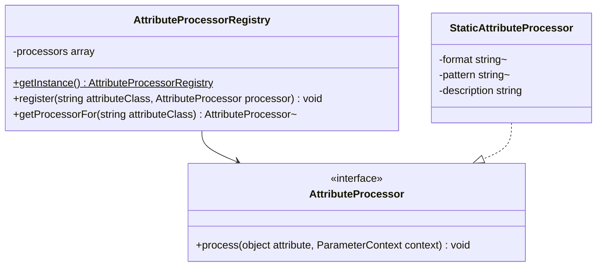

# Attribute Processing Framework

Core canvas. Owns `src/AttributeProcessing/AttributeProcessor.php`, `AttributeProcessorRegistry.php` (the mechanism and the order families register in, not the rows) and `Processors/StaticAttributeProcessor.php` (the mechanism, not its rows).

Related canvases: pipeline canvases (`AttributeProcessingStage` looks up this registry; `ParameterContext` is pipeline-owned); every family canvas (each specifies its own processors and registry rows, see `INDEX.md`); public attributes (`Description`, `Example`, `QueryParameter` rows and processors); documentation records (`ParameterLocation`).

Reverse-codified from the v0.4.0 code with `/spdd-reverse`.

## Requirements

- Map a Spatie Laravel Data validation attribute or a package docs attribute onto fields of `ParameterContext` (constraints, format, pattern, location, example, description fragments).
- Support Spatie rules that only need a fixed format, pattern and sentence without a dedicated class each.
- Register a default table of attribute class → processor at first use, made of the rows each family canvas specifies.
- Ignore unknown attribute classes (caller uses nullsafe).

## Entities

Extended by family canvases: family bases that implement `AttributeProcessor` directly include `SizeBasedProcessor` and `ComparisonProcessor` (size and bounds), as do standalone processors such as `Regex`, `DateFormat`, `StartsWith`, `EndsWith`, `Digits`, `DigitsBetween` and `MultipleOf`.

`ParameterContext` is pipeline-owned. Processors write public fields and append to `descriptions`; they do not call `toParameter`.

## Approach

Plugin table: singleton registry constructed with `registerDefaults()`. `AttributeProcessingStage` iterates `DataDocsAttribute` instances first, then Spatie `ValidationRule` instances, and looks up `attribute::class`.

Three implementation styles: (1) `StaticAttributeProcessor` instances configured in the registry, (2) subclasses of a base class, (3) standalone processors. Which style an attribute uses is its family canvas's decision.

Spatie attributes are read via `parameters()` (array of constructor args). Package attributes are read via public properties.

Known divergences:

- `Hidden` and `ResponseData` are not registered (public attributes canvas).
- Registry overwrite: a later `register` replaces the processor for that class.
- The stage visits every attribute instance, but no Spatie validation attribute is `IS_REPEATABLE`, so PHP rejects a repeated one before this stage runs. Only `Description` repeats, and each instance adds its own text.
- Registry lookup is by exact class, so a subclass of a registered attribute is not documented.
- The rows in `registerDefaults()` are not grouped by family today: the static format and pattern rows at the top belong to three families (identifiers, enumerated values and text patterns, dates and times), and the dedicated rows from `DateFormat` to `MultipleOf` to four. Order is not observable, because every class is registered once.

## Structure

`src/AttributeProcessing/AttributeProcessor.php` and `AttributeProcessorRegistry.php`. Processors under `Processors/`, bases under `Processors/Base/`. The registry depends on every default processor class; processors depend on the context.

## Operations

### AttributeProcessor

- Method `process(object $attribute, ParameterContext $context): void`.

### AttributeProcessorRegistry

- Singleton: private constructor, private clone, `__wakeup` throws `Cannot unserialize singleton`, `getInstance` lazy-init.
- `register(string $attributeClass, AttributeProcessor $processor)` keyed by attribute FQCN.
- `getProcessorFor` returns the processor registered for the class, or null (no parent-class walk).
- `registerDefaults()` registers every family's rows, as listed in each family canvas's Operations table; this canvas does not list them, so a family story that adds a row does not edit this canvas. Current order, by block: the static format and pattern rows; the dedicated format, digit and pattern processors with `MultipleOf`; the size and comparison bounds; then the public attributes rows (`Example`, `Description`, `QueryParameter`).
- No entry for `Required`, `Nullable`, `Sometimes` or `Present`: requirement status is the requirement resolution canvas's, and `RequiredStage` runs after this stage.

### StaticAttributeProcessor

- Constructor: optional `format`, `pattern`; `description` defaults to empty.
- `process`: if format is not null, set `context->format`; if pattern is not null, set `context->pattern`; if description is not empty, append it to `descriptions`. Does not read the Spatie attribute instance.

## Norms

- Namespace `Abrha\LaravelDataDocs\AttributeProcessing` and `...\Processors` / `...\Processors\Base`.
- `final` on concrete processors; `abstract` on every base.
- Singleton registry matching `CustomTypeProcessorRegistry` (same wakeup message).
- Description fragments wrap every interpolated token in `<code>`, a field name a comparison references included; `MultipleOf` is the one recorded exception (size and bounds canvas). Every sentence a processor writes itself is complete and ends with a full stop, so fragments concatenate cleanly with a single space. `#[Description]` text is passed through as the developer wrote it.
- The size and bounds, text pattern, date and digit processors write their sentence text as inline strings; the static rows pass theirs to the constructor in the registry.
- Spatie rule args via `parameters()`; no dedicated DTO for rule payloads.
- A family canvas specifies each attribute as one row of its Operations table (see `INDEX.md`); this canvas specifies no attribute.
- Tests: one Pest file per concrete processor under `tests/Unit/AttributeProcessing/Processors/`. `StaticAttributeProcessor` is covered through `AttributeProcessorRegistryTest` and `AttributeProcessingStageTest`.

## Safeguards

- Unregistered attribute classes are skipped by the stage (null processor).
- No processor looks up the field a comparison names.
- No documented value is resolved from the container, configuration, environment, filesystem or network.
- Static processors do not overwrite format/pattern when those constructor args are null; they still skip an empty description.
- The registry is process-global with no reset method.
- No HTML escaping of interpolated attribute values in descriptions.
