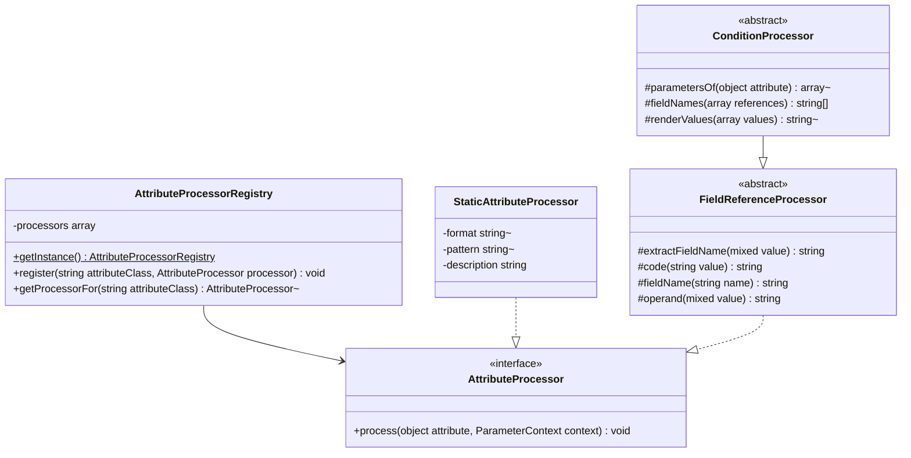

# Attribute Processing Framework

Core canvas. Owns `src/AttributeProcessing/AttributeProcessor.php`, `AttributeProcessorRegistry.php` (the mechanism and the order families register in, not the rows), `Processors/StaticAttributeProcessor.php` (the mechanism, not its rows), `Processors/Base/FieldReferenceProcessor.php` and `Processors/Base/ConditionProcessor.php`.

Related canvases: pipeline canvases (`AttributeProcessingStage` looks up this registry; `ParameterContext` is pipeline-owned); every family canvas (each specifies its own processors and registry rows, see `INDEX.md`); public attributes (`Description`, `Example`, `QueryParameter` rows and processors); documentation records (`ParameterLocation`, `ConfirmationCompanion`).

Reverse-codified from the v0.4.0 code with `/spdd-reverse`.

## Requirements

- Map a Spatie Laravel Data validation attribute or a package docs attribute onto fields of `ParameterContext` (constraints, format, pattern, location, example, description fragments).
- Support Spatie rules that only need a fixed format, pattern and sentence without a dedicated class each.
- Register a default table of attribute class → processor at first use, made of the rows each family canvas specifies.
- Distinguish, in description text, a **field name** from a **value**, so a reader of "Required when account_type is business" can tell which token is which without parsing the grammar.
- Give every family that names another field or states a condition one shared way to read attribute parameters and render values.
- Ignore unknown attribute classes (caller uses nullsafe).
- Never throw out of a processor. A malformed attribute declaration degrades to silence rather than failing the documentation build.

## Entities

Extended by family canvases: `ComparisonProcessor` (size and bounds) extends `FieldReferenceProcessor`; `RequirementConditionProcessor` (conditional requirement) and `AcceptanceProcessor` (cross-field and acceptance) extend `ConditionProcessor`, as do the prohibition and exclusion processors and the cross-field comparison (`Same`, `Different`, `InArray`) and confirmation processors directly. Family bases that implement `AttributeProcessor` directly include `SizeBasedProcessor` (size and bounds), as do standalone processors such as `Regex`, `DateFormat`, `StartsWith`, `EndsWith`, `Digits`, `DigitsBetween` and `MultipleOf`.

`FieldReferenceProcessor` is the shared root of everything that can name another field. It exists because two otherwise unrelated families need the same two things: turning a Spatie `FieldReference` into a printable name, and rendering a token as either a field or a value.

`ConditionProcessor` holds the condition rendering shared by the requirement, prohibition, exclusion, comparison, confirmation and acceptance families, with no opinion on whether a condition is enforced. Deciding that is family-private: the conditional requirement canvas suppresses a condition that a later requiring rule replaces or a later `Present` strips.

`ParameterContext` is pipeline-owned. Processors write public fields and append to `descriptions`; they do not call `toParameter`.

## Approach

Plugin table: singleton registry constructed with `registerDefaults()`. `AttributeProcessingStage` iterates `DataDocsAttribute` instances first, then Spatie `ValidationRule` instances, and looks up `attribute::class`.

Three implementation styles: (1) `StaticAttributeProcessor` instances configured in the registry, (2) subclasses of a base class, (3) standalone processors. Which style an attribute uses is its family canvas's decision.

Spatie attributes are read via `parameters()` (array of constructor args). Package attributes are read via public properties.

**Reading `parameters()` is not safe for every attribute.** `RequiredWith`, `RequiredWithAll`, `RequiredWithout` and `RequiredWithoutAll` declare `protected array $fields` with no default and populate it only inside a `foreach` over the flattened constructor arguments, so `#[RequiredWith]` or `#[RequiredWith([])]` leaves it uninitialised and `parameters()` throws `Error: Typed property … must not be accessed before initialization`. Verified by execution against `spatie/laravel-data ^4.14` when the conditional family was designed; the tests pin it with real attributes for `RequiredWith([])` and `Prohibits()`, and for the other three through stand-ins (`MalformedConditionAttributeTest`). `Prohibits` has the same defect (`#[Prohibits]` with no fields). Every processor extending `ConditionProcessor` that reads parameters therefore does so through `parametersOf`, which absorbs it. This is an upstream defect the package swallows rather than reports: a documentation build must not fail over one attribute, but the declaration is genuinely broken and the developer gets no signal from us.

**Two token kinds, two renderings.** A value the consumer sends is wrapped in `<code>`; a field name they send it under is wrapped in `<b><i>`. Before the conditional family landed, every processor used `<code>` for both, which left "Required when account_type is business" carrying no signal about which token was the field. The convention is package-wide: any processor that can receive a `FieldReference` renders it through `operand()` or `fieldName()`, so field names never render two ways in one document.

**A referenced field is named as written, and never looked up.** Condition and comparison sentences render the referenced name verbatim, which may differ from the published name for an input-mapped or nested property, and may name a `#[Hidden]` property. Resolving either would require sibling lookup, which is deliberately avoided so a dangling reference cannot fail the build.

Known divergences:

- `Hidden` and `ResponseData` are not registered (public attributes canvas).
- Registry overwrite: a later `register` replaces the processor for that class.
- The stage visits every attribute instance, but no Spatie validation attribute is `IS_REPEATABLE`, so PHP rejects a repeated one before this stage runs. Only `Description` repeats, and each instance adds its own text.
- Registry lookup is by exact class, so a subclass of a registered attribute is not documented.
- The rows in `registerDefaults()` are not grouped by family today: the static format and pattern rows at the top belong to three families (identifiers, enumerated values and text patterns, dates and times), and the dedicated rows from `DateFormat` to `MultipleOf` to four. Order is not observable, because every class is registered once.

## Structure

`src/AttributeProcessing/AttributeProcessor.php` and `AttributeProcessorRegistry.php`. Processors under `Processors/`, bases under `Processors/Base/`. The registry depends on every default processor class; processors depend on the context.

- `FieldReferenceProcessor`: implements `AttributeProcessor`; holds `extractFieldName`, `code`, `fieldName` and `operand`, and the sole import of Spatie `FieldReference` among the processors.
- `ConditionProcessor`: extends it; holds `parametersOf`, field-list rendering and value rendering; imports `BackedEnum`, `ExternalReference`, `Throwable` and `UnitEnum`.

`FieldReference` is a sanctioned collaborator, not one of the four Spatie validation internals confined to `RequirementResolver`; `tests/ArchTest.php` encodes that distinction by naming the four types rather than the namespace.

## Operations

### AttributeProcessor

- Method `process(object $attribute, ParameterContext $context): void`.

### AttributeProcessorRegistry

- Singleton: private constructor, private clone, `__wakeup` throws `Cannot unserialize singleton`, `getInstance` lazy-init.
- `register(string $attributeClass, AttributeProcessor $processor)` keyed by attribute FQCN.
- `getProcessorFor` returns the processor registered for the class, or null (no parent-class walk).
- `registerDefaults()` registers every family's rows, as listed in each family canvas's Operations table; this canvas does not list them, so a family story that adds a row does not edit this canvas. Current order, by block: the static format and pattern rows; the dedicated format, digit and pattern processors with `MultipleOf`; the size and comparison bounds; the conditional requirement rows, then `Filled`; the prohibition and exclusion rows; the cross-field comparison, confirmation and acceptance rows; then the public attributes rows (`Example`, `Description`, `QueryParameter`).
- No entry for `Required`, `Nullable`, `Sometimes` or `Present`: the requirement resolution canvas owns those, and `RequiredStage` runs after this stage.

### StaticAttributeProcessor

- Constructor: optional `format`, `pattern`; `description` defaults to empty.
- `process`: if format is not null, set `context->format`; if pattern is not null, set `context->pattern`; if description is not empty, append it to `descriptions`. Does not read the Spatie attribute instance.

### FieldReferenceProcessor

- Abstract, implements `AttributeProcessor`.
- `extractFieldName(mixed $value): string`: if value is a Spatie `FieldReference`, return its `name`; else cast to string.
- `code(string $value): string`: wraps a **value** in `<code>`.
- `fieldName(string $name): string`: wraps a **field name** in `<b><i>`.
- `operand(mixed $value): string`: renders a `FieldReference` via `fieldName`, anything else via `code`. This is the whole of the field-versus-value distinction; processors do not re-implement it.
- Carries a class docblock explaining the two token kinds, one of the few commented classes in the package.

### ConditionProcessor

- Abstract, extends `FieldReferenceProcessor`.
- `parametersOf(object $attribute): ?array`: `parameters()` inside a try, null on any `Throwable`. Its docblock names the affected attributes (see Approach).
- `fieldNames(array $references): array`: maps `extractFieldName` over the `parameters()[0]` array used by the presence-based attributes and `Prohibits`.
- `renderValues(array $values): ?string`: returns null for an empty list, and null as soon as any element is an `ExternalReference`. Otherwise renders each element: a `BackedEnum` as its case name in `code()` followed by the backing value in brackets (`<code>Business</code> (business)`), matching the enum list of `TypeDescriptionStage`; any other `UnitEnum` as its case name in `code()`; and, wrapped in `code()`, `null` as the literal `null`, a bool as `true`/`false`, anything else cast to string. One value is returned alone; several are joined as `one of: a, b, c`. A bool would otherwise cast to `1` or an empty string.
- Writes nothing itself.

## Norms

- Namespace `Abrha\LaravelDataDocs\AttributeProcessing` and `...\Processors` / `...\Processors\Base`.
- `final` on concrete processors; `abstract` on every base.
- Singleton registry matching `CustomTypeProcessorRegistry` (same wakeup message).
- Description fragments wrap a **value** in `<code>` and a **field name** in `<b><i>`; `MultipleOf` is the one recorded exception (size and bounds canvas). Every sentence a processor writes itself is complete and ends with a full stop, so fragments concatenate cleanly with a single space. `#[Description]` text is passed through as the developer wrote it.
- Sentence text lives in private class constants rather than inline literals in the conditional requirement, prohibition and exclusion, and cross-field comparison and acceptance families, so the wording contract is greppable and diffable. The size and bounds, text pattern, date and digit processors use inline strings.
- Spatie rule args via `parameters()`; no dedicated DTO for rule payloads. Processors extending `ConditionProcessor` read through `parametersOf`.
- A family canvas specifies each attribute as one row of its Operations table (see `INDEX.md`); this canvas specifies no attribute.
- Tests: one Pest file per concrete processor under `tests/Unit/AttributeProcessing/Processors/`. `StaticAttributeProcessor` is covered through `AttributeProcessorRegistryTest` and `AttributeProcessingStageTest`, and the two bases through their subclasses.

## Safeguards

- Unregistered attribute classes are skipped by the stage (null processor).
- No processor throws. Every processor that reads a Spatie attribute whose `parameters()` can throw goes through `parametersOf` and returns without appending when the attribute cannot be read or its parameters are short.
- No processor writes `required`, `nullable`, `onlyValidatedWhenPresent`, `presentAcceptsEmpty` or `neverSatisfiable`; `RequiredStage` owns all five and would discard such a write.
- No processor looks up the field a comparison, confirmation or condition names.
- No documented value is resolved from the container, configuration, environment, filesystem or network. `ExternalReference` values are never dereferenced (`renderValues` returns null for them), so repeated builds over an unchanged codebase produce identical output.
- Static processors do not overwrite format/pattern when those constructor args are null; they still skip an empty description.
- The registry is process-global with no reset method.
- No HTML escaping of interpolated attribute values in descriptions.
