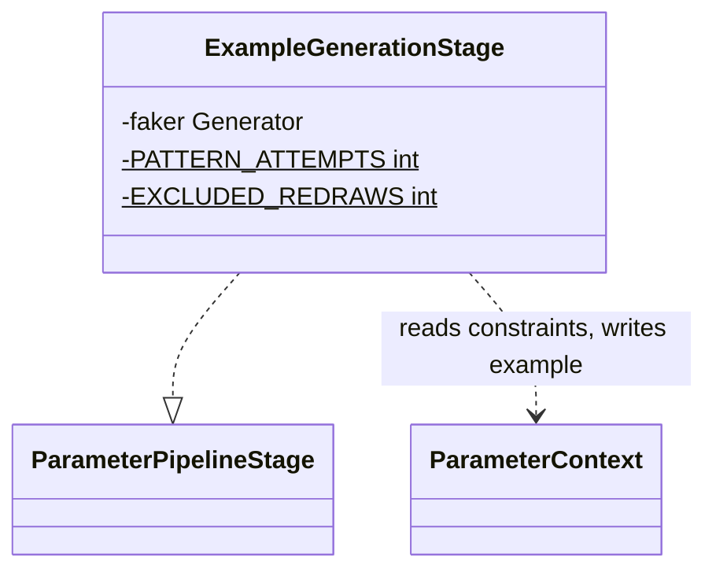

# Example Generation

Core canvas. Owns `Pipeline/Stages/ExampleGenerationStage.php`: the generated `example` of every parameter that has none.

Related canvases: parameter metadata pipeline (the stage contract, its last position in the default order, and the `ParameterContext` fields it reads: `type`, `enumInfo`, the allowed and excluded value sets, `numericString`, `format`, `exampleFormat`, `dateFormat`, `uriScheme`, `pattern`, `valuePatterns`, `valueRegexes` and `valueRules` through `matchesValueRules()`, the bounds and `exampleMultipleOf`); every family canvas whose attributes shape the example (identifiers for `uri` / `password` / `json` and for `IP`'s `exampleFormat`, dates and times for `dateFormat` and for `Date`'s `exampleFormat`, enumerated values for the value sets and patterns, size and bounds for the numeric bounds); public attributes (an explicit `#[Example]` is never replaced).

Split out of the parameter metadata pipeline canvas on 2026-09-26 (INDEX, size rule); Requirements, Approach, Operations and Safeguards moved verbatim, and Structure and Norms keep only what concerns this canvas; git history keeps the combined file.

## Requirements

- Generate a sample `example` when none was supplied, using Faker and any constraint fields already on the context, except for nested object shapes.
- A generated example passes the field's own rules wherever one value can, within the limits recorded under Operations.

## Entities

Collaborating types: `ParameterContext` (parameter metadata pipeline), Faker `Generator`, created by `Faker\Factory::create()` with no locale argument in `PipelineFactory`.

## Approach

Example generation is last so it can read constraints written earlier, but it does not regenerate when `example` is already non-null.

Dates are drawn from fifty years either side of today, so a pattern naming a future year can be met; the cost is plausibility, since about half of the examples lie in the future, which reads oddly for a field such as a birth date. A rule that bounds a date (`Before`, `After`) would need the draw narrowed to it.

## Structure

`Pipeline\Stages\ExampleGenerationStage`, `final`, constructor-injected `Faker\Generator`. It reads the context only; it calls no registry.

## Operations

### ExampleGenerationStage

- Responsibility: set `example` with Faker when still null, respecting type, enums, and some constraints.
- Constructor requires `Faker\Generator`.
- If `example !== null`, return immediately (does not distinguish “explicit example of null”).
- If type is `object` or `object[]`, return without an example.
- If `enumInfo` is set and type ends with `[]`: `enumInfo->toArray()`; empty → `[]`; else `itemsFrom(values, itemCount)`: `itemCount` is `max(minItems ?? 1, 1)` capped by `maxItems`, so `#[Min(5)]` gets five items; `itemsFrom` draws that many distinct values via `randomElements` when the list has enough, else that many with repeats, since Laravel's `enum` and `in` check each item alone.
- If `enumInfo` is set (non-array path): `randomElement` of values, or null if empty.
- Whatever branch drew it, an example that `excludedValues` rejects (its string form, `'1'` / `''` for a boolean as Laravel compares it, is listed; for an array, all of its items are, which an empty array vacuously is, as Laravel's `not_in` rejects `[]`) is redrawn, up to `EXCLUDED_REDRAWS` (20) times; after that the last draw is published, rejected or not. An explicit example is never redrawn.
- Else if `allowedValueList()` is not null: `itemsFrom` of it for an array type (count and repeats as for enum arrays), `randomElement` otherwise, so the example is a value `#[In]` accepts. When the field's pattern rules, format rules or bounds reject every `#[In]` value, `allowedValueList()` is null and generation falls through to the branches below, giving an example outside the set; no request can pass such a field anyway.
- Else if the base type is `boolean` and `acceptedAllowedValues()` holds `'0'` (so `allowedValueList()` was null: `#[In([0])]`, `#[In(['0'])]`), the example is `0` (`[0]` for `boolean[]`): `in:"0"` accepts the JSON integer `0`, and so does `boolean`, although a boolean schema cannot list it.
- If type ends with `[]`: `generateArrayExample` — base type is type with `[]` stripped; item count `itemCount` (as for enum arrays: the minimum, at least one, within `maxItems`), so `#[Min(5)]` or `#[Size(4)]` on a plain or custom-type array gets an example Laravel's item-count rule accepts; each item is word / numberBetween 1–100 / randomFloat 2dp 1–100 / boolean / null for unknown base types. Array item generation does not apply format, pattern, or numeric constraints, except those a custom type publishes under `items`: with a non-empty `itemSchema`, `itemExample` draws each item as a field of the base type carrying the item schema's constraints (its `pattern` the only value pattern; the array's own attribute rules, which Laravel applies to the array itself, are dropped for the item), so a `Money[]` entry with `pattern: ^[0-9]+$` and `minLength: 3` gets items such as `"4821"` (`CustomTypeStageTest` "draws the items of an array custom type from its published item schema…").
- Else match type: string → `generateStringExample`, or, when `numericString` is true, `generateNumericStringExample` (below), checked before the `match`; integer → integer number example; number → float number example; boolean → `faker->boolean()`; default → null example.
- A numeric-string example is generated by `generateNumericStringExample`, before `format` and `pattern` are considered, because the documented rule rejects any non-numeric value; the field's pattern rules still decide which draw is kept (`matchesValueRules()`, below). It honours both kinds of bound on the field, because Laravel compares the comparison bounds as numbers and `Min`/`Max`/`Between`/`Size` as length:
  - the numeric range is `numericRange` for integers (below); `maxLength` then caps the upper end below `10^maxLength` (the exponent capped at 18, to stay within an int), before any default is chosen; with no lower bound the range starts at `min(1, upper)`, with no upper bound it spans `max(99, 10 × divisor)` above the lower; `maxLength` finally floors the lower end above `-(10^(maxLength - 1))` (0 for one character);
  - when `minLength` is above 1, the range is first raised to `10^(minLength - 1)`, so the value has that many digits naturally; when the range cannot reach it, the value is left-padded with zeros after any sign (`"0007"`, `"-007"`), which Laravel still compares as the number;
  - a whole divisor (`wholeDivisor`: the least common multiple of `multipleOf` and an `exampleMultipleOf` that is a whole number, from `#[MultipleOf]` on a string field) keeps the example a whole multiple: the integer range above (lengths and bounds), whose default lower bound, with only an upper bound (declared or from `maxLength`) below the divisor, is 0 for an upper bound at or above 0 and 100 divisors below it otherwise, is searched for a multiplier between `ceil(lower/divisor)` and `floor(upper/divisor)`; when the range holds no multiple and the numeric bounds admit 0, the example is 0 (`#[MultipleOf(1000), Max(3)]` and `#[MultipleOf(150), Digits(2)]` get `"0"` and `"00"`, `#[MultipleOf(5), LessThan(3), Regex('/^\d+$/')]` `"0"`); the multiple is padded with leading zeros like any numeric string (`#[Digits(3), MultipleOf(3)] string` gets `"027"` or `"945"`, `#[MultipleOf(25), Max(2)]` `"25"`, `"50"` or `"75"`);
  - up to `PATTERN_ATTEMPTS / 2` (100) values are drawn, each written at its natural width (at least `minLength`) and then with more leading zeros, up to `maxLength` characters or three more zeros, and the first form `matchesValueRules()` accepts is used, so a digit rule, a `\d` regex or a prefix beside it passes without a length bound too (`#[MultipleOf(5), Regex('/^\d{3}$/')]` gets `"035"` or `"100"`, `#[MultipleOf(5), StartsWith('2')]` `"25"`); with no declared upper bound, the draws cycle through that range and ranges 10, 100 and 1000 times as wide (still within `maxLength`), so `^[1-9]\d{3}$` gets `"1005"`; with none accepted, the first form of the first draw;
  - when the integer range is empty, because no whole number lies between the bounds (`#[GreaterThan(0.5), LessThan(0.9)]`), or when the divisor is fractional (an `exampleMultipleOf` that is not whole), the example is `decimalNumericString`: up to `PATTERN_ATTEMPTS / 2` (100) draws of the float number example of the same bounds, with `maxLength` capping a copy of the context's range as for whole numbers (`generateNumberExample(context, false)`: the two-decimal grid, `offGridNumber`, or a multiple of the divisor), each tried as written and floored and ceiled at 2, 1 and 0 decimals, each form padded to `minLength` (`paddedForms`: a form with a point with trailing zeros; a whole one with leading zeros, then, two characters short or more, with a point and zeros; never a bare trailing point); the first form within the length bounds, the numeric bounds (`withinNumericBounds`), a multiple of every divisor (`isMultiple`) and accepted by `matchesValueRules()` is used, so `#[GreaterThan(0.5), LessThan(0.9), Min(6)]` gets `"0.7300"`, `Max(3)` gets `"0.6"` for `0.51`, whose floor `0.5` the exclusive bound rejects, `#[MultipleOf(0.7), Max(3)] string` a short multiple such as `"2.1"` or `"14"`, `#[MultipleOf(0.7), Max(1)]` `"7"` or `"0"`, and `#[Digits(3), MultipleOf(1.5)]` a whole multiple such as `"033"`; with none, the first form of the first draw is used; bounds that contradict each other give whatever that example gives, which no request can satisfy anyway.
- String examples use `format ?? exampleFormat` as their format. Only the `password` and `uri` examples read length bounds; the other format examples (`#[Email, Max(10)]`, `#[Uuid, Max(8)]`) ignore them. When `pattern` is set, or a declared regex publishes none (`valueRegexes` is not empty), together with that format or `dateFormat` (`generateFormatAndPatternExample(context, ?pattern)`), up to `PATTERN_ATTEMPTS` (200) examples are drawn as below, ignoring the pattern, each tried as drawn and in lower and upper case (Faker draws one case, a lower-case UUID, and a case rule beside the format may want the other), and the first one the field accepts is used: the pattern matches it, unless no pattern is published or it only approximates Laravel's rule (`patternIsApproximate()`, parameter metadata canvas: `#[Email, Lowercase]` accepts a lower-case email, which `^[a-z]+$` rejects), `matchesValueRules()` passes (every pattern rule, declared regex and format rule of the field, not only the last pattern written) and, on a date field (`dateFormat`, or `format ?? exampleFormat` of `date` or `date-time`), `isDateExample` passes; if none does, `overlaidExample` (below); failing that, the pattern example (`generatePatternExample`, below). Else, if `dateFormat` is set, `generateDateFormatExample(dateFormat, exampleFormat === 'date')` (below), before `format`, because the declared `date_format` rule rejects any other value. The match is `preg_match` with the pattern between `\x01` delimiters and the `u` modifier, so a published ECMA-262 pattern is read as JSON Schema reads it; a pattern PHP cannot compile matches nothing. The pattern wins because JSON Schema always asserts `pattern` but treats `format` as an annotation by default, so an example that fails the pattern fails schema validation everywhere; drawing and filtering keeps an accepted example valid for both, whatever the format. 200 draws make a one-in-fifteen combination such as `#[Email, StartsWith('a')]` near-certain to succeed, at negligible cost, and bound the work for a combination no value meets (`#[Email, Alpha]`). Otherwise, if `format` is email, url, uuid, ipv4, ipv6, date (`Y-m-d`), date-time (`DATE_ATOM`, `+00:00` offset, as RFC 3339 requires; `iso8601()` gives `+0000`), time (`H:i:s`), use the matching Faker helper, except that the `date` and `date-time` examples are drawn with `dateTimeBetween('-50 years', '+50 years', 'UTC')`, as `generateDateFormatExample` draws, so `#[Date, StartsWith('205')]` can be met; uri, json and password are generated as below; unknown format falls through to basic string. Else if `pattern` is set, or a declared regex publishes none (`valueRegexes` is not empty: a flag outside `DSXUru`, `\z`), `generatePatternExample` (below). Else basic string. A format and a pattern no draw or overlay can meet together fall back to the pattern's example, which the format's rule then rejects: `#[IP, StartsWith('fe80')]` draws only IPv4 addresses from `exampleFormat` `ipv4`, and gets `fe80`, which `ip` rejects; a date pattern no overlay turns into a date either (a time suffix on a `date` example, `#[Date, EndsWith('T00:00:00+00:00')]`) fails the date rule the same way.
- `overlaidExample(context, ?pattern, accepts)`, for every format: the sources are the pattern (unless `patternIsApproximate()`, which `accepts` does not require either, so `#[Url, EndsWith('.pdf'), Lowercase]` is not held to `^[a-z]+$`), every one of `valuePatterns` and the body of every declared regex (`regexBody`) that PHP compiles. Up to `PATTERN_ATTEMPTS` times, a new format example is drawn, and for each source it does not yet match, the source's draw (`drawFrom`) is laid over its start or its end (`overlays`: the piece replaces as many characters as its length, then one more, one fewer, two more and two fewer, in that order, so `10.` over `192.168.1.5` gives `10.168.1.5`; then everything up to or from each character that is not a letter or digit, so `@corp.com` over `gina42@example.com` gives `gina42@corp.com`); of the overlays that the source and every source already met match, one the whole field accepts wins, else the first, as a step towards the next source. The result is used when the field accepts it (`accepts`: the pattern, `matchesValueRules()`, and `isDateExample` on a date field, which reads back unchanged under `dateFormat` when that is set and passes `passesDateRule` when there is no `dateFormat` or `exampleFormat` is `date`). So a narrow prefix (`StartsWith('2031-05')`, `#[Date, StartsWith('1850')]`, outside the draw range), `#[Url, EndsWith('.pdf')]`, `#[IP, StartsWith('10.')]`, `#[Email, EndsWith('@corp.com')]`, `#[Email, StartsWith('a'), EndsWith('.com')]` and a regex that publishes no pattern (`#[Url, Regex('/\.pdf$/i')]`, `#[DateFormat('Y-m-d'), Regex('/^2031/i')]`) are met. It returns null when no attempt qualifies.
- `passesDateRule`: Laravel's `date` rule, `strtotime` reads the value and `date_parse` yields a valid calendar date (`checkdate`).
- `generatePatternExample`: the sources are the published `pattern`, every one of `valuePatterns` and the body of every `valueRegexes` regex (`regexBody`: delimiters and flags stripped, the PCRE-only anchors `\A`, `\z`, `\Z` removed, and, when the regex carries the `x` flag, its insignificant whitespace and `#` comments stripped too, since the reader has no x-mode of its own), kept only when PHP can compile them; a candidate must pass `matchesValueRules()` (every `valuePatterns` entry, every declared `valueRegexes` regex and every format `valueRules` entry, parameter metadata canvas), and the published `pattern` too when both pattern lists are empty. Up to `PATTERN_ATTEMPTS / 10` (20) rounds, each source is drawn with `drawFrom`, a small PCRE reader of the stage's own, since Faker's `regexify` writes `{4,}`, lookarounds and nested groups out as text: alternation, capturing, named, non-capturing and atomic groups, `?`, `*` (0–5), `+` (1–6), `{n}`, `{n,m}`, `{,m}` and `{n,}` (up to `n + 5`), lazy and possessive suffixes; a class (negated and POSIX ones included), an escape class (`\d`, `\W`, `\s`, `\h`, `\p{L}`, `\P{L}`) or a dot is drawn from the printable ASCII, Latin, Greek and Cyrillic characters it matches (`membersOf`, cached per class), its ASCII letters and digits when it has any, else its ASCII symbols, else its other characters, else a space or a tab, so `[^\w]+` gets symbols and `[^a-z]` capitals or digits; `\xHH`, `\x{…}`, `\t`, `\n` and escaped characters are literal; a backreference repeats its group; anchors, `\b`, `\B`, `\A`, `\z`, `\Z`, `\G`, lookarounds, inline flags (`(?i)`) and comments draw nothing, and the rules decide whether a draw meets a lookaround; a construct it does not know (`\k`, a conditional) gives no draw, and the source is skipped; each draw also gets a lower-case and an upper-case copy, since a regex declared with `i`, or a case rule beside a mixed-case pattern (`#[Ulid, Uppercase]`), wants a case the draw does not know; the draws are combined (`combinedDraws`: each draw, then every two draws joined in either order and, when the first is no longer, laid over the start or the end of the second), each combination is fitted to the length bounds (`fittedToLength`: padded to `minLength` by repeating its last character, its first, or the character before its middle in the middle, which keeps both a prefix and a suffix; cut to `maxLength` from the end, or from the start; left as is when `minLength` exceeds `maxLength`, and dropped when empty but too short), and a candidate must pass the checks (not empty, since Laravel skips a non-required rule for an empty value, so `#[Regex('/^[a-z]*$/')]` and `#[Email, Lowercase]` never get `""`; no edge space, which Laravel's `TrimStrings` middleware would strip; `matchesValueRules()`; then `matchesAll` for the published pattern when both pattern lists are empty). The first candidate the published pattern also matches is used, which keeps the document consistent with itself; with none, the first candidate that passed the checks, so the example fails the published pattern only when no value Laravel accepts meets it (`#[Lowercase, Digits(3)]`). So `#[StartsWith('img_'), EndsWith('.png')]` gets `img_.png`, `#[StartsWith('ab'), EndsWith('yz'), Min(10)]` `abbbbbbbyz`, `#[StartsWith('ab'), Regex('/^[a-z]{4}$/')]` a four-letter word starting with `ab`, and `#[Regex('/^[A-Z][a-z]+\s[A-Z][a-z]+$/')]` two capitalised words. So `#[Min(15), Uppercase]` gets fifteen capitals, `#[Min(12), EndsWith('.pdf')]` a value padded before `.pdf`, and `#[StartsWith('09'), Digits(11)]` eleven digits starting with `09`. The checks are Laravel's patterns, not the published approximation, so `#[Lowercase, Digits(3)]` gets `007`. So `#[Regex('/^[A-Z]{2}\d{4}$/i')]`, `#[Regex('/^\d{5}\z/')]` and `#[Regex('/^[a-z]+$/i'), Min(20)]`, which publish no pattern, get examples their regex accepts. So `/^\p{Lu}[0-9]{2}$/u`, `/^\p{L}+$/u`, a named group and a negated class get examples their regex accepts. So `#[Regex('/^\d{4,}$/')]`, `/^(?=.*[A-Z])(?=.*\d)[A-Za-z\d]{8,}$/`, `/^(?!admin)[a-z]{3,8}$/`, `/(?i)^abc$/`, `/^((ab)|c)d$/`, `/^\x41{2}$/`, `/^\P{L}{3}$/u`, `[^\w]+`, `[^[:alnum:]]+` and `[^a-zA-Z0-9]{3}` get examples their regex accepts. If no candidate passes at all, a plain draw of the published pattern, then a basic string, is used when it passes the checks and the published pattern; else the draw when the published pattern matches it, else the basic string, so an example fails its own published pattern only when the reader cannot draw from it.
- `generateDateFormatExample(format, passesDate)`: a Faker `dateTimeBetween('-50 years', '+50 years')` in UTC, so a pattern such as `StartsWith('205')` can be met by some draw, formatted with `dateFormat`, redrawn up to 50 times until it reads back unchanged the way Laravel's `date_format` rule reads it (`DateTime::createFromFormat('!' . format, value, UTC)` succeeds and formats back to the value) and, when `passesDate` is set (a `#[Date]` beside the `DateFormat`), also passes `passesDateRule`, since `date` reads `d/m/Y` as month first and rejects a day above 12 there; after 50 draws the last one is returned. The redraw covers a format satisfiable on most dates but not all, such as `d/m` on 29 February, which is read in 1970.
- `uri` (`generateUriExample`): `uriScheme ?? 'https'` + `://` + Faker `safeEmailDomain()` (`example.com`, `example.org` or `example.net`) + `/`, then Faker `slug(2)` unless `maxLength` is set, in which case the path is dropped, giving the shortest URL on those hosts; a URL shorter than `minLength` has its path padded with random letters up to it. The default scheme is `https` so the example also passes `url:https`, and the host is a reserved domain that resolves, so it passes `active_url` (identifiers family). Because the stage builds it, a `uri` example goes through the pattern filter and the `excludedValues` redraw like any other example. A `maxLength` below the shortest URL (about 20 characters) cannot be met.
- `json`: `json_encode` of a one-entry object (Faker word key to Faker word value) or of a one-word array, at random, so it passes Laravel's `json` rule and a prefix such as `[` (`#[Json, StartsWith('[')]`) can be met.
- `password` (`generatePasswordExample`): length drawn between `max(minLength ?? 1, 12)` and `max(that, 20)`, with the upper end cut to `maxLength` and the lower end to the upper; it always holds one lowercase letter, one uppercase letter, one digit and one symbol from `!#$%&*+-=?@^_`, the rest Faker `asciify('*')`, shuffled. It therefore meets every character-class rule of Laravel's `Password` rule and the length bounds the `Password` processor publishes. Below four characters the required characters are cut.
- Basic string: `minLength` default 1; if maxLength is set and minLength > maxLength, minLength is lowered to maxLength. If maxLength is set and ≤ 10, `lexify` of `?` repeated `min(maxLength, max(minLength, 3))`. If minLength > 10, `faker->text(minLength + 50)`, padded with random letters up to `minLength` when Faker returns less (it often does for long lengths), then `substr` to `max(minLength, min(strlen, maxLength ?? minLength))`, and a leading or trailing whitespace character is replaced by a random letter, because Laravel's default `TrimStrings` middleware trims input before validation, so an edge space would cost a character. Else `faker->word()`, padded with random letters up to `minLength` when shorter, and cut to `maxLength` when longer, so the word meets both bounds.
- `numericRange(context, integer)` returns the strictest lower and upper bound over the four numeric bound fields. For an integer example an inclusive bound `x` becomes `ceil(x)` (lower) or `floor(x)` (upper), and an exclusive one `floor(x) + 1` or `ceil(x) - 1`. For a float example a bound is moved onto the two-decimal grid the example is drawn from: an exclusive lower bound becomes `(floor(x·100) + 1) / 100`, an exclusive upper one `(ceil(x·100) − 1) / 100`, the nearest two-decimal value inside it, and an inclusive one is rounded inwards (`ceil` for the lower, `floor` for the upper), so a range as narrow as `(0.5, 0.55)` still yields `0.51`–`0.54`, `(0.555, 0.565)` yields `0.56`, and a two-decimal `randomFloat` cannot round out of it. For an integer example a bound beyond the int range is clamped to `PHP_INT_MIN` / `PHP_INT_MAX` before conversion, so a published `1e20` cannot overflow the cast. It is the only place example generation reads a numeric bound.
- Number examples: the range comes from `numericRange`. With no lower bound, min is 1 when the upper bound is missing; with an upper bound and a divisor (`multipleOf` or `exampleMultipleOf`), which needs room for a multiple, min is 0 for an upper bound above 0 and the upper bound minus the room for one at or below 0 (`#[MultipleOf(0.25), LessThan(0)]` gets `-0.25`, not `-0.01`; `#[MultipleOf(0.3), LessThan(1.1)]` gets `0.9` or below; `#[MultipleOf(5), LessThan(3)] int` gets `0` or a negative multiple; `#[MultipleOf(250), LessThan(0)] int` a multiple down to `-2500`); otherwise min is 1 for an upper bound of at least 1 and the upper bound itself below 1, so a bound below 1 is not widened away; with no upper bound, the max is min plus the room with a divisor and 100 (100.0) without. The room is `max(100, 10 × divisor)`, the larger divisor's absolute value, so a divisor beyond 1–100 still has multiples in range (`#[MultipleOf(250.5)] float`, `#[MultipleOf(-500)] int`, `#[Min(1), MultipleOf(500)] int` get a multiple, not a plain draw or `0`). For a float example with no `multipleOf` whose grid range is empty (min > max) although the published range is not, `offGridNumber` returns a value inside the published bounds: their midpoint, or the one value an inclusive range of width zero allows (`(0.001, 0.009)` gives `0.005`, `[0.005, 0.009]` gives `0.007`); it returns null when no value satisfies them, and generation continues. If min > max, max becomes min plus the room (100 without a divisor), capped at `PHP_INT_MAX` for an integer example so a lower bound beyond the int range gives `PHP_INT_MAX` instead of wrapping. If both `multipleOf` and `exampleMultipleOf` are set (a digit count on a `float` beside `MultipleOf(1.5)`), `multipleBetween(min, max, exampleMultipleOf, true, multipleOf)` picks a multiple of the divisor that is also a whole multiple of `multipleOf`; when it finds none, the next step follows. If `multipleOf` is set, pick an integer multiplier between `ceil(min/multipleOf)` and `floor(max/multipleOf)`, each clamped to the int range, then multiply; when the product would leave the int range (`abs(multiplier) > intdiv(PHP_INT_MAX, multipleOf)`), the example is `PHP_INT_MAX` or `PHP_INT_MIN` on an integer field and the float product on a number field, never a wrapped int; otherwise the result is an int for a `number` field too, because a float of fifteen digits or more is written in exponent form, which `digits` rejects, and a JSON integer is a valid `number`. If the ceil/floor range is empty, which only declared bounds with no multiple between them leave, the multiplier is `ceil(min/multipleOf)`, not Faker's swapped range; no value passes such a field. Else, if `exampleMultipleOf` is set, `multipleBetween(min, max, divisor, integer, wholeMultiple = 1)` picks a multiple within the range: the step is the divisor, or on an integer field (or with `wholeMultiple`) its smallest whole multiple that `wholeMultiple` divides (the divisor times the first factor up to 1000 that gives such a number; none, and the helper returns null); the multiplier lies between `ceil(min/step)` and `floor(max/step)`, each rounded to six decimals first and clamped to the int range; the value is rounded to the divisor's decimals, because Laravel's `multiple_of` takes an exact decimal remainder, so `#[MultipleOf(0.1)]` gets `0.3`, never `0.30000000000000004`, and a whole result is an int. It returns null when no multiple lies in the range, and the draws below follow. Integers without multipleOf: `numberBetween(min, max)`, the int bounds as they are, since `ceil` of `PHP_INT_MAX` would return a float that an int cast wraps. Floats: if both maximum and exclusiveMaximum are null, `randomFloat(2, min, min+100)` even when exclusiveMinimum-derived min was used; otherwise `randomFloat(2, min, max)`.

## Norms

- Method docblocks record the external facts a reader cannot recover from the code (how Laravel or JSON Schema reads a value): the NotIn rejection rule, the password, uri, format-plus-pattern and pattern examples, the date draw range and the `Date` beside a `DateFormat`, `passesDateRule`, `overlaidExample`, `overlays`, `drawFrom` and its class helpers (`oneOf`, `membersOf`, the class cache), `combinedDraws`, the numeric-string helpers (`wholeDivisor`, `decimalNumericString` and `paddedForms` among them), `itemCount` and `itemsFrom`, `offGridNumber`, `multipleBetween`, `regexBody` and `clampToInt`. Inline comments state the decimal numeric-string case, the int example for a whole-number `number`, the product beyond the int range, the boolean `0` example, Faker's short `text()`, the `TrimStrings` edge space in the long-text and pattern branches, the case copies of pattern draws and of format draws, the approximate pattern in the format branch, the empty-or-trimmed candidate and the preferred candidate the published pattern matches, the whole divisor on a numeric string and its zero, the length cap before the default range, the leading-zero forms, the default lower bound with a divisor, the declared bounds with no multiple, the two divisors on one field, the middle padding, the approximate pattern left out of the overlay sources, the preferred overlay, the pattern-example fallback, and the comment, inline flag and lookaround groups of the reader. No other comments.
- Tests: `tests/Unit/Pipeline/Stages/ExampleGenerationStageTest.php`; the families' integration tests validate generated examples against their fixtures' own rules.

## Safeguards

- ExampleGenerationStage does not overwrite a non-null `example`.
- ExampleGenerationStage does not invent examples for `object` and `object[]`.
- A generated example of an `In`/`NotIn` field passes those rules. `ExampleGenerationStageTest` pins the draw from the allowed set and the redraw of an excluded value; `InTest` and `NotInTest` (enumerated values family) validate the examples against the fixture's own rules over repeated runs.
- A generated `Url` example meets the field's other rules too: the stage builds it from `uriScheme`, so a pattern, a `NotIn` and a length bound, minimum or maximum, apply to it. `ExampleGenerationStageTest` pins the scheme and the dropped path; `IdentifiersTest` validates `Url` combined with `StartsWith`, `Max` and `NotIn`, and `#[Url, Min(40)]`. A `DateFormat` or `Date` field with a pattern some date in the ±50-year range meets gets a date example that matches it, a narrow prefix through the overlay (a pattern no date in that range meets falls back to the pattern's example, Operations); `DatesTimesTest` validates `#[DateFormat('Y-m-d'), StartsWith('20')]` (`with_pattern`), `#[DateFormat('Y-m-d'), StartsWith('205')]` (`future_pattern`), `#[Date, StartsWith('205')]` (`any_date_future`), `StartsWith('2031')` and `StartsWith('2031-05')` on a `DateFormat('Y-m-d')` (`narrow_year`, `narrow_month`) and on a `Date` (`any_date_narrow`), `#[Date, DateFormat('d/m/Y')]` (`day_first_date`), which must pass both rules, `#[DateFormat('Y-m-d'), StartsWith('20'), EndsWith('-01')]` (`two_patterns`) and `#[Date, StartsWith('1850')]` (`far_past_prefix`).
- A generated example of a `DateFormat` field passes the declared `date_format` rule. `ExampleGenerationStageTest` pins that `dateFormat` takes precedence over `format` and that a date-time example ends with a `+00:00`-style offset; `DatesTimesTest` (dates and times canvas) validates the examples against the fixture Data class's own rules over repeated runs.
- An attribute with no exact OpenAPI format gets an example from `exampleFormat` that passes its rule: `IdentifiersTest` validates the `ip` row and `DatesTimesTest` the `any_date` row against the fixture Data class's own rules.
- A generated number or numeric-string example meets a fractional bound, including a range holding one two-decimal value or none. `ComparisonBoundsRuntimeTest` validates the examples of integer, number and numeric-string properties with fractional `GreaterThan`, `LessThan`, `GreaterThanOrEqualTo`, `LessThanOrEqualTo`, `Min` and `Max` against the fixture Data class's own rules, and those of the narrow float ranges `(0.5, 0.55)`, `(0.555, 0.565)`, `[0.005, 0.009]` and `(0.001, 0.009)`. A whole-number `number` example with a digit count passes `digits`: `DigitCountTest` validates `Digits(15)`, `Digits(18)` and `Digits(19)` on a `float`, as the PHP value and after a JSON round trip. `ExampleGenerationStageTest` pins that a numeric-string example is a numeric string within the bounds; `ComparisonBoundsRuntimeTest` validates the generated example against the fixture Data class's own rules for each literal comparison on a string field, alone and combined with `Min`, `Max`, `Between` or `Size` in both declaration orders, including combinations that need zero-padding, and for string ranges holding no whole number (`(0.5, 0.9)`, `[0.005, 0.009]`), alone and with `Min(6)` or `Max(3)` (`fraction_code_min`, `fraction_code_max`).
- A generated `uri`, `json` or `password` example passes Laravel's `url`, `active_url`, `json` and `Password` rules. `ExampleGenerationStageTest` pins the shapes (an `https` URL on an `example.*` host, a JSON string, a password holding all four character classes within `minLength` / `maxLength`); `IdentifiersTest` (identifiers family) validates them against a Data class's own rules over repeated runs, `active_url` with `Validator::fakeDnsLookups()`.
- A long basic string example meets its minimum length even once trimmed: `SizeBoundsTightenTest` validates `#[Min(40)]`, `#[Min(200)]`, `#[Min(200), Max(210)]` and `#[Min(15), Max(15)]` (`long_exact`) after `trim()`, as `TrimStrings` would send them.
- An integer example beyond the int range does not wrap: `ExampleGenerationStageTest` pins `PHP_INT_MAX` for a lower bound of `1e19` and a positive, unwrapped `multipleOf` example beyond it (no JSON number satisfies such a field exactly).
- A string example with a pattern meets the length bounds and every pattern rule of the field. `ExampleGenerationStageTest` pins that a pattern example meets `minLength` and `maxLength`; `EnumeratedTextPatternsTest` validates repeated examples of `#[Min(15), Uppercase]`, `#[Size(12), AlphaNumeric]`, `#[Min(20), StartsWith('abc')]`, `#[Min(12), EndsWith('.pdf')]`, `#[Min(20), Alpha]`, `#[Max(3), Alpha]`, `#[StartsWith('09'), Digits(11)]`, `#[Lowercase, Digits(3)]`, `#[StartsWith('img_'), EndsWith('.png')]`, `#[StartsWith('ab'), EndsWith('yz'), Min(10)]`, `#[Regex('/^[A-Z][a-z]+\s[A-Z][a-z]+$/')]`, `#[StartsWith('ab'), Regex('/^[a-z]{4}$/')]`, and the regexes that publish no pattern `#[Regex('/^[A-Z]{2}\d{4}$/i')]`, `#[Regex('/^\d{5}\z/')]` and `#[Regex('/^[a-z]+$/i'), Min(20)]` against the Data class's own rules; "gives a padded pattern example no edge space…" pins `#[Regex('/^[a-z ]+$/'), Min(20)]`. It also validates patterns Faker cannot expand as written (`/^\p{Lu}[0-9]{2}$/u`, `/^\p{L}+$/u`, a named group, a negated class), an optional pattern that must not yield an empty example (`/^[a-z]*$/`), `#[Json, StartsWith('[')]` and `#[Ulid, Uppercase]`. `ExampleGenerationRound7Test` validates, against the rules, after a JSON round trip and against the published pattern, open-ended counts (`/^\d{4,}$/`, `/^[a-z]{3,}$/`, `/^(ab){2,}$/`, with `Max(5)`, beside `StartsWith('ab')`, with `i`), lookaheads, a negative lookahead, `(?i)`, escaped brackets, `\W`, a nested group, `\x41`, `\P{L}` and the negated classes `[^\w]`, `[^[:alnum:]]`, `[^a-zA-Z0-9]`, `[^a-z]`, `[^0-9 ]` and `[^"'<>]`.
- A generated number example is a multiple of a divisor `multipleOf` cannot publish, where the range holds one: `SizeBoundsTightenTest` validates `MultipleOf(0.1)`, `MultipleOf(0.25)`, `MultipleOf(-0.2)` and `MultipleOf(0.3)` with `Between(1, 2)` on a `float`, and `MultipleOf(0.5)` and `MultipleOf(-3)` on an `int`, as the PHP value and after a JSON round trip, and with only an upper bound below 1 (`#[MultipleOf(0.25), LessThan(0)]`, `#[MultipleOf(-3), LessThan(0)]`, and the published `#[MultipleOf(3), LessThan(0)]`). `DigitCountTest` validates `Digits(3)` with `MultipleOf(1.5)`, `MultipleOf(2.5)` and `MultipleOf(-3)` on a `float`, in either declaration order. `SizeBoundsTightenTest` also validates an upper bound below the divisor (`#[MultipleOf(0.3), LessThan(1.1)]`, `#[MultipleOf(2.5), LessThan(2)]`, `#[MultipleOf(-3), LessThan(2)] int`, and the published `#[MultipleOf(5), LessThan(3)] int` and `#[MultipleOf(5), Max(3)] float`) and numeric strings with a divisor beside a digit rule, a `\d` regex or a `Max` (`#[Digits(3), MultipleOf(3)]`, `#[MultipleOf(5), Digits(4)]`, `#[MultipleOf(3), Regex('/^\d+$/'), Min(3)]`, `#[MultipleOf(0.7), Max(3)]`, `#[MultipleOf(3), Max(1)]`, `#[MultipleOf(25), Max(2)]`). `ExampleGenerationRound7Test` validates, also against the published pattern, divisors larger than the default range (`#[MultipleOf(250.5)] float`, `#[MultipleOf(-500)] int`, `#[Min(1), MultipleOf(500)] int`, `#[MultipleOf(250), LessThan(0)] int`, `#[MultipleOf(150), GreaterThan(0)] float`), numeric strings whose only multiple is 0 (`#[MultipleOf(1000), Max(3)]`, `#[MultipleOf(10), Size(1)]`, `#[MultipleOf(150), Digits(2)]`, `#[MultipleOf(5), LessThan(3), Regex('/^\d+$/')]`, `#[Digits(3), MultipleOf(5), LessThan(3)]`), numeric strings beside a pattern with no length bound (`#[MultipleOf(5), Regex('/^\d{3}$/')]`, `Regex('/^[1-9]\d{3}$/')`, `StartsWith('2')`, `EndsWith('0')`), fractional divisors beside a digit rule or a `\d` regex (`#[Digits(3), MultipleOf(1.5)]`, `#[MultipleOf(0.5), Digits(4)]`, `#[DigitsBetween(2, 4), MultipleOf(2.5)]`, `#[MultipleOf(0.5), Regex('/^\d+$/')]`) and with a one-character length (`#[MultipleOf(0.7), Max(1)]`, `(0.3)`, `(0.1)`, `#[MultipleOf(0.5), Size(1)]`).
- A boolean field whose `#[In]` accepts only `0` gets the example `0`: `InTest` validates `#[In([0])]` and `#[In(['0'])]` on a `bool` against the fixture's own rules.
- A string example with both a `format` and a `pattern` matches every pattern rule and keeps the format where a drawn or overlaid format example does. `ExampleGenerationStageTest` pins that a format example that matches is kept and that the pattern is met when no drawn example matches it. `EnumeratedTextPatternsTest` validates the examples against the fixture Data class's own rules, including `#[Url, EndsWith('.pdf')]`, `#[Url, EndsWith('.com')]`, `#[IP, StartsWith('10.')]`, `#[Email, StartsWith('a'), EndsWith('.com')]` and `#[Uuid, StartsWith('a'), EndsWith('f')]`. It also validates a format beside an approximate pattern (`#[Email, Lowercase]`, `#[Url, Lowercase]`, `#[Uuid, Uppercase]`) and beside a regex that publishes no pattern (`#[Url, Regex('/\.pdf$/i')]`, `#[Email, Regex('/^a/i')]`, `#[Uuid, Regex('/^a/i')]`); `DatesTimesTest` validates `#[DateFormat('Y-m-d'), Regex('/^2031/i')]`. `ExampleGenerationRound7Test` validates an email domain suffix (`#[Email, EndsWith('@corp.com')]`, `#[Email, Regex('/@corp\.com$/')]` and its `i` form) and a format with a prefix or suffix beside an approximate pattern (`#[Url, EndsWith('.pdf'), Lowercase]`, `#[Url, Lowercase, Regex('/\.pdf$/i')]`, `#[IP, StartsWith('10.'), Lowercase]`, `#[Uuid, StartsWith('A'), Uppercase]`), asserting that every build publishes the same pattern.
- Faker is created once per `createDefault` call and reused across properties if the same pipeline instance is reused.
- Pattern draws come from `drawFrom`'s own reader, not Faker's `regexify`, and only shape a candidate; an example never carries a construct written out as text (`'9{4,}'`). The format-and-pattern branch and `generatePatternExample` compile patterns with `preg_match` and suppress the warning; a pattern that does not compile is neither drawn from nor checked, and a pattern the reader cannot read gives no draw and is skipped as a source.
- An array example has as many items as its `minItems` asks for, within `maxItems`: `ExampleGenerationRound7Test` validates `#[Min(5)]`, `#[Size(4)]`, `#[Min(4), Max(6)]` and `#[Size(5)]` on `string[]`, `int[]`, `float[]`, `bool[]`, an enum array, an `#[In]` array and array custom types against the fixture's own rules.
