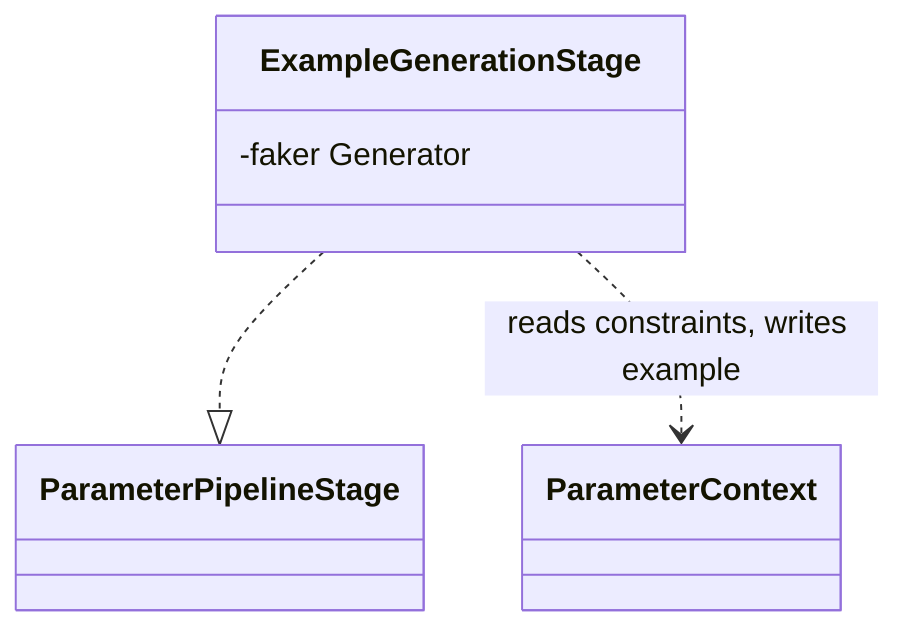

# Example Generation

Core canvas. Owns `Pipeline/Stages/ExampleGenerationStage.php`: the generated `example` of every parameter that has none.

Related canvases: parameter metadata pipeline (the stage contract, its last position in the default order, and the `ParameterContext` fields it reads: `type`, `enumInfo`, `format`, `pattern`, the length and item-count bounds, the numeric bounds and `multipleOf`); every family canvas whose attributes write those fields (identifiers for the formats and `Ulid`'s pattern, dates and times for `DateFormat`'s and `Date`'s formats, enumerated values and text patterns for `pattern`, size and bounds for the bounds, arrays and type assertions for the digit counts); custom type extension and parameter metadata pipeline (a configured custom type writes the same fields); public attributes (an explicit `#[Example]` is never replaced).

Codified from the v0.4.0 code with `/spdd-reverse`.

## Requirements

- Generate a sample `example` when none was supplied, using Faker and any constraint fields already on the context, except for nested object shapes.

## Entities

Collaborating types: `ParameterContext` (parameter metadata pipeline), Faker `Generator`, created by `Faker\Factory::create()` with no locale argument in `PipelineFactory`.

What the fields the stage reads hold when it runs:

- `type`: the documentation type from `TypeStage` or `CustomTypeStage`: `string`, `integer`, `number`, `boolean`, `object`, a `[]` variant of one of them, `[]`, or a raw PHP type name.
- `enumInfo`: set by `TypeStage` for an enum or enum-array property; `toArray()` gives the backing values of a backed enum and the case names of a pure one.
- `format`: an OpenAPI-style format from a static registry row (`email`, `uri` for `Url` and `ActiveUrl`, `uuid`, `password`, `ipv4`, `ipv6`, `date` for `Date`, `json`), from `DateFormatProcessor` (`date-time`, `time`, or `date` for any other format string), or from a custom type's config.
- `pattern`: the last pattern written: a `Regex` attribute's regex as declared, delimiters and flags included; `^(…)` from `StartsWith` or `(…)$` from `EndsWith`; a static row's pattern (`Ulid`, `Alpha`, `AlphaDash`, `AlphaNumeric`, `Lowercase`, `Uppercase`); or a custom type's config.
- `minLength` / `maxLength`: `Min`, `Max`, `Between` and `Size` on a `string`; `minItems` / `maxItems`: the same attributes on a `[]` type.
- `minimum` / `maximum`: `Min`, `Max`, `Between` and `Size` on an `integer` or `number`, `GreaterThanOrEqualTo` and `LessThanOrEqualTo` with a numeric operand, and `Digits` / `DigitsBetween`, which write the smallest and largest number with that many digits; `exclusiveMinimum` / `exclusiveMaximum`: `GreaterThan` and `LessThan` with a numeric operand.
- `multipleOf`: `MultipleOf`.
- Every bound, `multipleOf` included, is an `?int` on the context; a custom type's config can write any of them.
- `example`: non-null only when an earlier stage set it, such as `ExampleProcessor` from `#[Example]`.

## Approach

Example generation is last so it can read constraints written earlier, but it does not regenerate when `example` is already non-null.

Known divergences (codified as-is, not proposed fixes):

- The `format` values `uri` and `json`, which the registry writes for `Url`, `ActiveUrl` and `Json`, have no branch, so those fields get a basic string; the `url` branch is reached only by a custom type configured with `format: url`.
- A `Digits` or `DigitsBetween` bound is read as a numeric range, so a `string` field carrying one gets a word, not digits.

## Structure

`Pipeline\Stages\ExampleGenerationStage`, `final`, constructor-injected `Faker\Generator`. It reads the context only; it calls no registry.

## Operations

### ExampleGenerationStage

- Responsibility: set `example` with Faker when still null, respecting type, enums, and some constraints.
- Constructor requires `Faker\Generator`.
- If `example !== null`, return immediately (does not distinguish “explicit example of null”).
- If type is `object` or `object[]`, return without an example.
- If `enumInfo` is set and type ends with `[]`: `enumInfo->toArray()`; empty → `[]`; else pick `itemCount` unique elements via `randomElements`. `itemCount` is `min(max(minItems ?? 1, 1), min(maxItems ?? 3, count(values)))`.
- If `enumInfo` is set (non-array path): `randomElement` of values, or null if empty.
- If type ends with `[]`: `generateArrayExample` — base type is type with `[]` stripped; item count `min(max(minItems ?? 1, 1), min(maxItems ?? 3, 3))`; each item is word / numberBetween 1–100 / randomFloat 2dp 1–100 / boolean / null for unknown base types. Array item generation does not apply format, pattern, or numeric constraints.
- Else match type: string → `generateStringExample`; integer → integer number example; number → float number example; boolean → `faker->boolean()`; default → null example.
- String examples: if `format` is email, url, uuid, ipv4, ipv6, date (`Y-m-d`), date-time (`iso8601`), time (`H:i:s`), password (12–20), use the matching Faker helper; unknown format falls through to basic string. Else if `pattern` is set, `faker->regexify(pattern)`. Else basic string.
- Basic string: `minLength` default 1; if maxLength is set and minLength > maxLength, minLength is lowered to maxLength. If maxLength is set and ≤ 10, `lexify` of `?` repeated `min(maxLength, max(minLength, 3))`. If minLength > 10, `faker->text(minLength + 50)` then `substr` to `max(minLength, min(strlen, maxLength ?? minLength))`. Else `faker->word()` (word length is not forced to min/max except via the branches above).
- Number examples: start min from `minimum ?? exclusiveMinimum`, max from `maximum ?? exclusiveMaximum`. If exclusiveMinimum set, integer min becomes exclusiveMinimum+1, float min exclusiveMinimum+0.1. Exclusive max analogously −1 / −0.1. Integer defaults min 1 max 100; float defaults 1.0–100.0. If min > max, max becomes min+100. If `multipleOf` is set, pick an integer multiplier between `ceil(min/multipleOf)` and `floor(max/multipleOf)` then multiply (integer-cast result when `$integer` is true). If the ceil/floor range is invalid, Faker `numberBetween` behavior is whatever Faker does (not guarded). Integers without multipleOf: `numberBetween(ceil(min), floor(max))`. Floats: if both maximum and exclusiveMaximum are null, `randomFloat(2, min, min+100)` even when exclusiveMinimum-derived min was used; otherwise `randomFloat(2, min, max)`.

## Norms

- No comments, following the pipeline's comment-free style (parameter metadata pipeline canvas, Norms).
- Tests: `tests/Unit/Pipeline/Stages/ExampleGenerationStageTest.php`; `tests/Integration/ExampleGenerationIntegrationTest.php` runs the default pipeline, including an explicit `#[Example]` and constraint-aware examples.

## Safeguards

- ExampleGenerationStage does not overwrite a non-null `example`.
- ExampleGenerationStage does not invent examples for `object` and `object[]`.
- Faker is created once per `createDefault` call and reused across properties if the same pipeline instance is reused.
- Faker `regexify` receives `pattern` as stored, unsanitised.
