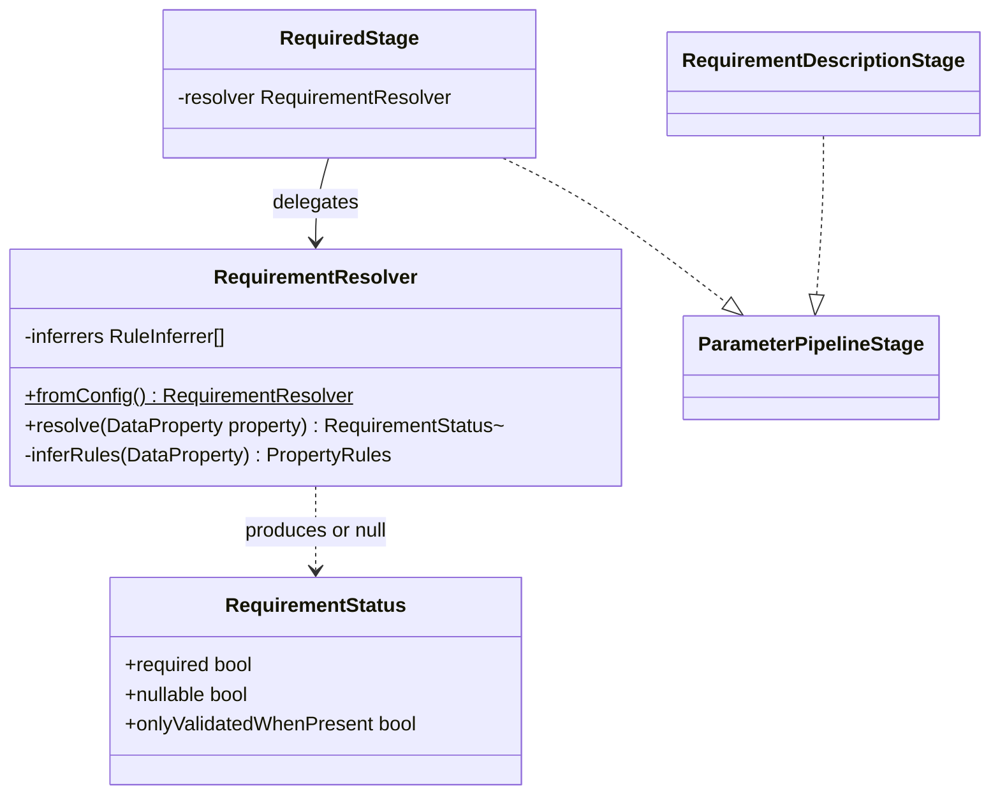

# Requirement Resolution

Core canvas. Owns `Pipeline/Stages/RequiredStage.php`, `Pipeline/Stages/RequirementDescriptionStage.php` and `Pipeline/Support/**` (`RequirementResolver`, `RequirementStatus`): the requirement seam, the only place the package reads Spatie's validation internals.

Related canvases: parameter metadata pipeline (the stage contract, the factory that builds `RequiredStage` with `RequirementResolver::fromConfig()` and fixes its position, and the `ParameterContext` fields this canvas writes); attribute processing framework (the registry must not hold processors for `Required`, `Nullable` or `Sometimes` — `RequiredStage` owns those).

Codified from the v0.4.0 code with `/spdd-reverse`.

## Requirements

- Decide required vs optional by reconciling the declared type with any requirement attribute, inheriting Spatie's own precedence rather than restating it, so published docs cannot contradict runtime validation.
- State in prose that a property is only validated when included, a fact the required/optional flag cannot carry.

Boundaries: `RequiredStage`, `RequirementDescriptionStage`, `RequirementResolver` and `RequirementStatus`. The stage contract, the context and the stage order are the parameter metadata pipeline canvas's.

## Entities

Collaborating types used here but not owned by this canvas:

- `ParameterContext` (parameter metadata pipeline): `RequiredStage` writes `required`, `nullable` and `onlyValidatedWhenPresent`; `RequirementDescriptionStage` reads `onlyValidatedWhenPresent` and appends to `description`.
- `DataProperty` (Spatie): the resolver reads `hasDefaultValue`, and the fallback `type` (`isNullable`, `isOptional`) and `hasDefaultValue`.
- `DataConfig` (Spatie): read only for `ruleInferrers`, the already-instantiated list built from `data.rule_inferrers`.
- `RuleInferrer` (Spatie): the five shipped inferrers reconcile type-derived and attribute-derived requirement rules. All accept a `ValidationContext` and none read it, which is what allows them to run at documentation time.
- `PropertyRules` (Spatie): mutable rule collection; only `hasType()` is used.
- `RequiringRule` (Spatie marker interface), `Nullable` and `Sometimes` rules: the three membership checks requirement status is read from.
- `ValidationContext` / `ValidationPath` (Spatie): constructed with null payloads purely to satisfy the inferrer signature.

## Approach

Requirement status is reconciled, not recomputed. Three decisions are recorded here because they are not derivable from the code:

- Precedence between a declared type and a requirement attribute is **inherited** from Spatie's configured rule inferrers, never reimplemented. The package runs them itself rather than calling `DataValidationRulesResolver`, which needs a full request payload and, given an empty one, silently omits every property that has a default value.
- A property carrying both a default value and `#[Required]` is published as **optional**. Rule inference does emit a requiring rule for it, but omitting the field produces no error because the default applies, so optional matches observable API behaviour. `RequirementResolver` applies this by subtracting `hasDefaultValue` from the requiring-rule result.
- A property carrying both `#[Sometimes]` and a requiring rule is published as **optional**. This subtraction is load-bearing, not defensive: `RequiredRuleInferrer::shouldAddRule` skips nullable types, optional types, `Present` on collectables, an existing `Nullable` rule and an existing requiring rule — it never checks for `Sometimes`. So for a non-nullable `#[Sometimes]` property the inferrers emit `[Required, StringType, Sometimes]` and `hasType(RequiringRule::class)` is true. Omitting a `sometimes` field produces no error, so optional matches observable API behaviour, and `RequirementResolver` applies it by subtracting `onlyValidatedWhenPresent` from the requiring-rule result.

Those two subtractions are the only two permitted. Both narrow a requiring rule to optional on the same ground — omission produces no runtime error — and neither reorders the inferrers nor restates their conditions. Rule inference stays fully delegated; only the presentation of the inferred result is this package's judgement. Any further change to these terms is a design change, not a fix.

The upstream coupling is confined to one class, `RequirementResolver`, because Spatie's validation internals carry no backwards-compatibility guarantee. The seam is the repair site; `RequirementResolverTest` is the detector. "Internals" means the four types listed under Structure, not every class in `Spatie\LaravelData\Support\Validation`.

Trade-off present in the code:

- Requirement resolution degrades rather than fails: `RequirementResolver::resolve` returns null on an empty inferrer list or any throwable, and `RequiredStage` then applies the original type-derived computation. A documentation build never fails because one property could not be reconciled.

Known divergences (codified as-is, not proposed fixes):

- `RequirementResolver` and `RequiredStage` carry explanatory docblocks, departing from the pipeline's otherwise comment-free style. Retained deliberately: both encode non-obvious decisions (why the payload is null, why the resolver is the only importer of the validation internals) that a reader cannot recover from the code. `RequirementResolver` carries a method docblock and an inline comment in addition to its class docblock; see Norms for the full inventory.
- `RequirementDescriptionStage` is not idempotent: processing the same context twice appends the sentence twice. The "at most once" safeguard holds because the default flow builds a fresh `ParameterContext` per property, not because the stage guards against it.
- An empty inferrer list is treated as "cannot reconcile" rather than as "no rules apply". Answering from an empty rule set would mark every property not-required and not-nullable, which is worse than the type-derived baseline.
- `RequiredStage`'s constructor argument is mandatory. Constructing the stage without a resolver is no longer possible, a deliberate break so no caller can silently obtain the pre-reconciliation behaviour.

## Structure

`RequiredStage` and `RequirementDescriptionStage` live in `Pipeline\Stages` beside the other stages; the seam and its value object live in `Pipeline\Support`. `RequirementStatus` is a leaf value; `RequirementResolver` depends on it and on Spatie validation support types; `RequiredStage` additionally requires `RequirementResolver`. All four classes are `final`.

`RequirementResolver` is the only class in the package permitted to import Spatie's validation **internals** — `PropertyRules`, `RequiringRule`, `ValidationContext` and `ValidationPath`. Every other class reads `RequirementStatus`. The rule is scoped to those four types rather than the whole `Spatie\LaravelData\Support\Validation` namespace, because two collaborators in that namespace are sanctioned in the parameter metadata pipeline and size and bounds canvases and predate the seam: `ValidationRule` (the attribute family `AttributeProcessingStage` iterates) and `References\FieldReference` (read by `ComparisonProcessor`, size and bounds family canvas).

## Operations

### RequiredStage

- Responsibility: sole authority on `required`, `nullable` and `onlyValidatedWhenPresent` for every context, and so for every declared property.
- Constructor requires a `RequirementResolver` (readonly, promoted). There is no no-argument constructor.
- Calls `resolver->resolve(context->property)`.
- When a `RequirementStatus` comes back, copies its three fields onto the context.
- When null comes back, applies the fallback path in `applyTypeDerivedFallback`: `nullable` = `property->type->isNullable`; `required` = not nullable AND not `isOptional` AND not `hasDefaultValue`; `onlyValidatedWhenPresent` = `property->type->isOptional`. This is the pre-reconciliation behaviour, reproduced exactly.
- Assigns unconditionally in both paths, overwriting anything an earlier stage wrote to those three fields.

### RequirementDescriptionStage

- Responsibility: append the requirement fact a boolean cannot carry.
- Appends the private constant `SENTENCE` (`"Only validated when included in the request."`) when `onlyValidatedWhenPresent` is true, and leaves the context untouched otherwise.
- The append uses `trim(existing + space + sentence)`, matching DefaultValueDescriptionStage.
- Holds no state and takes no constructor arguments.

### RequirementResolver

- Responsibility: produce requirement facts for a `DataProperty` using Spatie's own rule inference, without a request payload.
- Namespace `Abrha\LaravelDataDocs\Pipeline\Support`. Constructor takes `array<int, RuleInferrer> $inferrers`, readonly.
- Static `fromConfig()` returns `new self(app(DataConfig::class)->ruleInferrers)`. Reads the container-built list rather than `config()` directly, so a project override of `data.rule_inferrers` is honoured.
- `resolve(DataProperty $property): ?RequirementStatus`:
  - Returns null immediately when the inferrer list is empty. An empty list means nothing can be reconciled; answering from an empty rule set would mark everything not-required and not-nullable.
  - Otherwise runs `inferRules`, catching `Throwable` and returning null.
  - `onlyValidatedWhenPresent` = `rules->hasType(Sometimes::class)`.
  - `nullable` = `rules->hasType(Nullable::class)`.
  - `required` = `rules->hasType(RequiringRule::class)` AND NOT `onlyValidatedWhenPresent` AND NOT `property->hasDefaultValue`.
  - The interrogation after `inferRules` is `hasType` calls only, which make no method call on a rule object and cannot throw. `resolve()`'s try/catch wraps `inferRules` but not that interrogation, so this is what keeps the unguarded region safe. Do not widen the try block to compensate; that would change the failure semantics the fallback depends on.
- Private `inferRules`: starts from an empty `PropertyRules`, builds `new ValidationContext(null, null, ValidationPath::create())`, and folds each inferrer in configured order via `handle($property, $rules, $context)`. Order is never re-sorted.
- Must not call `DataValidationRulesResolver`, `RuleDenormalizer`, or `Data::getValidationRules()`; must not open a database connection or read the request.

### RequirementStatus

- Responsibility: immutable carrier of the three resolved facts.
- Namespace `Abrha\LaravelDataDocs\Pipeline\Support`. Final, three readonly promoted bools: `required`, `nullable` and `onlyValidatedWhenPresent`.
- No methods, no defaults; every value is supplied by `RequirementResolver`.
- Placed under `Pipeline\Support` rather than `ValueObjects` on purpose: it is pipeline-internal, never reaches `Parameter`, and keeping it here confines the change to this canvas's ownership.

## Norms

- `RequirementResolver` and `RequiredStage` are the pipeline's two deliberate exceptions to the no-explanatory-comments rule (parameter metadata pipeline canvas, Norms). `RequiredStage` carries a class-level docblock only. `RequirementResolver` carries three pieces of prose, each recording a decision a reader cannot recover from the code: a class-level docblock (why the payload is null, and why it is the single importer of the validation internals), a docblock on `resolve()` (what a null return asks the caller to do), and an inline comment in the empty-inferrer branch (why "cannot reconcile" beats "nothing required"). `RequirementResolver` also has an `@param` docblock on its constructor.
- `RequirementResolver` is constructor-injected into `RequiredStage`, not service-located inside `process()`: the counter-example to the registries' `getInstance()`.
- Imports of Spatie's validation internals — `PropertyRules`, `RequiringRule`, `ValidationContext`, `ValidationPath` — are permitted in `RequirementResolver` only. Adding one elsewhere is a defect, not a style preference. The rule is scoped to the four types rather than the namespace, because `ValidationRule` and `References\FieldReference` live in the same namespace but are ordinary collaborators, not internals, and are permitted where the canvases name them.
- Tests: `tests/Unit/Pipeline/Stages/RequiredStageTest.php`, `RequirementDescriptionStageTest.php` and `tests/Unit/Pipeline/Support/RequirementResolverTest.php`. `RequirementStatus`, a three-field readonly carrier with no behaviour and no defaults, is covered through `RequirementResolverTest` rather than a file of its own.
- `RequiredStageTest` covers both branches. The reconciled branch uses `RequirementResolver::fromConfig()`; the fallback branch is reached with `new RequirementResolver([])`, which the resolver treats as unresolvable. Without that second construction the fallback never executes under `tests/TestCase`, since a registered Spatie provider makes the inferrer list non-empty for every property.
- `tests/Integration/Pipeline/RequirementReconciliationTest` exercises reconciliation through the assembled default pipeline, which is the only place stage ordering is observable. Its acceptance cases are numbered `AC1`–`AC6`, plus `AC5b` for the `Optional`-typed property that carries no requirement attribute.
- `tests/TestCase` registers Spatie's `LaravelDataServiceProvider` alongside the package provider. Without it `data.rule_inferrers` is unset, the inferrer list is empty, and every test silently exercises the fallback path instead of reconciliation.
- Error handling: `RequirementResolver` catches `Throwable` and converts it into a null return that triggers the caller's fallback; nothing in this canvas throws.

## Safeguards

Functional:

- A property carrying no requirement attribute must produce the same `required` and `nullable` values as the pre-reconciliation implementation. Description text may change for exactly one such case: an `Optional`-typed property gains the requirement sentence, because `SometimesRuleInferrer` adds `Sometimes` whenever `type->isOptional` and the fallback independently sets `onlyValidatedWhenPresent` from the same flag. Every other attribute-free property gains no new description text. `AC5` pins the plain and nullable cases; `AC5b` pins the `Optional` case.
- RequiredStage is the only component permitted to assign `required` or `nullable` on a context. No attribute processor may be registered for `Required`, `Nullable`, or `Sometimes`; the stage runs after AttributeProcessingStage and would discard such a processor's writes.
- Precedence between declared type and requirement attribute is inherited from the configured inferrers. Reimplementing their conditions, reordering them, or inspecting a specific inferrer is prohibited. The requiring-rule result may be narrowed by the two recorded subtractions (`hasDefaultValue`, `onlyValidatedWhenPresent`). Any further change to these terms is a design change, not a fix.
- The inferrer list must come from `DataConfig->ruleInferrers`, never a hardcoded array.
- A property with both a default value and a requiring rule is published as optional, uniformly.
- A property whose inferred rules keep both `Sometimes` and a requiring rule is published as optional. Removing the `onlyValidatedWhenPresent` term from `required` would publish a non-nullable `#[Sometimes]` property as required, because the inferrers do emit a requiring rule for it.

Data / format:

- The requirement sentence appears at most once per property and only when `onlyValidatedWhenPresent` is true.
- `onlyValidatedWhenPresent` must not surface in `Parameter` or `openApiAttributes`; generated OpenAPI output gains no field from reconciliation.

Performance / integration:

- No code path may require a request payload, a populated `ValidationContext`, or a database connection. `DataValidationRulesResolver`, `RuleDenormalizer`, and `Data::getValidationRules()` are prohibited here: given an empty payload the first silently omits properties that have default values.
- No throwable may escape `RequirementResolver`; a documentation build must complete even when one property cannot be reconciled, and the fallback must reproduce the type-derived computation exactly.
- At least one test must fail if the configured inferrers change how they reconcile type and attribute, or if any of them begins reading the `ValidationContext`.

Business / ordering:

- `RequiredStage` runs after `AttributeProcessingStage` and `RequirementDescriptionStage` directly after `RequiredStage` (parameter metadata pipeline canvas, stage order); moving either changes observable output, as that canvas's ordering safeguard states.
