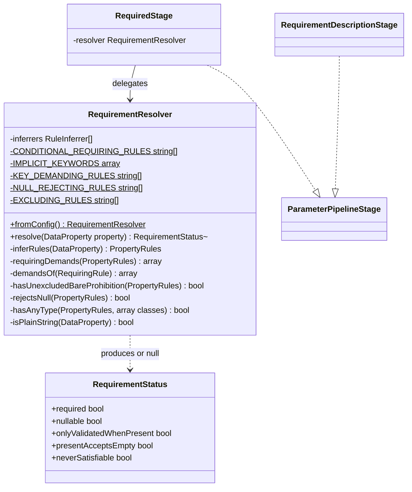

# Requirement Resolution

Core canvas. Owns `Pipeline/Stages/RequiredStage.php`, `Pipeline/Stages/RequirementDescriptionStage.php` and `Pipeline/Support/**` (`RequirementResolver`, `RequirementStatus`): the requirement seam, the only place the package reads Spatie's validation internals.

Related canvases: parameter metadata pipeline (the stage contract, the factory that builds `RequiredStage` with `RequirementResolver::fromConfig()` and fixes its position, and the `ParameterContext` fields this canvas writes); attribute processing framework (the registry must not hold processors for `Required`, `Nullable`, `Sometimes` or `Present` — `RequiredStage` owns the first three, and `Present`'s requirement status and its sentence are both owned here; `ReplacedRules::isBareExclude` and `ReplacedRules::isBare`); conditional requirement family (`Filled` *is* registered, for description text only, and the conditions are stated there); every family canvas (the attributes `RequirementResolver` names); DTO parameter extraction (the confirmation companion copies the resolved `required` / `nullable`).

Split out of the parameter metadata pipeline canvas on 2026-09-26 (INDEX, size rule); Requirements, Approach, Operations and Safeguards moved verbatim, and Structure and Norms keep only what concerns this canvas; git history keeps the combined file.

## Requirements

- Decide required vs optional by reconciling the declared type with any requirement attribute, inheriting Spatie's own precedence rather than restating it, so published docs cannot contradict runtime validation.
- State in prose the two requirement facts the required/optional flag cannot carry: that a property is only validated when included, and that it accepts a null value.
- Publish a property whose requirement is conditional on another field as optional, so the flag describes what a valid request may omit rather than asserting a requirement that holds only sometimes.

Boundaries: `RequiredStage`, `RequirementDescriptionStage`, `RequirementResolver` and `RequirementStatus`. The stage contract, the context and the stage order are the parameter metadata pipeline canvas's.

## Entities

Collaborating types used here but not owned by this canvas:

- `ParameterContext` (parameter metadata pipeline): `RequiredStage` writes `required`, `nullable`, `onlyValidatedWhenPresent`, `presentAcceptsEmpty` and `neverSatisfiable`; `RequirementDescriptionStage` reads them and appends to `description`.
- `DataProperty` (Spatie): the resolver reads `type` (`isNullable`, `isOptional`, `getAcceptedTypes()`), `hasDefaultValue` and `cast`.
- `DataConfig` (Spatie): read only for `ruleInferrers`, the already-instantiated list built from `data.rule_inferrers`.
- `RuleInferrer` (Spatie): the five shipped inferrers reconcile type-derived and attribute-derived requirement rules. All accept a `ValidationContext` and none read it, which is what allows them to run at documentation time.
- `PropertyRules` (Spatie): mutable rule collection; `hasType()` and `all()` are used.
- `RequiringRule` (Spatie marker interface), `Nullable`, `Sometimes`, `Present`, `Accepted`, `Declined`, `Filled`, `Prohibited` and the five exclusion rules (`Exclude`, `ExcludeIf`, `ExcludeUnless`, `ExcludeWith`, `ExcludeWithout`), plus a bare `exclude` rule string (`ReplacedRules::isBareExclude`) and a bare `Prohibited` (`ReplacedRules::isBare`): the membership checks requirement status is read from.
- `ValidationContext` / `ValidationPath` (Spatie): constructed with null payloads purely to satisfy the inferrer signature.

## Approach

Requirement status is reconciled, not recomputed. Eight decisions are recorded here because they are not derivable from the code:

- Precedence between a declared type and a requirement attribute is **inherited** from Spatie's configured rule inferrers, never reimplemented. The package runs them itself rather than calling `DataValidationRulesResolver`, which needs a full request payload and, given an empty one, silently omits every property that has a default value.
- A property carrying both a default value and `#[Required]` is published as **optional**. Rule inference does emit a requiring rule for it, but omitting the field produces no error because the default applies, so optional matches observable API behaviour. `RequirementResolver` applies this by subtracting `hasDefaultValue` from the requiring-rule result.
- A property carrying both `#[Sometimes]` and a requiring rule is published as **optional**. This subtraction is load-bearing, not defensive: `RequiredRuleInferrer::shouldAddRule` skips nullable types, optional types, `Present` on collectables, an existing `Nullable` rule and an existing requiring rule — it never checks for `Sometimes`. So for a non-nullable `#[Sometimes]` property the inferrers emit `[Required, StringType, Sometimes]` and `hasType(RequiringRule::class)` is true. Omitting a `sometimes` field produces no error, so optional matches observable API behaviour, and `RequirementResolver` applies it by subtracting `onlyValidatedWhenPresent` from the requiring-rule result. **The subtraction applies only where `Sometimes` survives inference, and declaration order decides that.** `AttributesRuleInferrer` removes `Sometimes` when it adds a requiring rule, but never removes a requiring rule when it adds `Sometimes`. So `#[Required] #[Sometimes]` keeps both and is published optional, while `#[Sometimes] #[Required]` loses `Sometimes`, is enforced as required at runtime, and is published required. The resolver reads the surviving rule set, so it follows upstream in both orders without inspecting order itself.

- A property whose only requiring rules are **conditional** — `RequiredIf`, `RequiredUnless`, `RequiredWith`, `RequiredWithAll`, `RequiredWithout`, `RequiredWithoutAll` — is published as **optional**, and the condition is stated in prose by the conditional requirement canvas. `RequiringRule` is an empty marker that upstream uses only to decide which rules displace one another; seven attributes implement it and six are conditional, so reading it whole publishes a field that is mandatory in some requests as mandatory in all of them. `required` is therefore read from the unconditional rules alone. A subclass of one of the six (matched with `instanceof`, as the registry documents it through its parent) is read by the keyword it emits, because upstream builds the rule string from `keyword()` while the class decides only displacement: a subclass that overrides only `parameters()`, restates the keyword or switches to another of Laravel's conditional implicit keywords (`required_unless`, `required_if_accepted`, `present_if`, `missing_with`, …) stays conditional; one emitting `required`, `accepted` or `declined` demands the key and rejects empty; `present` demands the key only; `filled` and `missing` reject an empty value only; any other rule Laravel ships is not implicit, so it is skipped for an absent key and, beside `nullable`, for null, and demands nothing. A keyword Laravel does not ship, a `keyword()` that throws, and a rule implementing `RequiringRule` directly have unknown semantics (a custom rule may be implicit) and count as unconditional, preserving the answer given before the distinction existed — guessing optional would risk publishing a mandatory field as optional.
- A property carrying `#[Present]` is published as **required**. Upstream `AttributesRuleInferrer` removes every requiring rule when it encounters `Present`, so the inferrers report nothing requiring, yet the API rejects a request that omits the key. `required` in the published contract means what OpenAPI's `required` means — the key must appear — which is exactly what `present` enforces. The same two subtractions apply.
- A property carrying `#[Accepted]` or `#[Declined]` is published as **required** for the same reason. Neither is a `RequiringRule`, but Laravel treats both as implicit rules and runs them when the key is absent, where they fail; `#[Accepted] ?bool` therefore rejects a request that omits it. `Filled` is implicit too but passes when the key is absent, so it does not demand the key. The same two subtractions apply.
- A property whose rules include `Accepted`, `Declined`, `Filled` or an unconditional requiring rule is published as **not nullable**, even when `Nullable` is also present. Laravel treats `Required`, `Accepted`, `Declined` and `Filled` as implicit rules and runs them against a null value, so `#[Required] ?string`, `#[Nullable] string` (which the inferrers turn into `required|nullable`), `#[Filled] ?string`, `#[Accepted] ?bool` and `#[Declined] ?bool` all reject `null` at runtime. These are the unconditional implicit rules Spatie ships attributes for that reject null. `Present`, the six conditional requiring attributes, `AcceptedIf` and `DeclinedIf` do not subtract: `present` accepts null, and a conditional implicit rule rejects null only while its condition holds. This reverses STORY-001-000's shipped AC1 and AC2, which published `nullable: true` for the first two declarations; the reversal was taken deliberately after the 2026-09-24 review showed `Data::validate` rejecting null for both. Nor is a property whose PHP type does not admit null, whatever its rules say: `#[Present, Nullable] string` and `#[Nullable, RequiredIf(...)] string` keep a `Nullable` rule once `Present` or the condition replaces the inferred `Required`, but Laravel Data cannot construct the property from null. For a property with no requirement attribute the rule and the type agree, so this changes nothing there.
- A conditional implicit rule does not subtract from `presentAcceptsEmpty` either, whether it requires (`RequiredIf` and the other five) or demands acceptance (`AcceptedIf`, `DeclinedIf`): `#[Present, RequiredIf('a', 'x')] ?string` keeps "Must be included in the request, but may be empty." and "A null value is accepted.", which hold while the condition does not; while `a` is `x` Laravel rejects an empty value, and the adjacent condition sentence states when the value becomes mandatory. `#[Present, AcceptedIf('a', 'x')] ?string` keeps them the same way (`ConditionalRequirementTest` "states Present may be empty beside a conditional acceptance rule…"). This mirrors the nullable decision above rather than restating each condition in the Present sentence.

- Prohibition never changes requirement status. `Prohibited` and the exclusion attributes are not `RequiringRule`s, so a non-nullable, non-`Optional`, undefaulted `#[Prohibited]` or `#[Exclude]` property still infers `Required` and is published as **required**, which is what the API enforces. Where that makes the field impossible to satisfy, `neverSatisfiable` states it: `required` AND `rejectsEmpty` AND a bare `Prohibited` that no exclusion rule precedes.
  - `rejectsEmpty` rather than `required` alone, because `#[Present, Prohibited] ?string` is satisfied by an empty value.
  - "Bare" means no wrapped Illuminate rule object, whose condition may make the field satisfiable.
  - "No exclusion precedes" is needed because Laravel stops validating a field once an exclusion rule applies. `#[Exclude, Prohibited] string`, `#[ExcludeIf(...), Prohibited] string` and `#[ExcludeWith(...), Prohibited] string` all pass a request that sends a value, while `#[Prohibited, Exclude] string` never passes. Any of the five exclusion attributes counts, conditional or not and wrapped or not: the advisory is an absolute claim, so it is withheld whenever some request might pass.

  This is a flag, not a subtraction: it changes no other field. Found by the 2026-09-25 review of STORY-001-002 (finding F1), which compared the published advisory with `Data::validate` for each order.

Those two subtractions are the only two permitted. Both narrow a requiring rule to optional on the same ground — omission produces no runtime error — and neither reorders the inferrers nor restates their conditions. The conditional, `Present` and `Accepted`/`Declined` entries above are a different operation: they change **which rules demand the key**, uniformly across closed enumerated sets (`CONDITIONAL_REQUIRING_RULES`, `IMPLICIT_KEYWORDS` and `KEY_DEMANDING_RULES`), rather than narrowing the result case by case. The nullability entry is a third kind: it subtracts `nullable` for the closed set of implicit rules that reject null (`NULL_REJECTING_RULES` plus requiring rules whose keyword rejects an empty value), and for a PHP type that does not admit null. Rule inference stays fully delegated; only the presentation of the inferred result is this package's judgement. Any further change to these terms is a design change, not a fix.

**Provenance.** The conditional, `Present` and nullable-sentence decisions come from STORY-001-001 (analysis `spdd/analysis/GGQPA-XXX-202609222058-[Analysis]-conditional-requirement-attributes.md`). They were designed in a change canvas that shipped in `64d5173`/`358afc0`, was folded back here and into the former attribute processors canvas, and was then removed (it is in git history up to `d54cac8`). The `Accepted`/`Declined`, PHP-type nullability and Present-emptiness rules were added after the 2026-09-24/25 code reviews. Two of those narrowed the story's acceptance criteria, signed off on 2026-09-24:
- **AC5** ("`terms` must be included but may be empty"): the "may be empty" sentence is published only on a nullable, uncast `string`. `#[Present] string` is published as required without it (`presentAcceptsEmpty`).
- **AC6** (`vat_number` with `#[RequiredIf]` and `#[Nullable]` states that null is accepted): the null sentence is published only where the PHP type admits null, so `?string` carries it and `string` does not.

The `neverSatisfiable` flag and its sentence come from STORY-001-002 (analysis `spdd/analysis/GGQPA-XXX-202609251142-[Analysis]-prohibition-exclusion-attributes.md`), signed off on 2026-09-25 in place of that story's AC1 wording ("listed as optional"), which holds only for a nullable or defaulted property. The change canvas was folded back here and into the former attribute processors canvas, then removed; git history keeps it.

A context still maps to one declared property, and `RequiredStage` still decides requirement for every declared property. The one sanctioned exception is the `#[Confirmed]` companion from STORY-001-003 (analysis `spdd/analysis/GGQPA-XXX-202609251435-[Analysis]-cross-field-comparison-acceptance-attributes.md`). `ConfirmedProcessor` records a `ConfirmationCompanion` on the source's context; after the pipeline has run, `ParameterGenerator` emits it, for a request parameter only, as a second `Parameter` placed directly after the source, copying the source's resolved `required` and `nullable` verbatim (companion requirement mirrors the source, D3, signed off on 2026-09-25). No stage reads the companion and no second requirement decision is inferred: the companion has no `DataProperty` for `RequirementResolver` to read, and Laravel runs `confirmed` only when the source is validated. A stage cannot build it, because a stage maps one context to one context, and a pipeline run for a synthetic property would re-read the source's attributes, `#[Confirmed]` included. The change canvas was folded back here and into the former attribute processors, DTO extraction and documentation records canvases, then removed; git history keeps it.

**Alternatives rejected** when the conditional carve-out was designed:
- **Processors only, requirement status untouched**: produces "optional, required when account type is business" beside a contract flag marking the field mandatory. Self-contradiction is worse than the gap it closes.
- **Reuse `onlyValidatedWhenPresent`**: it has a distinct meaning and its own sentence, and adding any requiring rule removes `Sometimes` from the rule set, so the flag is not even available on a conditionally required property.
- **Structural OpenAPI expression** (`allOf`/`if`-`then`, vendor extension): the Scribe parameter model has no slot for a conditional schema, and consumers are served by prose.
- **Delegate the conditional/unconditional distinction upstream**: nothing to delegate to. The distinction does not exist in Laravel Data; the `RequiringRule` marker is empty by design.
- **A processor or a new stage after `RequiredStage` for the carve-out**: a processor's write is discarded because `RequiredStage` runs later, and a second stage would create a second writer of `required`. The carve-out therefore lives in `RequirementResolver`.

The upstream coupling is confined to one class, `RequirementResolver`, because Spatie's validation internals carry no backwards-compatibility guarantee. The seam is the repair site; `RequirementResolverTest` is the detector. "Internals" means the four types listed under Structure, not every class in `Spatie\LaravelData\Support\Validation`.

Trade-off present in the code:

- Requirement resolution degrades rather than fails: `RequirementResolver::resolve` returns null on an empty inferrer list or any throwable, and `RequiredStage` then applies the original type-derived computation. A documentation build never fails because one property could not be reconciled.

Known divergences (codified as-is, not proposed fixes):

- `RequirementResolver` and `RequiredStage` carry explanatory docblocks, departing from the pipeline's otherwise comment-free style. Retained deliberately: both encode non-obvious decisions (why the payload is null, why the resolver is the only importer of the validation internals) that a reader cannot recover from the code. `RequirementResolver` carries a method docblock and an inline comment in addition to its class docblock; see Norms for the full inventory.
- `RequirementDescriptionStage` is not idempotent: processing the same context twice appends each of its sentences twice. The "at most once" safeguard holds because the default flow builds a fresh `ParameterContext` per property, not because the stage guards against it.
- The reconciled path and the fallback path disagree for conditional requirement attributes. `applyTypeDerivedFallback` reads the declared type only, so under fallback a non-nullable property carrying `#[RequiredIf]` publishes `required: true` while the reconciled path publishes `false`. Deliberate: the fallback's contract is to reproduce the pre-reconciliation computation exactly, and `RequiredStageTest`'s fallback dataset pins it. Visible only with an empty inferrer list or a throwing inferrer.
- An empty inferrer list is treated as "cannot reconcile" rather than as "no rules apply". Answering from an empty rule set would mark every property not-required and not-nullable, which is worse than the type-derived baseline.
- `RequiredStage`'s constructor argument is mandatory. Constructing the stage without a resolver is no longer possible, a deliberate break so no caller can silently obtain the pre-reconciliation behaviour.

## Structure

`RequiredStage` and `RequirementDescriptionStage` live in `Pipeline\Stages` beside the other stages; the seam and its value object live in `Pipeline\Support`. `RequirementStatus` is a leaf value; `RequirementResolver` depends on it, on `ReplacedRules` (`AttributeProcessing` namespace, attribute processing framework canvas), on Spatie validation support types, and on Laravel's `Validator` and `Str` (to recognise a rule keyword Laravel ships); `RequiredStage` additionally requires `RequirementResolver`. All four classes are `final`.

`RequirementResolver` is the only class in the package permitted to import Spatie's validation **internals** — `PropertyRules`, `RequiringRule`, `ValidationContext` and `ValidationPath`. Every other class reads `RequirementStatus`. The rule is scoped to those four types rather than the whole `Spatie\LaravelData\Support\Validation` namespace, because two collaborators in that namespace are sanctioned in the parameter metadata pipeline and attribute processing framework canvases and predate the seam: `ValidationRule` (the attribute family `AttributeProcessingStage` iterates) and `References\FieldReference` (read by `FieldReferenceProcessor`, attribute processing framework canvas).

## Operations

### RequiredStage

- Responsibility: sole authority on `required`, `nullable`, `onlyValidatedWhenPresent`, `presentAcceptsEmpty` and `neverSatisfiable` for every context, and so for every declared property. The confirmation companion's `required`/`nullable` are copied from the source's resolved parameter by `ParameterGenerator` (see Approach); that is not a second decision.
- Constructor requires a `RequirementResolver` (readonly, promoted). There is no no-argument constructor.
- Calls `resolver->resolve(context->property)`.
- When a `RequirementStatus` comes back, copies its five fields onto the context.
- When null comes back, applies the fallback path in `applyTypeDerivedFallback`: `nullable` = `property->type->isNullable`; `required` = not nullable AND not `isOptional` AND not `hasDefaultValue`; `onlyValidatedWhenPresent` = `property->type->isOptional`; `presentAcceptsEmpty` = false, so the fallback never states the Present sentence (the declared type cannot say whether `Present` is in force or whether anything rejects an empty value); `neverSatisfiable` = false, since the fallback reads no attributes. Otherwise this is the pre-reconciliation behaviour, reproduced exactly.
- Assigns unconditionally in both paths, overwriting anything an earlier stage wrote to those five fields.

### RequirementDescriptionStage

- Responsibility: append the requirement facts a boolean cannot carry.
- First appends the private constant `PRESENT_SENTENCE` (`"Must be included in the request, but may be empty."`) when `presentAcceptsEmpty` is true. `presentAcceptsEmpty` comes from `RequirementResolver` through `RequiredStage` and carries every unconditional condition for the sentence to be true: the key must be sent, nothing rejects an empty value, and the property is a nullable, uncast `string` (see the resolver). A conditional requiring rule does not subtract (Approach), so `#[Present, RequiredIf('a', 'x')] ?string` still reads "may be empty" and "A null value is accepted." although Laravel rejects an empty value while `a` is `x`; the adjacent condition sentence states when the value becomes mandatory. The stage adds no condition of its own. This sentence used to come from a `StaticAttributeProcessor` in the processor registry, which ran before requirement status existed; moving it here also moves it after the other attribute sentences.
- Appends the private constant `SENTENCE` (`"Only validated when included in the request."`) when `onlyValidatedWhenPresent` is true.
- Then appends the public constant `NULLABLE_SENTENCE` (`"A null value is accepted."`) when `nullable` is identically `true`. The strict comparison matters: `nullable` is `?bool` on the context, and an unresolved null must not emit the sentence. It is the one public sentence constant, so that `ParameterGenerator` reuses the same wording on a nullable confirmation companion; the other three stay private.
- Finally appends the private constant `NEVER_SATISFIABLE_SENTENCE` (`"Note: this field is both required and prohibited, so no request can pass validation."`) when `neverSatisfiable` is true. It is written here, not by the `Prohibited` processor, because it depends on requirement status, which does not exist when processors run.
- Order is fixed and observable: Present first, only-validated second, nullable third, never-satisfiable fourth. In practice the last two do not co-occur, because `rejectsEmpty` also subtracts `nullable`. Present and only-validated never co-occur, because only-validated forces `required` false. Today's output stays a prefix of tomorrow's.
- Each append uses `trim(existing + space + sentence)`, matching DefaultValueDescriptionStage.
- The nullable sentence fires for every property published `nullable: true`, not only those carrying `#[Nullable]`. A rule that fired on the attribute but not on an equivalent nullable type would make output depend on how the developer spelled the same fact. It exists because `nullable` reaches the OpenAPI schema but never the human-readable reference pages, which render name, type, required and description only — so without prose a consumer reading those pages cannot learn that null is accepted.
- Holds no state and takes no constructor arguments.

### RequirementResolver

- Responsibility: produce requirement facts for a `DataProperty` using Spatie's own rule inference, without a request payload.
- Namespace `Abrha\LaravelDataDocs\Pipeline\Support`. Constructor takes `array<int, RuleInferrer> $inferrers`, readonly.
- Static `fromConfig()` returns `new self(app(DataConfig::class)->ruleInferrers)`. Reads the container-built list rather than `config()` directly, so a project override of `data.rule_inferrers` is honoured.
- `resolve(DataProperty $property): ?RequirementStatus`:
  - Returns null immediately when the inferrer list is empty. An empty list means nothing can be reconciled; answering from an empty rule set would mark everything not-required and not-nullable.
  - Otherwise runs `inferRules`, catching `Throwable` and returning null.
  - `onlyValidatedWhenPresent` = `rules->hasType(Sometimes::class)`.
  - `[requiringDemandsKey, requiringRejectsEmpty]` = `requiringDemands(rules)`, computed once.
  - `mustBePresent` = `requiringDemandsKey` OR `hasAnyType(rules, KEY_DEMANDING_RULES)`.
- Private constant `KEY_DEMANDING_RULES` (`Present`, `Accepted`, `Declined`): rules that demand the key without being requiring rules. The class docblock states why `Filled` is not listed.
  - `nullable` = `rules->hasType(Nullable::class)` AND `property->type->isNullable` AND NOT `rejectsEmpty` (defined below). The type term is in the class docblock.
- Private constant `NULL_REJECTING_RULES` (`Accepted`, `Declined`, `Filled`). `Required` is not listed: it arrives through `requiringRejectsEmpty`.
- Private `rejectsNull(PropertyRules $rules): bool`: `hasAnyType(rules, NULL_REJECTING_RULES)`.
- Private `hasAnyType(PropertyRules $rules, array $classes): bool`: true when `rules->hasType` matches any listed class. `hasType` is an `instanceof` test, so subclasses count. Like the requiring-rule walk, it makes no method call on a rule object and cannot throw.
  - `required` = `mustBePresent` AND NOT `onlyValidatedWhenPresent` AND NOT `property->hasDefaultValue`.
  - `rejectsEmpty` = `requiringRejectsEmpty` OR `rejectsNull(rules)`: the implicit rules that reject null reject an empty value too, so one term serves both `nullable` and `presentAcceptsEmpty`.
  - `nullable` (the result above) is computed before `required` so both can use it.
  - `neverSatisfiable` = `required` AND `rejectsEmpty` AND `hasUnexcludedBareProhibition(rules)`. See Approach and the class docblock.
  - `presentAcceptsEmpty` = `required` AND `nullable` AND `rules->hasType(Present::class)` AND `isPlainString(property)`. `nullable` already excludes `rejectsEmpty`. Read from the surviving rule set, so `#[Required, Present] ?string` (Present strips the requiring rule) accepts empty while `#[Present, Required] ?string` does not. `nullable` and `isPlainString` are required because the sentence must hold end to end: Laravel's default `ConvertEmptyStringsToNull` middleware turns `''` into `null`, which a non-nullable property rejects, and Laravel Data fails to build any non-string or cast type from `''`. The class docblock says so.
- Private `isPlainString(DataProperty $property): bool`: the declared accepted types are exactly `['string']` and `property->cast` is null. It reads the declared PHP type, not the documented `type`, so a custom-type class documented as `string` does not qualify.
- Private `requiringDemands(PropertyRules $rules): array{bool, bool}`: walks `rules->all()`, skipping anything that is not a `RequiringRule`, and ORs what each survivor enforces in every request, `[key must be sent, empty value rejected]`, as read by the private `demandsOf($rule)`. `demandsOf` returns `[true, true]` for anything that is not `instanceof` one of the private constant `CONDITIONAL_REQUIRING_RULES` (`RequiredIf`, `RequiredUnless`, `RequiredWith`, `RequiredWithAll`, `RequiredWithout`, `RequiredWithoutAll`), so `Required` and a rule implementing `RequiringRule` directly are unconditional. For one of the six or a consumer subclass (the registry documents it through its parent, attribute processing framework canvas) it decides by the emitted keyword, since upstream builds the rule string from `keyword()`: an inherited `keyword()` (a `ReflectionMethod` declaring-class test against the conditional class) is read without a call; otherwise `$rule::keyword()` is called inside a `try`, and a throw counts as `[true, true]`. The keyword is looked up in the private constant `IMPLICIT_KEYWORDS`, Laravel's implicit rules by keyword with their pair (Approach): the conditional ones `[false, false]`, `required`/`accepted`/`declined` `[true, true]`, `present` `[true, false]`, `filled`/`missing` `[false, true]`. A keyword not listed is `[false, false]` when Laravel's `Validator` has a `validate{Studly}` method for it (a shipped, non-implicit rule), and `[true, true]` otherwise. `RequirementResolverTest` pins the plain subclass, a subclass emitting `required` ("treats a conditional subclass that emits a rule of its own as unconditional, as Laravel does"), subclasses that override only `parameters()`, restate `required_if` or switch to `required_unless`, one switching to `required_if_accepted` (required and nullable), a rule implementing `RequiringRule` directly, and `IMPLICIT_KEYWORDS` against Laravel's `Validator::$implicitRules` ("lists exactly Laravel's implicit rules by keyword"). `KeywordSwitchedConditionTest` pins `required` and `nullable` of subclasses switching to every kind of keyword, over string, int, float, bool, array and enum properties, against the validator with the condition on and off, plus an unshipped and a throwing keyword.
  - The walk cannot let a throwable escape: `instanceof` tests, a `ReflectionMethod` on `keyword` (a method every conditional attribute has), the upstream classes' own `keyword()`, `Str::studly` and `method_exists` on a string, and the consumer's `keyword()` inside its own `try`. `resolve()`'s try/catch wraps `inferRules` but not the interrogation that follows it, so this is what keeps the unguarded region safe. Do not widen the try block to compensate; that would change the failure semantics the fallback depends on.
- Private constant `EXCLUDING_RULES` (`Exclude`, `ExcludeIf`, `ExcludeUnless`, `ExcludeWith`, `ExcludeWithout`).
- Private `hasUnexcludedBareProhibition(PropertyRules $rules): bool`: walks `rules->all()` in order.
  - Returns false on the first rule that is `instanceof` any `EXCLUDING_RULES` class, or that `ReplacedRules::isBareExclude` recognises: a bare `exclude` rule string stays a plain `Rule` in Spatie's list but excludes all the same (framework canvas), so `#[Rule('exclude'), Prohibited]` gets no never-satisfiable warning.
  - Returns true on the first rule that is `instanceof Prohibited` and that `ReplacedRules::isBare` recognises, i.e. carries no wrapped rule object. `isBare` reads the protected `$rule` through a bound closure (`!isset($this->rule)`) rather than comparing with `new Prohibited()`, so a consumer subclass of `Prohibited`, which the registry documents through its parent, counts as bare too and gets the note, unless the subclass declares its own `getRule()`, which may return a conditional rule, so it never counts as bare; `ProhibitionExclusionTest` pins both against `Data::validate`.
  - Returns false if neither is found.

  The walk follows rule order, which is the order Laravel runs rules in: the inferred `Required` is prepended, then declared attributes in declaration order. Like the requiring-rule walk it runs in the unguarded region and is incapable of throwing: `instanceof` tests, a `ReflectionMethod` on `getRule` (a method every `Prohibited` has), an `isset` on a declared property, and one method call, `Rule::get()` inside `isBareExclude`, a plain getter on upstream's base `Rule`; the rules in the list are never consumer subclasses of `Rule`, because Spatie's `RuleNormalizer` unwraps every `Rule` through `get()` during inference and re-wraps what it cannot resolve as a new base `Rule`. `getRule()` is not called, and the attribute is never stringified, because either would evaluate the wrapped rule's condition.
- Private `inferRules`: starts from an empty `PropertyRules`, builds `new ValidationContext(null, null, ValidationPath::create())`, and folds each inferrer in configured order via `handle($property, $rules, $context)`. Order is never re-sorted.
- Must not call `DataValidationRulesResolver`, `RuleDenormalizer`, or `Data::getValidationRules()`; must not open a database connection or read the request.

### RequirementStatus

- Responsibility: immutable carrier of the five resolved facts.
- Namespace `Abrha\LaravelDataDocs\Pipeline\Support`. Final, five readonly promoted bools: `required`, `nullable`, `onlyValidatedWhenPresent`, `presentAcceptsEmpty` and `neverSatisfiable`. The last two default to false so a three- or four-argument construction keeps its meaning.
- No methods; every value is supplied by `RequirementResolver`, and the two defaults exist only for backward-compatible construction.
- Placed under `Pipeline\Support` rather than `ValueObjects` on purpose: it is pipeline-internal, never reaches `Parameter`, and keeping it here confines the change to this canvas's ownership.

## Norms

- `RequirementResolver` and `RequiredStage` are the pipeline's two deliberate exceptions to the no-explanatory-comments rule (parameter metadata pipeline canvas, Norms). `RequiredStage` carries a class-level docblock only. `RequirementResolver` carries six pieces of prose, each recording a decision a reader cannot recover from the code: a class-level docblock (why the payload is null, why it is the single importer of the validation internals, why the empty `RequiringRule` marker is insufficient, why an unrecognised requiring rule counts as unconditional, the null and PHP-type reasoning behind `nullable`, the empty value and `ConvertEmptyStringsToNull`, why `Accepted` and `Declined` demand the key and `Filled` does not, how `neverSatisfiable` is defined, why a preceding exclusion (a bare `exclude` rule string included) withholds it, and what "bare" means), a docblock on `IMPLICIT_KEYWORDS` (what each pair means), a docblock on `requiringDemands()` (the pair it returns), a docblock on `demandsOf()` (why the emitted keyword decides what a subclass demands, why an inherited `keyword()` is read without a call, why a shipped non-implicit rule demands nothing and an unshipped or throwing keyword counts as unconditional), a docblock on `resolve()` (what a null return asks the caller to do), and an inline comment in the empty-inferrer branch (why "cannot reconcile" beats "nothing required"). `RequirementResolver` also has an `@param` docblock on its constructor.
- `RequirementResolver` is constructor-injected into `RequiredStage`, not service-located inside `process()`: the counter-example to the registries' `getInstance()`.
- Imports of Spatie's validation internals — `PropertyRules`, `RequiringRule`, `ValidationContext`, `ValidationPath` — are permitted in `RequirementResolver` only. Adding one elsewhere is a defect, not a style preference. This is now executable rather than aspirational: `tests/ArchTest.php` names those four types and asserts they are used only in `RequirementResolver`. The rule is scoped to the four types rather than the namespace, because `ValidationRule` and `References\FieldReference` live in the same namespace but are ordinary collaborators, not internals, and are permitted where the canvases name them.
- Tests: `tests/Unit/Pipeline/Stages/RequiredStageTest.php`, `RequirementDescriptionStageTest.php` and `tests/Unit/Pipeline/Support/RequirementResolverTest.php`. `RequirementStatus`, a five-field readonly carrier with no behaviour, is covered through `RequirementResolverTest` rather than a file of its own.
- `RequiredStageTest` covers both branches. The reconciled branch uses `RequirementResolver::fromConfig()`; the fallback branch is reached with `new RequirementResolver([])`, which the resolver treats as unresolvable. Without that second construction the fallback never executes under `tests/TestCase`, since a registered Spatie provider makes the inferrer list non-empty for every property.
- `tests/Integration/Pipeline/RequirementReconciliationTest` exercises reconciliation through the assembled default pipeline, which is the only place stage ordering is observable. Its acceptance cases are numbered `AC1`–`AC6`, plus `AC5b` for the `Optional`-typed property that carries no requirement attribute. `AC1`, `AC2` and `AC4` assert `nullable: false` since the implicit-rule decision; a comment above them records the reversal. A dataset case, "publishes nullable only where a null value survives validation and construction", runs over every constructor parameter of the fixture `NullAcceptanceTestData` (plain nullable and non-nullable types, `#[Nullable] string`, `Required`, `Filled`, `Accepted`, `Declined`, `Present`, `#[Present, Nullable] string`, `RequiredIf`, `#[Nullable, RequiredIf] string`, `AcceptedIf`, `DeclinedIf`). For each it runs `validateAndCreate` on a valid payload with that property set to null and asserts the published `nullable` equals the outcome, so the expected answer comes from Laravel and Laravel Data rather than from a list in the test. A validator-only check would miss the PHP-type term: the validator accepts null for `#[Present, Nullable] string`, but the object cannot be built. A second dataset over the same fixture, "publishes required only where validation rejects an omitted key", checks `required` against the validator with the key absent. Conditions reference fields absent from the payload, so a conditional rule is expected to accept null.
- `tests/TestCase` registers Spatie's `LaravelDataServiceProvider` alongside the package provider. Without it `data.rule_inferrers` is unset, the inferrer list is empty, and every test silently exercises the fallback path instead of reconciliation.
- Error handling: `RequirementResolver` catches `Throwable` and converts it into a null return that triggers the caller's fallback; nothing in this canvas throws.

## Safeguards

Functional:

- A property carrying no requirement attribute must produce the same `required` and `nullable` values as the pre-reconciliation implementation. Description text may change for two such cases. Every property published `nullable: true` gains `"A null value is accepted."` — the deliberate, recorded output diff of the nullable sentence, and the widest-reaching change in this canvas; a non-nullable property with no requirement attribute is byte-identical. And an `Optional`-typed property gains the requirement sentence, because `SometimesRuleInferrer` adds `Sometimes` whenever `type->isOptional` and the fallback independently sets `onlyValidatedWhenPresent` from the same flag. Every other attribute-free property gains no new description text. `AC5` pins the plain and nullable cases; `AC5b` pins the `Optional` case.
- `required: true` is published only where runtime validation rejects a request that omits the key. `RequirementReconciliationTest` pins this for every property of `NullAcceptanceTestData`, validating an empty payload against each property's inferred rules with Laravel's validator, so a key-demanding rule missing from `KEY_DEMANDING_RULES` fails the test once a fixture property carries it. `KeywordSwitchedConditionTest` pins it for conditional subclasses emitting each kind of keyword. The one deliberate exception is a subclass whose keyword Laravel does not ship, or whose `keyword()` throws: its semantics are unknown, so it is published required.
- `nullable: true`, and therefore `"A null value is accepted."`, is published only where a null value survives validation and construction. A property carrying `Accepted`, `Declined`, `Filled` or a requiring rule whose keyword rejects an empty value, or whose PHP type does not admit null, is never published nullable. Pinned per case in `RequirementResolverTest` (`Accepted`, `Declined`, `Filled`, requiring rules), and in `RequirementReconciliationTest` for every property of `NullAcceptanceTestData`, which runs `validateAndCreate` with the property set to null and asserts `nullable` equals the outcome; `ConditionalRequirementTest` pins `#[Filled] ?string`. A null-rejecting rule missing from `NULL_REJECTING_RULES`, or a rule/type mismatch such as `#[Present, Nullable] string`, fails the reconciliation test once a fixture property carries it.
- `"Note: this field is both required and prohibited, so no request can pass validation."` is published only where `Data::validate` rejects every request. It is withheld when a default, `Sometimes`, an empty-accepting `Present`, a wrapped rule object, a conditional prohibition, or an exclusion rule preceding the bare `Prohibited`, including a bare `exclude` rule string, lets some request pass; a bare consumer subclass of `Prohibited` gets it as `Prohibited` does, and one that declares its own `getRule()` never gets it. `ProhibitionExclusionTest` pins both exclusion orders, the bare `exclude` rule string row, the bare subclass and a subclass declaring `prohibited_unless:role,admin` against `Data::validate`, so a change to how Laravel orders or applies exclusion rules fails the test.
- RequiredStage is the only component permitted to assign `required` or `nullable` on a context. The single sanctioned exception outside the pipeline is the `#[Confirmed]` companion of a request parameter, whose `required` and `nullable` `ParameterGenerator` copies verbatim from the source's resolved parameter, inferring nothing. No attribute processor may be registered for `Required`, `Nullable`, or `Sometimes`; the stage runs after AttributeProcessingStage and would discard such a processor's writes.
- Precedence between declared type and requirement attribute is inherited from the configured inferrers. Reimplementing their conditions, reordering them, or inspecting a specific inferrer is prohibited. The requiring-rule result may be narrowed by the two recorded subtractions (`hasDefaultValue`, `onlyValidatedWhenPresent`), and the set of rules that demand the key is narrowed to the requiring rules whose emitted keyword demands it (`IMPLICIT_KEYWORDS`) — `Required`, a conditional subclass emitting `required`, `present`, `accepted` or `declined`, and any unrecognised `RequiringRule` or keyword — and widened to the rules in `KEY_DEMANDING_RULES` (`Present`, `Accepted`, `Declined`), which fail on an absent key without being requiring rules. `nullable` is narrowed by the rules in `NULL_REJECTING_RULES`, by requiring rules whose keyword rejects an empty value, and by a PHP type that does not admit null. Any further change to these sets is a design change, not a fix.
- The inferrer list must come from `DataConfig->ruleInferrers`, never a hardcoded array.
- A property with both a default value and a requiring rule is published as optional, uniformly.
- A property whose inferred rules keep both `Sometimes` and a requiring rule is published as optional. Removing the `onlyValidatedWhenPresent` term from `required` would publish a non-nullable `#[Sometimes]` property as required, because the inferrers do emit a requiring rule for it. Whether `Sometimes` survives depends on declaration order (see Approach); `RequirementResolverTest` pins both orders.
- A property whose only requiring rules are conditional is published as optional, uniformly, and a property carrying `#[Present]`, `#[Accepted]` or `#[Declined]` is published as required. `RequirementResolverTest` pins both per attribute class, including a non-nullable conditional property whose inferred `Required` the condition replaces. A separate test scans Spatie's `Attributes\Validation` directory and asserts the `RequiringRule` implementers are exactly `Required` and the six conditional attributes, so a change to that set fails the suite rather than silently altering published documentation.

Data / format:

- The requirement sentence appears at most once per property and only when `onlyValidatedWhenPresent` is true.
- The Present sentence appears only where both of its unconditional claims hold at runtime: the key cannot be omitted, and an empty value is accepted end to end; beside a conditional implicit rule (requiring or acceptance) it holds while the condition does not (Approach), which `ConditionalRequirementTest` "states Present may be empty beside a conditional requirement, which holds while the condition does not" pins against the validator. `ConditionalRequirementTest` pins the first against Laravel's validator for plain, `Optional`, `Sometimes` in both orders and default-value cases (`PresentOmissionTestData`). It pins the second for every property of `PresentEmptinessTestData`: non-nullable and nullable string, `#[Present, Nullable] string` (a `Nullable` rule on a non-nullable type), `?int`, `?float`, a backed enum, `CarbonImmutable`, a non-implicit `Min`, `Required` before and after `Present`, `Filled`, `Accepted`, and a nested Data object. For each it runs `validateAndCreate` with the empty value as sent and with `null`, which is what the default middleware delivers, and asserts the sentence appears exactly when both succeed. A validator-only check is not enough: it accepts `''` for types that Laravel Data then fails to build.
- `onlyValidatedWhenPresent` must not surface in `Parameter` or `openApiAttributes`; generated OpenAPI output gains no field from reconciliation.
- `RequirementDescriptionStage::NULLABLE_SENTENCE` keeps its value; making it public widened visibility only. `RequirementDescriptionStageTest` pins the value.

Performance / integration:

- No code path may require a request payload, a populated `ValidationContext`, or a database connection. `DataValidationRulesResolver`, `RuleDenormalizer`, and `Data::getValidationRules()` are prohibited here: given an empty payload the first silently omits properties that have default values.
- No throwable may escape `RequirementResolver`; a documentation build must complete even when one property cannot be reconciled, and the fallback must reproduce the type-derived computation exactly.
- At least one test must fail if the configured inferrers change how they reconcile type and attribute, or if any of them begins reading the `ValidationContext`.

Business / ordering:

- `RequiredStage` runs after `AttributeProcessingStage` and `RequirementDescriptionStage` directly after `RequiredStage` (parameter metadata pipeline canvas, stage order); moving either changes observable output, as that canvas's ordering safeguard states.
