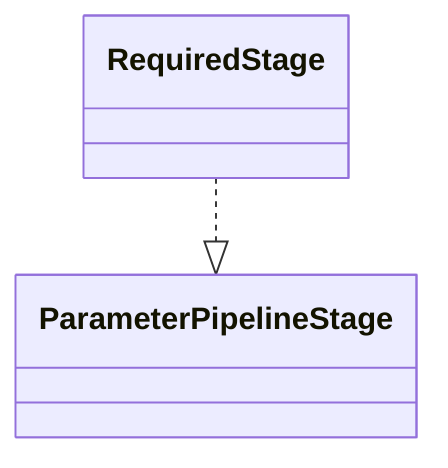

# Requirement Resolution

Core canvas. Owns `Pipeline/Stages/RequiredStage.php`: the published `required` and `nullable` of every parameter, and so the handling of `Required`, `Nullable`, `Sometimes` and `Present`.

Related canvases: parameter metadata pipeline (the stage contract, the factory that builds `RequiredStage` and fixes its position, and the `ParameterContext` fields this canvas writes); attribute processing framework (the registry holds no processor for `Required`, `Nullable`, `Sometimes` or `Present`).

Codified from the v0.4.0 code with `/spdd-reverse`.

## Requirements

- Decide required vs optional from nullability, optionality, and whether a default exists.

Boundaries: `RequiredStage`. The stage contract, the context and the stage order are the parameter metadata pipeline canvas's.

## Entities

Collaborating types used here but not owned by this canvas:

- `ParameterContext` (parameter metadata pipeline): `RequiredStage` writes `required` and `nullable`.
- `DataProperty` (Spatie): the stage reads `type` (`isNullable`, `isOptional`) and `hasDefaultValue`.

## Approach

Requirement status is computed from the declared type, not from validation rules. `nullable` is the type's nullability; `required` holds when the type admits neither null nor `Optional` and the property has no default value. No validation attribute is read: `#[Required]`, `#[Nullable]`, `#[Sometimes]` and `#[Present]` have no processor in the registry, and `RequiredStage` does not inspect the property's attributes.

Known divergences (codified as-is, not proposed fixes):

- The published flags can contradict runtime validation wherever a requirement attribute changes what Laravel Data enforces. `#[Required] ?string` is published optional and nullable, although the API rejects a request that omits it or sends null. `#[Sometimes] string` is published required, although a request may omit it. `#[Present] ?string` is published optional, although the API rejects a request that omits the key.
- No sentence states a requirement fact the flags cannot carry: nothing says that a property is only validated when included, or that it accepts null.

## Structure

`RequiredStage` lives in `Pipeline\Stages` beside the other stages. It is `final`, has no constructor and no collaborators beyond the context and the Spatie property metadata the context carries.

## Operations

### RequiredStage

- Responsibility: sole authority on `required` and `nullable` for every context, and so for every declared property.
- `nullable` = `property->type->isNullable`.
- `required` = not nullable AND not `isOptional` AND not `hasDefaultValue`.
- Assigns unconditionally, overwriting anything an earlier stage wrote to those two fields. Writes no other field and no description text.
- Holds no state and takes no constructor arguments.

## Norms

- No comments, following the pipeline's comment-free style (parameter metadata pipeline canvas, Norms).
- Tests: `tests/Unit/Pipeline/Stages/RequiredStageTest.php` covers every combination of a nullable type, an `Optional` type and a default value, that the stage returns the same context instance, and that it changes no field other than `required` and `nullable`.

## Safeguards

Functional:

- RequiredStage is the only component permitted to assign `required` or `nullable` on a context. No attribute processor may be registered for `Required`, `Nullable`, or `Sometimes`; the stage runs after AttributeProcessingStage and would discard such a processor's writes.

Data / format:

- `required` and `nullable` are always booleans once the stage has run, so `toParameter()`'s defaults (`required` false, `nullable` true) apply only to a context the stage never saw.

Business / ordering:

- `RequiredStage` runs after `AttributeProcessingStage` and the default-value stages and before `ExampleGenerationStage` (parameter metadata pipeline canvas, stage order). `required` and `nullable` are computed after descriptions and defaults are written, and they feed no description text.
