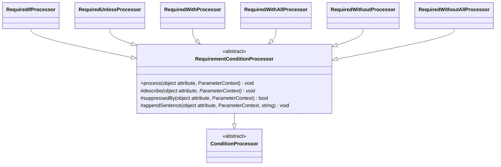

# Conditional Requirement Attributes

Family canvas for STORY-001-001 (`requirements/[User-story-1]conditional-requirement-validation-attributes.md`), plus `Filled` from STORY-001-000. Owns `RequiredIfProcessor`, `RequiredUnlessProcessor`, `RequiredWithProcessor`, `RequiredWithAllProcessor`, `RequiredWithoutProcessor`, `RequiredWithoutAllProcessor`, `Processors/Base/RequirementConditionProcessor`, and the registry rows `RequiredIf`, `RequiredUnless`, `RequiredWith`, `RequiredWithAll`, `RequiredWithout`, `RequiredWithoutAll`, `Filled`.

Related canvases: attribute processing framework (`ConditionProcessor`, `parametersOf`, `renderValues`, `fieldName`; `ReplacedRules::documentedRules` and `isReplaced`, which `AttributeProcessingStage` applies before any processor runs); pipeline canvases (`RequirementResolver` publishes a conditionally required property as optional and decides nullability; `RequirementDescriptionStage` writes the `Present` sentence).

Provenance: analysis `spdd/analysis/GGQPA-XXX-202609222058-[Analysis]-conditional-requirement-attributes.md`. Carved out of the former attribute processors canvas; git history keeps it.

## Requirements

- State, in a sentence an API consumer can read, the circumstance under which a conditionally required property becomes mandatory, naming the field the condition depends on and the value it is compared against.
- Never publish a condition the validator does not enforce.
- State on a `#[Filled]` property that, when included, it must not be empty.

## Entities

`Filled` has no class of its own; it is a `StaticAttributeProcessor` row.

## Approach

**A condition that is not enforced is never published.** Upstream `AttributesRuleInferrer` walks the declared validation attributes in order and, on reaching `Present`, strips every requiring rule collected so far. A conditional attribute declared **before** `#[Present]` is therefore not enforced at runtime, and `RequirementConditionProcessor::suppressedBy` withholds its sentence. One declared **after** `#[Present]` is added after the strip, is still enforced, and keeps its sentence. The same walk adds each requiring attribute through `PropertyRules::add`, which first removes every requiring rule already collected, so only the last requiring attribute survives: a conditional attribute followed by `#[Required]` or by another conditional attribute is replaced and not enforced, and its sentence is withheld too. Suppression follows declaration order for exactly that reason; an order-blind check would hide an enforced rule.

**The sentence states the rule the keyword emits.** Upstream builds the enforced rule string from the attribute's `keyword()`, not from its class, which decides only displacement. So a consumer subclass that switches keyword is worded by what it emits: switched to a sibling that reads the same parameters (`RequiredIf` and `RequiredUnless` read a field and values, the four presence-based attributes a field list), it gets that sibling's sentence; switched to anything else (`required`, `present_if`, `required_if_accepted`, `missing_with`, a sibling reading the parameters differently such as `RequiredIf` to `required_with`) or with a throwing `keyword()`, it gets no sentence, since no template here states that rule. Its `required` and `nullable` are decided from the same keyword by `RequirementResolver` (requirement resolution canvas), so a `required` subclass is published required with no condition beside it.

Suppression stays in this family because only requiring rules displace one another **across classes** upstream: `PropertyRules::removeType` drops every collected `RequiringRule` when another is added, but any other rule only when a rule of the same class is added. Why the prohibition and exclusion family does not suppress is recorded in its own canvas.

Before any processor runs, `AttributeProcessingStage` also skips an attribute that a later same-class declaration replaces (framework canvas, `ReplacedRules::isReplaced`). For the six conditional attributes that is already covered by suppression, since a later same-class rule is a later requiring rule. For `Filled`, a static row with no suppression, it is the only mechanism: `#[Filled, Rule('filled')]` publishes its sentence once, from the rule.

`Present` has no registry row (framework canvas); its sentence is written by `RequirementDescriptionStage` (requirement resolution canvas). `Filled` is description-only by design.

Known divergences:

- The same condition twice in one `Rule` (`Rule('required_if:x,z|required_if:x,z')`, `Rule('filled|filled')`) is documented twice: upstream pushes both in one `add`, and neither is declared after the other.

- Replacement is detected against a fixed list of requiring attribute classes (`Required` and the six conditional attributes), not against Spatie's `RequiringRule` marker, which `tests/ArchTest.php` confines to `RequirementResolver`. A consumer attribute implementing `RequiringRule` declared after a condition therefore does not suppress it, although upstream replaces the condition.
- `#[Rule(...)]` is expanded through the framework's `ConditionProcessor::expand`, which delegates to `ReplacedRules::expand` (memoised per `Rule`), which uses Spatie's `Support\Validation\RuleNormalizer` as `AttributesRuleInferrer` does (why that dependency is accepted: framework canvas); `ConditionalRequirementTest` fails if Spatie changes the expansion. A conditional requiring rule declared as a `Rule` string (`#[Rule('required_if:a,x')]`) is documented like the attribute: the stage runs the expanded `RequiredIf` through its processor, and suppression reads it at its `Rule`'s position.
- A `null` compared value (`RequiredUnless('status', null)`) is stated as `""`, the empty string Laravel's validator compares against. Laravel's default `ConvertEmptyStringsToNull` middleware turns a sent `""` into null before validation, so over HTTP in a default application that exemption is never reached and the field is required whenever the rule applies; the sentence states the rule as the validator reads it.

## Structure

`Processors/Base/RequirementConditionProcessor.php` extends `ConditionProcessor`; holds keyword dispatch, suppression and appending; imports Spatie `Present`, `Required` and the six conditional attributes for suppression, the six processors for keyword dispatch, and `Throwable`, and reads the later declarations through the inherited `declaredAfter` and `expand` (framework canvas). The six processors extend it and import no upstream class.

## Operations

### RequirementConditionProcessor

- `process(object $attribute, ParameterContext $context): void` (final): calls `describe` on the processor `describerFor($attribute)` returns, or does nothing when it returns null. Each processor implements the abstract protected `describe`, which holds what its `process` did before.
- Private `describerFor(object $attribute): ?self`: finds which of the six classes the attribute is `instanceof` in the private constant `SHAPES` (two groups by parameter shape: `RequiredIf`/`RequiredUnless`; `RequiredWith`/`RequiredWithAll`/`RequiredWithout`/`RequiredWithoutAll`, each mapped to its processor). Calls `$attribute::keyword()` inside a `try` (a throw returns null), and returns the processor whose class's `keyword()` equals it within the same group (`$this` when that is this processor, otherwise a new instance; processors are stateless), else null. An attribute that is none of the six returns `$this`. Docblock states why the keyword, not the class, decides.
- `suppressedBy(object $attribute, ParameterContext $context): bool`: walks `declaredAfter($attribute, $context)` — the declarations after `$attribute` in the order upstream walks them. Returns true when any later element is `instanceof Present`, or when any rule it expands to (see `expand`) is `instanceof` one of the private constant `REQUIRING_ATTRIBUTES` (`Required`, `RequiredIf`, `RequiredUnless`, `RequiredWith`, `RequiredWithAll`, `RequiredWithout`, `RequiredWithoutAll`). An attribute not found in the list (neither declared nor expanded from a declared `Rule`, which is only possible when a caller passes a fresh instance, as unit tests do) is treated as declared first, so any `Present` or requiring attribute on the property suppresses it. `DataAttributesCollection` indexes each attribute under its own class plus every interface and parent class, so a consumer subclass of `Present` is in the list and matched by `instanceof`, as it is upstream.
- The inherited `expand` turns a `Rule` into the rule objects upstream adds for it (`[]` when it cannot be expanded). A `Rule` is never tested as `Present`: upstream checks the declared attribute itself, so `#[Rule('present')]` does not strip a condition.
- `appendSentence(object $attribute, ParameterContext $context, string $sentence): void`: appends to `descriptions[]` unless `suppressedBy($attribute, $context)`. Each processor passes the attribute it is processing.
- Docblock on `suppressedBy` states the upstream ordering rule, the not-declared fallback, and why a `Rule` is expanded but never treated as `Present`. Docblock on `REQUIRING_ATTRIBUTES` states why it is a class list rather than the `RequiringRule` marker.

### Attributes

`{field}` and `{values}` of `RequiredIf`/`RequiredUnless` come from the framework's `conditionParts` and `renderValues`: Laravel splits the rule as CSV, so a field written `'a,b'` reads the field `a`, and `b` leads the compared values (`RequiredIf('a,b', 'x')` reads "Required when a is one of: b, x."); a comma-joined value renders as `one of: …`. The presence-based attributes' field lists go through `fieldNames`, which splits a comma-joined reference as Laravel does, so `RequiredWith('a,b')` reads "Required when any of a, b is present." (`ConditionValuesTest`, which also pins `RequiredUnless` with a comma-joined value). Every conditional processor reads through `parametersOf` and appends through `appendSentence`, so every sentence below is subject to suppression; which processor writes it follows the attribute's emitted keyword (`describerFor`), so the rows below are keyed by keyword as much as by class. All write `descriptions[]` only. A PHP `null` compared value, which only `RequiredUnless` accepts, is rendered `<code>""</code>`: Spatie writes it as an empty part (`required_unless:status,`), which Laravel compares as `''`, so the field is required when `status` is missing or null and exempt only when it is `''`. `ConditionValuesTest` pins the sentence against the validator.

| Attribute | Processor (base) | Reads / guards | Sentence | Requirement effect | Example rule |
| --- | --- | --- | --- | --- | --- |
| `RequiredIf` | `RequiredIfProcessor` (`RequirementConditionProcessor`) | `conditionParts(index 0)` field, then its extra parts ahead of the index 1 value list (`(array)`); skip when null, shorter than two, or that combined list is empty | `Required when {field} is {values}.` — degraded, when `renderValues` is null: `Required depending on the value of {field}.` | conditional: never makes the field required by itself; published optional unless a key-demanding rule (`#[Present]` in either order, `Accepted`, `Declined`) applies | generated |
| `RequiredUnless` | `RequiredUnlessProcessor` (same) | same as `RequiredIf` | `Required unless {field} is {values}.` — degraded as `RequiredIf` | conditional: never makes the field required by itself; published optional unless a key-demanding rule (`#[Present]` in either order, `Accepted`, `Declined`) applies | generated |
| `RequiredWith` | `RequiredWithProcessor` (same) | `fieldNames((array) (parameters[0] ?? []))`; skip when null or empty | one: `Required when {a} is present.`; two or more: `Required when any of {a}, {b} is present.` | conditional: never makes the field required by itself; published optional unless a key-demanding rule (`#[Present]` in either order, `Accepted`, `Declined`) applies | generated |
| `RequiredWithAll` | `RequiredWithAllProcessor` (same) | same | one: `Required when {a} is present.`; two: `Required when both {a} and {b} are present.`; three or more: `Required when all of {a}, {b}, {c} are present.` | conditional: never makes the field required by itself; published optional unless a key-demanding rule (`#[Present]` in either order, `Accepted`, `Declined`) applies | generated |
| `RequiredWithout` | `RequiredWithoutProcessor` (same) | same | one: `Required when {a} is not present.`; two or more: `Required when any of {a}, {b} is not present.` | conditional: never makes the field required by itself; published optional unless a key-demanding rule (`#[Present]` in either order, `Accepted`, `Declined`) applies | generated |
| `RequiredWithoutAll` | `RequiredWithoutAllProcessor` (same) | same | one: `Required when {a} is not present.`; two: `Required when neither {a} nor {b} is present.`; three or more: `Required when none of {a}, {b}, {c} are present.` | conditional: never makes the field required by itself; published optional unless a key-demanding rule (`#[Present]` in either order, `Accepted`, `Declined`) applies | generated |
| `Filled` | `StaticAttributeProcessor` (description only) | none | `When included, must not be empty.` | null-rejecting: never published nullable; does not demand the key | generated |

- `RequiredIf`/`RequiredUnless` split the field with `conditionParts` first and skip only when the combined compared list (the field's extra parts, then the declared values) is empty, because Laravel throws on such a declaration at validation time (`required_if requires at least 2 parameters`), so there is no enforced condition to state; an inline comment records that reason. A field written `'a,b'` with no declared value is enforced as `required_if:a,b` and states "Required when a is b.". The degraded sentence means an `ExternalReference` among the values: it resolves from the container, configuration or the current request at validation time, and dereferencing it would make output environment-dependent, could throw, and could leak an internal identifier into a published document.
- Sentence shape depends on arity, so the common two-field case reads naturally rather than as a list. Sentence text lives in private class constants on each processor.

## Norms

- Conditional processors write only to `descriptions[]`, and only through `appendSentence`; they never touch `required`, `nullable`, `format`, `pattern` or any numeric constraint field.
- The requirement effects above are decided by `RequirementResolver` (requirement resolution canvas); this family states conditions in prose and nothing else.

## Safeguards

- `#[Filled]` followed by an equal `#[Rule('filled')]` publishes its sentence once; `ReplacedRulesIntegrationTest` (framework) pins it.
- No condition sentence is published for a conditional attribute declared before `#[Present]`, `#[Required]` or another conditional attribute on the same property, because upstream strips or replaces it and the condition is therefore not enforced. One declared after all of them is enforced and keeps its sentence. The same holds for a requiring rule declared through `#[Rule('required')]` or `#[Rule('required_with:…')]`; `#[Rule('present')]` does not suppress. `ConditionalRequirementTest` pins both `Present` orders, conditional-then-conditional, conditional-then-`Required`, and the four `RuleStringTestData` cases against `getValidationRules`, so a change to upstream's ordering or `#[Rule]` expansion fails the test; it also pins that the `required_with` rule string that replaces a condition is documented itself. `RuleStringsTest` (framework) pins a `required_if` rule string documented like the attribute, and read at its own position for suppression.
- A consumer subclass of a conditional attribute is documented as its parent through the registry's parent fallback and suppressed like it (`suppressedBy` tests `instanceof`, as upstream displaces by class); `ConditionalRequirementTest` pins a `RequiredIf` subclass against the validator, and that one declared before `#[Present]` is withheld as upstream strips it. A subclass that overrides only `parameters()` or restates the keyword keeps its parent's sentence, filled from its own `parameters()`, so one returning no parameters gets no sentence. One whose `keyword()` switches is stated only as the rule it emits (Approach): `KeywordSwitchedConditionTest` pins the sibling sentence for `RequiredIf`→`required_unless` (and its grandchild), `RequiredUnless`→`required_if`, `RequiredWith`→`required_without` and `required_without_all`, and `RequiredWithout`→`required_with_all`, each against the validator with the condition on and off, and no condition sentence for `required`, `required_with` from `RequiredIf`, `required_if_accepted`, `required_if_declined`, `present_if`, `present_with`, `missing_with`, `missing`, `accepted_if`, `declined_if`, `present`, `accepted`, `filled`, a non-implicit rule, an unshipped keyword and a throwing `keyword()`, over string, int, float, bool, array and enum properties, together with the `required` and `nullable` `RequirementResolver` publishes for each.
- A comma-joined field reference is read as Laravel reads it: `ConditionValuesTest` pins `RequiredWith('first,second')` and `RequiredIf('first,second', 'x')` against the validator.
- `RequiredIf`/`RequiredUnless` with no compared value append nothing. Pinned by the "appends nothing when no value is given" case in both processors' Pest files. A comma-joined field with no declared value is stated as the field and its value, as Laravel enforces it: `ConditionValuesTest` "reads a comma-joined condition field with no compared value as the field and its value, as Laravel does" pins `RequiredIf('first,second')` and `RequiredUnless('first,second')` against the validator, and its comma-joined dataset pins `RequiredUnless('first,second', 'x')`.
- The one container call, `app(RuleNormalizer::class)` in `ReplacedRules::expand` (framework canvas, reached through the inherited `expand`), resolves Spatie's stateless normalizer service to expand a declared `#[Rule]`, not a value to publish. A `Rule` that cannot be expanded counts as expanding to nothing, pinned by `RequiredWithProcessorTest`.
