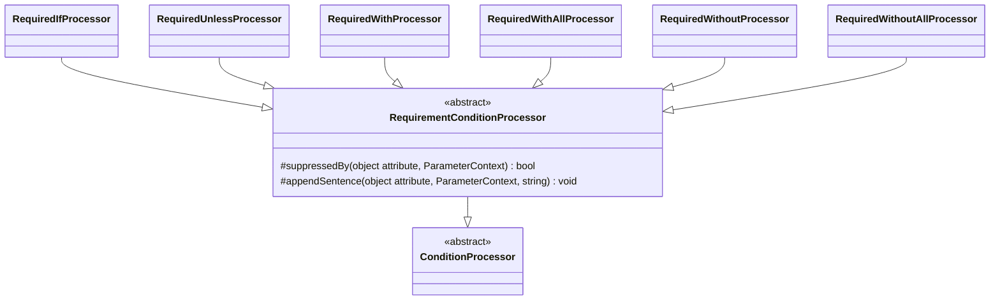

# Conditional Requirement Attributes

Family canvas for STORY-001-001 (`requirements/[User-story-1]conditional-requirement-validation-attributes.md`), plus `Filled` from STORY-001-000. Owns `RequiredIfProcessor`, `RequiredUnlessProcessor`, `RequiredWithProcessor`, `RequiredWithAllProcessor`, `RequiredWithoutProcessor`, `RequiredWithoutAllProcessor`, `Processors/Base/RequirementConditionProcessor`, and the registry rows `RequiredIf`, `RequiredUnless`, `RequiredWith`, `RequiredWithAll`, `RequiredWithout`, `RequiredWithoutAll`, `Filled`.

Related canvases: attribute processing framework (`ConditionProcessor`, `parametersOf`, `renderValues`, `fieldName`); pipeline canvases (`RequirementResolver` publishes a conditionally required property as optional and decides nullability; `RequirementDescriptionStage` writes the `Present` sentence).

Provenance: created by `/spdd-reasons-canvas` from the analysis `spdd/analysis/GGQPA-XXX-202609222058-[Analysis]-conditional-requirement-attributes.md`.

## Requirements

- State, in a sentence an API consumer can read, the circumstance under which a conditionally required property becomes mandatory, naming the field the condition depends on and the value it is compared against.
- Never publish a condition the validator does not enforce.
- State on a `#[Filled]` property that, when included, it must not be empty.

## Entities

`Filled` has no class of its own; it is a `StaticAttributeProcessor` row.

## Approach

**A condition that is not enforced is never published.** Upstream `AttributesRuleInferrer` walks the declared validation attributes in order and, on reaching `Present`, strips every requiring rule collected so far. A conditional attribute declared **before** `#[Present]` is therefore not enforced at runtime, and `RequirementConditionProcessor::suppressedBy` withholds its sentence. One declared **after** `#[Present]` is added after the strip, is still enforced, and keeps its sentence. The same walk adds each requiring attribute through `PropertyRules::add`, which first removes every requiring rule already collected, so only the last requiring attribute survives: a conditional attribute followed by `#[Required]` or by another conditional attribute is replaced and not enforced, and its sentence is withheld too. Suppression follows declaration order for exactly that reason; an order-blind check would hide an enforced rule.

Suppression stays in this family because only requiring rules displace one another **across classes** upstream: `PropertyRules::removeType` drops every collected `RequiringRule` when another is added, but any other rule only when a rule of the same class is added. Why the prohibition and exclusion family does not suppress is recorded in its own canvas.

`Present` has no registry row (framework canvas); its sentence is written by `RequirementDescriptionStage` (requirement resolution canvas). `Filled` is description-only by design.

Known divergences:

- Replacement is detected against a fixed list of requiring attribute classes (`Required` and the six conditional attributes), not against Spatie's `RequiringRule` marker, which `tests/ArchTest.php` confines to `RequirementResolver`. A consumer attribute implementing `RequiringRule` declared after a condition therefore does not suppress it, although upstream replaces the condition.
- `#[Rule(...)]` is expanded through Spatie's `Support\Validation\RuleNormalizer`, resolved from the container, which is the same class `AttributesRuleInferrer` uses. It sits in the namespace whose four internals `tests/ArchTest.php` confines to `RequirementResolver`, but is not one of them; the dependency is accepted rather than routed through the resolver, because it breaks only if Spatie changes how `#[Rule]` is expanded, and `ConditionalRequirementTest` would then fail. A requiring rule declared as a `Rule` string documents no condition sentence of its own; only `#[Required*]` attributes have processors.

## Structure

`Processors/Base/RequirementConditionProcessor.php` extends `ConditionProcessor`; holds suppression and appending; imports Spatie `Present`, `Required`, the six conditional attributes, `Rule`, `RuleNormalizer` and `ValidationRule` for suppression, and `Throwable`. The six processors extend it and import no upstream class.

## Operations

### RequirementConditionProcessor

- `suppressedBy(object $attribute, ParameterContext $context): bool`: reads `property->attributes->all(ValidationRule::class)` — the same declaration-ordered list upstream walks — and finds `$attribute` in it by identity (`array_search` strict). Returns true when any later element is `instanceof Present`, or when any rule it expands to (see `expand`) is `instanceof` one of the private constant `REQUIRING_ATTRIBUTES` (`Required`, `RequiredIf`, `RequiredUnless`, `RequiredWith`, `RequiredWithAll`, `RequiredWithout`, `RequiredWithoutAll`). An attribute not found in the list (only possible when a caller passes an instance the property does not declare, as unit tests do) is treated as declared first, so any `Present` or requiring attribute on the property suppresses it. `DataAttributesCollection` indexes each attribute under its own class plus every interface and parent class, so a consumer subclass of `Present` is in the list and matched by `instanceof`, as it is upstream.
- Private `expand(object $candidate): array`: a `Rule` becomes `app(RuleNormalizer::class)->execute($candidate)`, the rule objects upstream adds for it, inside a try that returns `[]` on any `Throwable`; anything else is returned as `[$candidate]`. A `Rule` is never tested as `Present`: upstream checks the declared attribute itself, so `#[Rule('present')]` does not strip a condition.
- `appendSentence(object $attribute, ParameterContext $context, string $sentence): void`: appends to `descriptions[]` unless `suppressedBy($attribute, $context)`. Each processor passes the attribute it is processing.
- Docblock on `suppressedBy` states the upstream ordering rule, the not-declared fallback, and why a `Rule` is expanded but never treated as `Present`. Docblock on `REQUIRING_ATTRIBUTES` states why it is a class list rather than the `RequiringRule` marker.

### Attributes

`{field}` is rendered via `fieldName(extractFieldName(...))`, `{values}` via the framework's `renderValues`. Every conditional processor reads through `parametersOf` and appends through `appendSentence`, so every sentence below is subject to suppression. All write `descriptions[]` only.

| Attribute | Processor (base) | Reads / guards | Sentence | Requirement effect | Example rule |
| --- | --- | --- | --- | --- | --- |
| `RequiredIf` | `RequiredIfProcessor` (`RequirementConditionProcessor`) | index 0 field, index 1 value list (`(array)`); skip when null, shorter than two, or the list is empty | `Required when {field} is {values}.` — degraded, when `renderValues` is null: `Required depending on the value of {field}.` | conditional: never makes the field required by itself; published optional unless a key-demanding rule (`#[Present]` in either order, `Accepted`, `Declined`) applies | generated |
| `RequiredUnless` | `RequiredUnlessProcessor` (same) | same as `RequiredIf` | `Required unless {field} is {values}.` — degraded as `RequiredIf` | conditional: never makes the field required by itself; published optional unless a key-demanding rule (`#[Present]` in either order, `Accepted`, `Declined`) applies | generated |
| `RequiredWith` | `RequiredWithProcessor` (same) | `fieldNames((array) (parameters[0] ?? []))`; skip when null or empty | one: `Required when {a} is present.`; two or more: `Required when any of {a}, {b} is present.` | conditional: never makes the field required by itself; published optional unless a key-demanding rule (`#[Present]` in either order, `Accepted`, `Declined`) applies | generated |
| `RequiredWithAll` | `RequiredWithAllProcessor` (same) | same | one: `Required when {a} is present.`; two: `Required when both {a} and {b} are present.`; three or more: `Required when all of {a}, {b}, {c} are present.` | conditional: never makes the field required by itself; published optional unless a key-demanding rule (`#[Present]` in either order, `Accepted`, `Declined`) applies | generated |
| `RequiredWithout` | `RequiredWithoutProcessor` (same) | same | one: `Required when {a} is not present.`; two or more: `Required when any of {a}, {b} is not present.` | conditional: never makes the field required by itself; published optional unless a key-demanding rule (`#[Present]` in either order, `Accepted`, `Declined`) applies | generated |
| `RequiredWithoutAll` | `RequiredWithoutAllProcessor` (same) | same | one: `Required when {a} is not present.`; two: `Required when neither {a} nor {b} is present.`; three or more: `Required when none of {a}, {b}, {c} are present.` | conditional: never makes the field required by itself; published optional unless a key-demanding rule (`#[Present]` in either order, `Accepted`, `Declined`) applies | generated |
| `Filled` | `StaticAttributeProcessor` (description only) | none | `When included, must not be empty.` | null-rejecting: never published nullable; does not demand the key | generated |

- `RequiredIf`/`RequiredUnless` skip an empty compared list because Laravel throws on such a declaration at validation time (`required_if requires at least 2 parameters`), so there is no enforced condition to state; an inline comment records that reason. The degraded sentence means an `ExternalReference` among the values: it resolves from the container, configuration or the current request at validation time, and dereferencing it would make output environment-dependent, could throw, and could leak an internal identifier into a published document.
- Sentence shape depends on arity, so the common two-field case reads naturally rather than as a list. Sentence text lives in private class constants on each processor.

## Norms

- Conditional processors write only to `descriptions[]`, and only through `appendSentence`; they never touch `required`, `nullable`, `format`, `pattern` or any numeric constraint field.
- The requirement effects above are decided by `RequirementResolver` (requirement resolution canvas); this family states conditions in prose and nothing else.

## Safeguards

- No condition sentence is published for a conditional attribute declared before `#[Present]`, `#[Required]` or another conditional attribute on the same property, because upstream strips or replaces it and the condition is therefore not enforced. One declared after all of them is enforced and keeps its sentence. The same holds for a requiring rule declared through `#[Rule('required')]` or `#[Rule('required_with:…')]`; `#[Rule('present')]` does not suppress. `ConditionalRequirementTest` pins both `Present` orders, conditional-then-conditional, conditional-then-`Required`, and the four `RuleStringTestData` cases against `getValidationRules`, so a change to upstream's ordering or `#[Rule]` expansion fails the test.
- `RequiredIf`/`RequiredUnless` with no compared value append nothing. Pinned by the "appends nothing when no value is given" case in both processors' Pest files.
- The one container call, `app(RuleNormalizer::class)` in the private `expand`, resolves Spatie's stateless normalizer service to expand a declared `#[Rule]`, not a value to publish. A `Rule` that cannot be expanded counts as expanding to nothing, pinned by `RequiredWithProcessorTest`.
