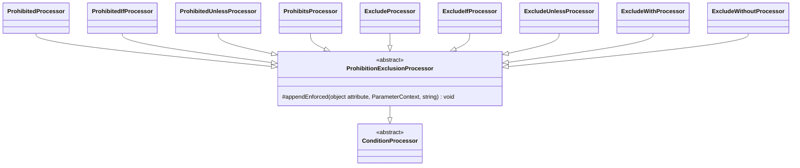

# Prohibition and Exclusion Attributes

Family canvas for STORY-001-002 (`requirements/[User-story-2]prohibition-and-exclusion-validation-attributes.md`). Owns the family-private base `Base/ProhibitionExclusionProcessor`, `ProhibitedProcessor`, `ProhibitedIfProcessor`, `ProhibitedUnlessProcessor`, `ProhibitsProcessor`, `ExcludeProcessor`, `ExcludeIfProcessor`, `ExcludeUnlessProcessor`, `ExcludeWithProcessor`, `ExcludeWithoutProcessor`, and the registry rows `Prohibited`, `ProhibitedIf`, `ProhibitedUnless`, `Prohibits`, `Exclude`, `ExcludeIf`, `ExcludeUnless`, `ExcludeWith`, `ExcludeWithout`.

Related canvases: attribute processing framework (`ConditionProcessor`, `parametersOf`, `renderValues`, `fieldName`; `ReplacedRules::isReplaced`, which the base calls and `AttributeProcessingStage` also applies, and `ReplacedRules::expand`, which reads a bare `exclude` rule string as `#[Exclude]`); pipeline canvases (`RequirementResolver` computes `neverSatisfiable`, and `RequirementDescriptionStage` writes its sentence; prohibition never changes requirement status).

Provenance: analysis `spdd/analysis/GGQPA-XXX-202609251142-[Analysis]-prohibition-exclusion-attributes.md`. Carved out of the former attribute processors canvas; git history keeps it.

## Requirements

- State when sending a field causes the request to be **rejected** (`#[Prohibited]`, `#[ProhibitedIf]`, `#[ProhibitedUnless]`, and `#[Prohibits]` on the carrier field).
- State when a field is **not validated and removed from the validated input** (`#[Exclude]` and its four conditional forms).
- Word the two families so that neither can be mistaken for the other, and so that exclusion never claims more than the validator guarantees.

## Entities

`ProhibitionExclusionProcessor` is family-private: it withholds a sentence whose attribute a later declaration of the same class replaced (see Approach).

## Approach

**Rejection and removal are worded apart.** Prohibition sentences open with "Must not be sent" (or "Sending this field forbids sending" for `#[Prohibits]`) and end by naming the consequence, "the request is rejected …". Exclusion sentences open with "Not validated, and removed from the validated input" and never say ignored, discarded, dropped, must or rejected. Both families state conditions in the same words as the conditional requirement family, so the verb phrase is the only difference a reader compares. Exclusion is worded at validator level because Laravel Data builds the Data object from the request payload (`ValidatePropertiesDataPipe` returns the properties, not the validated array): an excluded value still reaches application code, unvalidated. "Must not be sent" is stricter than runtime, which accepts a prohibited key sent empty; signed off as a safe simplification.

**A condition that cannot be read is stated as conditional, never as unconditional.** `#[Prohibited]` and `#[Exclude]` may wrap an Illuminate rule object whose condition is opaque. The bare form is recognised by the framework's `ReplacedRules::isBare`, which reads the protected `$rule` property through a closure bound to the attribute, without calling `getRule(ValidationPath)`, whose argument type `tests/ArchTest.php` confines to `RequirementResolver`. It holds for a consumer subclass too, which the registry documents through its parent: a bare subclass of `Prohibited` or `Exclude` is stated as unconditional, and a bare `Prohibited` subclass on a required field gets the never-satisfiable note (`ProhibitionExclusionTest`). A subclass that declares its own `getRule()` enforces whatever that returns, which the documentation cannot read, so `isBare` (by reflection on the method's declaring class) never counts it as bare and it is stated as conditional. Stringifying the attribute is ruled out because it evaluates the wrapped rule's condition. A wrapped form states "in some requests".

**A sentence is published only while its attribute is enforced; requiring rules and `Present` never withhold it.** Upstream `AttributesRuleInferrer` adds each declared validation attribute, in declaration order, through `PropertyRules::add`, whose `removeType` first drops every collected rule that is `instanceof` the class of a rule being added. Among this family's attributes that takes a later declaration expanding to a rule of which the attribute is an instance: a `#[Rule(...)]` that expands (through `RuleNormalizer`) to a rule of the **same class**, or, for a consumer subclass, a later attribute of its parent class (no Spatie validation attribute is repeatable). So `#[ProhibitedIf('plan', 'enterprise'), Rule('prohibited_if:role,admin')]` enforces only the `role` condition, as does `#[SubProhibitedIf('plan', 'enterprise'), ProhibitedIf('role', 'admin')]`, and `#[Exclude, Rule([new \Illuminate\Validation\Rules\ExcludeIf(false)])]` enforces only the conditional exclusion. `ProhibitionExclusionProcessor::appendEnforced` walks the attributes declared after the processed one, as upstream does, and withholds the sentence when any later declaration expands to a rule of the attribute's class, equal or not. An equal rule is the later declaration's rule, and the framework documents it through its own expansion, so `#[Prohibited, Rule('prohibited')]` publishes the sentence once, from the rule, and `#[ProhibitedIf('plan', 'enterprise'), Rule('prohibited_if:role,admin|prohibited_if:plan,enterprise')]` publishes the `role` and `plan` conditions once each: one `add` call pushes all the rules a `Rule` expands to after removing the earlier ones, so the `plan` condition is still enforced, by the rule. A rule of another class never replaces one: `removeType` drops every collected `RequiringRule` only when another requiring rule is added, and `Present` strips only requiring rules, so a later `#[Required]`, `#[Present]`, `#[Rule('prohibited_unless:…')]` or `#[Rule('exclude_if:…')]` after `#[Exclude]` leaves the sentence in place. This is why the family does not extend `RequirementConditionProcessor`, whose suppression would hide an enforced rule.

Verified by execution against `spatie/laravel-data ^4.14` with `getValidationRules` and Laravel's validator: a later `Rule('prohibited_if:role,admin')` leaves only `prohibited_if:role,admin` (a payload with `plan=enterprise` passes, one with `role=admin` fails); `Rule('prohibited_unless:…')` after `#[ProhibitedIf]` keeps both rules; `Rule('prohibited_if:role,admin|prohibited_if:plan,enterprise')` keeps both conditions; `Rule([new ExcludeIf(false)])` after `#[Exclude]` leaves only the Illuminate rule, and the value is then validated and kept. `#[Rule(new ExcludeIf(...))]` without the array is coerced to its string form when PHP instantiates the attribute (`Rule`'s variadic accepts `string` but no `Stringable`), which freezes the condition at that moment: `'exclude'` when it is true, `''` when it is false. `RuleNormalizer` leaves either as a plain `Rule`, so upstream it does not replace `#[Exclude]`; both then apply. The framework reads `'exclude'` as `#[Exclude]` (see below), documented once; `''` documents nothing. Either way the `#[Exclude]` still applies and keeps its sentence.

**Rule strings are documented like the attributes.** A `#[Rule('prohibited…')]` / `#[Rule('exclude…')]` string is documented through the attribute it expands to (framework canvas), and a replaced attribute's sentence is withheld while the replacing rule is documented instead: `#[ProhibitedIf('plan', 'enterprise'), Rule('prohibited_if:role,admin')]` publishes only the `role` sentence. A bare `#[Rule('exclude')]`, which Spatie leaves a `Rule` but Laravel still enforces, is read by the framework's `ReplacedRules::expand` as `#[Exclude]`, so it publishes the unconditional exclusion sentence.

Known divergences:

- A field named by `#[Prohibits]` gets no reciprocal sentence; only the carrier is documented, because a reciprocal sentence needs sibling lookup.
- Constraint sentences on an excluded field (e.g. `#[Exclude, Email]`) are kept, although the rule is not enforced while the exclusion holds.
- A property carrying both a prohibition and an exclusion attribute publishes both sentences in declaration order; which wins at runtime depends on that order.
- A `Rule` that `RuleNormalizer` cannot expand counts as expanding to nothing and never replaces an attribute; upstream would fail on such a declaration anyway.
- A bare `#[Rule('exclude')]` followed by a conditional `#[Exclude]` also publishes the conditional exclusion sentence, since Laravel enforces both; it is redundant, not false.
- In a nested Data object a comma-joined reference names siblings, while Laravel reads only the first part under the path: Spatie prefixes the whole string (`prohibits:child.a,b`), so `#[Prohibits('a,b')]`, `ExcludeWith` and `ExcludeWithout` on a child check `child.a` and a root-level `b`.
- Two identical rules from one `Rule` (`#[Rule('prohibited|prohibited')]`) are both documented, so the sentence appears twice: one `add` call pushes both upstream, and neither is declared after the other.
- A `null` compared value (`ProhibitedUnless('role', [null])`, `ExcludeUnless`) is stated as `""`, the empty string Laravel's validator compares against; Laravel's default `ConvertEmptyStringsToNull` middleware turns a sent `""` into null, so over HTTP in a default application that exemption is never reached. The sentence states the rule as the validator reads it.

## Structure

`Processors/Base/ProhibitionExclusionProcessor.php` extends `ConditionProcessor` and imports nothing upstream: it delegates the replacement check to the framework's `ReplacedRules::isReplaced`. The nine processors extend it. Only `ProhibitedProcessor` and `ExcludeProcessor` import an upstream class: `Prohibited` and `Exclude` respectively, for the bare-form comparison.

## Operations

`{field}` and `{values}` of the `If`/`Unless` rows come from the framework's `conditionParts` and `renderValues`: Laravel splits the rule as CSV, so a field written `'a,b'` reads the field `a`, and `b` leads the compared values. Every processor except `ProhibitedProcessor`/`ExcludeProcessor` reads through `parametersOf` and returns when it is null. All append to `descriptions[]` through `appendEnforced` and write nothing else. A `null` in a compared value list (`ProhibitedIf('plan', [null])`) is rendered `<code>""</code>`, the empty part Spatie writes for it and Laravel compares as `''`.

### ProhibitionExclusionProcessor

- `appendEnforced(object $attribute, ParameterContext $context, string $sentence): void`: appends `$sentence` unless the private `replacedLater($attribute, $context)` is true. Each processor passes the attribute it is processing.
- Private `replacedLater(object $attribute, ParameterContext $context): bool`: delegates to the framework's `ReplacedRules::isReplaced($attribute, $context->property)`, which `AttributeProcessingStage` also applies to every family; kept so a processor called directly, as unit tests do, withholds the sentence too. The rule: replaced as soon as some candidate in `declaredAfter($attribute, $context)` expands (`expand($candidate)`) to a rule of which `$attribute` is an instance (upstream's own test), equal or not. An attribute not declared on the property is treated as declared first (`declaredAfter`'s fallback), as unit tests pass fresh instances.
- Its docblock states the upstream rule (`removeType` by class, one `add` per declaration), why an equal rule replaces it too (it is documented in the attribute's place), and why requiring rules and `Present` are not considered.

| Attribute | Processor | Reads / guards | Sentence | Requirement effect | Example rule |
| --- | --- | --- | --- | --- | --- |
| `Prohibited` | `ProhibitedProcessor` | no parameters; bare when `ReplacedRules::isBare($attribute)` | bare: `Must not be sent; the request is rejected if it is.`; wrapped: `Must not be sent in some requests; the request is rejected if it is.` | none; a bare `Prohibited` feeds `neverSatisfiable` | generated |
| `ProhibitedIf` | `ProhibitedIfProcessor` | `conditionParts(index 0)` field, then its extra parts ahead of the index 1 value list (`(array)`); skip when shorter than two or that combined list is empty | `Must not be sent when {field} is {values}; the request is rejected if it is.` — degraded: `Must not be sent when {field} has certain values; the request is rejected if it is.` | none | generated |
| `ProhibitedUnless` | `ProhibitedUnlessProcessor` | same as `ProhibitedIf` | `Must not be sent unless {field} is {values}; the request is rejected if it is.` — degraded: `Must not be sent unless {field} has certain values; the request is rejected if it is.` | none | generated |
| `Prohibits` | `ProhibitsProcessor` | `fieldNames((array) (parameters[0] ?? []))`, which splits a comma-joined reference as Laravel does; skip when empty | one: `Sending this field forbids sending {a}; the request is rejected if both are sent.`; two or more: `Sending this field forbids sending {list}; the request is rejected if any of them is also sent.` | none | generated |
| `Exclude` | `ExcludeProcessor` | no parameters; bare when `ReplacedRules::isBare($attribute)` | bare: `Not validated, and removed from the validated input.`; wrapped: `Not validated, and removed from the validated input, in some requests.` | none; withholds `neverSatisfiable` when it precedes a bare `Prohibited` | generated |
| `ExcludeIf` | `ExcludeIfProcessor` | `conditionParts(index 0)` field, single value at index 1 rendered as `renderValues([...extra field parts, $value])`; skip when shorter than two | `Not validated, and removed from the validated input when {field} is {value}.` — degraded: `Not validated, and removed from the validated input depending on the value of {field}.` | as `Exclude` | generated |
| `ExcludeUnless` | `ExcludeUnlessProcessor` | same as `ExcludeIf` | `Not validated, and removed from the validated input unless {field} is {value}.` — degraded as `ExcludeIf` | as `Exclude` | generated |
| `ExcludeWith` | `ExcludeWithProcessor` | field at index 0; skip when unset. A comma-joined reference names only its first part, the one Laravel's `validateExcludeWith` reads | `Not validated, and removed from the validated input when {field} is present.` | as `Exclude` | generated |
| `ExcludeWithout` | `ExcludeWithoutProcessor` | field at index 0, split by `fieldNames`; every part is named, as Laravel checks each (`anyFailingRequired`) | one: `Not validated, and removed from the validated input when {field} is not present.`; two or more: `Not validated, and removed from the validated input when any of {a}, {b} is not present.` | as `Exclude` | generated |

- `ProhibitedIf`/`ProhibitedUnless` follow the same control flow as `RequiredIf`/`RequiredUnless`: the field is split with `conditionParts` first, and the processor skips only when the combined compared list is empty, with the inline comment that Laravel throws on such a declaration; they append without suppression. A field written `'a,b'` with no declared value is enforced as `prohibited_if:a,b` and states "Must not be sent when a is b; …".
- `ProhibitsProcessor`'s private `joinFields` renders `a and b` / `a, b and c` (no Oxford comma).
- `ExcludeIf`/`ExcludeUnless` hold a **single** value upstream, so bools, enums and floats render as in the conditional requirement family; a comma-joined string is split into the values Laravel compares (framework canvas), so `ExcludeIf('mode', 'a,b')` reads "when mode is one of: a, b" (`ConditionValuesTest` pins `ExcludeIf` and `ExcludeUnless`).
- `ProhibitedProcessor` and `ExcludeProcessor` have no comments; `isBare`'s docblock (framework canvas) records why the wrapped rule is read and not evaluated. `ExcludeWithProcessor` and `ExcludeWithoutProcessor` each carry a one-line comment on how Laravel reads a comma-joined reference.

## Norms

- Sentence text lives in private class constants.
- Prohibition sentences name the rejection; exclusion sentences name removal from the validated input and nothing stronger.
- The requirement effects above, including `neverSatisfiable`, are decided by `RequirementResolver` (requirement resolution canvas); this family states prohibition and exclusion in prose and nothing else.

## Safeguards

- `ProhibitionExclusionTest` also counts both conditions of one `Rule('prohibited_if:role,admin|prohibited_if:plan,enterprise')` once each, and pins that a later `#[Present]` or `#[Required]` leaves an `#[Exclude]` sentence in place.
- No processor in this family extends `RequirementConditionProcessor` or calls `suppressedBy`/`appendSentence`; only a later declaration expanding to a rule of the attribute's own class withholds its sentence. `ProhibitionExclusionTest` pins a `#[ProhibitedIf]` followed by `#[Required]`, and pins each replacement case in Approach against `getValidationRules` and Laravel's validator (replaced by another condition, re-added by an equal rule, re-added in the same `Rule`, kept by a rule of another class, `#[Exclude]` replaced by an array-wrapped `ExcludeIf`, kept by an earlier `Rule`), counting the sentence so an enforced rule is stated exactly once and a replaced one not at all; a change to upstream's replacement rule fails the test.
- Prohibition and exclusion never make a field optional; the "required and prohibited" warning is written by `RequirementDescriptionStage` (requirement resolution canvas).
- Every prohibition sentence names the rejection. No exclusion sentence contains ignored, discarded, dropped, must or rejected. `ProhibitionExclusionTest` (AC8) pins the distinction on the conditional pair `ExcludeIf` / `ProhibitedIf`; each processor's Pest file pins its exact sentences.
- No wrapped Illuminate rule object inside `#[Prohibited]`/`#[Exclude]` is stringified or evaluated.
- A bare `#[Rule('exclude')]` is documented exactly as `#[Exclude]`, and once after an `#[Exclude]`; a conditional `#[Exclude]` declared after it does not make it conditional. `RuleStringsTest` pins all three. Like `#[Exclude]`, it withholds the never-satisfiable warning of a later bare `#[Prohibited]`; `ProhibitionExclusionTest` pins that against Laravel's validator.
- A bare consumer subclass of `Prohibited` or `Exclude` is stated as unconditional, and the subclass of `Prohibited` on a required field gets the never-satisfiable note; a subclass of either that declares its own `getRule()` (`prohibited_unless:role,admin`, `exclude_if:mode,legacy`) is stated as conditional and gets no note; a `Prohibited` subclass that wraps a rule through its constructor is stated as conditional; a `ProhibitedIf` subclass followed by its parent is replaced. `ProhibitionExclusionTest` pins all of them against the validator.
- At root level, a comma-joined field reference in `Prohibits`, `ExcludeWith` or `ExcludeWithout` names the fields Laravel reads (`ConditionValuesTest`, whose unit counterpart `ExcludeWithoutProcessorTest` pins the multi-field sentence). A condition's comma-joined field reads the first part as the field and the rest as compared values: `ConditionValuesTest` pins `ProhibitedIf('first,second', 'x')` and `ExcludeIf('first,second', 'x')` against the validator, and `ProhibitedIf('first,second')` / `ProhibitedUnless('first,second')` with no declared value ("reads a comma-joined condition field with no compared value…").
- `ProhibitsProcessorTest` pins `#[Prohibits]` with no fields; `ProhibitedIfProcessorTest` pins that the sentence is not suppressed by `Present`.
