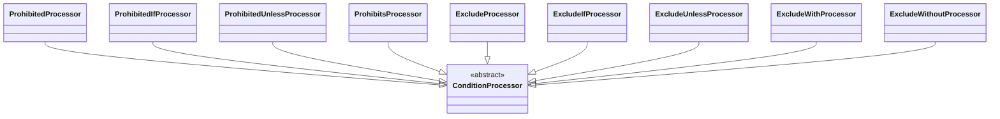

# Prohibition and Exclusion Attributes

Family canvas for STORY-001-002 (`requirements/[User-story-2]prohibition-and-exclusion-validation-attributes.md`). Owns `ProhibitedProcessor`, `ProhibitedIfProcessor`, `ProhibitedUnlessProcessor`, `ProhibitsProcessor`, `ExcludeProcessor`, `ExcludeIfProcessor`, `ExcludeUnlessProcessor`, `ExcludeWithProcessor`, `ExcludeWithoutProcessor`, and the registry rows `Prohibited`, `ProhibitedIf`, `ProhibitedUnless`, `Prohibits`, `Exclude`, `ExcludeIf`, `ExcludeUnless`, `ExcludeWith`, `ExcludeWithout`.

Related canvases: attribute processing framework (`ConditionProcessor`, `parametersOf`, `renderValues`, `fieldName`); pipeline canvases (`RequirementResolver` computes `neverSatisfiable`, and `RequirementDescriptionStage` writes its sentence; prohibition never changes requirement status).

Provenance: created by `/spdd-reasons-canvas` from the analysis `spdd/analysis/GGQPA-XXX-202609251142-[Analysis]-prohibition-exclusion-attributes.md`.

## Requirements

- State when sending a field causes the request to be **rejected** (`#[Prohibited]`, `#[ProhibitedIf]`, `#[ProhibitedUnless]`, and `#[Prohibits]` on the carrier field).
- State when a field is **not validated and removed from the validated input** (`#[Exclude]` and its four conditional forms).
- Word the two families so that neither can be mistaken for the other, and so that exclusion never claims more than the validator guarantees.

## Entities

No family-private base class.

## Approach

**Rejection and removal are worded apart.** Prohibition sentences open with "Must not be sent" (or "Sending this field forbids sending" for `#[Prohibits]`) and end by naming the consequence, "the request is rejected …". Exclusion sentences open with "Not validated, and removed from the validated input" and never say ignored, discarded, dropped, must or rejected. Both families state conditions in the same words as the conditional requirement family, so the verb phrase is the only difference a reader compares. Exclusion is worded at validator level because Laravel Data builds the Data object from the request payload (`ValidatePropertiesDataPipe` returns the properties, not the validated array): an excluded value still reaches application code, unvalidated. "Must not be sent" is stricter than runtime, which accepts a prohibited key sent empty; signed off as a safe simplification.

**A condition that cannot be read is stated as conditional, never as unconditional.** `#[Prohibited]` and `#[Exclude]` may wrap an Illuminate rule object whose condition is opaque. The bare form is recognised by loose equality against a fresh instance (`$attribute == new Prohibited()`), which compares the protected `$rule` property without reflection and without `getRule(ValidationPath)`, whose argument type `tests/ArchTest.php` confines to `RequirementResolver`. Stringifying the attribute is ruled out because it evaluates the wrapped rule's condition. A wrapped form states "in some requests".

**No suppression.** Unlike the conditional requirement family, these processors do not extend `RequirementConditionProcessor`. `PropertyRules::removeType` drops a collected prohibition or exclusion rule only when a rule of the same class is added, never for a requiring rule, so a later `#[Required]` does not disable `#[ProhibitedIf]`, and inheriting suppression would hide an enforced rule.

Known divergences:

- Prohibition and exclusion attributes declared through `#[Rule('prohibited…')]` / `#[Rule('exclude…')]` strings document no sentence; only the attribute classes have processors.
- A field named by `#[Prohibits]` gets no reciprocal sentence; only the carrier is documented, because a reciprocal sentence needs sibling lookup.
- Constraint sentences on an excluded field (e.g. `#[Exclude, Email]`) are kept, although the rule is not enforced while the exclusion holds.
- A property carrying both a prohibition and an exclusion attribute publishes both sentences in declaration order; which wins at runtime depends on that order.
- A later `#[Rule]` that expands to a rule of the same class replaces the attribute upstream, but the attribute's sentence is still published. `#[ProhibitedIf('plan', 'enterprise'), Rule('prohibited_if:role,admin')]` states the `plan` condition, which is no longer enforced; `#[Exclude, Rule([new \Illuminate\Validation\Rules\ExcludeIf(false)])]` states the unconditional exclusion while only the conditional one is enforced.

## Structure

The nine processors extend `ConditionProcessor`. Only `ProhibitedProcessor` and `ExcludeProcessor` import an upstream class: `Prohibited` and `Exclude` respectively, for the bare-form comparison.

## Operations

`{field}` via `fieldName(extractFieldName(...))`; `{values}` via the framework's `renderValues`. Every processor except `ProhibitedProcessor`/`ExcludeProcessor` reads through `parametersOf` and returns when it is null. All append directly to `descriptions[]` and write nothing else.

| Attribute | Processor | Reads / guards | Sentence | Requirement effect | Example rule |
| --- | --- | --- | --- | --- | --- |
| `Prohibited` | `ProhibitedProcessor` | no parameters; bare when `$attribute == new Prohibited()` | bare: `Must not be sent; the request is rejected if it is.`; wrapped: `Must not be sent in some requests; the request is rejected if it is.` | none; a bare `Prohibited` feeds `neverSatisfiable` | generated |
| `ProhibitedIf` | `ProhibitedIfProcessor` | index 0 field, index 1 value list (`(array)`); skip when shorter than two or the list is empty | `Must not be sent when {field} is {values}; the request is rejected if it is.` — degraded: `Must not be sent when {field} has certain values; the request is rejected if it is.` | none | generated |
| `ProhibitedUnless` | `ProhibitedUnlessProcessor` | same as `ProhibitedIf` | `Must not be sent unless {field} is {values}; the request is rejected if it is.` — degraded: `Must not be sent unless {field} has certain values; the request is rejected if it is.` | none | generated |
| `Prohibits` | `ProhibitsProcessor` | `fieldNames((array) (parameters[0] ?? []))`; skip when empty | one: `Sending this field forbids sending {a}; the request is rejected if both are sent.`; two or more: `Sending this field forbids sending {list}; the request is rejected if any of them is also sent.` | none | generated |
| `Exclude` | `ExcludeProcessor` | no parameters; bare when `$attribute == new Exclude()` | bare: `Not validated, and removed from the validated input.`; wrapped: `Not validated, and removed from the validated input, in some requests.` | none; withholds `neverSatisfiable` when it precedes a bare `Prohibited` | generated |
| `ExcludeIf` | `ExcludeIfProcessor` | index 0 field, single value at index 1 rendered as `renderValues([$value])`; skip when shorter than two | `Not validated, and removed from the validated input when {field} is {value}.` — degraded: `Not validated, and removed from the validated input depending on the value of {field}.` | as `Exclude` | generated |
| `ExcludeUnless` | `ExcludeUnlessProcessor` | same as `ExcludeIf` | `Not validated, and removed from the validated input unless {field} is {value}.` — degraded as `ExcludeIf` | as `Exclude` | generated |
| `ExcludeWith` | `ExcludeWithProcessor` | single field at index 0; skip when unset | `Not validated, and removed from the validated input when {field} is present.` | as `Exclude` | generated |
| `ExcludeWithout` | `ExcludeWithoutProcessor` | same as `ExcludeWith` | `Not validated, and removed from the validated input when {field} is not present.` | as `Exclude` | generated |

- `ProhibitedIf`/`ProhibitedUnless` follow the same control flow as `RequiredIf`/`RequiredUnless`, including the inline comment that Laravel throws on an empty compared list, but append without suppression.
- `ProhibitsProcessor`'s private `joinFields` renders `a and b` / `a, b and c` (no Oxford comma).
- `ExcludeIf`/`ExcludeUnless` hold a **single** value upstream, so bools, enums and floats render as in the conditional requirement family.
- In `ProhibitedProcessor` and `ExcludeProcessor`, a one-line comment records why loose equality is used; it is the only comment in either class.

## Norms

- Sentence text lives in private class constants.
- Prohibition sentences name the rejection; exclusion sentences name removal from the validated input and nothing stronger.
- The requirement effects above, including `neverSatisfiable`, are decided by `RequirementResolver` (requirement resolution canvas); this family states prohibition and exclusion in prose and nothing else.

## Safeguards

- No processor in this family extends `RequirementConditionProcessor` or calls `suppressedBy`/`appendSentence`, so their sentences appear whatever is declared after them. `ProhibitionExclusionTest` pins a `#[ProhibitedIf]` followed by `#[Required]`.
- Prohibition and exclusion never make a field optional; the "required and prohibited" warning is written by `RequirementDescriptionStage` (requirement resolution canvas).
- Every prohibition sentence names the rejection. No exclusion sentence contains ignored, discarded, dropped, must or rejected. `ProhibitionExclusionTest` (AC8) pins the distinction on the conditional pair `ExcludeIf` / `ProhibitedIf`; each processor's Pest file pins its exact sentences.
- No wrapped Illuminate rule object inside `#[Prohibited]`/`#[Exclude]` is stringified or evaluated.
- `ProhibitsProcessorTest` pins `#[Prohibits]` with no fields; `ProhibitedIfProcessorTest` pins that the sentence is not suppressed by `Present`.
