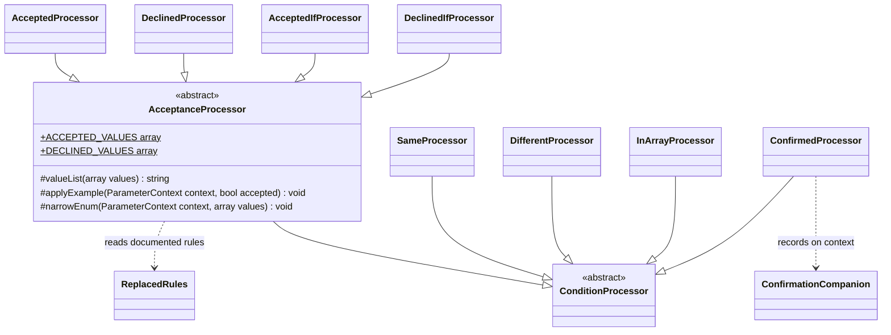

# Cross-Field Comparison and Acceptance Attributes

Family canvas for STORY-001-003 (`requirements/[User-story-3]cross-field-comparison-validation-attributes.md`). Owns `SameProcessor`, `DifferentProcessor`, `InArrayProcessor`, `ConfirmedProcessor`, `AcceptedProcessor`, `AcceptedIfProcessor`, `DeclinedProcessor`, `DeclinedIfProcessor`, `Processors/Base/AcceptanceProcessor`, and the registry rows `Same`, `Different`, `InArray`, `Confirmed`, `Accepted`, `AcceptedIf`, `Declined`, `DeclinedIf`.

Related canvases: attribute processing framework (`ConditionProcessor`, `parametersOf`, `renderValues`, `fieldName`); documentation records (`ConfirmationCompanion`); DTO parameter extraction (`ParameterGenerator` publishes the companion `ConfirmedProcessor` records); pipeline canvases (`RequirementResolver` publishes `Accepted`/`Declined` fields as required and not nullable; `TypeStage` writes the `type` the acceptance example reads; `ExampleGenerationStage` skips a context whose example is set).

Provenance: analysis `spdd/analysis/GGQPA-XXX-202609251435-[Analysis]-cross-field-comparison-acceptance-attributes.md`. The story owner signed off on 2026-09-25 on the enforced companion name (D2), the literal bare `InArray` form (D4), acceptance and companion examples (D6), the value-list rendering, and the restated value set in conditional sentences (D5). Carved out of the former attribute processors canvas; git history keeps it.

## Requirements

- State how a field's value must relate to another submitted field: equal to it (`#[Same]`), different from it (`#[Different]`), or one of its values (`#[InArray]`, documented as it really behaves).
- State on a `#[Confirmed]` field that a matching confirmation field must be sent, and record that companion, under the name runtime enforces, for the parameter generator to publish.
- State exactly which values count as acceptance or refusal (`#[Accepted]`, `#[Declined]`, `#[AcceptedIf]`, `#[DeclinedIf]`), unconditionally or under a stated condition.
- Give an `#[Accepted]` / `#[Declined]` field an example that passes its rule when no example was supplied.

## Entities

`AcceptanceProcessor` holds what the four acceptance processors share: the two value sets Laravel compares against, their rendering, and the example rule. It extends `ConditionProcessor` rather than `FieldReferenceProcessor` because the conditional pair needs `parametersOf` and `renderValues`. `Same`, `Different`, `InArray` and `Confirmed` extend `ConditionProcessor` directly, for `parametersOf`. `ComparisonProcessor` (size and bounds) is not reused for `Same`/`Different`: it exists to write numeric bounds, and field equality has no schema form.

## Approach

**A comparison names the other field as written, and never looks it up.** `Same`, `Different` and `InArray` always hold a single `FieldReference` (string input is wrapped), but Laravel splits the rule it becomes as CSV, so a name written `'a,b'` is several fields at runtime. The processors read it through the framework's `fieldNames` and name what Laravel reads: `Same` and `InArray` the first part (`same` and `in_array` compare with the first field only), `Different` every part (`different` checks each). A reference to an undeclared field still renders and cannot fail the build.

**`InArray` is documented as it behaves.** `in_array:tags` compares against the key `tags` itself; only `in_array:tags.*` checks membership of an array field. The sentence is therefore chosen by the referenced name: one containing `*` states membership, with a single trailing `.*` stripped for display (`tags.*.id` is shown as written); one without `*` states equality, literally. A bare reference to an array field is documented as "Must equal the value of…" with no warning (D4, signed off).

**The confirmation field is named as runtime enforces it.** Laravel Data's `Confirmed` declares no constructor, so `parameters()` returns `[]`. What happens to `#[Confirmed('email_repeat')]` depends on the PHP version. PHP 8.4 discards the argument, and runtime still demands `<property>_confirmation`. PHP 8.3 refuses to instantiate the attribute (`Error: Attribute class … does not have a constructor, cannot pass arguments`), so Laravel Data cannot build the Data class at all, and documentation generation for it fails with the same error the application hits. Nothing is swallowed, because there is no enforced contract to document. `#[Rule('confirmed:email_repeat')]` is rebuilt through the same constructor-less class and loses the name too (analysis Result 1). `ConfirmedProcessor` therefore names the companion `{input}_confirmation`, where `{input}` is the property's `inputMappedName`, else its name (Spatie builds the rules under that name and Laravel's `validateConfirmed` reads `$attribute.'_confirmation'`), and reads a name from `parameters()[0]` only when one is reported, so that an upstream change is followed rather than contradicted. The processor states the rule on the source and records a `ConfirmationCompanion` on the context: the name plus the companion's two sentences, so the `<b><i>` markup stays in this layer. It does not build the companion parameter. That needs the source's resolved `required`, `nullable` and final `example`, which exist only after `RequiredStage` and `ExampleGenerationStage`, and it is emitted by `ParameterGenerator` (DTO extraction canvas).

**Acceptance values are derived from the values Laravel compares against, never typed twice.** `ACCEPTED_VALUES` (`'yes', 'on', 1, '1', true, 'true'`) and `DECLINED_VALUES` (`'no', 'off', 0, '0', false, 'false'`) hold the PHP values of Laravel's `validateAccepted` / `validateDeclined`. The rendered text comes from them. The conditional forms restate the full value set after their condition (D5). Acceptance sentences state values only: `RequirementResolver` already publishes `Accepted`/`Declined` fields as required and not nullable, and the sentences neither repeat nor contradict that.

**An acceptance example passes the acceptance rule.** `AcceptedProcessor` and `DeclinedProcessor` set `example` from the value set by the documented `type`, only when no example is set yet. Package attributes are processed before validation attributes, so an explicit `#[Example]` wins, and `ExampleGenerationStage` skips a context whose example is set. `AcceptedIf`/`DeclinedIf` leave the example to generation, because their condition is not known per property. An enum property is also left to generation: `TypeStage` types an enum by its backing type (`string` or `integer`; a pure enum as `string`), and the value-set token for that type (`'yes'`, `1`) need not be one of its cases. Instead `Accepted`/`Declined` narrow the enum to the cases whose backing value (a pure enum's name) is in the value set, compared strictly as Laravel does, so the published `enum` list and the case `ExampleGenerationStage` draws both pass the rule (`#[Accepted]` on a `yes`/`no` enum publishes and exemplifies `yes`, `#[Declined]` on a `0`/`1` int enum `0`). When no case passes, the field is published as an empty allowed set, with the enumerated values family's note that every request fails.

Known divergences:

- An acceptance example is the first value of the set for the type, set before the field's other rules have run, so `#[Accepted, NotIn(['yes'])]` or `#[Accepted, Max(2)]` publishes `yes`, which fails them. Set an explicit `#[Example]` for such a contradictory combination.

- Comparison sentences name the referenced field verbatim, while Laravel resolves the reference relative to the nested path (`#[Same('email')]` inside a nested `profile` enforces `profile.email`, framework canvas) and does not apply the referenced property's input mapping. For `Different('a,b')` inside a nested Data object Spatie prefixes the whole string (`different:profile.a,b`), so Laravel checks `profile.a` and a root-level `b`, while the sentence names `a` and `b` as siblings. A quoted comma inside a condition's field argument (`AcceptedIf('a,"b,c"', 'x')`) is split once by `conditionParts` and again by `renderValues`, so the sentence lists `b`, `c`, `x` where Laravel compares `b,c` and `x`. The confirmation companion's name uses the source's input name (the `Confirmed` row), and its `Must match the value of {source}.` names the source without its nested path, which reads unambiguously because the companion is published beside it.
- `#[Confirmed('email_repeat')]` is documented as `email_confirmation` on PHP 8.4+, and the developer is not warned that the argument is discarded (D2, signed off). On PHP 8.3 the declaration throws when Laravel Data reads the class, so generation fails as the application would. The throw comes from upstream and is not caught here.
- A bare `#[InArray('tags')]` on an array field is documented literally ("Must equal the value of…"), with no warning that it can never pass (D4, signed off).
- `#[Same('a'), Different('a')]` and `#[Accepted, Declined]` publish both sentences with no advisory, although no request can pass.
- `#[Same]` and `#[InArray]` examples are not aligned with the referenced field's example (D6(b), follow-up). An `#[AcceptedIf]`/`#[DeclinedIf]` field's example stays generated, so it may not satisfy the rule when the condition holds.
- An acceptance field typed `bool` is published as `type: boolean`, although validation also accepts `"yes"`, `"on"`, `"true"` and their refusal counterparts (D7). The type comes from `TypeStage`; this canvas does not widen it.
- Comparison, confirmation and acceptance rules declared as strings (`#[Rule('same:email')]`, `#[Rule('confirmed')]`, `#[Rule('accepted')]`) are documented like the attributes, through the expanded rules (framework canvas); `#[Rule('confirmed')]` publishes the companion too, and `#[Rule('confirmed:email_repeat')]` names it `{property}_confirmation`, because the expansion discards the argument (`Confirmed::parameters()` reports `[]`), as runtime does. `RequirementResolver` (requirement resolution canvas) counts `accepted`/`declined` rules towards requirement, as before. A rule string's values after the first are dropped by `create()` (`accepted_if:country,DE,AT` is enforced as `accepted_if:country,DE`), and the sentence follows what runs. An attribute of this family that a later same-class `#[Rule]` replaces (`#[Same('a'), Rule('same:b')]`) is not documented; the replacing rule is (framework canvas).
- A subclass of one of these attributes is documented as the attribute it extends (registry parent fallback, framework canvas); `CrossFieldComparisonTest` pins a `Same` subclass and an `Accepted` subclass (required and not nullable, as `Accepted`) against the validator. A `Confirmed` subclass whose `parameters()` reports a plain string name (`['email_repeat']`) is documented with that companion; at the root that matches runtime, but in a nested Data the companion is published under the nested path (`profile.email_repeat`) while Laravel's `validateSame` reads the plain name from the root of the data. A name reported as a `FieldReference` is resolved against the path by Spatie, so it is published correctly.

## Structure

`SameProcessor`, `DifferentProcessor`, `InArrayProcessor` and `ConfirmedProcessor` extend `ConditionProcessor`; `AcceptedProcessor`, `DeclinedProcessor`, `AcceptedIfProcessor` and `DeclinedIfProcessor` extend `Processors/Base/AcceptanceProcessor`, which extends `ConditionProcessor` and imports `ParameterContext`, the framework's `ReplacedRules` and upstream `In` (for the example guard); none of the eight processors imports an upstream class. `ConfirmedProcessor` alone imports `ValueObjects\ConfirmationCompanion`, owned by the documentation records canvas.

## Operations

### AcceptanceProcessor

- Public constants `ACCEPTED_VALUES = ['yes', 'on', 1, '1', true, 'true']` and `DECLINED_VALUES = ['no', 'off', 0, '0', false, 'false']`, each with a one-line docblock saying it mirrors Laravel's `validateAccepted` / `validateDeclined` and is pinned by a validator test. They are public so that test can read them.
- `valueList(array $values): string`: maps each value to a token with `match (true)`: a bool → `true`/`false`; an int → its digits; a numeric string or `'true'`/`'false'` → the value in double quotes; anything else → the value bare. Each token is wrapped via `code()`. Returns `''` for an empty list and the single token for one value; otherwise all but the last joined with `, `, then `, or ` and the last. Carries a `@param` docblock only. The accepted set renders as `<code>yes</code>, <code>on</code>, <code>1</code>, <code>"1"</code>, <code>true</code>, or <code>"true"</code>`.
- `applyExample(ParameterContext $context, bool $accepted): void`: returns immediately when `$context->example !== null` (like `ExampleGenerationStage`, it does not distinguish an explicit example of `null`), when `$context->enumInfo !== null`, so an enum property keeps a generated case, and when `ReplacedRules::documentedRules` holds an `In` (declared before or after), so the example is drawn from the `#[In]` set, which `accepted` / `declined` narrow through `valueRules`, a boolean's values checked as `true`/`false` (`#[In(['on', 'maybe']), Accepted]` publishes and exemplifies `on`, `#[In([true, false]), Declined] bool` `false`; `InTest` `in_accepted`, `in_declined`, the `bool_*` and `int_*` acceptance rows). On an enum field the case list is narrowed by `narrowEnum` instead. Otherwise sets it by `$context->type`:

| `type` | accepted | declined |
| --- | --- | --- |
| `boolean` | `true` | `false` |
| `integer`, `number` | `1` | `0` |
| `string` | `'yes'` | `'no'` |
| anything else | not set | not set |

### Attributes

`{field}`, `{companion}` and `{source}` via `fieldName(...)`; `{value}` via `renderValues([$value])`, which renders `one of: <code>DE</code>, <code>AT</code>` when the value splits into several (`AcceptedIf('country', 'DE,AT')`, pinned by `ConditionValuesTest`). Every processor except `AcceptedProcessor`/`DeclinedProcessor` reads through `parametersOf` and returns when it is null.

| Attribute | Processor (base) | Reads / guards | Writes | Sentence | Requirement effect | Example rule |
| --- | --- | --- | --- | --- | --- | --- |
| `Same` | `SameProcessor` (`ConditionProcessor`) | the first part of `fieldNames([parameters[0]])`; skip when index 0 is unset or the name is `''` | `descriptions[]` | `Must match the value of {field}.` | none | generated |
| `Different` | `DifferentProcessor` (same) | every non-empty part of `fieldNames([parameters[0]])`; skip when index 0 is unset or none is left | `descriptions[]` | one: `Must differ from the value of {field}.`; several: `Must differ from the value of each of {a}, {b}.` | none | generated |
| `InArray` | `InArrayProcessor` (same) | same as `Same` | `descriptions[]` | name contains `*`: `Must be one of the values submitted in {field}.` with one trailing `.*` stripped; otherwise `Must equal the value of {field}.` | none | generated |
| `Confirmed` | `ConfirmedProcessor` (same) | companion name: `extractFieldName(parameters[0])` when set and non-empty, else `{input}_confirmation`, where `{input}` is the property's input name (`inputMappedName`, else its name), which Laravel's `confirmed` rule reads; `{source}` is that input name too | `descriptions[]`, `confirmationCompanion` | source: `A matching {companion} value must be sent with it.`; companion match: `Must match the value of {source}.`; companion required-when-sent: `Required when {source} is sent.` | none on the source; the companion mirrors it (DTO extraction) | generated; the companion copies the source's |
| `Accepted` | `AcceptedProcessor` (`AcceptanceProcessor`) | no parameters | `descriptions[]`, `valueRules` += `accepted`, `example` when null and no `In`, `enumInfo` narrowed | `Must be sent as one of {valueList(ACCEPTED_VALUES)}.` | key-demanding and null-rejecting (requirement resolution canvas): required unless `Sometimes` or a default applies; never nullable | `applyExample(true)` |
| `Declined` | `DeclinedProcessor` (same) | no parameters | `descriptions[]`, `valueRules` += `declined`, `example` when null and no `In`, `enumInfo` narrowed | `Must be sent as one of {valueList(DECLINED_VALUES)}.` | as `Accepted` | `applyExample(false)` |
| `AcceptedIf` | `AcceptedIfProcessor` (same) | index 0 field through `conditionParts` (a field written `'a,b'` reads `a`, and `b` leads the values), value at index 1, split at commas by `renderValues` as Laravel splits it (`create()` maps `'1'`/`'true'` to the string `'true'` and `'0'`/`'false'` to `'false'`, which is what runtime enforces; `ConditionValuesTest` pins `accepted_if:country,1`); skip when shorter than two | `descriptions[]` | `Must be accepted when {field} is {value}, by sending one of {accepted list}.` — degraded, when `renderValues` is null: `Must be accepted when {field} has certain values, by sending one of {accepted list}.` | none | generated |
| `DeclinedIf` | `DeclinedIfProcessor` (same) | same as `AcceptedIf` | `descriptions[]` | `Must be declined when {field} is {value}, by sending one of {declined list}.` — degraded: `Must be declined when {field} has certain values, by sending one of {declined list}.` | none | generated |

- Sentence constants: `SameProcessor`, `AcceptedProcessor` and `DeclinedProcessor` each hold a private `SENTENCE`; `DifferentProcessor` holds `SENTENCE` and `EACH_SENTENCE`; `AcceptedIfProcessor` and `DeclinedIfProcessor` hold `SENTENCE` and `DEGRADED_SENTENCE`; `InArrayProcessor` holds `MEMBER_SENTENCE` (wildcard) and `EQUAL_SENTENCE`.
- `InArrayProcessor`: a one-line comment above the branch records that `in_array` matches keys by pattern, so only a wildcard reference tests membership of an array field. `SameProcessor` and `InArrayProcessor` carry a one-line comment that Laravel reads the first field of `'a,b'`, and `DifferentProcessor` one that it checks every field; these are the only comments in the three classes.

| Referenced name | Sentence |
| --- | --- |
| `tags.*` | `Must be one of the values submitted in <b><i>tags</i></b>.` |
| `tags.*.id` | `Must be one of the values submitted in <b><i>tags.*.id</i></b>.` |
| `tags` | `Must equal the value of <b><i>tags</i></b>.` |

- Rendered acceptance sentences: `Accepted` → `Must be sent as one of <code>yes</code>, <code>on</code>, <code>1</code>, <code>"1"</code>, <code>true</code>, or <code>"true"</code>.`; `Declined` → `Must be sent as one of <code>no</code>, <code>off</code>, <code>0</code>, <code>"0"</code>, <code>false</code>, or <code>"false"</code>.`
- `ConfirmedProcessor` sets `$context->confirmationCompanion = new ConfirmationCompanion($name, $matchSentence, $requiredWhenSentSentence)` with the constants `SOURCE_SENTENCE`, `MATCH_SENTENCE` and `REQUIRED_WHEN_SENT_SENTENCE`; both companion sentences name the source via `fieldName({input})`, the same input name the companion is built from. It records the companion whatever the property's type or visibility; whether it is published, and where, is decided by `ParameterGenerator`. Class docblock, two sentences: Laravel Data's `Confirmed` accepts no argument (PHP 8.4 discards one; PHP 8.3 rejects the declaration), so the default name is what runtime enforces; a name is read from `parameters()` only so that an upstream change is followed rather than contradicted.
- `narrowEnum(ParameterContext $context, array $values): void`: calls `$context->keepEnumCases` with a predicate keeping a case whose backing value (a `UnitEnum`'s name) is `in_array(…, $values, true)`; it does nothing on a non-enum field. Carries a `@param` docblock and a sentence saying the enum then publishes and draws only those cases.
- Only `AcceptedProcessor` and `DeclinedProcessor` call `applyExample` and then `narrowEnum` (with `ACCEPTED_VALUES` / `DECLINED_VALUES`), in that order, so an enum narrowed to no case still gets no acceptance example; they do not read parameters.

## Norms

- Sentence text lives in private class constants. The two value sets on `AcceptanceProcessor` are the only public constants; the rendered value lists are derived from them, never typed separately.
- Comparison sentences open with "Must match", "Must differ", "Must be one of the values submitted in" or "Must equal"; acceptance sentences with "Must be sent as one of", "Must be accepted when" or "Must be declined when".

## Safeguards

- Write scope: all eight write `descriptions[]`. `AcceptedProcessor` and `DeclinedProcessor` also append to `valueRules`, may write `example`, only when it is null, and narrow `enumInfo` (clearing it and setting `allowedValues` to `[]` when no case passes). `ConfirmedProcessor` may also write `confirmationCompanion`. None writes a requirement field, `type`, `format`, `pattern` or a numeric constraint. Each processor's Pest file asserts that `required`, `nullable`, `format`, `pattern` and `minLength` stay at their defaults; `AcceptedProcessorTest` / `DeclinedProcessorTest` also pin the `valueRules` entry, the `In` early return and the enum narrowing.
- No processor looks up the field it names. `CrossFieldComparisonTest` pins a `#[Same]` reference to an undeclared field (AC10).
- At root level, a comma-joined reference names the fields Laravel reads. `ConditionValuesTest` pins `Same`, `InArray`, `Different`, `AcceptedIf` and `DeclinedIf` with `'first,second'` against the validator, and `DifferentProcessorTest` pins the multi-field sentence.
- No companion is named after an argument that `Confirmed::parameters()` does not report. `CrossFieldComparisonTest` pins that `new Confirmed()` still reports `[]`, so an upstream change surfaces as a failing test, not as silent drift. On PHP 8.4+ it pins that `#[Confirmed('email_repeat')]` publishes `email_confirmation` (AC5). On PHP 8.3 it pins that the same declaration is rejected with PHP's constructor-less attribute error. The declaration sits in its own fixture class, so the error cannot take other cases down; `ConfirmedProcessorTest` pins that a reported name is followed.
- The published acceptance and refusal lists are derived from `ACCEPTED_VALUES` and `DECLINED_VALUES`. `CrossFieldComparisonTest` checks every constant value against Laravel's validator and asserts that the near-misses `'TRUE'`, `'Yes'`, `'ON'`, `2` fail `accepted` and `'FALSE'`, `'No'`, `'OFF'` fail `declined`.
- An example written by `#[Example]` is never overwritten by an acceptance processor. Pinned by `explicit_example` in `CrossFieldComparisonTest`.
- An acceptance processor never sets the example of an enum property, and narrows its cases to those the rule takes, so the published `enumValues` and the generated example pass it. `CrossFieldComparisonTest` pins a string and an int enum under `Accepted` and `Declined`, with and without an `In`, against the validator over repeated builds, and `enum_consent` (no case passes) publishing the empty-set note; `AcceptedProcessorTest` / `DeclinedProcessorTest` pin the narrowing.
