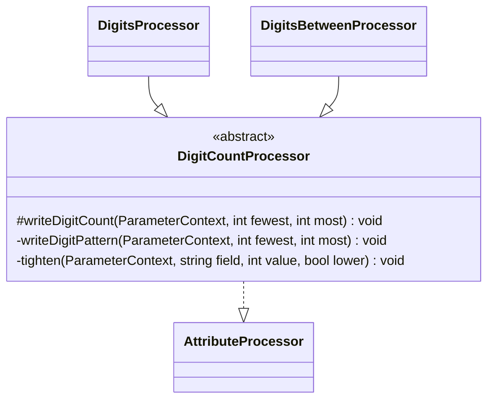

# Array and Type-Assertion Attributes

Family canvas for STORY-001-007 (`requirements/[User-story-7]array-and-type-assertion-validation-attributes.md`). Owns `DigitsProcessor`, `DigitsBetweenProcessor`, the family-private base class `Processors/Base/DigitCountProcessor`, and the registry rows `Digits` and `DigitsBetween`.

**Story not shipped yet.** This canvas was reverse-codified from the code, then its digit rules were fixed (below). STORY-001-007 extends it with `/spdd-prompt-update` (`ArrayType`, `ListType`, `StringType`, `IntegerType`, `BooleanType`, `Numeric`, `Distinct`, `RequiredArrayKeys`, `MinDigits`, `MaxDigits`); nothing that story adds is specified here. `Min`/`Max`/`Size` on an array property are a type branch in the size and bounds canvas.

Related canvases: attribute processing framework (registry); pipeline canvases (`ParameterContext`'s `pattern`, `valuePatterns`, `minLength`/`maxLength`, `minimum`/`maximum` and `multipleOf`; `ExampleGenerationStage` reads them: a string example is a pattern example fitted to the lengths, a `number` example with a `multipleOf` is a multiple of it). Attribute processing framework also expands `#[Rule('digits:4')]` into `Digits(4)` (Spatie coerces the string argument to an int, so the `is_int` guard passes; `digits:abc` cannot be built and documents nothing), and skips a digit rule a later same-class `#[Rule]` replaces. No dependency on the size and bounds family: the tightening rule is repeated in this family's own base class rather than taken from its `WritesBounds` trait (`INDEX.md`, ownership).

Carved out of the former attribute processors canvas; git history keeps it.

## Requirements

- State the number of digits a field must have, and publish it in the form OpenAPI reads for the field's documented type: a digit pattern and a length on a string, a numeric range on an integer or a number.
- Publish only what is exact: no bound that overflows an int, no range that excludes a value the validator accepts.
- Give an example that passes the rule.
- Publish a digit count that no value can have (a reversed `DigitsBetween`) as a note, with no constraint.
- When several attributes bound the same field, publish the strictest, whatever order they are declared in, as the size and bounds family does.

## Entities

## Approach

**What the validator accepts.** Verified against Laravel's validator on 2026-09-25, with the rules a Data class's own `getValidationRules` produces (a `string` property gets `string|digits:N`, an `int` or `float` property `numeric|digits:N`). `validateDigits` passes when the value is numeric or a string, contains only `0`–`9`, and `strlen((string) $value)` is the count; `validateDigitsBetween` the same with the length between the two counts. So:

- a string counts its characters, leading zeros included: `"007"` passes `Digits(3)`; `"12"`, `"-12"`, `"1.5"`, `"1e2"`, `"123\n"` fail, and so does the integer `123` on a `string` property (the `string` rule);
- an integer counts the digits of its decimal form: `Digits(3)` accepts 100–999; `Digits(1)` accepts 0–9, 0 included; a negative never passes;
- a float passes only when its string form is all digits: `123.0` passes `Digits(3)` on a `float` property, `123.5` and `523.47` fail;
- `Digits(19)` on an `int` property accepts `PHP_INT_MAX` and `1000000000000000000`; a JSON number beyond the int range decodes to a float (`1.0E+19`) and fails;
- `DigitsBetween(5, 2)` rejects every value (`"12"`, `"123"`, `"12345"`, the integer `123`).

**A digit count is published by type** (`DigitCountProcessor::writeDigitCount`, with `fewest` ≤ `most`; `Digits(n)` is `fewest = most = n`):

| Documented type | Writes |
| --- | --- |
| `string` | `minLength` = `fewest` and `maxLength` = `most`, tightened; then `pattern` `^[0-9]{low,high}$` (`^[0-9]{n}$` when they are equal) from the tightened lengths, or from `fewest`/`most` when those lengths contradict each other. The pattern is written when none is set or when the current one is a digit pattern of this shape (an earlier digit rule's); another attribute's pattern (`Regex`, `StartsWith`, a character class) is kept as the published one. The digit pattern is appended to `valuePatterns` either way, so it still filters `#[In]` values and pattern examples. Beside a `MultipleOf`, which makes the field a numeric string (size and bounds canvas), the example is a whole multiple of the divisor within the digit lengths, padded with leading zeros, and one the digit pattern accepts, so it still passes the digit rule and pattern; a fractional divisor gets a whole multiple of it too, never a decimal (`#[Digits(3), MultipleOf(3)] string` gets `"027"` or `"945"`, `#[Digits(3), MultipleOf(1.5)]` `"033"` or `"102"`; `SizeBoundsTightenTest` `digits_multiple_string`, `digits_four_multiple_string`; `DigitCountTest` `code_whole_multiple`, `code_half_multiple`, `code_four_half_multiple`, `code_range_multiple`, `code_small_range_multiple`) |
| `integer` | `minimum` = `10^(fewest - 1)`, or 0 when `fewest` is 1, and `maximum` = `10^most - 1`, tightened; each bound only when it fits an int exactly: the minimum up to 19 digits, the maximum up to 18 |
| `number` | as `integer`, and `multipleOf` = 1 when no `multipleOf` is set, since a fraction never passes; beside a fractional or negative `MultipleOf`, which writes only `exampleMultipleOf` (size and bounds canvas), the example is a multiple of both and an `#[In]` value must be a multiple of both (example generation and parameter metadata canvases) |
| anything else | nothing; the sentence only |

A string example is then a pattern example (example generation canvas): drawn from the published pattern or the digit pattern, fitted to the length bounds and kept only when every pattern rule accepts it, a digit string that may start with zeros; beside a `MultipleOf` it is a numeric-string example that the digit pattern also accepts (above); an integer example lies in the range; a `number` example is a whole number in it, generated as an int (example generation canvas): a float of fifteen digits or more prints in exponent form, which `digits` rejects, while a JSON integer is a valid `number`.

**A bound tightens, it never overwrites.** The validator enforces every declared rule, so `writeDigitCount` keeps the larger lower bound and the smaller upper bound on `minLength`/`maxLength` and `minimum`/`maximum`, whichever attribute ran first: `#[Digits(3), Min(5)]` and `#[Min(5), Digits(3)]` on an integer both publish `minimum: 100`. The rule is the size and bounds family's `WritesBounds::tighten`, repeated as a private method of `DigitCountProcessor` so that neither family depends on the other.

**An impossible count is published as a note.** `DigitsBetween(fewest, most)` with `fewest > most` writes nothing and its sentence becomes `Note: must have between <code>{fewest}</code> and <code>{most}</code> digits, which no value can have, so any request that sends this field fails validation.`, in the size and bounds family's style ("An impossible range is published as a note").

Known divergences:

- On an `int` property, a digit rule beside `Lowercase` or `Uppercase` accepts no value: Spatie gives the property `numeric`, and Laravel's `lowercase` / `uppercase` compare a lower- or upper-cased string with the value strictly, which an integer never equals, so every example fails; each sentence is published as an ordinary rule.
- A field with another pattern rule (`Regex`, `StartsWith`, a character class) and a digit rule publishes one pattern: the digit pattern is not written over another attribute's, and the other rule overwrites unconditionally, so the published pattern depends on declaration order. The lengths are still written, and both rules still decide `#[In]` values and the example (`valuePatterns`, and `valueRegexes` for a `Regex`); `InTest` pins `#[StartsWith('1'), Digits(3), In(['1ab', '123'])]` publishing only `123`, which only the digit pattern decides (`in_digits_prefixed`). A published character-class pattern only approximates Laravel's rule, so when the field's example, which Laravel's rules accept, fails it, `toParameter` leaves it out (parameter metadata canvas; an example the rules reject decides nothing): `#[Lowercase, Digits(3)]` publishes no pattern beside the example `007` (`EnumeratedTextPatternsTest` "leaves out an approximate pattern the field's example fails…"). A `StartsWith`, `EndsWith` or translated `Regex` pattern is kept, since it is Laravel's own rule; a character-class pattern written after a `Regex` is still judged by the example (`#[Regex('/^\d{3}$/'), Lowercase]` publishes no pattern). A `Regex` whose translated pattern has the digit shape itself (`/^[0-9]{3}$/`) is taken for an earlier digit rule's and replaced by a later `Digits`.
- A length bound declared after the digit rule (`#[DigitsBetween(2, 8), Min(5)]`) narrows `minLength`/`maxLength` but not the published pattern, which stays `^[0-9]{2,8}$`; the example is fitted to the lengths, so it still passes. Declared before it (`#[Min(5), DigitsBetween(2, 8)]`), the pattern is `^[0-9]{5,8}$`.
- On an `integer` or `number` field with more than 18 digits, the published range has no maximum; `Digits(20)` and more publishes none at all, and its example (1–100) fails the rule. No JSON number passes such a rule (a 20-digit number decodes to a float), yet it is stated as an ordinary sentence, not a note, because a query-string value is a string and can pass it.
- A digit rule on a type other than `string`, `integer` or `number` (an array, a boolean), which no request can pass, is stated as an ordinary sentence, not a note.
- A field whose other bounds contradict the digit count publishes both, with no note: `#[Max(2), Digits(3)]` on a string gives `minLength: 3` and `maxLength: 2`, `#[Size(5), Digits(3)]` on an integer gives `minimum: 100` and `maximum: 5`.
- On a query-string integer field a leading-zero value (`"007"`) passes `digits:3` but falls below the published `minimum: 100`; a client that serialises an integer never sends it.
- `Digits(1)` renders "1 digits".
- A `Digits` or `DigitsBetween` whose argument is an `ExternalReference` produces no description and no constraint; for `DigitsBetween` one reference drops both bounds.
- Both processors call `parameters()` directly rather than through `ConditionProcessor::parametersOf`; their attributes use promoted constructor properties, so `parameters()` cannot throw.

## Structure

`Processors/Base/DigitCountProcessor.php` (abstract, implements `AttributeProcessor`); `Processors/DigitsProcessor.php` and `Processors/DigitsBetweenProcessor.php` extend it.

## Operations

| Attribute | Processor (base) | Reads / guards | Writes | Sentence | Requirement effect | Example rule |
| --- | --- | --- | --- | --- | --- | --- |
| `Digits` | `DigitsProcessor` (`DigitCountProcessor`) | first parameter, only an `int` of at least 1 | `writeDigitCount(n, n)` | `Must have exactly <code>{digits}</code> digits.` | none | `string`: a digit string of that length, a whole multiple of any divisor; `integer`/`number`: a whole number in the range |
| `DigitsBetween` | `DigitsBetweenProcessor` (same) | `parameters()[0]` and `[1]`, both `int` of at least 1 | `writeDigitCount(min, max)`; nothing when `min > max` | `Must have between <code>{min}</code> and <code>{max}</code> digits.`; reversed: the note above | none | as `Digits` |

## Norms

- Digit counts in sentences are wrapped in `<code>`.
- A type branch is added in `DigitCountProcessor::writeDigitCount`, not in the two processors.

## Safeguards

- `Digits(0)`, `DigitsBetween(0, …)` and `DigitsBetween(…, 0)` write nothing. Both Pest files pin that, and an `ExternalReference` argument.
- No digit bound is written from an overflowing int, and none loosens a bound already on the context. The two Pest files pin the per-type writes, the 18- and 19-digit edges and the reversed note.
- Acceptance check: `tests/Integration/Pipeline/DigitCountTest.php` publishes each rule through the default pipeline on a `string`, an `int` and a `float` property, validates the generated example against the Data class's own rules over repeated runs, both as the PHP value and after a JSON round-trip (including `Digits(15)`, `Digits(18)` and `Digits(19)` on a `float`, and `Digits(3)` with `MultipleOf(1.5)`, `MultipleOf(2.5)` and `MultipleOf(-3)` on a `float` in either order, whose `#[In]` counterpart `InTest` `in_digit_multiple` pins), and on a `string` beside a whole or fractional divisor (`#[Digits(3), MultipleOf(5)]`, `#[Digits(3), MultipleOf(1.5)]`, `#[MultipleOf(0.5), Digits(4)]`, `#[DigitsBetween(2, 4), MultipleOf(2.5)]`, `#[MultipleOf(1.5), DigitsBetween(1, 3)]`), also matched against the published pattern, checks tightening in both declaration orders and the pattern narrowed by an earlier length, and pins each runtime claim above against Laravel's validator. A change to how Laravel counts digits fails the test.
