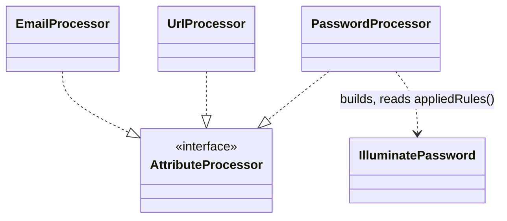

# Identifier and Database-Backed Attributes

Family canvas for STORY-001-008 (`requirements/[User-story-8]database-backed-validation-attributes.md`). Owns `EmailProcessor`, `UrlProcessor`, `PasswordProcessor`, and the registry rows `Email`, `Url`, `ActiveUrl`, `Uuid`, `Ulid`, `Password`, `IP`, `IPv4`, `IPv6` and `Json`. `Email`, `Url` and `Password` read their arguments through their processors; the other seven are static rows.

**Story not shipped yet.** This canvas was reverse-codified from the code, then extended by a fix that documents the arguments of `Email`, `Url` and `Password` and makes the `Url`, `ActiveUrl`, `Json` and `Password` examples pass. STORY-001-008 extends it with `/spdd-prompt-update` (`Exists`, `Unique`, `CurrentPassword`, `MacAddress`); nothing that story adds is specified here.

Related canvases: attribute processing framework (`StaticAttributeProcessor`, registry; rule strings such as `#[Rule('email:rfc,dns')]`, `#[Rule('url:https')]` or a wrapped `Rule(Password::min(8))` are documented through these processors, `#[Rule('password')]` cannot be built and documents nothing, and an attribute a later same-class `#[Rule]` replaces is skipped); pipeline canvases (`ExampleGenerationStage` picks an example by `format`, or regexifies `pattern`; its `uri`, `json` and `password` examples serve this family); size and bounds (`MinProcessor` / `MaxProcessor` tighten `minLength` / `maxLength` the same way `PasswordProcessor` does, so declaration order does not matter).

Carved out of the former attribute processors canvas; git history keeps it.

## Requirements

- Publish a field that must hold a well-known identifier or encoded value (email, URL, UUID, ULID, IP address, JSON, password) as an OpenAPI `format` or `pattern` plus a sentence.
- State the arguments an attribute takes when they narrow the rule: the protocols of `#[Url(...)]`, the validation modes of `#[Email(...)]`, and the length, character-class and data-leak rules of `#[Password(...)]`. Publish the part OpenAPI can hold exactly (a password's length bounds as `minLength` / `maxLength`); state the rest in the sentence.
- A generated example passes the field's own rules, where that can be checked without the network.

## Entities

- `EmailProcessor`, `UrlProcessor`, `PasswordProcessor`: `final`, implement `AttributeProcessor` directly. No family base class.
- The seven other rows are `new StaticAttributeProcessor(format:, pattern:, description:, exampleFormat:, valueRule:)` in `AttributeProcessorRegistry::registerDefaults()`. `valueRule` is the Laravel rule string (`uuid`, `ip`, `ipv4`, `ipv6`, `json`) that decides which `#[In]` values count as accepted; `ActiveUrl` has none, since `active_url` needs the network.

## Approach

- `Url` and `Email` expose their arguments through Spatie's public `parameters()`. `Url` returns the protocols as given (flattened); `Email` returns the declared modes filtered to `rfc`, `strict`, `dns`, `spoof`, `filter`, defaults to `['rfc']` when none is declared, and throws `CannotBuildValidationRule` when every declared mode is unknown.
- `Password` has no public accessor for its constructor arguments, and its `getRule()` takes a `ValidationPath`, which `tests/ArchTest.php` confines to `RequirementResolver`. `PasswordProcessor` therefore reads the attribute's constructor properties (`min`, `letters`, `mixedCase`, `numbers`, `symbols`, `uncompromised`, `uncompromisedThreshold`, `default`, `rule`) by reflection and rebuilds the rule `getRule()` would build: the given `rule`; else, when `default` is true, `Illuminate\Validation\Rules\Password::default()` (the application's `Password::defaults()` callback, evaluated at documentation time); else `Password::min($min)` with each flag applied. It then reads the rule's public `appliedRules()`, so Laravel's own normalisation applies (a minimum below 1 becomes 1). This duplicates six lines of Spatie's `getRule()`; an upstream change to it is a documentation defect, not a crash (see Safeguards).
- An argument that is an `ExternalReference` is resolved from the request at validation time and is never dereferenced here. When one is present the processor publishes the generic sentence of the static row it replaced.
- Verified against Laravel 13 with Spatie Laravel Data 4.23 (`Str::isUrl`, `validateEmail`, `validateActiveUrl`, `validateJson`, `Rules\Password`):
  - `url:https` rejects `http://…` and accepts `HTTPS://…`: the protocol list is matched case-insensitively, as a regex alternation inserted unescaped.
  - `email:rfc` accepts `a@b`; `strict` and `filter` reject it. `dns` rejects any address on `example.com` / `.org` / `.net`, which publish a null MX record (RFC 7505; checked live). `spoof` throws `LogicException` without the intl extension.
  - `active_url` needs an A or AAAA record for the host; `example.com`, `example.org` and `example.net` have them (checked live). `Validator::fakeDnsLookups()` accepts any valid hostname, which is how the suite checks it offline.
  - `json` accepts `{"a":1}` and rejects a bare word.
  - `Password` counts characters with `mb_strlen`, needs a match of `\pL` for letters, `(\p{Ll}+.*\p{Lu})|(\p{Lu}+.*\p{Ll})` for mixed case, `\pN` for numbers and `\p{Z}|\p{S}|\p{P}` for symbols. `uncompromised` asks the Have I Been Pwned range API and fails a password found more than `threshold` times (checked live).
- `IP` has no OpenAPI format for "either version", so it is published as a sentence only.

Known divergences:

- `Email('dns')`: the example is Faker's `safeEmail()`, on a reserved `example.*` domain whose null MX record fails the DNS check. No reserved domain accepts mail, and a real third-party domain is not put in documentation, so the example of a `dns` field fails at runtime. Set an explicit `#[Example]`.
- `Email('spoof')` is documented, but the example is not verified against it: the test image has no intl extension, and Laravel throws without it. The example is ASCII, which the single-script check accepts.
- `Password(uncompromised: true)`: the example is a random password of at least 12 characters and is not checked against Have I Been Pwned in the suite (no network). Custom rules added with `Rules\Password::rules()` are stated only as "Also subject to custom password rules."; they are not read, and they do not narrow an `#[In]` set.
- `Url` with a protocol that holds a regex metacharacter other than `.` (for example `coap+tcp`) matches differently from how it reads, because Laravel inserts it unescaped. The sentence states it as declared, and no scheme is recorded for it, so the stage's `https` example fails such a rule.
- A `Url` field with a `maxLength` below the shortest example URL (about 20 characters) gets an example that fails the bound.
- `Ulid` combined with a format attribute (`Uuid`, `Email`) gets a ULID example, in either declaration order: with both set, example generation keeps a format example only when it matches the pattern, so the pattern wins (example generation canvas). No value passes both rules, so the example fails the other one.
- A format rule narrows an `#[In]` set only where Laravel can check it without the network: `ActiveUrl` and an `Email` whose only mode is `dns` record no value rule, so an `#[In]` value they reject is still published, stated and drawn. `Email`'s other modes are checked without `dns`, and without `spoof` where the intl extension it needs is missing. `Password` is checked by its length and character classes, not `uncompromised` and not the application's custom rules, which may read the rest of the request (`confirmed`) or application state; a value only those reject is still published, stated and drawn (`InTest` "checks allowed values against a password rule without its custom rules…"). A mode or protocol given as a reference falls back to plain `email` / `url`.
- The `email`, `json`, `uuid`, `ipv4` and `ipv6` examples ignore length bounds from other attributes (`#[Email, Min(40)]`, `#[Json, Min(40)]` fail every run); only the `uri` and `password` examples read them (example generation canvas).
- A `Password` minimum contradicted by another attribute is not noted: `#[Password(min: 20), Max(10)]` publishes `minLength: 20` and `maxLength: 10` with two ordinary sentences, although no request passes. The note covers only the rule's own `max`.
- `string[]` items get a word, whatever the format.

## Structure

`src/AttributeProcessing/Processors/EmailProcessor.php`, `UrlProcessor.php`, `PasswordProcessor.php`. `PasswordProcessor` imports Spatie's `Password` and `ExternalReference`, `Illuminate\Validation\Rules\Password`, `ReflectionProperty` and `Throwable`; `EmailProcessor` (with `Throwable`) and `UrlProcessor` read the attribute through `parameters()` and import no Spatie type. None imports a type `tests/ArchTest.php` confines to `RequirementResolver`.

The ten rows sit in the format and pattern block at the top of `registerDefaults()`, interleaved with the static rows of other families (see the framework canvas). `Email`, `Url` and `Password` keep their positions there with their dedicated processors.

## Operations

Every example rule below applies only to a property typed exactly `string` with no explicit example: `string[]` items get a word, and an explicit example skips generation. `<code>x</code>` marks a rendered argument. The `Email` checks and the `Password` classes join a list of two or more items with `, ` and a final ` and `; the `Url` "one of the protocols" list joins with `, ` only.

| Attribute | Processor | Reads and guards | Writes | Sentence | Requirement effect | Example rule |
| --- | --- | --- | --- | --- | --- | --- |
| `Email` | `EmailProcessor` | `parameters()`, caught if it throws; every mode must be a string | `format` = `email`; appends to `valueRules` `email:{modes}` with `dns` dropped, and `spoof` when intl is not loaded (`email` when no mode is readable; nothing when `dns` is the only mode, which alone Laravel checks by DNS only) | modes `['rfc']` (the default), a throw, or a non-string mode: `Must be a valid email address.` Otherwise `Must be a valid email address that passes {checks}.`, one check per distinct mode in declared order: `rfc` → `RFC 5322 validation`; `strict` → `strict RFC 5322 validation, which also rejects addresses with warnings`; `dns` → `a DNS check that its domain has an MX, A or AAAA record`; `spoof` → `a spoofing check that rejects addresses mixing Unicode scripts`; `filter` → `PHP's <code>FILTER_VALIDATE_EMAIL</code> filter` | none | Faker `safeEmail()` (passes `rfc`, `strict`, `filter`; see divergences for `dns`, `spoof`) |
| `Url` | `UrlProcessor` | `parameters()`; every protocol must be a string; a repeated protocol is listed once | `format` = `uri`; appends `url` or `url:{protocols}` to `valueRules` | no protocols, or a non-string one: `Must be a valid URL.` One: `Must be a valid URL using the <code>{p}</code> protocol.` Several: `Must be a valid URL using one of the protocols: <code>{p1}</code>, <code>{p2}</code>.` | none | stage `uri` example (`https://…`) when no protocol is given or one equals `https` ignoring case. Otherwise, when `type` is `string`, the processor records the first protocol matching `^[A-Za-z][A-Za-z0-9.-]*$` as `uriScheme` (parameter metadata pipeline canvas), and the stage's `uri` example uses it (`{p}://example.{com,org,net}/…`), so the field's pattern, `NotIn` and length bounds shape it too; none matching: no scheme, the stage's `https` example |
| `ActiveUrl` | `StaticAttributeProcessor` | — | `format` = `uri` | `Must be an active URL.` | none | stage `uri` example: its host is `example.com`, `.org` or `.net`, which resolve |
| `Uuid` | `StaticAttributeProcessor` | — | `format` = `uuid`; `valueRules` += `uuid` | `Must be a valid UUID.` | none | Faker UUID |
| `Ulid` | `StaticAttributeProcessor` | — | `pattern` = `^[0-7][0-9A-HJKMNP-TV-Za-hjkmnp-tv-z]{25}$`: Crockford base32 in either case, as Symfony's `Ulid::isValid` reads it, with a first character of at most 7 so the timestamp fits 48 bits | `Must be a valid ULID.` | none | pattern example (example generation canvas) |
| `Password` | `PasswordProcessor` | the constructor properties by reflection, caught if any is missing; no `ExternalReference`; `rule` null or an Illuminate `Password` | `format` = `password`; `minLength` tightened to `min`; `maxLength` tightened to `max` when set; `valueRules` += a rebuilt Illuminate `Password` rule object (`min`, `max`, `letters`, `mixedCase`, `numbers`, `symbols`; no `uncompromised`, no custom rules), except for the impossible-range note and when unresolved | unresolved: `Must be a valid password.` A maximum below the minimum, which no password meets: `Note: must be a password of <code>{min}</code> to <code>{max}</code> characters, which no password can be, so any request that sends this field fails validation.`, with no length bound written. Otherwise `Must be a password of at least <code>{min}</code> characters` (`character` for 1), or `of <code>{min}</code> to <code>{max}</code> characters` when a max is set, then ` containing {classes}` when any class is required, then `.`: `mixedCase` → `at least one uppercase and one lowercase letter` (replaces `letters`), `letters` → `at least one letter`, `numbers` → `at least one number`, `symbols` → `at least one symbol`. Then, when uncompromised: ` Must not appear in a known data leak.` (threshold 0) or ` Must not appear in known data leaks more than <code>{n}</code> times.`; when custom rules are set: ` Also subject to custom password rules.` | none | stage `password` example: always holds a lowercase and an uppercase letter, a digit and a symbol (when `maxLength` allows four characters or more), and meets `minLength` / `maxLength` |
| `IP` | `StaticAttributeProcessor` | — | `exampleFormat` = `ipv4`, `valueRules` += `ip`; no published `format`, because OpenAPI has none for "IPv4 or IPv6" | `Must be a valid IP address.` | none | an IPv4 address, which `ip` accepts |
| `IPv4` | `StaticAttributeProcessor` | — | `format` = `ipv4`; `valueRules` += `ipv4` | `Must be a valid IPv4 address.` | none | Faker IPv4 |
| `IPv6` | `StaticAttributeProcessor` | — | `format` = `ipv6`; `valueRules` += `ipv6` | `Must be a valid IPv6 address.` | none | Faker IPv6 |
| `Json` | `StaticAttributeProcessor` | — | `format` = `json`; `valueRules` += `json` | `Must be a valid JSON string.` | none | stage `json` example: a JSON object string |

## Norms

- A new attribute that needs only a fixed format, pattern and sentence is a row here, not a class. An attribute whose arguments narrow its rule gets a processor that states them.
- No processor in this family writes `example`: `UrlProcessor` records `uriScheme` for a `string` field and leaves the example to `ExampleGenerationStage`, which skips an explicit `#[Example]` and applies the field's other rules (pattern, `NotIn`, length) to what it generates.

## Safeguards

- No processor lets a throwable escape: `Email::parameters()` can throw, and `PasswordProcessor` catches a missing or renamed constructor property (`ReflectionException`) and an unexpected property type. Both fall back to their generic sentence (`Must be a valid email address.`, `Must be a valid password.`) with `format` still set. `EmailProcessorTest` pins an unknown mode and an `ExternalReference`; `PasswordProcessorTest` pins an attribute whose properties cannot be read and an `ExternalReference`, and the impossible-range note for a maximum below the minimum.
- An `ExternalReference` argument is never dereferenced.
- `PasswordProcessor` is the only processor that reads application state, and only for `default: true`, through `Password::default()`; it is the framework canvas's one named exception to "no documented value from the container or configuration". A `Password::defaults()` callback that branches on the environment documents the rule of the environment the docs are built in. `IdentifiersTest` pins a configured default and Laravel's own default when the application sets none.
- Every example of this family passes its own rule, and an `#[In]` set keeps only values its offline rules accept (`InTest` `in_email`, `in_ip`, `in_uuid`, `in_json`, `in_url`, `in_password`; `EmailProcessorTest` pins the recorded email rule; `IdentifiersTest` pins `IPv4` and `IPv6` with `#[In]`): `IdentifiersTest` validates the `Uuid`, `Ulid`, `IP`, `IPv4` and `IPv6` examples over repeated runs, pins the five sentences and their published format, and checks the `Ulid` pattern against the `ulid` rule on upper- and lower-case values, first characters 7 and 8, an excluded letter and a short value. `ExampleGenerationRound7Test` validates an `Email` with a domain suffix (`EndsWith('@corp.com')`, `Regex('/@corp\.com$/')` and its `i` form) and a `Url` or `IP` with a prefix or suffix beside a case row (`#[Url, EndsWith('.pdf'), Lowercase]`, `#[IP, StartsWith('10.'), Lowercase]`).
- The acceptance check is `tests/Integration/Pipeline/IdentifiersTest.php`: it pins every sentence template above against the attribute declared on a Data class (the `Password` rule-object templates, which cannot be declared in an attribute argument, by calling the processor directly) (the `Uuid`, `IPv4` and `Ulid` sentences also in `AttributeProcessingStageTest`), and validates the generated examples of `Url` (plain, `https`, `ftp`/`sftp`, `ftp` with a `StartsWith` pattern, `http` with `Max`, `ftp` with `NotIn`, `Url` with `Min` (`urlWithMin`)), `ActiveUrl` (with `Validator::fakeDnsLookups()`), `Json`, `Email` (`rfc`, `strict`, `filter`) and `Password` (default, every class, a minimum above 20, `default: true` with an application default, combined with `Max`) against that Data class's own `getValidationRules()` over repeated runs. It skips `dns`, `spoof`, `uncompromised` and the live DNS lookup of `active_url`.
